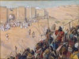

  
[Intangible Textual Heritage](../../index)  [Bible](../index) 
[Index](index)  [Previous](biob01)  [Next](biob03) 

------------------------------------------------------------------------

[Buy this Book at
Amazon.com](https://www.amazon.com/exec/obidos/ASIN/B002ECE954/internetsacredte)

------------------------------------------------------------------------

  
*The Biography of the Bible*, by Ernest Sutherland Bates, \[1937\], at
Intangible Textual Heritage

------------------------------------------------------------------------

p. 1p. 2 p. 3

### ONE

### General Character

A GREAT BOOK is a living organism. Months, years, or centuries may go
into its gestation. When finally composed and written down, it can be
said to be born, but only born. It then grows and develops through the
interpretations of generation after generation of readers, critics,
editors, and translators, each adding something, great or little, to its
expanding magnitude.

The life of the Bible, above all other books, is a life made up of
countless lives, embodying their joys and agonies, their visions, their
defeats and aspirations. Four thousand years cling about it. A full
millennium of myths and legends passed into it; another millennium was
consumed in the writing; bitter battles over canon and creed occupied a
third; a fourth has seen the ever-continuing translations into modern
tongues.

No individual, no Caesar or Napoleon, has had such a part in the world's
history as this book. Wars, reformations, martyrdoms, religions, lie
heavy on its head; men fought and died over its meaning; down

p. 4

through the ages it has continued to evolve, affecting for good and also
for ill millions and millions of lives.

Not until the fourth century A.D. was it called the Bible. Saint John
Chrysostom, the golden-mouthed, well deserved that sobriquet when he
named the collection of Jewish and Christian sacred scriptures the
Bible—one book, the Book. For in spite of the length of time consumed in
its creation and in spite of the greatest diversity in the literary and
moral value of the various parts, the unity of the Bible is its most
compelling feature, so compelling that centuries after the original work
was completed, when men of other races and languages sat down to
translate the Bible, although they usually collaborated in large groups,
nevertheless under the spell of the original they often found themselves
writing as one man. This unusual and significant literary phenomenon
appeared even in the Septuagint of the first translators, the legendary
two and seventy Jewish elders of Alexandria who, according to the tale,
in two and seventy days of the third century B.C. rendered the Old
Testament into Greek. In all these cases, the quality of the translation
sprang from the quality of the original.

When one asks, however, just wherein resides

p. 5

this unity, so evident to sense that it has always been overemphasized
rather than underemphasized, the answer is not easy. The older and still
customary explanation that it consists in a definite type of religion
maintained from first to last will not bear scrutiny. The religion of
the earliest parts of the Old Testament is a tribal religion, strong and
stern, intolerant, only half ethical and not even consistently
monotheistic; the Prophets introduced nothing less than a religious and
moral revolution; the later books of the Old Testament reveal the
conflict between humanistic and nationalistic aspirations; and the
coming of Christianity brought so great a change that the Jews
themselves could not accept it. Yet all these varying attitudes are
expressed fully and powerfully in the Bible.

Nor can one say with truth that the Bible is unified because it is
always inspired by some religious viewpoint, however divergent the
successive viewpoints may be. The collection of love lyrics known as the
Song of Songs is purely secular, and the greater part of Ecclesiastes is
a work of skeptical philosophy. Yet these are included, and one feels
that the pattern is not broken.

The one enduring characteristic which does mark the Bible from first to
last is a pronounced attitude

p. 6

of mind that reveals itself in literary style and content.

The content of the Bible is Man. Alone among the ancient nations, the
Jews accepted Man as the object of chief interest. Their religion, while
in all its manifold forms preaching absolute submission to God, in
another way made God himself subordinate to Man; where half of the Greek
myths deal with the doings of the gods among themselves, gods who think
only occasionally of the creatures of a day on earth, Jehovah is shown
as making the destiny of Man his chief concern. Where the pagan gods are
transparent personifications of natural phenomena gradually humanized,
Jehovah is fundamentally Man himself gradually idealized to the height
of human imaginings of good.

The content furthermore is Average Man. There are no Homeric heroes in
the Bible. Abraham is brave and cowardly by turns, Jacob is loyal and a
trickster, Joseph indulges in the vainglorious babblings of youth, the
noblehearted David under the influence of lust will cause the murder of
a devoted servitor, Solomon's wisdom cannot keep him from debauchery. As
a result, where Agamemnon and Achilles and all the highborn heroes of
Greek tragedy move us but aesthetically, our spirits are

p. 7

touched simply and directly by our sorrowful twin brothers who acted so
like ourselves centuries ago. We can find Abraham in the flesh on a
Vermont farm, meet Jacob in the streets of New York, encounter Joseph in
any gentle but pampered favorite child, and discover degenerate Solomons
in night clubs from the Atlantic to the Pacific coast.

Finally, the content is Collective Man. Behind these sharply defined
individuals, one is always conscious of their ancestors, and stretching
before them one sees the long line of their descendants. A compensatory
dignity accrues to the persons in the tale from their relation to the
social whole. The group, the nation, and ultimately all mankind form a
perpetual background against which the characters stand out the more
plainly but into which they eventually merge and their relation to which
constitutes the criterion of their conduct.

From this interest in the average man and the collective man springs the
democratic and revolutionary character of the Bible. The constant
admonitions to heed the poor, the widow, and the orphan; the diatribes
against the corruptions of the court, the law, the men of power and
wealth; the ever-repeated pleas for social justice; to the extent that
these have entered into the thought of the

p. 8

world we have in the first instance to thank the Bible.

The literary style of the Bible is in harmony with the unusual content.
It is a style that moves effortlessly from the familiar to the sublime;
from Job scratching himself among the potsherds to the same Job holding
converse with God in the whirlwind. The Jews were the first realists.

Even the Jewish myths were localized and definite. Not only does the Ark
of Noah come to rest upon Mount Ararat but its exact size is
recorded—three hundred cubits by fifty by thirty. Abraham, visited by
three angels, has water brought to wash their feet and tells his wife
Sarah to "make ready three measures of fine meal, knead it, and make
cakes upon the hearth." In the Book of Tobit, Asmodeus, that wicked
spirit, slayer of husbands, is put to flight by the homely ritual of
raising a smoke from the heart and liver of a fish laid over smoldering
ashes. Such precise vivid details lend verisimilitude to the most
fantastic narratives. The persistence of the belief in the verbal
inspiration of the Scriptures and in their complete inerrancy is largely
due to the impression on the reader that he is hearing for the first
time a story told by an eyewitness of the events recorded.

p. 9

The Jewish imagination, running always to the concrete, emphasized
action. One could say with slight exaggeration that the Jews were
behaviorists in their psychology, leaving motivation to be inferred from
deeds, uninterested in it otherwise. The style moves with the swiftness
of narrative as well in reflective passages as in those directly
concerned with events. Wisdom is condensed into antitheses and
aphorisms. Nature is never presented for itself in set pictures but as
momentary illustration or background. All is condensation, concision,
brevity. Enlargement comes not through the logical development of an
idea but rather through concentration upon a single idea until it is
seen to be exemplified everywhere, swelling to amplitude through
reiteration, as in music or in life itself the same theme is repeated
with multiplying significance.

Thence comes the characteristic parallelism of word, phrase, or strophe
which forms the chief basis of Hebrew versification. Less of a
deliberate artifact than the quantitative structure of classical poetry
or the accentual basis of modern systems, it lay close to prose, in the
sense that writers, as their mood heightened or relaxed, could move from
prose to verse, from verse to prose, without

p. 10

violent transition. While as in other early poetry there is usually
present a liturgical flavor of chanting that effectually sets the verse
of the Bible apart from modern rhythms, the form undoubtedly suggested
the poetic prose and free verse of Ossian, Blake, Carlyle, Ruskin, Walt
Whitman, and other moderns.

Thus, both in content and in form, the greater part of the Bible when
taken directly and not hardened into dogma, has been throughout history
a freeing and liberalizing force. Unfortunately, freedom, obtainable
only through law, is often lost through law. Much in the Bible itself
proved a bondage to the Jews, and to this very day passages torn from
their textual or historical context still furnish instruments to those
who love to inflict or suffer bondage. Through its very closeness to
life, the Bible has shared the fortunes of life. Its biography, like
that of individuals and nations, is a tale of conflicting forces, and of
struggles alike internal and external.

------------------------------------------------------------------------

[Next: Two. The Authors](biob03)
