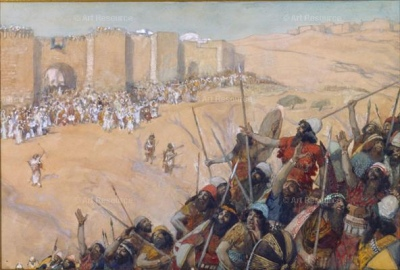

  
[Intangible Textual Heritage](../../index)  [Bible](../index) 

------------------------------------------------------------------------

[Buy this Book at
Amazon.com](https://www.amazon.com/exec/obidos/ASIN/B002ECE954/internetsacredte)

------------------------------------------------------------------------

<table width="75%">
<colgroup>
<col style="width: 50%" />
<col style="width: 50%" />
</colgroup>
<tbody>
<tr class="odd">
<td width="50%" data-valign="TOP"></td>
<td width="50%" data-valign="CENTER"><h1 id="the-biography-of-the-bible" data-align="CENTER">The Biography of the Bible</h1>
<h2 id="by-ernest-sutherland-bates" data-align="CENTER">by Ernest Sutherland Bates</h2>
<h4 id="section" data-align="CENTER">[1937]</h4></td>
</tr>
</tbody>
</table>

------------------------------------------------------------------------

[Contents](#contents)    [Start Reading](biob00)    [Page
Index](pageidx)    [Text \[Zipped\]](biob.txt.gz)

------------------------------------------------------------------------

|                                                                                                                           |
|---------------------------------------------------------------------------------------------------------------------------|
|  |

This is an narrative of the development of the Bible, from the earliest
manuscripts to the 20th century. It includes the story of the
translation of the Bible into English, the 'Higher Criticism' of the
19th century, and presents the Bible in historical and social context.
This serves as a short but detailed introduction to the subject, well
worth reading whatever one's views on the Bible.

------------------------------------------------------------------------

 [Title Page](biob00)  
[Table of Contents](biob01)  
[One. General Character](biob02)  
[Two. The Authors](biob03)  
[Three. The Conflict over Creed and Canon](biob04)  
[Four The Bible Under Medievalism](biob05)  
[Five. The Great Translations](biob06)  
[Six. The Higher Criticism](biob07)  
[Seven. The Bible and the Stream of Life](biob08)  
[Index](biob09)  
[About the Author](biob10)  
