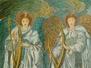

  
[Intangible Textual Heritage](../../index)  [Bible](../index) 
[Apocrypha](../../chr/apo/index)  [Index](index)  [Previous](boe023) 
[Next](boe025) 

------------------------------------------------------------------------

[Buy this Book on
Kindle](https://www.amazon.com/exec/obidos/ASIN/B0037Z6LLW/internetsacredte)

------------------------------------------------------------------------

  
*The Book of Enoch*, by R.H. Charles, \[1917\], at Intangible Textual
Heritage

------------------------------------------------------------------------

XXI\. *Preliminary and final place of punishment of the fallen angels
(stars)*.

### CHAPTER XXI.

1\. And I proceeded to where things were chaotic. 2. And I saw there
something horrible: I saw neither a heaven above nor a firmly founded
earth, but a place chaotic and horrible. 3. And there I saw seven stars
of the heaven bound together in it, like great mountains and burning
with fire. 4. Then I said: 'For what sin are they bound, and on what
account have they been cast in hither?' 5. Then said Uriel, one of the
holy angels, who was with me, and was chief over them, and said: 'Enoch,
why dost thou ask, and why art thou eager for the truth? 6. These are of
the number of the stars ⌈of heaven⌉, which have transgressed the
commandment of the

p. 47

\[paragraph continues\] Lord, and are
bound here till ten thousand years, the time entailed by their sins, are
consummated.' 7. And from thence I went to another place, which was
still more horrible than the former, and I saw a horrible thing: a great
fire there which burnt and blazed, and the place was cleft as far as the
abyss, being full of great descending columns of fire: neither its
extent or magnitude could I see, nor could I conjecture. 8. Then I said:
'How fearful is the place and how terrible to look upon!' 9. Then Uriel
answered me, one of the holy angels who was with me, and said unto me:
'Enoch, why hast thou such fear and affright?' And I answered: 'Because
of this fearful place, and because of the spectacle of the pain.' 10.
And he said ⌈⌈unto me⌉⌉: 'This place is the prison of the angels, and
here they will be imprisoned for ever.'

------------------------------------------------------------------------

[Next: Chapter XXII](boe025)

