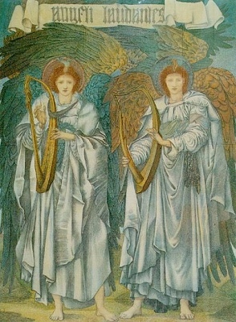

  
[Intangible Textual Heritage](../../index)  [Bible](../index) 
[Apocrypha](../../chr/apo/index) 

------------------------------------------------------------------------

[Buy this Book on
Kindle](https://www.amazon.com/exec/obidos/ASIN/B0037Z6LLW/internetsacredte)

------------------------------------------------------------------------

<table width="75%">
<colgroup>
<col style="width: 50%" />
<col style="width: 50%" />
</colgroup>
<tbody>
<tr class="odd">
<td width="50%" data-valign="CENTER"></td>
<td width="50%" data-valign="CENTER"><h1 id="the-book-of-enoch" data-align="CENTER">The Book of Enoch</h1>
<h3 id="tr.-by-r.h.-charles" data-align="CENTER">tr. by R.H. Charles</h3>
<h4 id="section" data-align="CENTER">[1917]</h4></td>
</tr>
</tbody>
</table>

------------------------------------------------------------------------

[Contents](#contents)    [Start Reading](boe000)    [Page
Index](pageidx)    [Text \[Zipped\]](boe.txt.gz)

------------------------------------------------------------------------

The Book of Enoch, written during the second century B.C.E., is one of
the most important non-canonical apocryphal works, and probably had a
huge influence on early Christian, particularly Gnostic, beliefs. Filled
with hallucinatory visions of heaven and hell, angels and devils, Enoch
introduced concepts such as fallen angels, the appearance of a Messiah,
Resurrection, a Final Judgement, and a Heavenly Kingdom on Earth.
Interspersed with this material are quasi-scientific digressions on
calendrical systems, geography, cosmology, astronomy, and meteorology.

This etext has been prepared specially for sacred-texts, and is a great
improvement over other versions on the Internet, with the introduction,
correct verse numbering, page numbers from the 1917 edition, and intact
critical apparatus.

------------------------------------------------------------------------

 [Title Page](boe000)  
[Editors' Preface](boe001)  
[Introduction](boe002)  
[Abbreviations, Brackets and Symbols Specially Used in the Translation
of 1 Enoch](boe003)  

### The Book of Enoch

[Chapter I](boe004)  
[Chapter II](boe005)  
[Chapter III.](boe006)  
[Chapter IV.](boe007)  
[Chapter V.](boe008)  
[Chapter VI.](boe009)  
[Chapter VII](boe010)  
[Chapter VIII.](boe011)  
[Chapter IX](boe012)  
[Chapter X](boe013)  
[Chapter XI](boe014)  
[Chapter XII](boe015)  
[Chapter XIII](boe016)  
[Chapter XIV](boe017)  
[Chapter XV](boe018)  
[Chapter XVI](boe019)  

### Enoch's Journeys through the Earth and Sheol

[Chapter XVII](boe020)  
[Chapter XVIII](boe021)  
[Chapter XIX](boe022)  
[Chapter XX](boe023)  
[Chapter XXI](boe024)  
[Chapter XXII](boe025)  
[Chapter XXIII](boe026)  
[Chapter XXIV](boe027)  
[Chapter XXV](boe028)  
[Chapter XXVI](boe029)  
[Chapter XXVII](boe030)  
[Chapter XXVIII](boe031)  
[Chapter XXIX](boe032)  
[Chapter XXX](boe033)  
[Chapter XXXI](boe034)  
[Chapter XXXII](boe035)  
[Chapter XXXIII](boe036)  
[Chapter XXXIV](boe037)  
[Chapter XXXV](boe038)  
[Chapter XXXVI](boe039)  

### The Parables

[Chapter XXXVII](boe040)  

### The First Parable

[Chapter XXXVIII](boe041)  
[Chapter XXXIX](boe042)  
[Chapter XL](boe043)  
[Chapter XLI](boe044)  
[Chapter XLII](boe045)  
[Chapter XLIII](boe046)  
[Chapter XLIV](boe047)  

### The Second Parable

[Chapter XLV](boe048)  
[Chapter XLVI](boe049)  
[Chapter XLVII](boe050)  
[Chapter XLVIII](boe051)  
[Chapter XLIX](boe052)  
[Chapter L](boe053)  
[Chapter LI](boe054)  
[Chapter LII](boe055)  
[Chapter LIII](boe056)  
[Chapter LIV](boe057)  
[Chapter LIV](boe058)  
[Chapter LVI](boe059)  
[Chapter LVII](boe060)  

### The Third Parable

[Chapter LVIII.](boe061)  
[Chapter LIX](boe062)  

### Book of Noah--a Fragment

[Chapter LX](boe063)  
[Chapter LXI](boe064)  
[Chapter LXII](boe065)  
[Chapter LXIII](boe066)  
[Chapter LXIV](boe067)  
[Chapter LXV](boe068)  
[Chapter LXVI](boe069)  
[Chapter LXVII](boe070)  
[Chapter LXVIII](boe071)  
[Chapter LXIX](boe072)  

 

[Chapter LXX](boe073)  
[Chapter LXXI](boe074)  

### The Book of the Courses of the Heavenly Luminaries

[Chapter LXXII.](boe075)  
[Chapter LXXIII](boe076)  
[Chapter LXXIV](boe077)  
[Chapter LXXV](boe078)  
[Chapter LXXVI](boe079)  
[Chapter LXXVII](boe080)  
[Chapter LXXVIII](boe081)  
[Chapter LXXIX](boe082)  
[Chapter LXXX](boe083)  
[Chapter LXXI](boe084)  
[Chapter LXXXII](boe085)  

### The Dream-Vision

[Chapter LXXXIII](boe086)  
[Chapter LXXXIV](boe087)  
[Chapter LXXXV](boe088)  
[Chapter LXXXVI](boe089)  
[Chapter LXXXVII](boe090)  
[Chapter LXXXVIII](boe091)  
[Chapter LXXXIX](boe092)  
[Chapter XC](boe093)  

### The Concluding Section of the Book

[Chapter XCII](boe094)  
[Chapter XCI](boe095)  
[Chapter XCIII](boe096)  
[Chapter XCI](boe097)  
[Chapter XCIV](boe098)  
[Chapter XCV](boe099)  
[Chapter XCVI](boe100)  
[Chapter XCVII](boe101)  
[Chapter XCVIII](boe102)  
[Chapter XCIX](boe103)  
[Chapter C](boe104)  
[Chapter CI](boe105)  
[Chapter CII.](boe106)  
[Chapter CIII](boe107)  
[Chapter CIV](boe108)  
[Chapter CV](boe109)  

### Fragment of the Book of Noah

[Chapter CVI](boe110)  
[Chapter CVII](boe111)  

### An Appendix to the Book of Enoch

[Chapter CVIII](boe112)  
