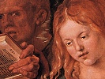

  
[Intangible Textual Heritage](../../index)  [Bible](../index) 
[Index](index)  [Previous](csj009)  [Next](csj011) 

------------------------------------------------------------------------

[Buy this Book at
Amazon.com](https://www.amazon.com/exec/obidos/ASIN/B0027CSIX0/internetsacredte)

------------------------------------------------------------------------

  
*The Complete Sayings of Jesus*, by Arthur Hinds, \[1927\], at
Intangible Textual Heritage

------------------------------------------------------------------------

### VII

### JESUS' MOTHER AND THE WATER CHANGED TO WINE—HE DRIVES THE MONEYMAKERS FROM THE TEMPLE—TEMPLE OF THE BODY

A.D. 27. Age 30. *Cana*. *Jerusalem*.

John 2, 1-9; 12-16; 18-21.

THE third day, there was a marriage in Cana of Galilee. Both Jesus was
called, and his disciples, to the marriage; and the mother of Jesus was
there.

When they wanted wine, his mother saith unto Jesus, They have no wine.
Jesus saith,

Woman, what have I to do with thee? mine hour is not yet come.

His mother saith unto the servants, Whatsoever he saith, do *it*.

There were set there six waterpots of stone containing two or three
firkins apiece. Jesus saith,

Fill the waterpots with water.

They filled them to the brim. And he saith,

Draw out now, and bear unto the governor of the feast.

And they bare *it*. The ruler of the feast tasted. The water was made
wine.

¶After this he went to Capernaum, Jesus, and his mother, and his
brethren,

p. 11

and his disciples; and they continued there not many days.

¶The Jews’ passover was at hand: Jesus went up to Jerusalem.

¶ [\*](#fn_5)He found in the temple those that
sold oxen and sheep and doves; and the changers of money sitting: and
when he had made a scourge of small cords, he drove them all out of the
temple, and the sheep, and the oxen; and poured out the changers' money,
and overthrew the tables; and said unto them that sold doves,

Take these things hence, make not my Father's house a house of
merchandise.

¶Then the Jews said unto Jesus, What sign shewest thou unto us, seeing
that thou doest these things? He answered,

Destroy this temple, and in three days I will raise it up. [†](#fn_6)

Then said the Jews, Forty and six years was this temple in building, and
wilt thou rear it up in three days?

But Jesus spake of the temple of his body.

------------------------------------------------------------------------

### Footnotes

[11:\*](csj010.htm#fr_5) John 2, 14-16. Matthew
and Mark tell of a similar encounter (turn to LXV of this book).

[11:†](csj010.htm#fr_6) Symbolism: For other
examples turn to XXXVI and XLV in this book.

------------------------------------------------------------------------

[Next: VIII. Nighttime Visit of Nicodemus—Christ Enlightens Him](csj011)
