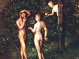

  
[Intangible Textual Heritage](../../index)  [Bible](../index) 
[Apocrypha](../../chr/apo/index)  [Index](index)  [Previous](fbe039) 
[Next](fbe041) 

------------------------------------------------------------------------

[Buy this Book at
Amazon.com](https://www.amazon.com/exec/obidos/ASIN/B0027CSJWK/internetsacredte)

------------------------------------------------------------------------

  
*The Forgotten Books of Eden*, by Rutherford H. Platt, Jr., \[1926\], at
Intangible Textual Heritage

------------------------------------------------------------------------

### CHAP. XXXV.

God's reply.

THEN God looked again upon Adam and his weeping and groaning, and the
Word of God came to him, and said unto him:--

2 "O Adam, when thou wast in My garden, thou knewest neither eating nor
drinking; neither faintness nor suffering; neither leanness of flesh,
nor change; neither did sleep depart from thine eyes. But since thou
transgressedst, and camest into this strange land, all these trials are
come upon thee."

------------------------------------------------------------------------

[Next: Chapter XXXVI](fbe041)
