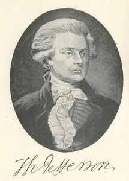

  
[Intangible Textual Heritage](../../index)  [Bible](../index) 

------------------------------------------------------------------------

[Buy this Book at
Amazon.com](https://www.amazon.com/exec/obidos/ASIN/141790576X/internetsacredte)

------------------------------------------------------------------------

[Buy this Book on
Kindle](https://www.amazon.com/exec/obidos/ASIN/B002KCO5UC/internetsacredte)

------------------------------------------------------------------------

<table width="75%">
<colgroup>
<col style="width: 50%" />
<col style="width: 50%" />
</colgroup>
<tbody>
<tr class="odd">
<td width="50%" data-valign="TOP"> 
Thomas Jefferson [prior to 1902] (Public Domain Image)</td>
<td width="50%" data-valign="CENTER"><h1 id="the-life-and-morals-of-jesus-of-nazareth" data-align="CENTER">The Life and Morals of Jesus of Nazareth</h1>
<h5 id="the-jefferson-bible" data-align="CENTER">(The Jefferson Bible)</h5>
<h2 id="by-thomas-jefferson" data-align="CENTER">by Thomas Jefferson</h2>
<h4 id="section" data-align="CENTER">[1902]</h4></td>
</tr>
</tbody>
</table>

------------------------------------------------------------------------

[Contents](#contents)    [Start Reading](jb00)    [Page
Index](pageidx)    [Text \[Zipped\]](jb.txt.gz)

------------------------------------------------------------------------

|                                                                                                                           |
|---------------------------------------------------------------------------------------------------------------------------|
|  |

This is Thomas Jefferson's attempt at editing the Gospels into a single,
coherent narrative. The text here focuses on the attributed words of
Jesus: chiefly the Sermon on the Mount and the parables. Jefferson
highlights the ideas of the Gospels, rather than miracles and wonder
stories. For instance, Jefferson ends the story with Jesus' burial:
there is no resurrection in this tale, and no post-death interaction
with the disciples. This edition contains a very short section with some
other writings of Jefferson on religion.

Production notes: The [table of texts](jb02) has been cross-linked with
the [King James Version](../kjv/index) of the Bible at this site.

------------------------------------------------------------------------

 [Title Page](jb00)  
[Preface](jb01)  
[A Table of the Texts](jb02)  
[Facsimile Page from Jefferson's Bible](jb03)  
[Religious Views of Thomas Jefferson](jb04)  
[I. Joseph and Mary go to Bethlehem, Where Jesus is Born](jb05)  
[II. He is Circumcised and Named and they Return to Nazareth](jb06)  
[III. At Twelve Years of Age He Accompanies his Parents to Jerusalem and
Returns](jb07)  
[IV. John Baptizes in Jordan](jb08)  
[V. Jesus is Baptized at 30 Years of Age](jb09)  
[VI. Drives the Traders Out of the Temple](jb10)  
[VII. He Baptizes, but Retires into Galilee on the Death of
John](jb11)  
[VIII. He Teaches in the Synagogue](jb12)  
[IX. Explains the Sabbath](jb13)  
[X. Call of His Disciples](jb14)  
[XI. The Sermon on the Mount](jb15)  
[XII. Exhorts](jb16)  
[XIII. A Woman Annointeth Him](jb17)  
[XIV. Precepts](jb18)  
[XV. Parable of the Rich Man](jb19)  
[XVI. Precepts](jb20)  
[XVII. Parable of the Fig Tree](jb21)  
[XVIII. Precepts](jb22)  
[XIX. Parable of the Sower](jb23)  
[XX. Precepts](jb24)  
[XXI. Parable of the Tares](jb25)  
[XXII. Precepts](jb26)  
[XXIII. Parable of New Wine in Old Bottles](jb27)  
[XXIV. A Prophet Hath no Honor in his Own Country](jb28)  
[XXV. Mission Instructions, Return of Apostles](jb29)  
[XXVI. Precepts](jb30)  
[XXVII. Parable of the Wicked Servant](jb31)  
[XXVIII. Mission of the Seventy](jb32)  
[XXIX. The Feast of the Tabernacles](jb33)  
[XXX. The Woman Taken in Adultery](jb34)  
[XXXI. To be Born Blind No Proof of Sin](jb35)  
[XXXII. The Good Shepherd](jb36)  
[XXXIII. Love God and Thy Neighbour; Parable of the Samaritan](jb37)  
[XXXIV. Form of Prayer](jb38)  
[XXXV. The Sabbath](jb39)  
[XXXVI. The Bidden to a Feast](jb40)  
[XXXVII. Precepts](jb41)  
[XXXVIII. Parables of the Lost Sheep and Prodigal Son](jb42)  
[XXXIX. Parable of the Unjust Steward](jb43)  
[XL. Parable of Lazarus](jb44)  
[XLI. Precepts to be Always Ready](jb45)  
[XLII. Parables of the Widow and Judge, the Pharisee and
Publican](jb46)  
[XLIII. Precepts](jb47)  
[XLIV. Parable of the Labourers in the Vineyard](jb48)  
[XLV. Zacchaeus, and the Parable of the Talents](jb49)  
[XLVI. Goes to Jerusalem and Bethany](jb50)  
[XLVII. The Traders Cast Out from the Temple](jb51)  
[XLVIII. Parable of the Two Sons](jb52)  
[XLIX. Parable of the Vineyard and Husbandmen](jb53)  
[L. Parable of the King and the Wedding](jb54)  
[XL. Tribute, Marriage, Resurrection](jb55)  
[LII. The Two Commandments](jb56)  
[LIII. Precepts, Pride, Hypocrisy, Swearing](jb57)  
[LIV. The Widow's Mite](jb58)  
[LV. Jerusalem and the Day of Judgment](jb59)  
[LVI. The Faithful and Wise Servant](jb60)  
[LVII. Parable of the Ten Virgins](jb61)  
[LVIII. Parable of the Talents](jb62)  
[LIX. The Day of Judgment](jb63)  
[LX. A Woman Anointeth Him](jb64)  
[LXI. Judas Undertakes to Point Out Jesus](jb65)  
[XLII. Precepts to His Disciples, Washes their Feet. Trouble of Mind and
Prayer.](jb66)  
[LXIII. Judas Conducts the Officers to Jesus](jb67)  
[LXIV. He is Arrested and Carried Before Caiaphas, the High Priest and
is Condemned](jb68)  
[LXV. Is then Carried to Pilate](jb69)  
[LXVI. Who Sends Him to Herod](jb70)  
[LXVII. Receives Him Back, Scourges and Delivers Him to
Execution](jb71)  
[LXVIII. His Crucifixion, Death, and Burial](jb72)  
[LXIX. His Burial](jb73)  
