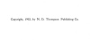

  
[Intangible Textual Heritage](../../index)  [Bible](../index) 
[Index](index)  [Next](jb01) 

------------------------------------------------------------------------

[Buy this Book at
Amazon.com](https://www.amazon.com/exec/obidos/ASIN/141790576X/internetsacredte)

------------------------------------------------------------------------

[Buy this Book on
Kindle](https://www.amazon.com/exec/obidos/ASIN/B002KCO5UC/internetsacredte)

------------------------------------------------------------------------

  
*The Life and Morals of Jesus of Nazareth (the Jefferson Bible)*, by
Thomas Jefferson, \[1902\], at Intangible Textual Heritage

------------------------------------------------------------------------

### THE

## LIFE AND MORALS

##### OF

# JESUS OF NAZARETH

###### Extracted Textually from the Gospels, together with a comparison of his doctrines with those of others.

###### BY

## THOMAS JEFFERSON.

 

|                                                                                                                                                                                                                                                                                                   |
|---------------------------------------------------------------------------------------------------------------------------------------------------------------------------------------------------------------------------------------------------------------------------------------------------|
| Jefferson's mission was leadership. Without an effort on his part expressions from his lips, that from other men's would scarcely have attracted notice, became thenceforth axioms, creeds, and gathering-cries to great masses of his countrymen.—*Henry S. Randall*. |

#### N. D. THOMPSON PUBLISHING CO.,

#### ST. LOUIS, CHICAGO AND

#### NEW YORK.

#### \[1902\]

Scanned, proofed and formatted at Intangible Textual Heritage, October
2007, by John Bruno Hare. This text is in the public domain in the US
because it was published prior to 1923.

  [  
Click to enlarge](img/cover.jpg)  
Front Cover and Spine  

  [  
Click to enlarge](img/front.jpg)  
Frontispiece: Thomas Jefferson  

  [  
Click to enlarge](img/title.jpg)  
Title Page  

 
[  
Click to enlarge](img/verso.jpg)  
Verso  

p. 2

Copyright, 1902, by N. D. Thompson Publishing Co.

------------------------------------------------------------------------

[Next: Preface](jb01)

