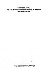

  
[Intangible Textual Heritage](../../index)  [Bible](../index) 
[Index](index)  [Next](jpspref) 

------------------------------------------------------------------------

*The Tanach*, Jewish Publication Society tr. \[1917\], at Intangible
Textual Heritage

------------------------------------------------------------------------

p. i

‏תורה נביאים וכתובום‎

# THE HOLY SCRIPTURES

##### ACCORDING TO THE MASORETIC TEXT

### A NEW TRANSLATION

##### WITH THE AID OF PREVIOUS VERSIONS AND WITH CONSTANT CONSULTATION OF JEWISH AUTHORITIES

#### PHILADELPHIA

#### THE JEWISH PUBLICATION SOCIETY OF AMERICA

#### 5677—1917

#### \[1917\]

p. ii

Copyright, 1917,

By The Jewish Publication Society of America

All rights reserved

The Lakeside Press, Chicago

Scanned at Intangible Textual Heritage, 206. Proofed and formatted by
John Bruno Hare. This text is in the public domain in the United States
because it was published prior to 1923. These files may be used for any
purpose by anyone without any restrictions.

  [  
Click to enlarge](img/title.jpg)  
Title Page  

 
[  
Click to enlarge](img/verso.jpg)  
Verso  

------------------------------------------------------------------------

[Next: Preface](jpspref)

