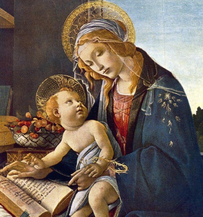

  
[Intangible Textual Heritage](../../index)  [Bible](../index) 

------------------------------------------------------------------------

[Buy this Book on
Kindle](https://www.amazon.com/exec/obidos/ASIN/B002LE7A6A/internetsacredte)

------------------------------------------------------------------------

<table width="75%">
<colgroup>
<col style="width: 50%" />
<col style="width: 50%" />
</colgroup>
<tbody>
<tr class="odd">
<td width="50%" data-valign="TOP"> 
Madonna with the book, Sandro Botticelli [1483] (Public Domain Image)</td>
<td width="50%" data-valign="CENTER"><h1 id="the-lost-books-of-the-bible" data-align="CENTER">The Lost Books of the Bible</h1>
<h3 id="edited-by-rutherford-h.-platt-jr." data-align="CENTER">edited by Rutherford H. Platt, Jr.</h3>
<h4 id="section" data-align="CENTER">[1926]</h4></td>
</tr>
</tbody>
</table>

------------------------------------------------------------------------

[Contents](#contents)    [Start Reading](lbob00)    [Page
Index](pageidx)    [Text \[Zipped\]](lbob.txt.gz)

------------------------------------------------------------------------

|                                                                                                                           |
|---------------------------------------------------------------------------------------------------------------------------|
|  |

This is a collection of New Testament Apocrypha, including many works
which were admired and read by the early Christians, but which were
later excluded from the canonical Bible. It includes accounts of the
young Jesus, particularly the Gospel of Mary and the Protevangelion,
which provides additional folklore about the birth and youthful
adventures of Jesus. Of note are the letters of Paul and Seneca, and the
letters of Herod and Pilate, which are most likely a forgery, but add
more depth to the question of the historicity of Jesus. There are also a
number of non-canonical epistles, such as Laodiceans. Also worth a close
read are the three books of the Shepherd of Hermas, which uses
apocalyptic and symbolic imagery. This collection is an invaluable
selection of portions of the New Testament which illustrates the fluid
nature of the early Biblical canon, and provides access to all of the
'spare parts.'--J.B. Hare, August 12, 2009.

Although not attributed, the initials of the editor, Rutherford H.
Platt, Jr., appear on the Preface. He also edited the companion volume
[The Forgotten Books of Eden](../fbe/index), a collection of Old
Testament apocrypha.

------------------------------------------------------------------------

 [Title Page](lbob00)  
[List of Illustrations](lbob01)  
[Introduction](lbob02)  
[The Order of All the Books](lbob03)  
[Preface](lbob04)  
[The Gospel of the Birth of Mary](lbob05)  
[The Protevangelion](lbob06)  
[The First Gospel of the Infancy of Jesus Christ](lbob07)  
[Thomas's Gospel of the Infancy of Jesus Christ](lbob08)  
[The Epistles of Jesus Christ and Abgarus King of Edessa](lbob09)  
[The Gospel of Nicodemus, Formerly Called the Acts of Pontius
Pilate](lbob10)  
[The Apostles’ Creed](lbob11)  
[The Epistle of Paul the Apostle to the Laodiceans](lbob12)  
[The Epistles of Paul the Apostle to Seneca, with Seneca's to
Paul](lbob13)  
[The Acts of Paul and Thecla](lbob14)  
[The First Epistle of Clement to the Corinthians](lbob15)  
[The Second Epistle of Clement to the Corinthians](lbob16)  
[The General Epistle of Barnabas](lbob17)  
[The Epistle of Ignatius to the Ephesians](lbob18)  
[The Epistle of Ignatius to the Magnesians](lbob19)  
[The Epistle of Ignatius to the Trallians](lbob20)  
[The Epistle of Ignatius to the Romans](lbob21)  
[The Epistle of Ignatius to the Philadelphians](lbob22)  
[The Epistle of Ignatius to the Smyrnæans](lbob23)  
[The Epistle of Ignatius to Polycarp](lbob24)  
[The Epistle of Polycarp to the Philippians](lbob25)  
[The Shepherd of Hermas](lbob26)  
[The Second Book of Hermas, Called His Commands](lbob27)  
[The Third Book of Hermas, Which Is Called His Similitudes](lbob28)  
[Letters of Herod and Pilate](lbob29)  
[The Lost Gospel According to Peter](lbob30)  
[Table I.](lbob31)  
[Table II.](lbob32)  
