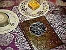

  
[Intangible Textual Heritage](../index)  [Index](index) 
[Previous](bos236)  [Next](bos239) 

------------------------------------------------------------------------

  

sacred-texts \|  Web \| *Powered by*

 

*Sponsored Links:*

------------------------------------------------------------------------

  
*Internet Book of Shadows*, (Various Authors), \[1999\], at Intangible
Textual Heritage

------------------------------------------------------------------------

              

                       THE

                  STANDING STONES

                  BOOK OF SHADOWS

                                        by Scott Cunningham

              excerpted from:
              WICCA  A Guide For The Solitary Practioner
              PP. 111 - 187
              1989, Llewellyn Publications
              ISBN 0-87542-118-0

                                                                                1011          

                                      WORDS TO THE WISE ....

                        O daughters andsons of theEarth, adore theGoddess and Godand
              be blessed with the fullness of life.

                        Know thatThey havebrought youto thesewritings, forherein lie
              our ways of the Craft, to serve and fulfill the keepers of wisdom, the
              tenders of the sacred flame of knowledge.  Run the rites with love and
              joy, and the Goddess  and God will bless  you with all that  you need.
              But those who practice dark magicks shall know Their greatest wrath.

                        Remember thatyou are ofthe Craft. No moredo you trodthe ways
              of doubt.   You walk the  path of light, ever climbing  from shadow to
              shadow to  the  highest realm  of  existence.   But  though we're  the
              bearers of  truths, others do not  wish to share our  knowledge, so we
              run our rites beneath moon filled  skies enwrapped in shadows.  But we
              are happy.

                        Live fully, forthat is the purpose of life. Refrain not from
              earthly existence.   From it  we grow to  learn and understand,  until
              such time that we are reborn to learn more, repeating this cycle 'till
              we have spiralled  up the path of perfection and  can finally call the
              Goddess and God our kin.

                        Walk the fields andforests; be refreshedby the cool windsand
              the touch of a  nodding flower.  The Moon and Sun  sing in the ancient
              wild places:   The deserted  seashore, the stark  desert, the  roaring
              waterfall.   We are  of the Earth  and should  revere Her,  so do  Her
              honor.

                        Celebratethe riteson theappropriate daysand seasons,and call
              upon the Goddess and God when the time is meet, but use the Power only
              when necessary, never  for frivolous ends.  Know that  using the Power
              for harm is a Perversion of Life itself.

                        But for those who love and magnify love, the richness oflife
              shall be your reward.  Nature will celebrate.

                   So love the Goddess and God, and harm none!

                                                                                1012          

                                       THE NATURE OF OUR WAY

                        * As  often as possible, hold  the rites in  forests, by the
              seashore, on deserted mountaintops or near tranquil lakes.  If this is
              impossible, a garden  or some chamber shall suffice, if  it is readied
              with fumes of flowers.

                        *Seek outwisdom inbooks, rare manuscriptsand crypticpoems if
              you will, but seek it out also in simple stones and fragile herbs  and
              in the cries of wild birds.  Listen to the whisperings of the wind and
              the  roar of water if you  would discover magick, for  it is here that
              the old secrets are preserved.

                        * Books contain words;trees contain energies andwisdom books
              ne'er dreamt of.

                        *  Ever remember that the  Old Ways are constantly revealing
              themselves.  Therefore  be as the  river willow that  bends and  sways
              with  the wind.    That which  remains  changeless shall  outlive  its
              spirit, but that which evolves and grows will shine for centuries.

                        * Therecan be no monopolyon wisdom.  Thereforeshare what you
              will of our ways with  others who seek them, but hide mystic lore from
              the  eyes of those  who would destroy,  for to do  otherwise increases
              their destruction.

                        * Mock not the rituals or spells of another, for who can say
              yours are greater in power or wisdom?

                        *Ensure that your actions are honorable, for all that you do
              shall return to you three-fold, good or bane.

                        * Be waryof one who would dominate you,who would control and
              manipulate your  workings  and reverences.    True reverence  for  the
              Goddess  and God occurs within.  Look  with suspicion on any who would
              twist worship from you for their own gain and glory, but welcome those
              priestesses and priests who are suffused with love.

                        * Honorall living things,for we are ofthe bird, thefish, the
              bee.  Destroy not life save it be to preserve your own.

                   * And this is the nature of our way.

                                                                                1013          

                                          BEFORE TIME WAS

                        Beforetime was, therewas The One;The One was all,and all was
              The One.

                        Andthe vast expanseknown asthe universewas TheOne, all-wise,
              all-pervading, all-powerful, eternally changing.

                        And space moved.  The Onemolded energy into twin forms,equal
              but opposite, fashioning the Goddess  and God from The One and  of The
              One.

                        The Goddess and God stretched and gave thanks to The One,but
              darkness surrounded them.  They were alone, solitary save for The One.

                        So They formed energy  into gasses and gasses into  suns and
              planets and moons;  They sprinkled the  universe with whirling  globes
              and so all was given shape by the hands of the Goddess and God.

                        Light aroseand the sky wasilluminated by a billionsuns.  And
              the Goddess and God, satisfied by their works, rejoiced and loved, and
              were one.

                        From theirunion sprang the seedsof all life, andof the human
              race, so that we might achieve incarnation upon the Earth.

                        TheGoddess chose theMoon as Hersymbol, and theGod the Sun as
              His symbol, to remind the inhabitants of Earth of their fashioners.

                        All areborn, live, dieand are rebornbeneath the Sunand Moon;
              all things come  to pass thereunder, and all occurs with the blessings
              of The One, as has been the way of existence before time was.

                                                                                1014          

                                        SONG OF THE GODDESS

                        I am the GreatMother, worshipped by all creationand existent
              prior to their consciousness.  I am the primal female force, boundless
              and eternal.

                        I am thechaste Goddessof the Moon,the Lady ofall magick. The
              winds and moving leaves sing  my name.  I wear the  crescent Moon upon
              my brow and my feet rest among the starry heavens.  I am mysteries yet
              unsolved, a path  newly set upon.  I am a field untouched by the plow.
              Rejoice in me and know the fullness of youth.

                        I amthe blessed Mother,the gracious Lady ofthe harvest. I am
              clothed with the  deep, cool wonder of the  Earth and the gold  of the
              fields heavy with grain.  By me the tides  of the Earth are ruled; all
              things  come to  fruition according  to my  reason.   I am  refuge and
              healing.  I am the life-giving Mother, wondrously fertile.

                        Worship me as theCrone, tender of the unbrokencycle of death
              and rebirth.   I am the  wheel, the shadow  of the Moon.   I rule  the
              tides of  women and men and  give release and renewal  to weary souls.
              Though the darkness  of death  is my domain,  the joy  of birth is  my
              gift.

                        I amthe Goddess of theMoon, the Earth,the Seas.  Mynames and
              strengths are  manifold.   I pour  forth magick  and power, peace  and
              wisdom.    I am  the  eternal  Maiden, Mother  of  all,  and Crone  of
              darkness, and I send you blessings of limitless love.

                                          CALL OF THE GOD

                        I am the radiant King of the Heavens, floodingthe Earth with
              warmth and encouraging the hidden seed of creation to burst forth into
              manifestation.   I lift  my shining  spear to light  the lives  of all
              beings and  daily pour forth my gold upon the Earth, putting to flight
              the powers of darkness.

                        I am the master of the beasts wild and free.  I run with the
              swift stag  and soar as  a sacred falcon  against the shimmering  sky.
              The ancient woods and wild places  emanate my powers, and the birds of
              the air sing of my sanctity.

                        I amalso the lastharvest, offering upgrain andfruits beneath
              the sickle of time so that all may be nourished.  For without planting
              there can be no harvest; without winter, no spring.

                        Worshipme as the thousand-namedSun of creation,the spirit of
              the horned stag in the wild, the  endless harvest.  See in the  yearly
              cycle of festivals my birth, death and rebirth - and know that such is
              the destiny of all creation.

                        I am the sparkof life, the radiantSun, the giver of peaceand
              rest,  and  I  send  my  rays of  blessings  to  warm  the  hearts and
              strengthen the minds of all.

                                                                                1015          

                                       THE CIRCLE OF STONES

                        The Circle of stonesis used during indoor rituals,for energy
              raising, meditation and so on.

                   First cleanse the area with the ritual broom.

                        For this circle you willneed four large, flat stones. If you
              have none, candles can be used to mark the four cardinal points of the
              circle.  White or purple candles can be used, as can colors related to
              each direction - green for  the North, yellow for East, red  for South
              and blue for West.

                        Placethe first stone(or candle) tothe North, torepresent the
              Spirit of  the North Stone. In  ritual when you invoke  the Spirits of
              the  Stones  you're  actually  invoking  all  that  resides   in  that
              particular direction, including the elemental energies.

                        After setting theNorth Stone(or candle), placethe East,South
              and  West  Stones.   They  should  mark  out  a rough  square,  nearly
              encompassing the working  area.  This  square represents the  physical
              plane on which we exist - the Earth.

                        Nowtake a long purpleor white cordand lay it outin a circle,
              using  the four  stones or candles  to guide you.   It takes  a bit of
              practice to smoothly do this.   The cord should be placed so  that the
              stones remain inside the circle.  Now  you have a square and a circle,
              the circle  representing the spiritual  reality.   As such, this  is a
              squared circle;  the  place of  interpenetration of  the physical  and
              spiritual realms.

                        The  size of the  circle can be  anything from 5  to 20 feet
              depending on the room and your desires.
                   Next, set up the altar.  The following tools are recommended:

                   * A Goddess symbol (candle, holed stone, statue)
                   * A God symbol (candle, horn, acorn, statue)
                   * Athame 
                   * Wand
                   * Censer
                   * Pentacle
                   * A bowl of Water (spring, rain or tap)
                   * A bowl of Sea Salt (it can also be placed on the pentacle)
                   * Incense
                   * Flowers and greens
                   * One red candle in holder (if not using point candles)
                        * Anyother tools ormaterials requiredfor the ritual,spell or
                   magickal working

                        Set upthe altar accordingto theplan shown hereor accordingto
              your own design.  Also be sure to have plenty of matches, as well as a
              small  heat-proof  container in  which  to place  them  when used.   A
              charcoal block is also necessary to burn the incense.

                                                                                1016          

                   Goddess                                                  God
                   Symbol or                                              Symbol or
                    Candle                                                 Candle  

                                              Censer

                   Bowl of                     Red                        Bowl of
                    Water                     Candle                        Salt

                                             Pentacle

                     Cup                                                  Incense

                                             Cauldron,
                                             or Spell
                   Wand                      Materials                      Knife

                   Bell                                                    Boline

                                      Suggested Altar Layout

                        Light thecandles. Set theincense smoking. Lift theathame and
              touch its blade to the water, saying:

                   I consecrate and cleanse this water
                   that it may be purified and fit to
                   dwell within the sacred Circle of Stones.
                   In the name of the Mother Goddess and Father          God,
                   I consecrate this water.

                        As  you do  this, visualize  your athame  blasting away  all
              negativity from the water.
                        The salt is next touched with  the point of the athame while
              saying:

                   I bless this salt that it may be fit
                   to dwell within the sacred Circle of Stones.
                   In the name of the Mother Goddess and Father          God,
                   I bless this salt.

                        Now stand facing North,at the edge of thecord-marked circle.
              Hold your athame point outward at waist level.  Walk slowly around the
              circle's perimeter clockwise, your feet just inside the cord, charging
              it  with your  words and  energy.   Create the  circle -  through your
              visualization - with the  power flowing out from your  athame's blade.
              As you walk,  stretch the energy out until it  forms a complete sphere
              around the working area, half above the ground, half below.  As you do
              this say:

                   Here is the boundary of the Circle of Stones.
                   Naught but love shall enter in,
                   Naught but love shall emerge from within.
                   Charge this by Your powers, Old Ones!

                                                                                1017               

                        When youhave arrived backat the North,place the athameon the
              altar.   Take up the salt and sprinkle it around the circle, beginning
              and ending  in  the North,  and  moving clockwise.    Next, carry  the
              smoking censer from the  altar, and finally sprinkle water  around the
              circle.    Do more  than carrying  and  walking; sense  the substances
              purifying the circle.  The Circle of Stones is now sealed.

                        Holdaloft the wand atthe North, atthe edge ofthe circle, and
              say:

                   O Spirit of the North Stone,
                   Ancient One of the Earth,
                   I call You to attend this circle.
                   Charge this by Your powers, Old Ones!

                        As yousay this,visualize agreenish mistrising and writhingin
              the Northern quarter, over the stone.  This is the elemental energy of
              the Earth. When  the Spirit is  present, lower the  wand, move to  the
              East, raise it again and say:

                   O Spirit of the East Stone,
                   Ancient One of Air,
                   I call You to attend this circle.
                   Charge this by Your powers, Old Ones!

                        Visualize theyellowish mistof Airenergy.  Lowerthe wand,move
              to  the  South  and repeat  the  following  with  your upraised  wand,
              visualizing a crimson Fire mist:

                   O Spirit of the South Stone,
                   Ancient One of Fire,
                   I call You to attend this circle.
                   Charge this by Your powers, Old Ones!

                   Finally, to the West, say with the wand held aloft:

                   O Spirit of the West Stone,
                   Ancient One of Water,
                   I call You to attend this circle.
                   Charge this by Your powers, Old Ones!

                   Visualize the bluish mist, the essence of Water.
                        The circle breaths and lives around you.  The Spirits of the
              Stones are present.  Feel the  energies.  Visualize the circle glowing
              and growing in power.  Stand still, sensing for a moment.

                        The Circleof Stones is complete.  The Goddess and God may be
              called, and magick wrought.

                                                                                1018          

                                         CUTTING A DOORWAY

                        At times you may have to leave the circle.  This is fine, of
              course,  but  as  previously  mentioned, passing  through  the  circle
              dissipates it.  To prevent this from occurring it's traditional to cut
              a doorway.

                        Todo this,face Northeast. Hold yourathame pointdownward near
              the ground.  See and sense the circle before  you.  Pierce its wall of
              energy with  the athame  and trace  an archway,  tall  enough to  walk
              through,  moving counter-clockwise  along the  circle for  about three
              feet.  Move the  point of the athame up at the  arch's center and down
              the other side until it is near the ground.

                        As you're doingthis, visualizethat area ofthe circle'senergy
              being sucked  back into  the athame.   This  creates a void,  allowing
              passage in and out of the circle.  Pull the athame out of the circle's
              wall.  You're free to walk outside.

                        Onceback inside, close the door by placing the athame at the
              lower North-Eastern point  of the archway.  With your athame trace the
              circle's perimeter  clockwise, as  if redrawing  that  portion of  the
              Circle  of Stones, again visualizing blue or purple energy flaring out
              from the  blade and converging  with the rest  of the  circle.  It  is
              done.

                                       RELEASING THE CIRCLE

                   Once the rite is ended, face North, hold aloft the wand and say:

                   Farewell, Spirit of the North Stone.
                   I give thanks for your presence here.
                   Go in power.

                        Repeat  this  same formula  to  the  East, South  and  West,
              substituting the proper direction  in the words.   Then return to  the
              North and hold the wand aloft for a few moments.

                        Lay the wandon the altar. Take up theathame.  Standingin the
              North,  pierce the circle's wall with the  blade at waist level.  Move
              clockwise around the circle, visualizing it's power being  sucked back
              into the  athame.  Literally pull  it back into the  blade and handle.
              Sense  the  circle dissolving,  shrinking;  the  outside world  slowly
              regaining its dominance in the area.

                   When you arrive at the North again, the circle is no more.

                                                                                1019          

                              VISUALIZATIONS FOR THE CIRCLE OF STONES

                        If  you wish, you  can back up  the circle casting  with the
              following visualizations as you form the circle itself:
                        Prepare asusual.  Approachthe Northand set theNorth Stone(or
              the candle)  on the  ground.   Then, visualize  a stone  slab standing
              upright two feet to the left of and behind the North Stone.  Visualize
              this as  being bluish-grey, two feet wide, two feet thick and six feet
              tall.  This stone represents the Goddess.

                        When thestone is really there- in your visualization- create
              another stone of the same size and  color two feet to the right of and
              behind the North Stone.  This represents the God.

                        Now visualize a capstone  resting on top of the  two upright
              stones.   It  is about  two  feet  by two  feet  by six  feet.    This
              represents The One before the Goddess and God, the source of all power
              and magick.  The Northern Trilithon is now complete.

                        Thestones form anarchway, a symbolof the gatewayto the realm
              of the element of Earth.

                        Firmlyvisualize this, then gazethrough the archformed by the
              stones.  See the greenish haze of the Earth energy.

                        Repeat the  entire procedure  to the East,  South and  West.
              Visualize the appropriate elemental color within each trilithon.

                        Now purify salt and water,cast the circle as usual, andcarry
              around the salt, censer, candle and water.

                        As youapproach each quarterto callits Spirit ofthe Stone,see
              the  trilithon firmly  in your mind.   Visualize  it in  all its Pagan
              splendor.  See the  elemental hazes within them, boiling  and writhing
              in  unmanifestedness.   Stretch  out  with  your  feelings; sense  the
              arrival of the spirit of each stone, then go on to the next.

                        With practice this comes easily, but such visualizations are
              never necessary.

              THE BLESSING CHANT

              The Blessing Chant can be said at  the beginning of any type of ritual
              as a general invocation.  Separate invocations of the  Goddess and God
              may follow.

                   May the powers of The One,
                   the source of all creation;
                   all-pervasive, omnipotent, eternal;
                   may the Goddess,
                   the Lady of the Moon;
                   and the God,
                   Horned Hunter of the Sun;
                   may the powers of the Spirits of the Stones,
                   rulers of the elemental realms;
                   may the powers of the stars above and the Earth below,
                   bless this place, and this time, and I who am         with you.

                                                                                1020          

              THE SIMPLE FEAST

                        Hold up a Chalice of wine (or some other liquid) betweenyour
              hands to the sky, and say:

                   Gracious Goddess of Abundance,
                   Bless this wine and infuse it with your              love.
                   In your names, Mother Goddess and Father God,
                   I bless this wine (or brew, juice, etc.).

                        Hold upa plate ofcakes (bread,biscuits) with bothhands tothe
              sky and say:

                   Powerful God of the Harvest,
                   Bless these cakes and infuse them with your           love.
                   In your names, Mother Goddess and Father God,
                   I bless these cakes (or this bread).

              CONSECRATION OF TOOLS

                        Lightthe candles. Set the incensesmoking.  Castthe Circle of
              Stones.  Place the tool on the pentacle, or a plate of salt.  Touch it
              with the point of your athame (or your projective hand) and say:

                        Iconsecrate you, O Athame of steel(or wand of wood, etc.) to
              cleanse and purify  you to serve me within  the Circle of Stones.   In
              the names of the Mother Goddess and Father God, you are consecrated.

                        Send projective  energy into the  tool, cleansing it  of all
              negativity and past  associations.  Now pick  it up and  sprinkle with
              salt, pass it through the incense  smoke, through the candle flame and
              sprinkle  with  water,  calling upon  the  Spirits  of  the Stones  to
              consecrate it.

                   Then hold the tool to the sky, saying:

                        I charge youby the OldOnes: By theomnipotent Goddess andGod:
              By the virtues of the Sun, Moon and Stars: By the powers of the Earth,
              Air,  Fire and Water,  that I shall  obtain all that  I desire through
              you.  Charge this by your power, Old Ones!

                        The toolshould immediately beput touse to strengthenand bind
              the consecration.  For  example, the athame can be used  to consecrate
              another  tool; a wand to invoke the Goddess;  the pentacle to act as a
              resting place for a tool during its consecration.

                                                                                1021          

              THE FULL MOON RITE

                        Perform this at night,in the view ofthe Moon if possible. It
              is appropriate  for crescents, white  flowers, silver and  other lunar
              symbols  to  be present  on the  altar for  this  ritual.   The quartz
              crystal sphere can be placed on the altar as well.  Or, if you prefer,
              use the cauldron (or a small  white or silver bowl) filled with water.
              Place a piece of silver into the water.

                        Arrangethe altar, light the candles and censer, and cast the
              Circle of Stones.

                        Stand beforethe altar andinvoke the Goddess andGod, with the
              Blessing Chant and/or  any other invocations (see  Prayers, Chants and
              Invocations in this Book of Shadows).

                        Now gaze at the Moon, ifpossible.  Feel its energies sinking
              into  your body.  Feel its cool Goddess energy wash you with power and
              love.
                   Now say these or similar words:

                   Wondrous Lady of the Moon
                   You who greets the dusk with silvered kisses;
                   Mistress of the night and of all magicks,
                   who rides the clouds in blackened skies
                   and spills light upon the cold Earth;
                   O Lunar Goddess,
                   Crescented-One,
                   Shadow maker and shadow breaker;
                   Revealer of mysteries past and present;
                   Puller of seas and ruler of women;
                   All-wise Lunar Mother,
                   I greet your celestial jewel
                   at the waxing of its powers
                   With a rite in Your honor.
                   I pray by the Moon,
                   I pray by the Moon,
                   I pray by the Moon.

                        Continue chanting"I pray bythe Moon"  foras long asyou will.
              Visualize  the Goddess  if you so  desire, perhaps  as a  tall, robust
              woman  wearing silver jewelry and white, rippling, draped clothing.  A
              crescent  Moon may  rest upon  Her  brow, or  She may  toss a  glowing
              silvery white orb in Her  hands.  She treads the starfield  of eternal
              night  in  an eternal  round with  Her lover,  the Sun  God, spreading
              moonrays wherever  She goes.   Her eyes laugh,  Her skin is  white and
              translucent. She glows.

                        Nowis the timefor magick ofall types, forthe full ofthe Moon
              marks the  height of its powers, and all positive spells cast then are
              powerful.

                        FullMoons arealso excellenttimesfor meditation,mirror magick
              and  psychic workings, for such  are often more  successful within the
              circle.    Crystal-scrying  is  particularly  recommended;  flood  the
              crystal with  moonlight prior to the  ritual.  If you  have no crystal
              sphere, use  the cauldron filled  with water and the  piece of silver.
              Gaze at the  water (or at the  Moon glinting on the  silver) to awaken
              your psychic awareness.

                                                                                1022               

                        Lunar  liquids such as lemonade,  milk or white  wine can be
              consumed during the  simple feast  that follows.   Crescent cakes  are
              traditional as well.
                   Thank the Goddess and God and release the circle.  It is done.

              YULE (circa December 21) 

                        Thealtar isadorned withevergreens suchas pine,rosemary, bay,
              juniper and cedar,  and the  same can be  laid to mark  the Circle  of
              Stones.  Dried leaves can also be placed on the altar. 

                        The cauldron, resting onthe altar on a heat-proofsurface (or
              placed before it if too large), should be filled with ignitable spirit
              (alcohol), or a red candle can be placed within it.  At outdoor rites,
              lay a fire within the cauldron to be lit during ritual. 

                        Arrange the altar, lightthe candles and incense, andcast the
              Circle of Stones. 
                   Recite the Blessing Chant. 
                   Invoke the Goddess and God. 
                        Stand before the cauldron  and gaze within it. Say  these or
              similar words: 
               
                   I sorrow not, 
                      though the world is wrapped in sleep. 
                   I sorrow not, 
                      though the icy winds blast. 
                   I sorrow not, 
                      though the snow falls hard and deep. 
                   I sorrow not, 
                      this too shall soon be past. 
               
                        Ignitethe cauldron (or candle),using long matchesor a taper.
              As the flame(s) leap up say: 
               
                   I light this fire in Your honor, 
                      Mother Goddess 
                   You have created life from death; 
                      warmth from cold; 
                      The Sun lives once again; 
                      the time of light is waxing. 
                   Welcome, 
                      ever-returning God of the Sun! 
                   Hail Mother of All! 
               
                        Circle the altar andcauldron slowly, clockwise, watching the
              flames.  Say the following chant for some time: 
               
                   The wheel turns; the power burns. 
               
                        Meditate upon the Sun,on the hidden energies lyingdormant in
              winter, not  only in the Earth  but within ourselves.   Think of birth
              not as the start  of life but as its continuance.   Welcome the return
              of the God. 

                                                                                1023               

                        After a time cease and stand once again before the altar and
              flaming caldron.  Say: 
               
                   Great God of the Sun, 
                      I welcome Your return. 
                   May You shine brightly upon the Goddess; 
                      may You shine brightly upon the Earth, 
                      scattering seeds and fertilizing the land. 
                   All blessings upon You, 
                      reborn One of the Sun! 
               
                   Works of magick, if necessary, may follow. 
                   Celebrate the Simple Feast. 
                   The circle is released.  
              YULE LORE 
               
                        Onetraditional Yuletidepractice isthe creationof aYule tree.
              This  can be a living,  potted tree which can later  be planter in the
              ground, or a cut one.  The choice is yours. 

                        Appropriate Pagandecorations are fun to make,from strings of
              dried rosebuds  and cinnamon sticks  (or popcorn and  cranberries) for
              garlands,  to  bags of  fragrant spices  which  are hung  from boughs.
              Quartz  crystals can  be wrapped  with shiny  wire and  suspended from
              sturdy  branches to  resemble  icicles.   Apples,  oranges and  lemons
              hanging from boughs are strikingly beautiful, natural decorations, and
              were customary in ancient times. 

                        Many enjoy the custom of  lighting the Yule log.  This  is a
              graphic representation of  the rebirth  of the God  within the  sacred
              fire of  the Mother  Goddess.   If you choose  to burn  one, select  a
              proper log (traditionally of oak or pine).  Carve or chalk a figure of
              the Sun (such as a rayed disc) or the God (a horned circle or a figure
              of a man) upon it, with the Boline, and set it alight in the fireplace
              at dusk on Yule.   As the log burns, visualize the  Sun shining within
              it and think of the coming warmer days. 

                        As to food, nuts,  fruits such as apples and pears, cakes of
              caraways  soaked   in  cider,  and  (for   non-vegetarians)  pork  are
              traditional fare.  Wassail, lambswool, hibiscus or ginger tea and fine
              drinks for the Simple Feast or Yule Meals. 
               
               
               

                                                                                1024          

              IMBOLC (February 2) 

                        Asymbol ofthe season, suchas arepresentation ofa snow flake,
              a white  flower, or perhaps  some snow in  a crystal container  can be
              placed  on the altar.  An orange  candle anointed with musk, cinnamon,
              frankincense or rosemary  oil, unlit, should also be there.   Snow can
              be melted and used for the water during the circle casting. 

                        Arrangethe altar, light the candles and censer, and cast the
              Circle of Stones. 
                   Recite the Blessing Chant. 
                   Invoke the Goddess and God. 
                   Say such words as the following: 
               
                   This is the time of the feast of torches, 
                      when every lamp blazes and shines 
                      to welcome the rebirth of the God. 
                   I celebrate the Goddess, 
                      I celebrate the God; 
                      all Earth celebrates 
                      Beneath its mantle of sleep. 
               
                        Light the orange taper fromthe red candle on the altar(or at
              the Southern point of the circle).  Slowly walk  the circle clockwise,
              bearing the candle before you.  Say these or similar words: 
               
                   All the land is wrapped in winter. 
                   The air is chilled and frost envelops the Earth. 
                   But Lord of the Sun, 
                      Horned One of animals and wild places, 
                      unseen you have been reborn of the gracious Mother Goddess, 
                   Lady of all fertility. 
                   Hail Great God! 
                   Hail and welcome! 
               
                        Stop before the altar, holding aloft the candle.  Gaze atits
              flame.  Visualize  your life blossoming with  creativity, with renewed
              energy and strength. 

                        If you need to look into the future or past, now is an ideal
              time. 
                   Works of magic, if necessary, may follow. 
                   Celebrate the Simple Feast. 
                   The circle is released. 
               
               IMBOLC LORE 
               
                        It istraditional uponImbolc, atsunset or justafter ritual,to
              light every lamp in the house - if only for a few moments.   Or, light
              candles in  each room  in honor  of the  Sun's rebirth.   Alternately,
              light a kerosene lamp with a red chimney and place this in a prominent
              part of the home or in a window. 

                        If snow lies on the ground outside, walk in it for a moment,
              recalling the warmth  of summer.  With your projective  hand, trace an
              image of the Sun on the snow. 

                                                                                1025               

                        Foods  appropriate to eat on this day include those from the
              dairy, since Imbolc marks the festival of calving.   Sour cream dishes
              are fine.  Spicy and full-bodied foods in honor of the Sun are equally
              attuned.  Curries  and all  dishes made with  peppers, onions,  leeks,
              shallots, garlic or chives  are appropriate.  Spiced wines  and dishes
              containing  raisins  - all  foods  symbolic  of  the  Sun -  are  also
              traditional. 
              OSTARA (circa March 21) 
               
                        Flowersshould belaid onthe altar,placed around thecircle and
              strewn on  the ground.  The  cauldron can be filled  with spring water
              and flowers,  and buds and  blossoms may  be worn  as well.   A  small
              potted plant should be placed on the altar. 

                        Arrange the altar, lightthe candles and incense, andcast the
              Circle of Stones. 
                   Recite the Blessing Chant. 
                   Invoke the Goddess and God in whatever words please you. 
                   Stand before the altar and gaze upon the plant as you say: 
               
                   O Great Goddess, 
                      you have freed yourself from the icy prison of winter. 
                   Now is the greening, 
                      when the fragrance of flowers drifts on the breeze. 
                   This is the  beginning. 
                   Life renews itself by Your magick, 
                      the Earth Goddess. 
                   The God stretches and rises, 
                     eager in His youth, 
                     and bursting with the promise of summer. 
               
                        Touch theplant. Connect with itsenergies and, throughit, all
              nature.  Travel inside its leaves and stems through your visualization
              -  from  the center  of your  consciousness out  through your  arm and
              fingers and  into the plant  itself.  Explore its  inner nature; sense
              the miraculous processes of life at work within it. 

                   After a time, still touching the plant, say: 
               
                   I walk the Earth in friendship, 
                      not in dominance. 
                   Mother Goddess and Father God, 
                              instillwithinme throughthis plantawarmth forall living
              things. 
                   Teach me to revere the Earth and all its treasures. 
                   May I never forget. 
               
                        Meditate uponthe changing of theseasons.  Feelthe rousing of
              energies around you in the Earth. 
                   Works of magick, if necessary, may follow. 
                   Celebrate the Simple Feast. 
                   The circle is released. 
               
               
               

                                                                                1026          

              EOSTRA LORE 
               
                        A traditional VernalEquinox pastime:go to afield andrandomly
              collect  wildflowers [Thank  the  flowers for  their sacrifice  before
              picking them, using a collection  formula such as can be found  in "An
              Herbal Grimoire" elsewhere in this Book of Shadows].  Or buy some from
              a  florist, taking one or two of those that appeal to you.  Then bring
              them home and divine their magickal meanings by the use of books, your
              own intuition,  a pendulum  or by  other  means.   The flowers  you've
              chosen reveal your inner thoughts and emotions. 

                        It isimportant at thistime ofrenewed life toplan a walk(or a
              ride)  through gardens,  a  park, woodlands,  forest  and other  green
              places.  This  is not simply exercise,  and you should be  on no other
              mission.  It  isn't even just  an appreciation of  nature.  Make  your
              walk celebratory, a ritual for nature itself. 

                        Other traditionalactivities include plantingseeds, workingon
              magickal gardens and  practicing all  forms of herb  work -  magickal,
              medicinal, cosmetic, culinary and artistic. 

                        Foods intune with thisday (linkingyour meals withthe seasons
              is a  fine way of attuning  with nature) include those  made of seeds,
              such as  sunflower, pumpkin and  sesame seeds, as  well as  pine nuts.
              Sprouts  are  equally appropriate,  as  are  leafy, green  vegetables.
              Flower dishes such  as stuffed nasturtiums or carnation  cupcakes also
              find  their place here. [Find a book  of flower cooking or simply make
              spice cupcakes.   Ice with pink  frosting and place a  fresh carnation
              petal on each cupcake.  Stuff nasturtium blossoms  with a mixture made
              with cream cheese, chopped nuts, chives and watercress.] 
               
               
               
              BELTANE (April 30) 
               
                        If possible,celebrate Beltanein a forestor neara livingtree.
              If  this  is  impossible,  bring  a  small  tree  within  the  circle,
              preferably potted; it can be of any type. 

                        Create a small token or charm in honor of the wedding of the
              Goddess and  God to hang upon the  tree.  You can  make several if you
              desire.   These  tokens  can be  bags  filled with  fragrant  flowers,
              strings of  beads, carvings, flower  garlands - whatever  your talents
              and imagination can conjure. 

                        Arrangethe altar, light the candles and censer, and cast the
              Circle of Stones. 
                   Recite the Blessing Chant 
                   Invoke the Goddess and God. 
                   Stand before the altar and say, with wand upraised: 
               
                   O Mother Goddess, 
                      Queen of the night and of the Earth; 
                   O Father God, 
                      King of the day and of the forest, 
                              IcelebrateYour unionas naturerejoicesin ariotous blaze
              of color and life. 
                   Accept my gift, 
                      Mother Goddess and Father God, 
                      in honor of Your union. 

                                                                                1027          

               
                   Place the token(s) on the tree. 
               
                   From Your mating shall spring forth life anew; 
                      a profusion of living creatures shall cover the lands, 
                      and the winds will blow pure and sweet. 
                   O Ancient Ones, 
                      I celebrate with You! 
               
                   Works of magick, if necessary, may follow. 
                   Celebrate the Simple Feast. 
                   The circle is released. 
               
               
              BELTANE LORE 
               
                        Weavingand plaiting are traditionalarts at thistime of year,
              for the joining together  of two substances to form a third  is in the
              spirit of Beltane. 

                        Foods traditionally come from the dairy, and dishes such  as
              marigold custard (see recipes - food)  and vanilla ice cream are fine.
              Oatmeal cakes are also appropriate. 
               
               
               
              MIDSUMMER (circa June 21) 
               
                        Before the rite, make upa small cloth pouch filled withherbs
              such as  lavender, chamomile, St. John's Wort,  vervain, or any of the
              Midsummer herbs listed  in "An  Herbal Grimoire."   Mentally pour  all
              your troubles,  problems, pains, sorrows  and illnesses, if  any, into
              this petition as  you construct it.   Tie it  shut with a red  string.
              Place this on  the altar for use during the rite.  The cauldron should
              also  be  there or  nearby.   Even  if  you  use candles  to  mark the
              quarters, the red candle in a holder should also be on the altar.  For
              outdoor rituals,  light a fire  - however small  - and drop  the pouch
              into this. 

                        Arrangethe altar, light the candles and censer, and cast the
              Circle of Stones. 
                   Recite the Blessing Chant. 
                   Invoke the Goddess and God. 
                   Stand before the altar and say, with wand upraised: 
               
                   I celebrate the noon of summer with mystic rites. 
                   O great Goddess and God, 
                              allnaturevibrateswith YourenergiesandtheEarth isbathed
              with warmth and life. 
                   Now is the time of forgetting past cares and banes; 
                      O fiery Sun, 
                      burn away the unuseful, 
                      the hurtful, 
                      the bane, 
                      in Your omnipotent power. 
                   Purify me! 
                   Purify me! 
                   Purify me! 
               

                                                                                1028               

                        Lay thewand onthe altar. Take up theherbal petitionand light
              it in the red candle on the altar (or, if outdoors, the ritual fire). 
              When it is burning drop it into the cauldron (or some other heat-proof
              container) and say: 
               
               
                   I banish you by the powers of the Goddess and         God! 
                   I banish you by the powers of the Sun, 
                      Moon and Stars! 
                   I banish you by the powers of the Earth, 
                      Air, 
                      Fire and Water! 
               
                        Pause,seeing thehurts andpains burninginto nothingness. Then
              say: 
               
                   O Gracious Goddess, 
                      O Gracious God, 
                              onthis night of Midsummermagick I pray        that You
              charge my life with wonder and            joy. 

                        Help me in attuning with the energies adrift          on the
              enchanted night air. 
                   I give thanks. 
               
                        Reflect  upon the purification you have undergone.  Feel the
              powers  of nature flowing through  you, washing you  clean with divine
              energy. 

                   Works of magick, if necessary, may follow. 
                   Celebrate the Simple Feast. 
                   The circle is released. 
               
               
               
              MIDSUMMER LORE 
               
                        Midsummeris practically theclassic time toperform magicks of
              all  kinds.   Healings,  love  magick and  protections  are especially
              suitable.    Herbs  can  be  dried  over  the ritual  fire  if  you're
              celebrating  outdoors.   Leap the  fire for  purification and  renewed
              energy. 

                   Fresh fruits are standard fare for Midsummer. 
               
               
               

                                                                                1029          

              LUGHNASADH (August 1) 
               
                        Placeupon the altarsheaves of wheat,barley or oats,fruit and
              breads, perhaps a  loaf fashioned in the figure of the Sun or a man to
              represent the  God.   Corn dollies,  symbolic of  the Goddess, can  be
              present there as well. 
                        Arrangethe altar, light the candles and censer, and cast the
              Circle of Stones. 
                   Recite the Blessing Chant. 
                   Invoke the Goddess and God. 
                        Stand before the altar, holding aloft the  sheaves of grain,
              saying these or similar words: 
               
                   Now is the time of the First Harvest, 
                              when thebounties ofnaturegive ofthemselvesso thatwemay
              survive. 
                   O God of the ripening fields, 
                      Lord of the Grain, 
                              grant methe understanding ofsacrifice as Youprepare to
              deliver Yourself under the sickle of the Goddess and journey to the   
                    lands of eternal summer. 
                   O Goddess of the Dark Moon, 
                              teachmethe secretsofrebirth asthe Sunlosesits strength
              and the nights grow cold. 
               
                        Rub theheads of the wheatwith your fingers sothat the grains
              fall onto the altar.  Lift a piece of fruit and  bite it, savoring its
              flavour, and say: 
               
                   I partake of the first harvest, 
                              mixing itsenergieswithmine thatImay continuemyquestfor
              the starry wisdom of perfection. 
                   O Lady of the Moon and Lord of the Sun, 
                      gracious ones before Whom the stars halt their courses, 
                      I offer my thanks for the continuing fertility of the Earth. 
                        May the nodding grain  loose its seeds  to be buried in  the
              Mother's breast, 
                      ensuring rebirth in the warmth of the coming Spring. 
               
                   Consume the rest of the fruit. 
               
                   Works of magick, if necessary, may follow. 
                   Celebrate the Simple Feast. 
                   The circle is released. 
               
               
               

                                                                                1030          

              LUGHNASADH LORE 
               
                        It is appropriate toplant the seedsfrom the fruit consumedin
              ritual.  If they sprout, grow the  plant with love and as a symbol  of
              your connection with the Goddess and God. 

                        Wheat  weaving (the  making  of corn  dollies,  etc.) is  an
              appropriate  activity for  Lughnasadh.   Visits  to fields,  orchards,
              lakes and wells are also traditional. 

                        The foods of Lughnasadh  include bread, blackberries and all
              berries,  acorns (leached  of their poisons  first), crab  apples, all
              grains and locally ripe produce.  A cake is sometimes baked, and cider
              is used in place of wine. 

                        If youdo make afigure of theGod from bread,it can beused for
              the Simple Feast. 
               
              MABON (circa September 21) 
               
                        Decorate the altar with acorns, oak sprigs, pine and cypress
              cones, ears  of corn, wheat  stalks and other  fruits and nuts.   Also
              place there a small rustic basket filled  with dried leaves of various
              colors and kinds. 

                        Arrangethe altar, light the candles and censer, and cast the
              Circle of Stones. 
                   Recite the Blessing Chant. 
                   Invoke the Goddess and God. 
                        Standbefore the altar, holdingaloft the basketof leaves, and
              slowly  scatter them  so that  they cascade to  the ground  within the
              circle.  Say such words as these: 
               
                   Leaves fall, 
                      the days grow cold. 
                   The Goddess pulls Her mantle of the Earth around Her as You, 
                      O Great Sun God, 
                      sail toward the West to the lands of 
                      Eternal Enchantment., 
                      wrapped in the coolness of night. 
                   Fruits ripen, 
                      seeds drop, 
                      the hours of day and night are balanced. 
                   Chill winds blow in from the North wailing laments. 
                   In this seeming extinction of nature's power, 
                      O Blessed Goddess, 
                      I know that life continues. 
                   For spring is impossible without the second harvest, 
                      as surely as life is impossible without death. 
                   Blessings upon You, 
                      O Fallen God, 
                      as You journey into the lands of winter 
                      and into the Goddess' loving arms. 
               

                                                                                1031          

                   Place the basket down and say: 
                
                   O Gracious Goddess of all fertility, 
                              Ihave sownandreapedthe fruitsofmy actions,goodandbane.
                        Grantme the courageto plantseeds of joyand lovein the coming
              year, 
                      banishing misery and hate. 
                   Teach me the secrets of wise existence upon this planet, 
                      O Luminous One of the Night! 
               
                   Works of magick, if necessary, may follow. 
                   Celebrate the Simple Feast. 
                   The circle is released. 
               
               
              MABON LORE 
               
                        A  traditional practice is to  walk wild places and forests,
              gathering seed  pods and dried  plants. Some of  these can be  used to
              decorate the home; others saved for future herbal magick. 

                        The foods ofMabon consistof the secondharvest's gleanings,so
              grains, fruit and vegetables predominate, especially corn.  Corn bread
              is traditional fare, as are beans and baked squash. 
               
               
               

                                                                                1032          

              Samhain (October 31) 
               
                        Placeupon thealtarapples, pomegranates,pumpkins, squashesand
              other  late autumn  fruits.   Autumn  flowers  such as  marigolds  and
              chrysanthemums are fine too.   Write on a piece of paper  an aspect of
              your life which  you may wish to  be free of; anger,  a baneful habit,
              misplaced feelings, disease.   The cauldron or some similar  tool must
              be present  before  the altar  as  well, on  a  trivet or  some  other
              heat-proof  surface (if the legs  aren't long enough).   A small, flat
              dish  marked with an eight-spoked  wheel symbol should  also be there.
              [This is just  what it sounds like. On  a flat plate or dish,  paint a
              large circle.  Put a dot in  the center of this circle and paint eight
              spokes radiating  out from the  dot to the  larger circle.   Thus, you
              have  a  wheel  symbol  -  a  symbol  of  the  Sabbats,  a  symbol  of
              timelessness.] 

                        Prior toritual, sit quietlyand thinkof friends andloved ones
              who have passed away.  Do not despair.  Know that they have gone on to
              greater things.   Keep  firmly  in mind  that the  physical isn't  the
              absolute reality, and souls never die. 

                        Arrangethe altar, light the candles and censer, and cast the
              Circle of Stones. 
                   Recite the Blessing Chant. 
                   Invoke the Goddess and God. 

                        Lift one  of the pomegranates and,  with your freshly-washed
              Boline, pierce the skin of the  fruit.  Remove several seeds and place
              them on the wheel-marked dish. 
                   Raise your wand, face the altar and say: 
               
                   On this night of Samhain I mark Your passing, 
                      O Sun King, 
                      through the sunset into the Land of the            Young. 
                   I mark also the passing of all who have gone          before, 
                      and all who will go after. 
                   O Gracious Goddess, 
                      Eternal Mother, 
                      You who gives birth to the fallen, 
                              teach meto know that inthe time of the        greatest
              darkness there is the greatest            light. 
               
                        Taste the pomegranate seeds; burst them with your  teeth and
              savour   their  sharp,  bittersweet   flavour.    Look   down  as  the
              eight-spoked symbol on the plate; the Wheel of the Year,  the Cycle of
              the Seasons, the End and Beginning of all Creation. 

                        Light a firewithin the cauldron(a candle isfine).  Sitbefore
              it, holding the piece of paper, gazing at its flames.  Say: 
               
                   Wise One of the Waning Moon, 
                      Goddess of the Starry Night, 
                              I createthis firewithin Your cauldronto      transform
              that which is plaguing me. 
                   May the energies be reversed: 
                      From the darkness, light! 
                      From bane, good! 
                      From death, birth! 
               

                                                                                1033               

                        Light thepaper in thecauldron's flames anddrop it inside. As
              it  burns, know that your  ill diminishes, lessens  and finally leaves
              you as it is consumed within the universal fires.  [The cauldron, seen
              as the Goddess.] 
                        If  you wish, you may attempt scrying  or some other form of
              divination, for  this is  a  perfect time  to look  into  the past  or
              future.  Try  to recall past lives  too, if you  will.  But leave  the
              dead in peace.  Honor  them with your memories but do not call them to
              you.    [Many Pagans  do attempt  to  communicate with  their deceased
              ancestors and friends  at this  time, but it  seems to  me that if  we
              accept  the  doctrine  of  reincarnation,  this  is a  rather  strange
              practice.  Perhaps the personalities that we  knew still exist, but if
              the soul is currently  incarnate in another body, communication  would
              be difficult, to say the least.   Thus, it seems best to remember them
              with peace and love - but do not call  them up.]  Release any pain and
              sense of loss you may feel into the cauldron's flames. 
                   Works of magick, if necessary, may follow. 
                   Celebrate the Simple Feast. 
                   The circle is released. 
               
               
               
              SAMHAIN LORE 
               
                        It is traditional on Samhain night to leave a plate of  food
              outside the home  for the souls of  the dead.  A candle  placed in the
              window guides them to  the Lands of Eternal Summer, and burying apples
              in the hard-packed earth "feeds" the passed ones on their journey. 

                        Forfood, beets,turnips,apples, corn,nuts, gingerbread,cider,
              mulled  wines and pumpkin dishes  are appropriate, as  are meat dishes
              (once again,  if you're  not vegetarian.   If so, tofu  seems ritually
              correct). 
               
               
               

                                                                                1034          

              A RITUAL OF GESTURES 
               
                        Stand in the ritualarea.  Stillyour thoughts.  Breathedeeply
              for half a  minute or so until composed  and calm.  Turn your  mind to
              our Deities. 

                        Face North. Lift bothhands to waistheight, palms down. Press
              your fingers  together,  creating  two  solid,  flat  planes.    Sense
              solidity,  foundation,  fertility.   Invoke  the powers  of  the Earth
              through the gesture. 

                        Moments Later, turn toward the East. Raise your hands a foot
              higher,  your palms facing away from  you (no longer parallel with the
              ground), and elbows slightly bent.  Spread your fingers and hold  this
              position, sensing movement  and communication.   Invoke the forces  of
              Air through the gesture. 

                        Face South. Lift your handsfully above yourhead.  Keepingthe
              elbows straight, grasp  your fingers  into tight fists.   Feel  force,
              power,  creation and destruction.   Invoke the forces  of Fire through
              the gesture. 

                        Turn to the West.  Lower your hands a  foot or so.  Bend the
              elbows,  turn  your palms  upward and  cup  them, pressing  the thumbs
              against  the  forefingers.    Sense fluidity,  the  ocean,  liquidity.
              Invoke the forces of Water through the gesture. 

                        Face Northagain.  Throw yourhead back and raiseboth hands to
              the  sky, palms up, fingers spread.   Drink in the essence of The One,
              the  unknowable,  unapproachable ultimate  source  of  all. Sense  the
              mysteries within the universe. 

                        Lower your projective hand (your writing hand) but keep your
              receptive  hand high.   Pressing  the third,  forth and  fifth fingers
              against the  palm, lift the  forefinger and  thumb to  create a  rough
              crescent shape.   Sense the reality  of the Goddess.   Sense Her love,
              Her fertility,  Her compassion.  Sense  the powers of the  Moon in the
              gesture; the force of the eternal seas - the presence of the Goddess. 
                        Lower your receptivehand; liftyour projective hand. Benddown
              the middle and  forth fingers toward the palm, and  trap them with the
              thumb.   Lift the forefinger and little finger up to the sky, creating
              a horned image.  Sense the reality of the God.  Sense the power of the
              Sun  in the  gesture; the  untamed  energies of  the  woodlands -  the
              presence of the God. 

                        Lower yourprojective hand. Laydown flat. Spread yourlegs and
              arms  until you've  created the  pattern  of a  pentagram.   Sense the
              powers  of the  elements running through  you; merging  and coalescing
              into your being.   Sense them as emanations from  The One, the Goddess
              and God. 

                   Meditate.  Commune.  Communicate. 
                   When finished, simply stand up.  Your rite of gestures is over. 
               
               
               

                                                                                1035          

              THE LAW OF THE POWER 
               
                        1.  The Power shall not be used  to bring harm, to injure or
              control  others.  But  if the need  rises, the Power shall  be used to
              protect your life or the life of others. 
                   2. The Power is used only as need dictates. 
                        3.The Power can be usedfor your own gain, aslong as by doing
              so you harm none. 
                        4.It is unwiseto accept money forthe use ofthe Power, for it
              quickly controls its taker.  Be not as those of other religions. 
                        5. Use not the Power forprideful gain, for such cheapens the
              mysteries of the Craft and magick. 
                        6. Everremember that the Poweris a sacred giftof the Goddess
              and God, and should never be misused or abused. 
                   7. And this is the Law of the Power. 
               
               
               
              INVOCATION OF THE ELEMENTS 
               
              Air, Fire, Water, Earth, 
              Elements of Astral birth, 
              I call you now; attend to me! 
               
              In the circle, rightly cast, 
              Safe from psychic curse or blast, 
              I call you now, attend to me! 
               
              From cave and desert, sea and hill, 
              By blade and wand, cup and pentacle, 
              I call you now; attend to me! 
              This is my will, so mote it be! 
               
              [This invocation may  be chanted  while moving or  dancing around  the
              altar to raise elemental energy for magickal workings.] 
               
               
               
                       PRAYERS, CHANTS AND INVOCATIONS 
                                  OF AND TO 
                             THE GODDESS AND GOD 
               
                        These prayers can be used toinvoke the Goddess and Godduring
              ritual,  just after  the circle  casting.   Of course,  any which  you
              compose or are inspired to say and be used as well. 
                        A fewchants arealso includedto raise energyor tocommune with
              the deities. 
                        Someof theseinvocations rhyme, andsome donot. But recall the
              power of  rhyme -  it link  our conscious mind  to the  unconscious or
              psychic mind, thereby producing ritual consciousness. 
                        Some of these are  related to specific deities but,  as Dion
              Fortune wrote:  "All the gods are  one god; and all  the goddesses are
              one goddess, and there is only one initiator." 
               
               
               

                                                                                1036          

              INVOCATION TO THE GODDESS 
               
              Crescent One of the starry skies, Flowered One of the fertile plan, 
              Flowing One of the ocean's sighs, 
              Blessed One of the gentle rain; 
              Hear my chant 'midst the standing stones, 
              Open me to your mystic light; 
              Waken me to your silver tones, 
              Be with me in my sacred rite! 
               
               
               
              INVOCATION TO PAN 
               
              O Great God Pan, 
              Beast and man, 
              Shepherd of goats and Lord of the Land, 
              I call you to attend my rites 
              On this most magickal of nights. 
              God of the wine, 
              God of the vine, 
              God of the fields and God of the kine, 
              Attend my circle with your love 
              And send Your blessings from above. 
              Help me to heal; 
              Help me to feel; 
              Help me to bring forth love and weal. 
              Pan of the forests, Pan of the glade, 
              Be with me as my magick is made! 
               
               
               
              ISIS INVOCATION 
               
              Isis of the Moon, 
              You who are all that ever was, 
              All that is, 
              And all that shall be: 
              Come, veiled Queen of Night! 
              Come as the scent of the sacred lotus 
              Charging my circle 
              With love and magick. 
              Do descend upon my circle, 
              I pray, 
              O Blessed Isis! 
               
               
               
              PRAYER TO THE HORNED GOD 
               
              Horned One of the wilderness, 
              Winged One of the shining skies, 
              Rayed One of the spen'drous Sun, 
              Fallen One of the Samhain cries- 
              I call amidst the standing stones 
              Praying that You, O Ancient One, 
              Will deign to bless my mystic rites- 
              O fiery Lord of the Blazing Sun! 

                                                                                1037          

              NEW MOON CHANT TO DIANA 
               
              Waxing, waxing, growing, growing- 
              Diana's power is flowing, flowing. 
                                          (repeat) 
               
               
               
              CALL TO THE GOD 
               
              Ancient God of the forest deeps, 
              Master of beast and Sun; 
              Here where the world is hushed and sleeps 
              Now that the day is done. 
              I call You in the ancient way 
              Here in my circle round, 
              Asking that You will hear me pray 
              And send Your Sun force down. 
               
               
               
              INVOCATION TO THE GODDESS 
               
              Gracious Goddess, 
              You who are the Queen of the Gods, 
              The lamp of night, 
              the creator of all that is wild and free; 
              Mother of woman and man; 
              Lover of the Horned God and protectress of all the    Craft: 
              Descend, I pray, 
              With Your Lunar ray of power 
              Upon my circle here! 

              INVOCATION TO THE GOD

              Blazing God,
              You who are the King of the Gods,
              Lord of the Sun,
              Master of all that is wild and free;
              Father of woman and man,
              Lover of the Moon Goddess and protector of all the    Craft:
              Descend I pray,
              With you Solar ray of power
              Upon my circle here!

              GODDESS CHANT

              Luna, Luna, Luna, Diana
              Luna, Luna, Luna, Diana
              Bless me, bless me, bless me, Diana,
              Luna, Luna, Luna, Diana
                                (repeat)

                                                                                1038          

              EVENING CHANT TO THE GOD

              Hail fair Sun,
              Ruler of day;
              Rise on the morn
              To light my way.
                         (to be said while watching the sunset)

              EVENING CHANT TO THE GODDESS

              Hail fair Moon
              Ruler of night;
              Guard me and mine
              Until the light.
                         (to be said while Moon-gazing at night)

              GODDESS CHANT

              Aaaaaaaaaaaaah
              Oooooooooooooh
              Uuuuuuuuuuuuuu
              Eeeeeeeeeeeeee
              Iiiiiiiiiiiiii

              [These are obviously, the  vowels of the English language.   Pronounce
              them as: A-"Ah," O-"O," U-"Oo," E-"E," I-"Eye."  Extend the  vowels as
              you  vocalize  them,  stretch  the  sounds.    This  produces  Goddess
              awareness, and rouses the psychic mind]

                                                                                1039          

              THE LORE OF NUMBERS

                        To be used in ritual and magickal workings.  In general, odd
              numbers are related to  women, receptive energy and the  Goddess; even
              numbers to men, projective energy and the God.

              1.     The universe; The One; the source of all.

              2.        The  Goddess and  God; The  perfect duality;  projective and
              receptive   energy;   the   couple;   personal   union   with   deity;
              interpenetration of the physical and spiritual; balance.

              3.     The Triple Goddess; the Lunar phases;  the physical, mental and
              spiritual aspects of our species.

              4.        The elements;  the Spirits  of  the Stones;  the winds;  the
              seasons.

              5.     The senses;  the pentagram; the elements plus Akasha; a Goddess
              number.

              7.       The planets which  the ancients knew;  the time of  the Lunar
              phase; power; protection and magick.

              8.     The number of Sabbats; a number of the God.

              9.     A number of the Goddess.

              13.    The number of Esbats; a fortunate number.

              15.    A number of good fortune.

              21.    The number of Sabbats and Esbats in the Pagan year; a number of
              the Goddess.

              28.    A number of the Moon; a number of the goddess.

              101.   The number of fertility.

              The planets are numbered thus:

              Saturn      3           Venus       7
              Jupiter     4           Mercury     8
              Mars        5           Moon        9
              Sun         6

                                                                                1040          

              THIRTEEN GOALS OF A WITCH

                 I.   Know yourself
                II.   Know your Craft (Wicca)
               III.   Learn
                IV.   Apply knowledge with wisdom
                 V.   Achieve balance
                VI.   Keep your words in good order
               VII.   Keep your thoughts in good order
              VIII.   Celebrate life
                IX.   Attune with the cycles of Terra
                 X.   Breathe and eat correctly
                XI.   Exercise the body
               XII.   Meditate
              XIII.   Honor the Goddess and God

              RECIPES FOR FOOD

              CRESCENT CAKES

                  1 cup firmly ground almonds
              1 1/4 cups flour
                1/2 cup confectioner's sugar
                  2 drops almond extract
                1/2 cup butter, softened
                  1 egg yolk

                        Combinealmonds, flour,sugarand extractuntil thoroughlymixed.
              with the hands, work in butter and egg yolk until well-blended.  Chill
              dough.  Preheat  oven to  325 degrees F.   Pinch  off pieces of  dough
              about the size of walnuts and  shape into crescents.  Place on greased
              sheets and  bake for  about 20  minutes.   Serve during Simple  Feast,
              especially at Esbats.

                                                                                1041          

              BELTANE MARIGOLD CUSTARD

                2 cups milk
                1 cup unsprayed marigold petals
              1/4 tsp. salt
                3 tbsp. sugar
                1 to 2-inch piece vanilla bean
                3 egg yolks, slightly beaten
              1/8 tsp. allspice
              1/8 tsp. nutmeg
              1/2 tsp. rose water
                  whipped cream

                        Using a cleanmortar and pestle reservedfor cooking purposes,
              pound marigold  petals.  Or, crush with a spoon.   Mix the salt, sugar
              and spices together.   Scald milk with the  marigolds and the  vanilla
              bean.  Remove the vanilla  bean and add the slightly beaten  yolks and
              dry ingredients.  Cook on low heat.   When the mixture  coats a spoon,
              add rose water and cool.
                   Top with whipped cream, garnish with fresh marigold petals.

              SOFT MEAD

                1 quart water, preferably spring water
                1 cup honey
                1 sliced lemon
              1/2 tsp. nutmeg

                        Boil together  all ingredients in a non-metallic pot.  While
              boiling, scrape  off the rising "scum"  with a wooden spoon.   When no
              more rises add the following:

                  pinch salt
                  juice of 1/2 lemon

                        Strain andcool.  Drinkin placeof alcoholic meador wineduring
              the Simple Feast.

              BEVERAGES

                        If you  wish to avoid the  use of wine, which  has long been
              utilized  in  religious  and  magickal rites,  there  are  many  other
              beverages  that  can be  used to  toast the  Goddess  and God.   These
              include (but certainly aren't limited to):

              Sabbats: apple juice, grape  juice, grapefruit                  juice,
              orange juice,  pineapple juice,                 black  tea, soft mead,
              guava nectar,                cinnamon coffee, ginger tea, hibiscus tea

              Esbats:  lemonade,  apricot nectar, mango  nectar,                pear
              nectar, papaya nectar, peach nectar,          jasmine tea,  peppermint
              tea, rosebud tea,          milk

                                                                                1042          

              RECIPES FOR INCENSES

                        To make incenses, simply grind the ingredients and mix  them
              together.  As you mix, sense  their energies.  Burn on charcoal blocks
              in the censer during ritual.

              CIRCLE INCENSE

                4 parts Frankincense
                2 parts Myrrh
                2 parts Benzoin
                1 part Sandalwood
              1/2 part Cinnamon
              1/2 part Rose petals
              1/4 part Vervain
              1/4 part Rosemary
              1/4 part Bay

                        Burn  in the  circle for  all types  of rituals  and spells.
              Frankincense, myrrh and benzoin  should definitely constitute the bulk
              of the mixture.

              ALTAR INCENSE

              3 parts Frankincense
              2 parts Myrrh
              1 part Cinnamon

                        Burn  as a general incense on the  altar to purify it and to
              promote ritual consciousness during rituals.

              FULL MOON RITUAL INCENSE

                2 parts Sandalwood
                2 parts Frankincense
              1/2 part Gardenia petals
              1/4 part Rose petals
                  a few drops Ambergris oil

                        Burn during Esbats or simply at the time of the Full Moon to
              attune with the Goddess.

              SPRING SABBAT INCENSE

              3 parts Frankincense
              2 parts Sandalwood
              1 part Benzoin
              1 part Cinnamon
                a few drops Patchouly oil

                   Burn during spring and summer Sabbat rituals.

                                                                                1043          

              FALL SABBAT INCENSE

              3 parts Frankincense
              2 parts Myrrh
              1 part Rosemary
              1 part Cedar
              1 part Juniper

                   Burn during fall and winter Sabbat rituals.

              RECIPES FOR OILS

                        To create oils, simply mix themin a bottle.  Wear for ritual
              purposes.

              SABBAT OIL #1

              3 parts Patchouly
              2 parts Musk
              1 part Carnation

                   Wear to the Sabbats to promote communion with the deities.

              SABBAT OIL #2

              2 parts Frankincense
              1 part Myrrh
              1 part Carnation
              1 part Allspice

                   Use as the above formula.

              FULL MOON OIL #1

              4 parts Gardenia
              2 parts Lotus
              1 part Jasmine

                   Anoint the body prior to Esbats to attune with Lunar energies.

              FULL MOON OIL #2

              3 parts Sandalwood
              2 parts Lemon
              1 part Rose

                   Another like the above.

                                                                                1044          

              GODDESS OIL

              3 parts Rose
              2 parts Gardenia
              1 part Lemon
              1 part Lotus
              1 part Ambergris

                   Wear to honor the Goddess during rituals.

              HORNED GOD OIL

              2 parts Frankincense
              2 parts Cinnamon
              1 part Bay
              1 part rosemary
              1 part Musk

                   Wear to honor the Horned God during rituals.

              ALTAR OIL

              4 parts Frankincense
              3 parts Myrrh
              1 part Galangal
              1 part Vervain
              1 part Lavender

                        Anoint thealtar withthis oilat regularintervals topurify and
              empower it.

                                                                                1045          

              OF GATHERING FLOWERS, HERBS AND PLANTS:

                        Before cutting with the Boline, attune with the plantthrough
              visualization.  Feel  its energies.  As you cut,  say these or similar
              words:

                        Olittle plant of (name, such as hyssop,          etc.) I ask
              that you give of your bounty that      it may aid me in my work.  Grow
              stronger by        my  stroke, stronger and more powerful, O          
              plant of (name)!

                        If it isa tree, substitute theappropriate word (tree ofoak).
              Gently cut  only what you  need, and never  from very young  plants or
              more than twenty-five percent of the growth.  At the base of the plant
              leave  an offering: a  silver coin, a  bright jewel, a  bit of wine or
              milk, grain, a quartz crystal and so on.  Cover the offering and it is
              done.

              OF THE CIRCLE

                        The magick circle may be  fashioned with garlands of flowers
              sacred to the Goddess  and God. Alternately, flowers can  be scattered
              around the perimeter of the circle.
                        The  point stones may be ringed with fresh flowers and herbs
              suitable to the elements, such as:

                  North: corn, cypress, fern, honeysuckle, wheat, vervain
                        East: acacia,bergamot,clover, dandelion,lavender,lemongrass,
                       mint, mistletoe, parsley, pine
                      South:basil, carnation, cedar,chrysanthemum, dill, ginger,    
                        heliotrope, holly, juniper, marigold, peppermint
                        West: apple blossoms,lemon balm,camellia, catnip,daffodil,  
                    elder, gardenia, grape, heather, hibiscus, jasmine, orchid

                        Fresh flowers  may be present on  the altar or,  if none are
              available, greens such as ferns may be used.

                        When casting the circle around a tree, youcan use the fruit,
              leaves,  nuts  or flowers  of that  tree to  mark  out the  circle, if
              desired.

                   All of these can be used in addition to the cord and stones.

                                                                                1046          

              OF THE BALEFIRE:

                        If you wish to build a fire for an outdoor ritual, it can be
              composed of all or any combination of the following woods:

                   Rowan              Dogwood
                   Mesquite           Poplar
                   Oak                Juniper
                   Pine               Cedar
                   Apple

                        If these are unavailable, use native woods. Rites run on the
              seashore  can  be  illuminated   with  balefires  of  dried  driftwood
              collected prior to the rite.

              OF THE HOME CIRCLE:

                        Magickal plants growing outside the home incontainers can be
              placed around  the circle  or  on the  altar during  ritual.   If  you
              primarily  work indoors,  choose an  odd-numbered selection  of sacred
              plants  and  grow these  in  your  ritual area.    If  they need  more
              sunlight, simply move  them outdoors and  bring inside during  ritual.
              Give them  energy and love,  and they'll aid  you in your  worship and
              magick.

                        Though anybut poisonousplants canbe used,such plantsas these
              are recommended:

                   African Violets    Red Geraniums
                   Cacti (all types   Rose
                   Ferns (all types)  Rose Geranium
                   Holly              Rosemary
                   Hyssop             Ti (Cordyline terminalis)
                   Palms (all types)  Wax Plant (Hoya carnosa)

              OF THE CELEBRANT:

                        Wearfresh flowers and herbs in yourhair and on your body, if
              you prefer, during the rites.  Crowns or caplets of flowers are always
              appropriate for spring and summer rites.  Wear oak and pine during the
              winter rituals.

                        You may wishto wear anecklace ofherbs and seeds,such astonka
              beans, whole nutmegs,  star anise,  acorns and other  seeds and  nuts,
              strung on a natural  fiber.  Strings of small  pine cones may also  be
              worn.

                        For Full  Moon rituals  held at night,  wear night-blooming,
              fragrant flowers to suffuse yourself with Lunar energies.

                                                                                1047          

              OF THE TOOLS:

                        These are suggestions for dedicating the tools prior totheir
              first use or formal consecration,  if any.  Perform these  with proper
              visualization and ritual intent.

              The Athame or Sword:

                        Rub the blade with  fresh basil, rosemary or oak  leaves, at
              sunrise, outdoors  where you will not  be disturbed or seen.   Lay the
              sword or  Athame on  the ground  with its  point to  the South.   Walk
              clockwise around  it thrice, scattering bay  leaves (preferably fresh)
              over it.   Take up the sword or Athame, stand facing East and, holding
              it upward  but with arms lowered, invoke the God to infuse your Athame
              or sword with His strength.  Point it to the sky, invoking the Goddess
              to charge your blade with Her love and power.

                        Wrap yourAthame or swordin red cloth andtake it home. It may
              be stored in the cloth, if desired.

              The Bolline:

                        Early in the morning, goto a forest (or park, garden,or your
              indoor garden).  Choose the most beautiful and vibrant  plants.  Touch
              the point of the Boline gently  to these in turn, forging a connection
              between your Boline and the plants (and, thusly, the Earth).

                        Next, siton the Earth. Ensuring thatyou are quitealone, draw
              a pentagram with the Boline's point on the ground.  It is done.

              The Wand:

                        If the wand is of wood, take it outdoors at sunsetand rub it
              with fresh lavender,  eucalyptus or mint leaves.  Raise  it in the air
              toward the East (or the Moon if it is visible) and invoke the Goddess.
              At sunrise, take it again outdoors, rub with the fresh fragrant leaves
              and invoke the God by raising it to the East.

              The Pentacle:

                        Place the pentacle on bare Earth.  Lay upon itdried parsley,
              patchouly, mistletoe, or  fresh jasmine or  honeysuckle flowers.   Sit
              before  it facing North for several  seconds, visualizing the pentacle
              absorbing the Earth's energies.  Then pick it up and scatter the herbs
              or flowers to the four quarters, beginning and ending in the North.

                        Ifthis must bedone indoors, filla small dishwith fresh Earth
              and place the pentacle on this.  Proceed as above, saving the herbs or
              flowers to be scattered outdoors at a latter time.

                                                                                1048          

              The Censer:

                        Fume purerosemary, frankincenseorcopal withinthe censerprior
              to its first use.  Do this for about an hour.

              The Cauldron:

                        Takethe cauldron toa stream, river,lake or ocean. Gather the
              leaves  of some plants growing  nearby (at the  sea, perhaps seaweed).
              Dip the cauldron  into the water to fill it.   Place the leaves in the
              cauldron,  then set it on  the water's edge where  it is on both water
              and sand.   Place your  hands on the  cauldron and dedicate it  to the
              Goddess in any words you like.

                        Emptyand drythe cauldron, andreturn home. Thecharge has been
              made.

                        Ifperformed inside, placethe cauldronin alarge basinof water
              or the bathtub, in a candle-lit room.  Add a bit of salt to the water,
              which should be cold.  Proceed as above.

                        Salt water corrodes metal. Thoroughly wash the cauldronafter
              immersion in sea or salk water.

              The Chalice:

                        Anoint the base withgardenia, rose or violetoil and fillwith
              pure  spring water.  Then set  afloat a sprig of ivy,  a small rose, a
              fresh gardenia or some other appropriate flower or herb. Gaze into the
              Chalice and invoke the Goddess  to bless it.   You might also wish  to
              take  it outside  as night,  filled with water,  and catch  the Moon's
              reflection within it.

              The Broom:

                        It canbe fashioned from anash staff, birch twigsand a willow
              binding.  Brush the broom with chamomile, willow, lemon balm, elder or
              mallow  stalks and branches, then bury these  with due solemnity.  You
              might also wish to carve a crescent Moon upon its handle.

              The Crystal:

                        Onthe night ofa FullMoon, rub thesphere with fresh(or dried)
              mugwort, then take it outside.   Hold it up  so that it drinks in  the
              light and energies of the Moon.   Gaze at the Moon through the crystal
              by holding it before your eyes.  Repeat at least thrice yearly for the
              best benefits.

              The Book of Shadows:

                        Sewinto the cover of the Bookof Shadows leaves of the sacred
              herbs vervain, rue,  bay, willow or others, if you  wish.  They should
              be  well-dried and  secretly placed  by the  light of  the Moon.   The
              covers of the Book of Shadows should, of course, be covered with cloth
              for this purpose.

                                                                                1049          

              The Robe:

                        If you choose to wear one, lay it among sachets filled  with
              lavender, vervain and cedar when not in use.  Sew a bit of rosemary or
              frankincense into the hem  while fashioning it, if desired (and if the
              resulting stains won't show after washing).

              OF THE HERBS OF THE SABBATS:

                        Tobe used asdecorations on thealtar, round thecircle, in the
              home.

              Samhain:
                        Chrysanthemum,  wormwood,  apples,  pears,  hazel,  thistle,
              pomegranates,  all grains,  harvested  fruits and  nuts, the  pumpkin,
              corn.

              Yule:
                        Holly,  mistletoe, ivy, cedar, bay, juniper, rosemary, pine.
              Place offerings of apples, oranges, nutmegs, lemons and whole cinnamon
              sticks on the Yule tree.

              Imbolc:
                   Snowdrop, rowan, the first flowers of the year.

              Eostara:
                        Daffodil,woodruff,violet, gorse,olive,peony,iris, narcissus,
              all spring flowers.

              Beltane:
                   Hawthorn, honeysuckle, St. John's wort, woodruff, all flowers.

              Midsummer:
                        Mugwort, vervain, chamomile, rose, lily, oak, lavender, ivy,
              yarrow, fern, elder, wild thyme, daisy, carnation.

              Lughnasadh:
                        All grains, grapes, heather, blackberries, sloe, crabapples,
              pears.

              Mabon:
                        Hazel, corn, aspen, acorns, oak sprigs, autumn leaves, wheat
              stalks, cypress cones, pine cones, harvest gleanings.

              OF THE HERBS AND PLANTS OF FULL MOON RITUALS:

                        Placeupon thealtar allnocturnal, whiteor five-petaledflowers
              such as  the white rose, night-blooming  jasmine, carnation, gardenia,
              cereus, lily,  iris; all  pleasingly-scented flowers which  shall call
              forth the Goddess.  Camphor is also symbolic.

                                                                                1050          

              OF OFFERINGS:

              To the Goddess:

                        Allwatery and earthy flowersand seeds suchas camellia, lily,
              water  lily, willow stalks; those  flowers used in  Full Moon rituals;
              white  or purple blooms such as hyacinth, magnolia, heather and lilac;
              sweet-scented  herbs and flowers; those  dedicated to Venus  or to the
              Moon; rue, vervain and olive; or others that seem suitable.

              To the God:

                        All  fiery  and  airy  herbs  and  flowers  such  as  basil,
              chrysanthemum, snapdragon, clover,  lavender, pine;  strongly-scented,
              clean or  citrusy herbs and flowers;  those ruled by Mars  or the Sun;
              yellow  or red  blooms such  as sunflower,  pine cones,  seeds, cacti,
              thistles and stinging herbs; orange, heliotrope, cedar, juniper and so
              on.

                                                                                1051          

              OF THE SACRED HERBS OF THE GODDESSES:

              Aphrodite: olive, cinnamon, daisy, cypress,             quince.  orris
              (iris), apple, myrtle
              Aradia: rue, vervain
              Artemis:  silver fir, amaranth, cypress, cedar,         hazel, myrtle,
              willow, daisy, mugwort, date        palm
              Astarte: alder, pine, cypress, myrtle, juniper
              Athena: olive, apple
              Bast: catnip, Vervain
              Bellona: belladonna
              Brigit: blackberry
              Cailleach: wheat
              Cardea: hawthorn, bean, arbutus
              Ceres: willow, wheat, bay, pomegranate, poppy,        leek, narcissus
              Cybele: oak, myrrh, pine
              Demeter: wheat,  barley, pennyroyal, myrrh,  rose,        pomegranate,
              bean, poppy, all cultivated crops
              Diana: birch,  willow, acacia, wormwood, dittany,        hazel, beech,
              fir, apple, mugwort, plane,          mulberry, rue
              Druantia: fir
              Freya:  cowslip,  daisy,  primrose, maidenhair,                 myrrh,
              strawberry, mistletoe
              Hathor: myrtle, sycamore, grape, mandrake,            coriander, rose
              Hecate: willow, henbane, aconite, yew, mandrake,       cyclamen, mint,
              cypress, date palm, sesame,        dandelion, garlic, oak, onion
              Hekat: cypress
              Hera: apple, willow, orris, pomegranate, myrrh
              Hina: bamboo
              Hulda: flax, rose, hellebore, elder
              Irene: olive
              Iris: wormwood, iris
              Ishtar: acacia, juniper, all grains
              Isis: fig,  heather, wheat, wormwood, barley,             myrrh, rose,
              palm, lotus, persea, onion, iris,     vervain
              Juno: lily, crocus, asphodel,  quince, pomegranate,     vervain, iris,
              lettuce, fig, mint
              Kerridwen: vervain, acorns
              Minerva: olive, mulberry, thistle
              Nefer-Tum: lotus
              Nepthys: myrrh, lily
              Nuit: sycamore
              Olwen: apple
              Persephone: parsley, narcissus, willow,               pomegranate
              Rhea: myrrh, oak
              Rowen: clover, rowen
              Venus: cinnamon,  daisy, elder, heather, anemone,        apple, poppy,
              violet, marjoram, maidenhair          fern, carnation, aster, vervain,
              myrtle,           orchid, cedar, lily, mistletoe, pine, quince
              Vesta: oak

                                                                                1052          

              OF THE SACRED HERBS OF THE GODS:

              Adonis: myrrh, corn, rose, fennel, lettuce, white      heather
              Aesculapius: bay, mustard
              Ajax: delphinium
              Anu: tamarisk
              Apollo:  leek, hyacinth, heliotrope,  cornel, bay,       frankincense,
              date palm, cypress
              Attis: pine, almond
              Ares: buttercup
              Bacchus: grape, ivy, fig, beech, tamarisk
              Baldur: St. John's wort, daisy
              Bran: alder, all grains
              Cupid: cypress, sugar, white violet, red rose
              Dagda: oak
              Dianus: fig
              Dionysus: fig,  apple, ivy, grape, pine,  corn,           pomegranate,
              toadstools, mushrooms, fennel, all    wild and cultivated trees
              Dis: cypress
              Ea: cedar
              Eros: red rose
              Gwydion: ash
              Helios: oak
              Horus: horehound, lotus, persea
              Hypnos: poppy
              Jove: pine, cassia, houseleek, carnation, cypress
              Jupiter: aloe, agrimony, sage, oak, mullein,            acorn,  beech,
              cypress, houseleek,  date palm,          violet, gorse,  ox-eye daisy,
              vervain
              Kernunnos: heliotrope, bay, sunflower, oak, orange
              Kanaloa: banana
              Mars: ash, aloe, dogwood, buttercup, witch grass,     vervain
              Mercury: cinnamon, mulberry, hazel, willow
              Mithras: cypress, violet
              Neptune: ash, bladderwrack, all seaweeds
              Odin: mistletoe, elm, yew, oak
              Osiris: acacia,  grape, ivy, tamarisk, cedar,             clover, date
              palm, all grains
              Pan: fig, pine, reed, oak, fern, all meadow           flowers
              Pluto: cypress, mint, pomegranate
              Poseidon: pine, ash, fig, bladderwrack, all            seaweeds
              Prometheus: fennel
              Ra: acacia, frankincense, myrrh, olive
              Saturn: fig, blackberry
              Sylvanus: pine
              Tammuz: wheat, pomegranate, all grains
              Thoth: almond
              Thor: thistle,  houseleek, vervain, hazel, ash,          birch, rowen,
              oak, pomegranate, burdock, beech
              Uranus: ash
              Woden: ash
              Zeus: oak, olive, pine, aloe, parsley, sage,          wheat, fig

                        Asthe Craft, wewill takeonly that whichwe need fromthe green
              and growing  things of the  Earth, never  failing to  attune with  the
              plant before harvesting, nor failing to leave a token of gratitude and
              respect.

                                                                                1053          

              SPELLS AND MAGICK

              PROTECTIVE CHANT

                        Visualizea triplecircle ofpurplish lightaround youbody while
              chanting:

                   I am protected by your might,
                   O gracious Goddess, day and night.

                   Another of the same type: visualize a triple circle and chant:

                   Thrice around the circle's bound,
                   Evil sink into the ground.

              A MIRROR SPELL OF PROTECTION FOR THE HOME

                        Compose analtar: place acenser inthe center beforean imageof
              the  Goddess.  Have a twelve-inch (or  so) round mirror there as well.
              Ring the  altar with nine  white candles.   Burn a  protective incense
              (such as sandalwood, frankincense, copal or rosemary) in the censer.
                        Beginningwiththe candlemost directlybefore theGoddess image,
              say these or similar words:

                   Lunar light protect me!

                   Repeat as you light each candle until all are glowing.
                        Now,holding the mirror, invokethe Goddess inHer lunar aspect
              with these or similar words:

                   Great Goddess of the Lunar Light
                      and Mistress of the Seas;
                   Great Goddess of the Mystic Night
                      and of the Mysteries;
                   Within this place of candles bright
                      and with Your mirror nigh;
                   Protect me with Your awesome might
                      while ill vibrations fly!

                        Standing before thealtar, holdthe mirror facingthe candlesso
              that it reflects their flames.  Keeping the mirror toward the candles,
              move  slowly,  clockwise, around  the  altar,  watching the  reflected
              firelight bouncing off your surroundings.

                        Gradually increaseyour speed,mentally invoking theGoddess to
              protect you.  Move faster  and faster; watch the light  shattering the
              air, cleansing it,  burning away  all negativity and  all lines  along
              witch the ill energies have traveled into your home.

                        Charge your homewith the protectivelight of theGoddess. Race
              around  the candles until you've felt the atmosphere change, until you
              feel  that  your home  has  been  cleansed and  guarded  by the  Great
              Goddess.

                        When finished, stand once again before the image.  Thank the
              Goddess in any words you wish.  Pinch out the candles one by one, bind
              them  together with white  cord and store  them in a  safe place until
              (and if) you need to use them again for this same purpose.

                                                                                1054          

              A SPELL TO BREAK THE POWERS OF A SPELL

                        Ifyou believe that a spell hasbeen cast against you, place a
              large black candle in a cauldron (or a large  black bowl).  The candle
              must be tall enough to  extend a few inched above the  cauldron's rim.
              Affix the candle to the bottom of the cauldron with  warmed beeswax or
              the drippings of another black candle so that it will not tip over.

                        Fill the cauldron tothe rim with fresh water,without wetting
              the candle's wick.   An inch or two of the  candle should remain above
              the water.   Deep breathe,  meditate, clear  your mind, and  light the
              candle.   Visualize the suspected spell's power as residing within the
              candle's  flame.   Sit  in  quiet  contemplation  of  the  candle  and
              visualize the power flowing  and growing with the candle's  flame (yes
              the  power against  you).  As  the candle  burns down,  its flame will
              eventually sputter and go  out as it contacts  the water.  As soon  as
              the  flame has  been  extinguished by  the water,  the  spell will  be
              dispersed.

                        Break your visualization of the spell's power;see it explode
              into dust, becoming impotent.

                        Pourthe water intoa hole inthe ground,a lake orstream.  Bury
              the candle.  It is done.

              TO PROTECT AN OBJECT

                        Withthe firstand middle fingers(or yourAthame, ifyou have it
              with  you), trace  a  pentagram  over  the  object  to  be  protected.
              Visualize electric-blue  or purple  flame streaming from  your fingers
              (Athame) to form the pentagram.  Say this as you trace:

                   With this pentagram I do lay
                   Protection here both night and day.
                   And to the one who should not touch
                   Let the fingers burn and twitch.
                   I now invoke the Law of Three:
                   This is my will, so mote it be!

              CRYSTAL MAGICK

                        Crystals andstones are gifts ofthe Goddess and God. They are
              sacred, magickal tools which can be used to enhance ritual and magick.
              Here are some of the ways of Earth magick.

                                                                                1055          

              PREPARING THE CIRCLE:

                        The magick circlecan be laid out withcrystals and stones, if
              desired, rather than with herbs.

                        Beginning and ending in the North, lay 7, 9, 21 or 40 quarts
              crystals of any  size around the circle, either inside  the cord or in
              place of it.   If the ritual to be conducted within the circle is of a
              usual spiritual  or magickal  nature, place  the quartz crystals  with
              points outward.  If of a  protective nature, place with points  facing
              inward.

                        If youuse candlesto markthe four quartersof themagick circle
              rather than  large stones, ring  each candle  with any or  all of  the
              following stones:

                   North: Moss Agate, Emerald, Jet, Olivine, Salt, Black Tourmaline
                    East: Imperial Topaz, Citrine, Mica, Pumice
                   South: Amber, Obsidian, Rhodochrosite, Ruby, Lava, Garnet
                          West:Aquamarine,Chalcedony, Jade,Lapis Lazuli,Moonstone,  
                     Sugilite

              A STONE ALTAR:

                        Tomake this altar, searchthrough dry riverbeds and seashores
              for a  variety of  smoothly-shaped stones.   Or  check rock  shops for
              appropriate pieces.

                        Create thealtar itself ofthree large stones. Two smallerones
              of even  size are  used as  the base,  while a  longer, flat  stone is
              placed on top  of these to form  the altar itself.  On  this place one
              stone to the left of the  altar to represent the Goddess.  This  might
              be a natural,  river-rounded stone,  a holed stone,  a quartz  crystal
              sphere,  or any of the stones related  to the Goddess which are listed
              below.

                        Tothe right of the altar, placea stone to represent the God.
              This might be a piece of lava, a quartz crystal point, a long, thin or
              club-shaped  rock or  a  God-symbolic stone  such  as those  presented
              below.

                        Between thesetwo stones placea smallerstone with ared candle
              affixed to it to represent the divine energy of the Goddess and God as
              well as the element of Fire.

                        Beforethis, place a flat stone to receive offerings of wine,
              honey, cakes, semi-precious stones, flowers and fruit.

                        A small,cupped stone (ifone can befound) should be setto the
              left of  the offering stone.   Fill this with water  to represent that
              element.

                        To theright of the offeringstone place aflat rock. Pour salt
              upon this to symbolize the element of Earth.

                        Additionally, another  flat stone  can be placed  before the
              offering stone to serve as an incense burner.

                                                                                1056               

                        Use along, thin,terminated quartscrystal as awand anda flint
              or obsidian arrowhead for the Athame.

                        Any other tools which are needed can simply be placed on the
              altar.  Or, try to find stone alternatives to them.

                   This can be used for all types of Craft rituals.

              STONES OF THE GODDESSES:

                        In general,all pink, greenand bluestones; thoserelated tothe
              Moon or Venus; Water and Earth-ruled stones, such as peridot, emerald,
              pink tourmaline, rose quartz,  blue quartz, aquamarine, beryl, kunzite
              and turquoise.
                   Stones which are related to specific deities follow.

              Aphrodite: salt
              Ceres: emerald
              Coatlicue: Jade
              Cybele: jet
              Diana: amethyst, moonstone, pearl
              Freya: pearl
              The Great Mother: amber, coral, geodes, holed stones
              Hathor: turquoise
              Isis: coral, emerald, lapis lazuli, moonstone, pearl
              Kwan Yin: jade
              Lakshmi: pearl
              Maat: jade
              Mara: beryl, aquamarine
              Nuit: lapis lazuli
              Pele: lava, obsidian, peridot, olivine, pumice
              Selene: moonstone, selenite
              Tiamat: beryl
              Venus: emerald, lapis lazuli, pearl

              STONES OF THE GOD:

                        Generally,all orange and redstones; stones relatedto the Sun
              and  Mars; Fire and Air-ruled stones, such as carnelian, ruby, garnet,
              orange calcite, diamond, tiger's  eye, topaz, sunstone, bloodstone and
              tourmaline.

                   Stones which are related to specific deities follow.

              Aesculapius: agate
              Apollo: sapphire
              Bacchus: amethyst
              Cupid: opal
              Dionysus: amethyst
              Mars: onyx, sardonyx
              Neptune: beryl
              Odin: holed stone
              Poseidon: beryl, pearl, aquamarine
              Ra: tiger's eye
              Tezcatlipoca: obsidian

                                                                                1057          

              [Pearl  and coral  have  been mentioned  in  these lists  as  "stones"
              because they were anciently thought to be such.  Our knowledge of them
              as products of living creatures leaves us with the ethical question of
              whether or  not  to use  them in  ritual.   This  must be  a  personal
              decision.   Beach gathered coral and  shells (mother of pearl  is from
              shells)  can be  used  without conflicting  with  the above  statement
              because the  creature has already died by the time the item was found.
              If you decide not to use them, just remember leather is also a product
              of a living creature.]

              CAIRNS:

                        Inearlier times, throughout the world,people built mounds or
              piles of stones.  These  were sometimes formed to mark the  passage of
              travelers,  or  to commemorate  some  historic even,  but  such cairns
              usually had ritual significance.

                        In  magickal  thought, cairns  are  places of  power.   They
              concentrate the  energies of the stones  used to create them.   Cairns
              are  rooted  in the  Earth but  lift upward  to the  sky, symbolically
              representing  the interconnectedness  of  the  physical and  spiritual
              realms.

                        Duringoutdoor circles, a smallcairn, composed ofno more than
              nine or eleven rocks, can be fashioned as each point of the  Circle of
              Stones.  This can be done prior to creating the circle itself.

                        The nexttime you're insome wild, lonelyplace with aprofusion
              of  stones, clear a  place among them  and sit.   Visualize a magickal
              need.   As  you visualize,  grasp a  near-by stone.   Feel  the energy
              beating  within it  - the  power of  the Earth,  the power  of nature.
              Place it  on  the  cleared  ground.   Pick  up  another  stone,  still
              visualizing you need, and set it next to the first.

                        Stillvisualizing, continue toadd stones, buildingthem into a
              small pile.   Keep  adding stones  until you  feel them  vibrating and
              pulsating before you.   Place the last  rock on top of  the cairn with
              firm ritual  intent - affirm to  yourself, to the cairn  and the Earth
              that with this final magickal act you're manifesting your need.

                        Placeyour hands oneither sideof the pile. Giveit your energy
              through your visualization.  Nurse it.  Feed it strength  and see your
              need as being fulfilled.

                   Then leave the cairn alone to do its work.

                                                                                1058          

              A QUARTZ AND CANDLE SPELL:

                        Have a candle of  the color symbolic of your  magickal need,
              according to the following list (or as your intuition tells you):

              WHITE       Protection, Peace, Purity, Truth, Sincerity, Spirituality

              RED         Strength, Health, Vigor, Sexual Love, Passion, Protection,
                                    Courage,Danger,Warning,Anger,Element ofFire,God 
                        oriented, Male aspects

              LIGHT BLUE  Tranquility, Happiness, Understanding, Patience, Health,  
                         Element of Water, Goddess oriented, Feminine aspects

              DARK BLUE   Impulsiveness, Depression, Changeability, psychism

              GREEN       Finance, Fertility, Luck, Growth, Employment, Element of  
                         Earth, Goddess oriented, Feminine aspects

              GOLD/YELLOW Attraction, Persuasion, Charm, Confidence, Intellect,     
                                    Study,Divination,ElementofAir,God oriented,Male 
                        aspects, (Gold) The Great God, The Sun

              BROWN       Hesitation, Uncertainty, Neutrality, Healing Animals,     
                         Poverty

              PINK        Honor, Love, Morality, Friendship

              BLACK       Protection from, absorption Evil, loss, discord &         
                                    Confusion,Lackofcolorandvibrations, Neutrality, 
                       Element of Akasha, Spirituality, The Divine, The Void

              PURPLE      Relief from; Tension, Calming, Healing of severe Disease, 
                                    Spiritualism,Meditation,Protection,PsychicPower,
                        Element of Akasha, The Divine

              SILVER/GRAY Cancellation, Neutrality, Stalemate,(Silver) The Great    
                         Goddess, The Moon

              ORANGE      Encouragement, Adaptability, Stimulation, Attraction,     
                         Energy

              GREENISH YELLOW     Sickness, Cowardice, Anger, Jealousy, Discord

                        With the tipof acleansed, terminated quartzcrystal, scratcha
              symbol of your  need onto the candle.  This might be a heart for love,
              a  dollar sign for  money, a fist  for strength.   Alternately, use an
              appropriate rune or write your need on the candle with the crystal.

                        As you scratchor draw,visualize your needwith crystalclarity
              as if it had already manifested.   Place the candle in a holder.   Set
              the crystal near it and light the wick.

                        As the flame shines, again strongly visualize.  The crystal,
              candle and symbol will do their work.

                                                                                1059          

              A SELF-DEDICATION RITE

                   Prepare yourself by doing the Ritual Bath and Self Blessing.
                        If you,reperforming this ritual at the sea or a river, bathe
              there if you so desire.

                        As  you bathe,  prepare  for the  coming  rite.   Open  your
              consciousness  to higher levels of  awareness.  Breath  deep.  Cleanse
              your mind as well as your body.

                        After bathing, dry and dressfor the journey. Go to aplace in
              the wild where you feel safe.   It should be a comfortable spot  where
              you won't  be disturbed  by others,  an area where  the powers  of the
              Earth and  the Elements  are evident.   It  may be  a mountain  top, a
              desert canyon or  cave, perhaps  a dense forest,  a rocky  outcropping
              over the sea,  a quiet island in the center of  a lake.  Even a lonely
              part  of a park or  garden can be  used.  Draw on  your imagination to
              find the place.

                        Youneed take nothingwith you buta vial ofrichly scented oil.
              Sandalwood, frankincense, cinnamon or  any other scent is fine.   When
              you  arrive at  the place  of dedication,  remove your  shoes and  sit
              quietly for a few moments.  Calm your heart if you've exerted yourself
              during your travel.  Breathe deeply to return to normal, and keep your
              mind  free  of  cluttered thoughts.    Open  yourself  to the  natural
              energies around you.

                        When you're calm, riseand pivot slowly on onefoot, surveying
              the land  around you.  You're  seeking the ideal  spot.  Don't  try to
              find it; open your awareness to the place.  When  you've discovered it
              (and  you'll know when), sit,  kneel or lie flat on  your back.  Place
              the oil on the Earth beside you, Don't stand - contact the Earth.

                        Continue deep breathing. Feelthe energiesaround you. Callthe
              Goddess  and  God  in  any  words  you  like,  or  use  the  following
              invocation.   Memorize  these words  before the  rite so  that they'll
              spill effortlessly from you, or improvise:

                   O Mother Goddess,
                   O Father God,
                   Answers to all mysteries and yet mysteries unanswered;
                   In this place of power I open myself to Your Essence.
                   In this place and in this time I am changed;
                   From henceforth I walk the Paths of the Craft.
                   I dedicate myself to you, Mother Goddess and Father God.

              (rest for a moment, silent, still.  Then continue:)

                        I breathe you energies intomy body,                         
                     commingling, blending,
                      mixing them with mine,
                      that I may see the divine in nature,
                      nature in the divine,
                      and divinity within myself and all else.
                   O Great Goddess,
                   O Great God,
                      Make me one with your essence
                      Make me one with your essence
                      Make me one with your essence.

                                                                                1060               

                        You may feel bursting with power and  energy, or calm and at
              peace.   Your mind  might be in  a whirl.   The Earth  beneath you may
              throb  and undulate  with  energy.   Wild  animals, attracted  by  the
              psychic occurrence, might grace you with their presence.

                        Whatever occurs, knowthat youhave opened yourselfand thatthe
              Goddess and God have heard you.   You should feel different inside, at
              peace or simply powerful.

                        After the invocation, wet a finger with the oil and mark the
              symbols  of the Goddess  and God somewhere  on your body.   It doesn't
              matter where; you  can do this  on your  chest, forehead, arms,  legs,
              anywhere.   As you anoint,  visualize these symbols  sinking into your
              flesh,  glowing as  they  enter your  body  and then  dispersing  into
              millions of tiny points of light.

                        Theformal self-dedication is ended. Thank theGoddess and God
              for  Their attention.   Sit and meditate  before leaving  the place of
              dedication.

                   Once home, celebrate in some special way.

                                                                                1061          

              THE DAYS OF POWER

                        In the past, when peoplelived with Nature, the turningof the
              seasons  and the monthly  cycle of the  Moon had a  profound impact on
              religious ceremonies.   Because the Moon  was seen as a  symbol of the
              Goddess, ceremonies as adoration  and magick took place in  its light.
              The coming  of Winter, the first stirrings  of Spring, the warm Summer
              and the advent of Fall were also marked with rituals.

                        The Witches,heirsof thepre-Christian folkreligions ofEurope,
              still celebrate the Full Moon and observe the changing of the seasons.
              The Pagan  religious calendar contains  13 Full Moon  celebrations and
              eight Sabbats or days of power.

                        Four of thesedays (or,more properly, nights)are determinedby
              the  Solstices  and  Equinoxes,  the astronomical  beginnings  of  the
              seasons.   The  other four  ritual  occasions are  based on  old  folk
              festivals.  The  rituals give structure  and order to the  Pagan year,
              and also  remind us of the endless cycle that will continue long after
              we're gone.

                        Four of theSabbats - perhaps thosethat have been observedfor
              the longest time -  were probably associated with the  agriculture and
              the bearing cycles of animals.  These are Imbolc (February 2), Beltane
              (April 30), Lughnasadh  (August 1)  and Samhain (October  31).   These
              names  are  Celtic and  are quite  common  among Witches,  though many
              others exist.

                        When careful observationof theskies led tocommon knowledgeof
              the astronomical  year, the Solstices  and Equinoxes (circa  March 21,
              June 21, September 21 and December 21; the actual dates vary from year
              to year) were brought into this religious structure.

                        Who first beganworshipping and raising energy atthese times?
              That  question cannot  be answered.   However,  these sacred  days and
              nights are the origins of the 21 Craft ritual occasions.

                        Many of thesesurvive todayin both secularand religiousforms.
              May   Day   celebrations,   Hallowe'en,  Ground-hog   Day   and   even
              Thanksgiving, to  name some popular  North American holidays,  are all
              connected with ancient Pagan  worship.  Heavily Christianized versions
              of the Sabbats have also been preserved within the Catholic Church.

                        The Sabbats are Solarrituals, marking the points ofthe Sun's
              yearly  cycle, and are but half of the  Pagan ritual year.  The Esbats
              are  the Pagan  Full Moon  celebrations.   At this  time we  gather to
              worship She  Who Is.  Not that  Witches omit the God  at Esbats - both
              are usually revered on all ritual occasions.

                        There are 13 Full Moons yearly, orone every 28 1/4 days. The
              Moon is a symbol of the Goddess as well as a source of energy.   Thus,
              after  the religious  aspects of  the  Esbats, Witches  often practice
              magick, tapping into the larger amounts of energy which are thought to
              exist at these times.

                                                                                1062               

                        Some of the oldCraft festivals, stripped of theironce sacred
              qualities by the dominance of Christianity, have degenerated.  Samhain
              seems to have been taken over by candy manufacturers in North America,
              while Yule has  been transformed from one of the  most holy Pagan days
              to  a  time of  gross  commercialism.   Even  the  later  echoes of  a
              Christian savior's birth are  hardly audible above the  electronic hum
              of cash registers.

                        But the old magick remains on these days and nights, and the
              Craft celebrate  them.   Rituals vary greatly,  but all relate  to the
              Goddess and God  and to our home, the  Earth.  Most rites are  held at
              night for  practical purposes as well  as to lend a  sense of mystery.
              The Sabbats,  being Solar-oriented,  are more naturally  celebrated at
              noon or at dawn, but this is rare today.

              THE SABBATS

                        TheSabbats tell osone ofthe stories ofthe Goddessand God, of
              their relationship and the effects this has on the fruitfulness of the
              Earth.   There are many variations on these myths, but here's a fairly
              common one, woven into the basic descriptions of the Sabbats.

              YULE

                        The Goddess  gives birth to a  son, the God,  at Yule (circa
              December 21).  This  is in no way an adaptation  of Christianity.  The
              Winter  Solstice has  long been  viewed as  a time  of divine  births.
              Mithras  was said  to have  been born  at this  time.   The Christians
              simply adopted it for their use in 273 C.E. (Common Era).

                        Yule isa time of thegreatest darkness and isthe shortest day
              of the year.   Earlier peoples noticed such phenomena  and supplicated
              the forces of  nature to  lengthen the  days and  shorten the  nights.
              Witches  sometimes celebrate Yule just before dawn, then watch the Sun
              rise as a fitting finale to their efforts.

                        Sincethe God is also theSun, this marks thepoint of the year
              when the  Sun is reborn  as well.   Thus, the  Witches light  fires or
              candles to welcome the Sun's returning light.  The Goddess, slumbering
              through the Winter of Her labor, rests after Her delivery.

                        Yule is remnantof early rituals celebratedto hurry theend of
              Winter and  the bounty  of Spring,  when food  was once  again readily
              available.  To contemporary Witches it is a reminder that the ultimate
              product of  death is rebirth,  a comforting thought  in these  days of
              unrest

                                                                                1063          

              IMBOLC

                        Imbolc (February 2) marks the recovery of the Goddess  after
              giving birth to the God.  The lengthening periods of light awaken Her.
              The God  is a young, lusty  boy, but His  power is felt in  the longer
              days.  The warmth fertilizes the Earth (the Goddess), and causes seeds
              to  germinate and sprout.   And so  the earliest  beginnings of Spring
              occur.

                        This is a Sabbat  of purification after the shut-in  life of
              Winter, through the renewing power  of the Sun.  It is also a festival
              of light and  of fertility, once  marked in  Europe with huge  blazes,
              torches and  fire  in  every  form.   Fire  here  represents  our  own
              illumination and inspiration as much as light and warmth.

                        Imbolc is also known as Feast of Torches,Oimelc, Lupercalia,
              Feast  of Pan, Snowdrop Festival, Feast of the Waxing Light, Brighid's
              Day, and probably by many other names.  Some female Witches follow the
              old Scandinavian custom  of wearing  crowns of lit  candles, but  many
              more carry tapers during their invocations.

                        Thisis oneof thetraditional timesfor initiationsinto covens,
              and so self-dedication rituals, such as the  one outlined in this Book
              of Shadows, can be performed or renewed at this time.

              OSTARA

                        Ostara (circa March  21), the Spring Equinox,  also known as
              Spring, Rites  of Spring and Eostra's Day, marks the first day of true
              Spring.  The energies of Nature subtly shift from the  sluggishness of
              Winter to the exuberant expansion of Spring.  The Goddess blankets the
              Earth  with fertility,  bursting  forth from  Her  sleep, as  the  God
              stretches and  grows to maturity.   He  walks the greening  fields and
              delights in the abundance of nature.

                        On Ostara  the hours of day  and night are equal.   Light is
              overtaking darkness; the Goddess  and God impel the wild  creatures of
              the Earth to reproduce.

                        Thisis a timeof beginnings, of action,of planting spells for
              future gains, and of tending the ritual gardens.

                                                                                1064          

              BELTANE

                        Beltane (April 30) marks the emergence of the young God into
              manhood.   Stirred by the energies  at work in Nature,  He desires the
              Goddess.  They fall in  love, lie among the grasses and  blossoms, and
              unite.   The Goddess becomes pregnant  of the God.   Witches celebrate
              the symbol of Her fertility in ritual.

                        Beltane (alsoknown as MayDay) has longbeen marked withfeasts
              and rituals.   May poles,  supremely phallic symbols,  were the  focal
              point of  Old English village rituals.   Many persons rose  at dawn to
              gather flowers and green  branches from the fields and  gardens, using
              them to decorate the May pole, their homes and themselves.

                        The flowers andgreenery symbolizethe Goddess; theMay polethe
              God.   Beltane  marks the  return of  vitality, of  passion  and hopes
              consummated.

                        May poles are sometimes used by Witches today during Beltane
              rituals,  but the cauldron is  a more common  focal point of ceremony.
              It represents, of  course, the Goddess - the essence of womanhood, the
              end of all desire, the equal but opposite of the May pole, symbolic of
              the God.

              MIDSUMMER

                        Midsummer, the SummerSolstice (circa June 21), also known as
              Litha,  arrives when the powers  of Nature reach  their highest point.
              The Earth is awash in the fertility of the Goddess and God.

                        In  the past,  bonfires were  leapt to  encourage fertility,
              purification, health and  love.   The fire once  again represents  the
              Sun, feted on this time of the longest daylight hours.
                   Midsummer is a classic time for magick of all kinds.

              LUGHNASADH

                        Lughnasadh (August 1)is thetime of thefirst harvest, whenthe
              plants of  Spring wither and drop their fruits or seeds for our use as
              well as to ensure future crops.   Mystically, so too does the God lose
              His strength as  the Sun rises farther in  the South each day  and the
              nights  grow longer.   The Goddess  watches in  sorrow and  joy as She
              realizes  that the God  is dying, and  yet lives on inside  Her as Her
              child.

                        Lughnasadh, also known as AugustEve, Feast of Bread, Harvest
              Home  and Lammas,  wasn't  necessarily  observed  on  this  day.    It
              originally coincided with the first reapings.

                        AsSummer passes, Witches rememberits warmth andbounty in the
              food we eat.  Every  meal is an act  of atunement with Nature, and  we
              are reminded that nothing in the universe is constant.

                                                                                1065          

              MABON

                        Mabon (circaSeptember 21),theAutumn Equinox,is thecompletion
              of the  harvest begun  as Lughnasadh.   Once again  day and  night are
              equal, poised as the God prepares to leave His physical body and begin
              the great adventure into the unseen, toward renewal and rebirth of the
              Goddess.

                        Nature declines, drawsback its bounty,readying for Winterand
              its time of rest.  The Goddess nods in the weakening Sun, though  fire
              burns within Her womb.  She feels  the presence of the God even as  He
              wanes.

              SAMHAIN

                        At Samhain(October 31),the Craftsay farewell tothe God. This
              is a  temporary farewell.  He  isn't wrapped in eternal  darkness, but
              readies to be reborn of the Goddess at Yule.

                        Samhain, alsoknown as NovemberEve, Feast ofthe Dead, Feastof
              Apples, Hallows, All Hallows  and Hallowe'en, once marked the  time of
              sacrifice.   In  some  places  this was  the  time  when animals  were
              slaughtered to ensure food throughout the depths of Winter.  The God -
              identified with  the animals -  fell as well to  ensure our continuing
              existence.

                        Samhainis a time of reflection, oflooking back over the last
              year, of coming to terms with the one phenomenon of life over which we
              have no control - death.

                        The Craft feel that on this night the separation between the
              physical  and spiritual  realities is  thin.   Witches remember  their
              ancestors and all those who have gone before.

                        After Samhain, Witches celebrateYule, and so the Wheelof the
              Year is complete.

                                                                                1066               

                        Surely thereare mysteries buried here. Why is theGod the son
              and then  the  lover of  the  Goddess?   This  isn't incest,  this  is
              symbolism.  In  this agricultural story (one of  many Craft myths) the
              everchanging  fertility of the Earth is represented by the Goddess and
              God.  This myth speaks  of the mysteries of birth, death  and rebirth.
              It  celebrates the wondrous aspects and beautiful effects of love, and
              honors women who perpetuate our species.   It also points out the very
              real dependence  that humans have on  the Earth, the Sun  and the Moon
              and of the effects of the seasons on our daily lives.

                        Toagricultural peoples, the majorthrust of thismyth cycle is
              the production of food  through the interplay between the  Goddess and
              God.   Food - without which we would all die - is intimately connected
              with  the  deities.     Indeed,  Witches  see  food  as   yet  another
              manifestation of divine energy.

                        And so, byobserving the Sabbats, Witches attunethemselves to
              the Earth  and  to the  deities.   They  reaffirm their  Earth  roots.
              Performing rituals on  the nights  of the Full  Moon also  strengthens
              their connections with the Goddess in particular.

                        It is thewise Witch who celebrates on theSabbats and Esbats,
              for these are times of real as well as symbolic power.  Honoring  them
              in some fashion is an integral part of Witchcraft.

              THE ESBATS

                        When our  earliest ancestors  first painted images  of their
              religious rituals on the walls  of sacred caves and understood all  of
              Nature to be inhabited by Spirit, there can be little  doubt that they
              first reckoned time by the waxing and waning of the Moon.  The primary
              reason for this  is that the monthly  cycles of the Moon  are far more
              visible  than the slow and subtle changes  in the position of the Sun,
              even to someone  who is  not especially looking  for repeated  cycles.
              One  of the  earliest  calendars known  (although its  use is  still a
              controversy that may  never be settled) is a  30,000 year-old piece of
              bone from  Europe.   It is  pierced with variously  shaped holes  in a
              series  of sevens,  suggesting the  quarters of  the Moon,  in  a loop
              design, which  represents the Lunar  cycle from  New Moon to  Full and
              back to the New or Dark of the Moon.  The artifact, just a  few inches
              across,  describes three  such  Lunar cycles  -  three months  or  one
              season.

                        Because there are 13 Lunar months in a year, and because the
              first New Moon does not necessarily coincide with the first day of the
              first Solar month, the Full Moon, midpoint of the lunar month, may not
              always fall in  the Solar month that is given here.  And because there
              are  13 Full  Moons in a  Solar year,  one month  will have two.   The
              second Full  Moon to occur  in a Solar  month is popularly  called the
              Blue Moon.

                                                                                1067          

              JANUARY

                        To each Lunar monththe ancients assigned a namein accordance
              with  the nature of  the activity that  took place at that  time.  The
              Moon of deepest Winter  is the Wolf Moon, and its name  recalls a time
              when  our ancestors  gathered  close around  the  hearth fire  as  the
              silence  of the falling  snow was  pierced by  the howling  of wolves.
              Driven by hunger,  wolves came closer  to villages than  at any  other
              time of  the year, and may  have occasionally killed a  human being in
              order to survive.

                        The wolf innorthern countries wasat one timeso feared thatit
              became  the   image  of  Fenris,  the  creature  of  destruction  that
              supposedly will  devour the world at  the end of time.   The Christian
              version of  the myth would leave  it at that, but  the myth continues.
              Like  the  wolf in  the fairy  tale  of Little  Red  Ridinghood, which
              preserves  the full  idea of  the myth  but is  used only  to frighten
              children, the wolf is slain;  and the grandmother, like the world,  is
              brought forth once more.

                        As the lightof the new-born yearslowly increases andthe Wolf
              Moon  waxes full, it is  a good time to look  back upon that which has
              just ended  and learn from our experiences.  Bid the past farewell and
              let  it go  in order  to receive  the year  that has  just  been born.
              Learning to  let go of  that which  we would  cling to is  one of  the
              greatest secrets of magick.

              FEBRUARY

                        The Moon followingthe Wolf Moonis the StormMoon.  Whetheryou
              meet  with a  coven on  the night of  the Full  Moon, salute  Her in a
              solitary ritual, or simply blow Her a kiss, bear in mind the magick of
              this  night and  the nature  of the  storms of  February.   Unlike the
              boisterous storms of the light half of the year, which are accompanied
              by the  clashing of thunder  and the flinging of  lightning bolts, the
              storms  of  February  come in  silence.   They  blanket  the  world in
              coldness in  keeping with the nature of the  dark half of the Wheel of
              the  Year.  But  beneath the blanket  of cold and  silent snow, Nature
              rests, as we  do when in the realm of the Spirit that is called death;
              and like those in the world of Spirit, Nature prepares for life anew.

                                                                                1068          

              MARCH

                        The Moon following the Storm Moon is the Chaste Moon.   Like
              Diana, chaste  Goddess of the  Moon, all of  Nature at this  moment is
              pure  potential waiting to be fulfilled.   The Goddess has many forms:
              The maiden  pure and  lovely as  the snow  of February,  the seductive
              enchantress  of the  night, or  the Crone  ancient and  wise.   As the
              Goddess can  change Her form according to the Moon or according to Her
              will,  ever renewing  Herself, ever  beginning again,  se can  we, Her
              children,  always  begin again  by  discovering  new potential  within
              ourselves.   When you cast  the Circle  of the Chaste  Moon, when  the
              candles  have  been  lit and  the  incense  burned,  look deep  within
              yourself  to discover  what  potential lies  there  waiting, like  the
              Maiden, to be fulfilled.

                          As it is the time forthe planting of seeds on the material
              plane, so may it  be time to do so on the psychic  planes as well.  On
              the night that  the Seed Moon  (another name for  the Chaste Moon)  of
              March is  full, cast  your magick  Circle.  Then  before the  rite has
              ended, select the spiritual seeds  you would like to plant.   They may
              be  seeds of  wisdom,  seeds of  understanding,  or seeds  of  certain
              magickal skills.   Then by an  act of will, plant  these seeds in  the
              fertile soil of your  subconscious mind with the firm  commitment that
              they will be nurtured and cultivated in the months that  lie ahead, so
              that they will grow and flower and bear fruit.

              APRIL

                        Asthe Hare Moonof Aprilwaxes full,observe therabbits leaping
              and playing,  carefree in their mating and  joyful in their games, and
              as you  cast your  Esbat Circle  and  joyfully dance  the round,  feel
              within your heart the carefree nature  of the wild creatures that  are
              also children of the Old Gods.

              MAY

                        This time ofthe Sacred Marriage of the Godand Goddess is the
              Dyad Moon,  the time when  the two  become one, when  all things  meet
              their opposites  in perfect balance  and in  perfect harmony.   As you
              cast your  Circle this  night of  the Dyad Moon,  adorn it  with apple
              blossoms, and  light candles of white.  When the sacred round has been
              danced, sit a moment and reflect.  Seek harmony in all things.  As the
              dark  half of  the  Wheel of  the  Year balances  the  light, as  heat
              balances cold, recall  the words of the Goddess, "Let  there be beauty
              and  strength, power  and compassion,  honor and  humility,  mirth and
              reverence,  within you."  And then before the  rite is ended, if it is
              appropriate, become one with your working partner,  physically as well
              as spiritually.

                                                                                1069          

              JUNE

                        Afterthe spectacular flowers of May have passed and the bees
              have gathered their pollen and nectar, the hives are filled with honey
              that is waiting to  be gathered.  In ancient times much  of this honey
              was made into a drink called mead by a fermentation process similar to
              that of making  wine.  The "Moon in June" is  the Mead Moon.  Mead has
              been considered to have magickal and even life-restoring properties in
              many of the countries of ancient Europe, and  it was the drink of many
              of the great heroes of legend.

                        Thelegendary figureRobin Hood, whois acceptedhistorically as
              being a composite of several peasant leaders during the  reign of King
              Richard I,  is also generally accepted  by Pagans as being  one of us.
              One reason is that Robin was a popular Witch name, and also because he
              was always described as  being dressed in green, symbolic of the Green
              Man of Sherwood Forest.   Lincoln green, which is made from  woad, the
              dyestuff   used  by  the  Picts  of  ancient  Britain  and  the  Druid
              priestesses, is also a color  that symbolizes, historically, the Pagan
              peasantry.   Among the articles robbed from the rich by Robin Hood are
              "met and met."  This  probably means "meat and mead."  In  the myth of
              Odin, one of  His quests is for the Poetic  Mead of Inspiration, which
              He returns to the realm of the Gods where  it belongs, but a few drops
              fall to Earth, and this may be had by anyone who can find them.

                        Onthe night thatthe Mead Moonwaxes full, afterthe Circle has
              been  cast and  dancing  done,  fill  the  cup with  mead  (if  it  is
              available), sweet wine, or an herb  tea sweetened with honey.  Sip the
              sweet drink  and  sit quietly  and  make yourself  a vessel  ready  to
              receive the inspiration of the higher realms.  Become a mead cup ready
              to be filled, not  with the brew of everyday life but  with the clear,
              bright liquid of illumination.   Every time this ritual  is performed,
              even  if there  are  no immediate  results, you  are  becoming a  more
              perfect vessel for divine inspiration.

                        If the  night of the Mead  Moon is very close  to the Summer
              Solstice, the results  of this exercise can be very  powerful.  If the
              Mead Moon is full on Midsummer Night, then the priestess into whom the
              Moon is Drawn should be prepared.

              JULY

                        As the  Wort Moon of July  waxes full, this is  the time for
              gathering of  herbs.   The word  wort is  old Anglo-Saxon  for "herb."
              When  the magickal herbs have been gathered  and hung to dry, the time
              of the Wort Moon is the time  to give thanks to the spirits who  dwell
              in  the herb garden, and  to leave them  an offering.   Perhaps as you
              place an  offering in  the moonlit  garden, they will  whisper to  you
              other secrets of herbal magick.

                                                                                1070          

              AUGUST

                        One day atmid-month we realize that therobins and wrens that
              were nesting nearby  have simply  vanished.  Their  lovely songs  have
              been replaced  by the shrill calls of the bluejays, who were so silent
              during the nesting season.

                        As  August progresses the  days are still  hot but nighttime
              temperatures   are  beginning   to  cool,   and  the   late  afternoon
              thunderstorms  that bring the cooler air also bring about the ripening
              of tomatoes.

                        In thefields and meadowsand along roadsidesnow thereare wild
              herbs  to be gathered.   There are  goldenrod, Queen Anne's  lace, and
              milkweed  - all  awaiting the natural  dyer who can  extract from them
              tan, green, and bright  yellow respectively, for dyes and  for natural
              inks for talismans.  Among the medicinal herbs to be collected at this
              time is boneset,  which does not  help broken bones  to heal but  is a
              febrifuge that  was used  as  a remedy  for "Breakbone  Fever" in  the
              1840s.  Milkweed  pods with  their silken fluff,  goldenrod, and  wild
              grasses and grains  gathered now will  be dried in  time to adorn  the
              altar at the Autumnal Equinox.

                        As thearomatic herbs begin tofill the rafters inthe dry heat
              of  the attic,  and the  braids  of onions  and garlic  fill the  cool
              darkness of the root cellar, the golden grain and yellow corn ripen in
              the fields under the waning August Sun.

                        Tothe Ancients thiswas the Barley Moon,a time to contemplate
              the  eternalness of  life.  Just  as we  are descended  from the first
              woman  and the first man, who descended from the Gods, so is the grain
              of the bread that we eat descended from the first grain ever gathered.
              By ritually eating the Lammas bread we are participating in a chain of
              events that stretches back  through time to the Gods themselves.   And
              here before us in the ripening fields is the promise of the future.

                        Everywhere there is abundance -in herb garden, the vegetable
              garden, the field, and the orchard.  The pantry shelves are lined with
              glistening  glass  jars  that  are  filled  with  colorful  fruits and
              vegetables  preserved for  Winter  days;    quarts  of  red  tomatoes,
              cucumbers in slices or spears, dark red beets with cloves and cinnamon
              sticks, the yellow of  corn, the orange of  carrots - a feast for  the
              eyes  as well  as the  palate.   The house  is filled  with delightful
              aromas as  pickling spices  are added  to crocks  of brine  and exotic
              chutneys simmer on the stove.

                        But thetime of abundance isdrawing to a close. The fireflies
              of  June and July have given way  to katydids, whose scratchy calls to
              one another fill  the evening air of August with  the promise of frost
              in six weeks.

                                                                                1071          

              SEPTEMBER

                        Sincewine was, and is, such asacred fluid, the Pagans of old
              naturally named this Lunar month the  Wine Moon.  As you celebrate the
              night  of  the Full  Wine Moon  and dance  the  magickal round  in the
              moonlit Circle, pour some white wine in a silver cup.  Before the rite
              is ended, if possible, catch Her reflection in the liquid, then take a
              sip.  As the Moon-blessed  wine casts its inner glow, sit  quietly and
              feel your own spirit, of  which the wine is a symbol.  As  the body is
              stilled and the spirit soars, feel on this night of magick a sense  of
              the kind  of  transformation that  takes place  during true  spiritual
              initiation.

                        Today the term HarvestMoon is appliedto the Full Moonnearest
              to the Autumnal Equinox.  This is because, it is said, in  other times
              when harvesting was  done by  hand, as the  days grew shorter  farmers
              were able to work into the night in the brightness of Her light.

              OCTOBER

                        Atthis timeof yearthe abundanceof fruit andvegetables begins
              to slow.  It is  a time when our ancient ancestors  gathered what they
              could store and then supplemented their Winter diets either by hunting
              wild animals or by slaughtering domestic ones.  So this Lunar month is
              called the Blood Moon.  As you  cast the Esbat Circle on this  moonlit
              Autumn night  and fill the cup with blood-red wine, know that you will
              be  joined in  the sacred  dance not  only by  the unseen  presence of
              departed friends and family so close at this time of year, but also by
              the  spirits of animals  as well, perhaps  of those that  have died so
              that  we may have food.  In  this age of assembly line slaughterhouses
              and meatpacking  plants, it  is especially  appropriate  that on  this
              night of the  Blood Moon we who are on the Pagan path ritually ask the
              understanding  of our animal sisters and brothers, bless them, and bid
              them merry meet, merry part, and merry meet again.

                                                                                1072          

              NOVEMBER

                        As theWinter Sun wanes andthe Snow Moon waxesfull, cast your
              Circle in the warm glow of candlelight.  Salute  the Moon in Her snowy
              whiteness and breathe in the  coolness of Her light.  Become  as still
              as this Winter  night, and know  that the activity  of the warm  light
              months  is behind us.   Ahead are  the dark months  of the year.   The
              Spirit is most active when the body is most still.

              DECEMBER

                        The Full Moon nearestthe Winter Solstice is the OakMoon, the
              Moon of the newborn year, the Divine Child.  Like the Divine Child who
              is born to  die and dies to  be reborn anew,  the ancient Oak has  its
              trunk and  branches in  the material  world of the  living, while  its
              roots, the  branches  in  reverse,  reach deep  into  the  Underworld,
              symbolic  land of the  Spirit.  As  the roots probe  downward into the
              grave-like darkness of the Earth, its branches grow ever upward toward
              the light, to  be crowned by sacred Mistletoe.   At this most magickal
              time of the year, as the light of the old dying year wanes and the Oak
              Moon waxes to full, cast your  Circle wearing Mistletoe in your  hair.
              Let  this  token   remind  you  that  like  the  Oak,   we  too  dwell
              simultaneously in two  worlds - the world  of physical matter and  the
              world of Spirit.  As you invoke the Goddess of the Moon, ask  that you
              become ever  more aware of  the other side  of reality and  the unseen
              forces and beings that are  always among us.

                                                                                1073

------------------------------------------------------------------------

[Next: Consciousness & Politics (Carol Moore)](bos239)
