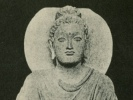

  
[Intangible Textual Heritage](../../index)  [Buddhism](../index) 
[Index](index)  [Previous](ami14)  [Next](ami16) 

------------------------------------------------------------------------

[Buy this Book on
Kindle](https://www.amazon.com/exec/obidos/ASIN/B002G1ZZEM/internetsacredte)

------------------------------------------------------------------------

  
*Amitabha, A Story of Buddhist Theology*, by Paul Carus, \[1906\], at
Intangible Textual Heritage

------------------------------------------------------------------------

p. 115

### THE DOUBLE WEDDING.

Charaka found by degrees and not without
difficulties his mental equilibrium, which his friend Kanishka seemed to
possess naturally. He unburdened his heart to the saintly old man and
arrived at the conviction that he was not made for a monk and that his
duties of life according to his disposition lay in other fields.

In the meantime King Kanishka had sent a messenger to Matura his
chancellor and vicegerent at Gandhâra, to bring Princess Kamalavatî to
Benares.

Princess Kamalavatî arrived, and when her betrothal to Charaka was
announced the happy events of our story reached their climax. Açvaghosha
solemnised the nuptials of both couples, Kanishka with Bhadraçrî, and
Charaka with Kamalavatî; and he read to them from the Dhammapada the
famous stanza:

p. 116

"Sweet in the world is fatherhood,  
 And motherhood is sweet;  
 But sweeter is the thought of good,  
 If nobly our heart beat.

"Sweeter, a life to old age spent  
 In truth and purity;  
 Sweeter, to reach enlightenment  
 And keep from evil free."[25](ami16.htm#an_25)

When the marriage ceremony was over a feast was spread at the royal
palace, and King Kanishka declared that he had a great respect for
priests, but did not favor the idea that his friend, the physician
royal, should resign his calling of wizard (as he was wont to call him)
for the sake of becoming a monk. While there were plenty of good and
honest men to wear the yellow robe, there was scarcely one man among a
million who could perform miracles and save human lives, as Charaka had
done.

Charaka denied that he was a wizard. His art was no magic but consisted
simply in observation and experiment, and it was nature whose forces he
had learned to guide; but for all that he accomplished things which
astounded

p. 117

the world. They were better than the miracles of magicians, for they
were more useful and of enduring benefit to mankind.

When his friends praised him, he replied: "My science is a beginning
only and what I accomplish is the work of a tyro. The Tathâgata has
preached the religion of enlightenment, he set the wheel rolling; it is
now our duty to follow up his thought, to spread enlightenment, and to
increase it. Amitâbha is infinite, and thus the possibilities of
invention are inexhaustible. The wondrous things which man is able to
do, and which he will do in the ages to come, can at present only be
surmised by the wisest sages.

"But greater than the greatest feats of invention will be the
application of the Lord Buddha's maxim of loving-kindness in all fields
of human intercourse, in family life, in politics, in labor and social
affairs, in our dealings with friends and foes, with animals, and even
with the degenerate and criminal. The enlightenment of our souls is most
important. Therefore we praise the Tathâgata above all other things.

p. 118

"Bright shineth the sun in his splendor by day  
 And bright the moon's radiance by night,  
 Bright shineth the hero in battle array,  
 And the sage in his thought shineth bright.  
 But by day and by night, none so glorious so bright  
 As Lord Buddha, the source of all spiritual light."

------------------------------------------------------------------------

[Next: Notes](ami16)
