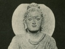

  
[Intangible Textual Heritage](../../index)  [Buddhism](../index) 
[Index](index)  [Previous](ami15) 

------------------------------------------------------------------------

[Buy this Book on
Kindle](https://www.amazon.com/exec/obidos/ASIN/B002G1ZZEM/internetsacredte)

------------------------------------------------------------------------

  
*Amitabha, A Story of Buddhist Theology*, by Paul Carus, \[1906\], at
Intangible Textual Heritage

------------------------------------------------------------------------

p. 119

### NOTES.

Page [1](ami01.htm#page_1).

1 For details of the pabbajja (or initiation) and
the upasampada (or ordination) see *Mahâvagga*, first khandaka
(*S.B.E.*, Vol. XIII).

Page [3](ami01.htm#page_3).

2 The time of our story is the fifth century
after the Buddha's enlightenment, which corresponds to the first century
of the Christian era.

Page [6](ami01.htm#page_6).

3 Cf. 'Buddhist Chants and Processions," *Journal
of the Buddhist Text Society of India*, Vol. III, Part II.

Page [10](ami02.htm#page_10).

4 Dhammapada, 21.

5 Dhammapada, 223.

Page [11](ami02.htm#page_11).

6 Dhammapada, 134.

7 Dhammapada, 313.

8 Dhammapada, 258; 240.

Page [12](ami02.htm#page_12).

9 Dhammapada, 254.

Page [31](ami04.htm#page_31).

10 Kevaddha's story is an abbreviated account of
an ancient Buddhist Pali text. The verses as well as other details are
almost literally translated. Cf. Henry Warren's *Buddhism in
Translations*, pp. 308-313.

p. 120

Page [32](ami05.htm#page_32).

11 Uposatha, or confession, was held regularly
on the days of the full and the new moon. For a detailed account of the
ceremony see *Mahâvagga*, second Khandhaka (*S.B.E.*, Vol. XIII).

Page [40](ami05.htm#page_40).

12 The Greeks.

Page 56.

13 Padhâna sutta, 16. *S.B.E.*, X, p. 71.

Page [64](ami08.htm#page_64).

14 Dhammapada, 151.

Page [74](ami10.htm#page_74).

15 Cf. T. Suzuki's translation of Açvaghosha's
*Discourse on the Awakening of Faith in the Mahayana*, pp. 101, 142 et
seq. The term "highest truth" is called by Açvaghosha in Sanskrit
*paramârthasatya*.

16 Compare Samuel Beal's Abstract of Form
Lectures on Buddhist literature in China, p. 177, where we read: "He who
is possessed of the highest self, he is able to see Buddha. Buddha,
although he dwell in the world, can be seen by none but those possessed
of this highest self. Mahârâja! Most true it is that though Buddha has
attained Nirvâna, yet may you behold him."

Page [87](ami11.htm#page_87).

17 Dhammapada 5.

Page [89](ami11.htm#page_89).

18 For full accounts of Prince Long-life see
Mahâvagga, X, 3-20. (*Sacred Books of the East*, Vol. XVII.)

Page [96](ami12.htm#page_96).

19 The *Saddharmapundarîka*, chapter 7.

p. 121

Page [98](ami12.htm#page_98).

20 Amitâbha (and with him Buddha) is never
called Creator, but he is frequently addressed as "Father." See the
*Saddharmapundarîka*, III, 97, 104, and the *Fo-sho-hing-tsan-king*,
III, 15, 1231.

Page [106](ami13.htm#page_106).

21 The simile of the blind leader of the blind
occurs in the same connection in the *Tevijja Sutta*, 15.

Page [108](ami13.htm#page_108).

22 For the details of Açvaghosha's doctrine of
the triple aspect of the highest truth (so similar to the Christian
trinity) as the Kâya (i.e., body or personality) of (1) the good law,
(2) transformation, (3) bliss, see T. Suzuki's translation of
Açvaghosha's Discourse on the Awakening of Faith, Chicago, 1900, pp.
99-101.

Page [113](ami14.htm#page_113).

23 The *Udâna*, VI.

Page [114](ami14.htm#page_114).

24 *Dhammapada*, 183

Page [116](ami15.htm#page_116).

25 *Dhammapada*, 332-333.

 

 

 

 

 
