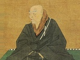

  
[Intangible Textual Heritage](../../index)  [Buddhism](../index) 
[Index](index)  [Previous](bups02)  [Next](bups04) 

------------------------------------------------------------------------

[Buy this Book at
Amazon.com](https://www.amazon.com/exec/obidos/ASIN/B0028Y4KM0/internetsacredte)

------------------------------------------------------------------------

  
*Buddhist Psalms*, by S. Yamabe and L. Adams Beck, \[1921\], at
Intangible Textual Heritage

------------------------------------------------------------------------

p. 19

**BUDDHIST PSALMS**

LAUDING THE INFINITE ONE

1\. Since He who is Infinite attained
unto the Wisdom Supreme, the long, long ages of ten Kalpas have rolled
away.

The Light of His Dharma-Kaya is in this world eyes to the blind.

2\. Seek refuge in the True Illumination! For the light of His Wisdom is
infinite.

In all the worlds there is nothing upon which His fight shines not.

3\. Take refuge in the Light universal.

As the Light of His deliverance is boundless, he who is within it is
freed from the lie of affirmation or denial.

4\. Seek refuge in That which is beyond understanding,

For His glory is all-embracing as the air. It shineth and pierceth all
things, and there is nothing hid from the light thereof.

p. 20

5\. Take refuge in the ultimate Strength, for His pure radiance is above
all things. He who perceiveth this Light is set free from the fetters of
Karma.

6\. Seek refuge in the World-Honoured.

Since His glorious radiance is above all He is called the Buddha of
Divine Light. And by Him is the darkness of the three worlds
Enlightened.

7\. Excellent is the Light of His Wisdom. Therefore is he called the
Buddha of Clear Shining.

He who is within the Light, being washed from the soil of Karma, shall
attain unto the final deliverance.

8\. Take refuge in the Mighty Consoler. Wheresoever His mercy shineth
throughout all the worlds, men rejoice in its gladdening light.

9\. The darkness of ignorance perisheth before His light. Therefore is
He hailed as the Buddha of Radiant Wisdom. All the Buddhas and the
threefold choir of sages praise Him.

10\. His glory shineth for ever and ever. Therefore is He called the
Buddha of Everlasting Light.

Most excellent is the virtue of this light, for he who perceiveth it is
born into Paradise without dissolution of being.

p. 21

11\. The glory of the Infinite is boundless, therefore is He known as
the Buddha of Light Past Comprehension.

All the Buddhas glorify the majesty of His holiness that leadeth all the
earth into His Kingdom.

12\. His clear shining transcendeth all revelation, nor can human speech
utter it. Therefore is He named the Buddha of Light Unspeakable.

All the Buddhas glorify the glory of the Infinite One who is Buddha
through His promise of Light immeasurable.

13\. Take refuge in Him who is Holiest of Holy. Sun and moon are lost in
the ocean of His splendour. Therefore is He named that Infinite in whose
radiance Sun and Moon are darkened. Before whose Divine Power even that
Buddha made flesh in India himself faltereth in ascribing praise to the
Majesty of His true glory.

14\. Far beyond human numbering are the wise in the high assemblage of
the Infinite One. Therefore let him who would be born into the Land of
Purity seek refuge in the Great Congregation.

15\. In Paradise are the Mighty unnumbered, Bodhisattvas ranked in that
hierarchy nearest

p. 22

to the Perfect Enlightenment. Thence are they made flesh upon earth
according to the way of salvation that all having life might be saved.

16\. Take refuge in the ocean-deep Soul Universal.

For the sake of all dwelling in the Ten Regions hath He kept the
fullness of all the Teachings, in His divine and mighty promises.

17\. He who is Infinite never resteth, for together with the
Bodhisattvas of Compassion and Pure Reason He laboureth, that the souls
of them that duly receive Him may have salvation, enlightening them with
the light of His mercy.

18\. When he who is born into the land of Pure Peace returneth again
into this sinful world, even like unto that Buddha made flesh in India,
he wearieth not in seeking the welfare of all men.

19\. Seek refuge in the World-Honoured, for His Pivine Dower is Almighty
and beyond man's measure, being made perfect in inconceivable Holiness.

20\. The Srāvakas, the Bodhisattvas, the Heavenly Beings and Souls in
Paradise, they in whom wisdom is made equal unto beauty, declare their
attributes in order, according to their former birth.

p. 23

21\. Seek refuge in Him in whom all strengths are equal.

Nought is there to compare with the excellent beauty of the Souls in
Paradise, for their being is infinite as space, and far are they above
celestials and mortal man.

22\. Whoso would be born into Paradise shall in this life be made one
with those men that return no more unto birth and death.

In that Pure Land is none who hath stood among doubting men, and none
also who hath trusted in his own deeds for Salvation. To this do all the
Buddhas witness.

23\. If all having life in the Ten Regions hear this Holiest Name of Him
that is Infinite, and attain unto the true faith, they shall obtain joy
and gladness.

24\. For when a man with joy accepteth the sacred vow of Him that is
infinite who saith, "I will not attain unto perfect Enlightenment unless
in Me shall all the world be made whole," at that very time he shall
assuredly be born into Paradise.

25\. Seek refuge in the Almighty Spirit.

By the divine might of His promise, by the Infinite One was Paradise
created; yea, and the

p. 24

Souls of men that dwell therein. And there is nought that may compare
with them.

26\. Seek refuge in the unutterable Wisdom.

Of His Land of Peace the half cannot be told. Even the word of the
Buddha himself could not utter it.

27\. Myriads of happy souls were born, are born and shall be born into
that Land of Purity, not from this world alone, but from the hidden
worlds also, and the Ten Regions.

28\. So soon as man heareth the holy name of the Infinite One and with
great gladness praiseth him, he shall attain to the reward of the holy
Treasury of Merit.

29\. Go forward, O Valiant Souls, seeking the Law though all the worlds
fall into flame and ruin, for ye shall have passed beyond birth and
death!

30\. The innumerable Buddhas praise the triumphant divinity of the
Bringer of Light. To Him do gather the myriad Bodhisattvas, unnumbered
as the Sands of Ganges in worship from the Eastern world.

31\. As from the East, so gather also to the Infinite One the
Bodhisattvas from the Nine Regions of the worlds.

p. 25

With Sacred Psalms the Gautama Buddha himself laudeth the boundless
glory of the Infinite One.

32\. Seek refuge in the World-Honoured. To Him do the myriad Buddhas of
the ten Regions bring homage with songs and praises, that they may sow
the seeds of merit.

33\. Bring homage to the Hall of Great Teaching and to the living Bo
tree that is in Paradise! Yet this land, glorious with the Holy Tree,
radiant with the Hall of Great Teaching that shineth with the Seven
Jewels, where innumerable souls hastening from all the ends of the Earth
shall be born, is but the temporal Paradise.

34\. In awful reverence seek refuge in the purity of Him that welcometh.
For by His Divine Promise was this glorious land, great beyond human
measurement, made to be.

35\. Seek refuge in the wisdom inconceivable. For the perfection of His
Virtue—that Virtue availing for all the world, and the perfect way by
which He willeth that man shall take refuge in Him, are past all human
speech or thought.

36\. Take refuge in the wisdom that is most truly infinite. For He is
faithful, having promised

p. 26

in His Divine Might, and on his perfect clear promise that cannot be
shaken is the merciful way of salvation builded.

------------------------------------------------------------------------

[Next: Of Paradise](bups04)
