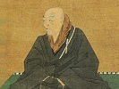

  
[Intangible Textual Heritage](../../index)  [Buddhism](../index) 
[Index](index)  [Previous](bups13)  [Next](bups15) 

------------------------------------------------------------------------

[Buy this Book at
Amazon.com](https://www.amazon.com/exec/obidos/ASIN/B0028Y4KM0/internetsacredte)

------------------------------------------------------------------------

  
*Buddhist Psalms*, by S. Yamabe and L. Adams Beck, \[1921\], at
Intangible Textual Heritage

------------------------------------------------------------------------

p. 53

CONCERNING DOSHAKU-ZENJI

171\. Having cast away from him all trust in the righteous deeds of the
sages, Doshaku-Zenji, the Great Teacher, hath taught us to enter in at
the only gate that is the Gospel of the Pure Land.

172\. Having thus cast away from him the laborious study of the Doctrine
of Nirvana, Doshaku, the Great Teacher, himself trusted only in the
power of the Divine Promise, and he persuaded men to follow after him.

173\. In this world of sin that is so far removed from the blessed day
of our Lord, is there no man who attaineth unto the wisdom Supreme, yea,
not though he should compass all righteous doing. So teacheth our Lord
of Great Teaching.

174\. He who succeeded unto the teaching of Donran-Daishi,
Doshaku-zenji, the Great Priest, thus declareth: "To toil and labour
after righteous deeds in this life is the unavailing toil of
self-effort."

175\. In this world, the doing of evil and the sin that is wrought of
men is violent and furious as the storm wind and rain. Therefore have

p. 54

the compassionate Buddhas exhorted men to seek their refuge within the
Land of Purity.

176\. From him that sinneth, throughout his life shall the fetters of
illusion fall away, if he shall recite the Holy Name with love and
adoration.

177\. That he might lead men into the Eternal Kingdom—those men who are
in this life fast bound unto the evil thing, our Father teacheth us,
saying, "Recite my name," and hath promised further, "Doing this, if
they be not born again, I myself will not attain unto Wisdom."

------------------------------------------------------------------------

[Next: Concerning Zendo-Daishi](bups15)
