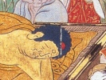

  
[Intangible Textual Heritage](../../index)  [Buddhism](../index) 
[Wisdom of the East](../../woe/index)  [Index](index) 
[Previous](busc01)  [Next](busc03) 

------------------------------------------------------------------------

  
*Buddhist Scriptures*, by E.J. Thomas, \[1913\], at Intangible Textual
Heritage

------------------------------------------------------------------------

p. 8

### EDITORIAL NOTE

The object of the Editors of this series
is a very definite one. They desire above all things that, in their
humble way, these books shall be the ambassadors of good-will and
understanding between East and West—the old world of Thought and the new
of Action. In this endeavour, and in their own sphere, they are but
followers of the highest example in the land. They are confident that a
deeper knowledge of the great ideals and lofty philosophy of Oriental
thought may help to a revival of that true spirit of Charity which
neither despises nor fears the nations of another creed and colour.

L. CRANMER-BYNG.  
S. A. KAPADIA,

Northbrook Society,  
    21, Cromwell Road,  
       Kensington, S.W.

------------------------------------------------------------------------

[Next: Introduction](busc03)

