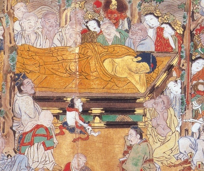

  
[Intangible Textual Heritage](../../index)  [Buddhism](../index) 
[Wisdom of the East](../../woe/index) 

------------------------------------------------------------------------

<table width="75%">
<colgroup>
<col style="width: 50%" />
<col style="width: 50%" />
</colgroup>
<tbody>
<tr class="odd">
<td width="50%" data-valign="TOP"></td>
<td width="50%" data-valign="CENTER"><h1 id="buddhist-scriptures" data-align="CENTER">Buddhist Scriptures</h1>
<h2 id="by-e.j.-thomas" data-align="CENTER">by E.J. Thomas</h2>
<h4 id="section" data-align="CENTER">[1913]</h4></td>
</tr>
</tbody>
</table>

------------------------------------------------------------------------

[Contents](#contents)    [Start Reading](busc00)    [Page
Index](pageidx)    [Text \[Zipped\]](busc.txt.gz)

------------------------------------------------------------------------

This is a short collection of excerpts from Buddhist scripture, selected
by an expert in the field. It includes several stories drawn from the
Buddhas' life, including past lives from the Jataka. While less stress
is placed on theological matters, the basics of the Buddha's message are
all here.

------------------------------------------------------------------------

 [Title Page](busc00)  
[Contents](busc01)  
[Editorial Note](busc02)  
[Introduction](busc03)  
[I. The Dream of Queen Māyā](busc04)  
[II. The Birth of Gotama](busc05)  
[III. The Four Signs](busc06)  
[IV. The Great Renunciation](busc07)  
[V. The Chain of Causation](busc08)  
[VI. The Beginning of Buddha's Preaching](busc09)  
[VII. The Ordination of Yasa](busc10)  
[VIII. The Ten Commandments](busc11)  
[IX. The Fire Discourse](busc12)  
[X. The Weaver's Daughter](busc13)  
[XI. The Questions of Mālunkyāputta](busc14)  
[XII. The Questions of Uttiya](busc15)  
[XIII. The Questions of Vacchagotta](busc16)  
[XIV. Birth-Story of the Blessings of the Commandments](busc17)  
[XV. Birth-Story of King Mahāsīlava](busc18)  
[XVI. Birth-Story of the City with Four Gates](busc19)  
[XVII. The Pig-Faced Ghost](busc20)  
[XVIII. The Jewel Discourse. A Spell](busc21)  
[XIX. Dhaniya The Herdsman](busc22)  
[XX. Buddha's Visit To Chunda](busc23)  
[XXI. The Death of Buddha](busc24)  
[XXII. The Non-Existence of Individuality](busc25)  
[XXIII. Non-Individuality and Moral Responsibility](busc26)  
[Advertisements](busc27)  
