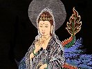

  
[Intangible Textual Heritage](../../index)  [Buddhism](../index) 
[Index](index)  [Previous](cbu34)  [Next](cbu36) 

------------------------------------------------------------------------

[Buy this Book at
Amazon.com](https://www.amazon.com/exec/obidos/ASIN/B0029LHUYM/internetsacredte)

------------------------------------------------------------------------

  
*Chinese Buddhism*, by Joseph Edkins, \[1893\], at Intangible Textual
Heritage

------------------------------------------------------------------------

RAHU, [212](cbu15.htm#page_212), [344](cbu26.htm#page_344). See *La-hu*
and *Lo-heu*.

Rahula, [14](cbu06.htm#page_14),
[32](cbu07.htm#page_32)-[34](cbu08.htm#page_34),
[248](cbu19.htm#page_248).

Rahulata, [78](cbu10.htm#page_78), [79](cbu10.htm#page_79).

Rajagriha, [5](cbu05.htm#page_5), [31](cbu07.htm#page_31),
[64](cbu10.htm#page_64), [66](cbu10.htm#page_66),
[214](cbu16.htm#page_214), [273](cbu22.htm#page_273). See *Wang-she*.

Raksha, [58](cbu09.htm#page_58).

Rakshas, [156](cbu12.htm#page_156), [206](cbu15.htm#page_206).

Rakshasas, [216](cbu16.htm#page_216), [217](cbu16.htm#page_217).

Rama, [220](cbu16.htm#page_220), [287](cbu22.htm#page_287).

Ras Algethi (a star), [348](cbu26.htm#page_348). See *Ti-tso*.

Ratnaprabha, [214](cbu16.htm#page_214).

Red bird, [337](cbu26.htm#page_337).

Remusat, J. A., [2](cbu05.htm#page_2), [6](cbu05.htm#page_6),
[62](cbu10.htm#page_62), [88](cbu11.htm#page_88),
[91](cbu11.htm#page_91), [109](cbu11.htm#page_109),
[114](cbu11.htm#page_114), [207](cbu15.htm#page_207),
[408](cbu31.htm#page_408).

Rhode, H., [156](cbu12.htm#page_156).

Ricci, Matteo, [151](cbu11.htm#page_151), [152](cbu11.htm#page_152),
[171](cbu12.htm#page_171), [355](cbu27.htm#page_355).

Rishi, [71](cbu10.htm#page_71), [173](cbu12.htm#page_173). See
*Sien-jen*.

Roman Catholic missionaries, [151](cbu11.htm#page_151),
[355](cbu27.htm#page_355).

Roman Catholics, [354](cbu27.htm#page_354), [355](cbu27.htm#page_355).

Roman emperor, [108](cbu11.htm#page_108); empire,
[86](cbu10.htm#page_86), [117](cbu11.htm#page_117),
[211](cbu15.htm#page_211), [222](cbu17.htm#page_222); merchant,
[108](cbu11.htm#page_108); religion, [397](cbu29.htm#page_397);
sculpture, [249](cbu19.htm#page_249); shopkeeper's wife,
[415](cbu31.htm#page_415).

Romans, [117](cbu11.htm#page_117).

Rome, [86](cbu10.htm#page_86), [202](cbu14.htm#page_202),
[269](cbu21.htm#page_269), [415](cbu31.htm#page_415).

Ruli, [45](cbu08.htm#page_45).

Russell, Bishop, [377](cbu28.htm#page_377).

Russian Ecclesiastical Mission, [411](cbu31.htm#page_411).

 

SABA (a world), [209](cbu15.htm#page_209), [214](cbu16.htm#page_214).
See *Saha*.

Sabikaras (a heretical sect), [292](cbu23.htm#page_292),
[293](cbu23.htm#page_293).

Sagardagam, [311](cbu24.htm#page_311). See *Sidagam*.

Sage of the house of Shakya, [11](cbu06.htm#page_11). See *Shakyamuni*.

Saha, [209](cbu15.htm#page_209), [214](cbu16.htm#page_214),
[222](cbu17.htm#page_222). See *Saba*.

S'âkyamuni, [414](cbu31.htm#page_414). See *Shakyamuni*.

Salaribhu, [52](cbu09.htm#page_52), [53](cbu09.htm#page_53).

Samadhi, [21](cbu06.htm#page_21), [24](cbu06.htm#page_24),
[52](cbu09.htm#page_52), [62](cbu10.htm#page_62),
[66](cbu10.htm#page_66)-[68](cbu10.htm#page_68),
[76](cbu10.htm#page_76), [77](cbu10.htm#page_77),
[186](cbu13.htm#page_186), [187](cbu13.htm#page_187),
[296](cbu23.htm#page_296), [384](cbu29.htm#page_384),
[414](cbu31.htm#page_414), [417](cbu31.htm#page_417).

Samana, [416](cbu31.htm#page_416). See *Shramana*.

Samanean, [409](cbu31.htm#page_409). See *Shramana*.

p. 437

Samanta, [144](cbu11.htm#page_144).

Samantabhadra, [20](cbu06.htm#page_20), [139](cbu11.htm#page_139),
[208](cbu15.htm#page_208). See *P‘u-hien*.

Samantagandha, [214](cbu16.htm#page_214).

Samarcand, [93](cbu11.htm#page_93).

Samidhi, [308](cbu24.htm#page_308).

Sam-mei, [417](cbu31.htm#page_417).

Sammitîyas, [118](cbu11.htm#page_118). See *San-mi-ti-pu*.

Samudaya, [27](cbu07.htm#page_27).

Sanchi topes, [287](cbu22.htm#page_287).

Sandracottus, [106](cbu11.htm#page_106). Σανδρακοττος,
[257](cbu19.htm#page_257). See *Chandragupta*.

Sandy desert, [150](cbu11.htm#page_150).

San-fo-ts‘i, [145](cbu11.htm#page_145).

Sanga, [28](cbu07.htm#page_28), [29](cbu07.htm#page_29),
[189](cbu14.htm#page_189), [354](cbu27.htm#page_354),
[417](cbu31.htm#page_417). See *Priesthood*.

Sangadeva, [110](cbu11.htm#page_110), [399](cbu30.htm#page_399). See
*Seng-k’ia-t’i-p’o*.

Sangarama, [29](cbu07.htm#page_29), [168](cbu12.htm#page_168),
[245](cbu19.htm#page_245).

Sanghanandi, [79](cbu10.htm#page_79), [80](cbu10.htm#page_80).

Sangkayasheta, [80](cbu10.htm#page_80), [81](cbu10.htm#page_81).

Sang-mun, [89](cbu11.htm#page_89). See *Shamen*.

Sankhya philosophy, [314](cbu24.htm#page_314); school,
[312](cbu24.htm#page_312).

San-kung, [346](cbu26.htm#page_346).

San-kwan, [247](cbu19.htm#page_247).

San-mi-ti-pu, [118](cbu11.htm#page_118). See *Sammitîyas*.

Sanscrit alphabet, [112](cbu11.htm#page_112), [113](cbu11.htm#page_113),
[399](cbu30.htm#page_399); books, [116](cbu11.htm#page_116),
[118](cbu11.htm#page_118), [136](cbu11.htm#page_136),
[144](cbu11.htm#page_144), [413](cbu31.htm#page_413); character,
[137](cbu11.htm#page_137); characters, [131](cbu11.htm#page_131),
[132](cbu11.htm#page_132), [137](cbu11.htm#page_137),
[249](cbu19.htm#page_249), [405](cbu30.htm#page_405),
[406](cbu30.htm#page_406); charm, [407](cbu30.htm#page_407); Chinese
dictionary, [413](cbu31.htm#page_413); copy, [109](cbu11.htm#page_109);
dialect, [404](cbu30.htm#page_404); dictionary,
[412](cbu31.htm#page_412); equivalent, [93](cbu11.htm#page_93); form,
[118](cbu11.htm#page_118), [222](cbu17.htm#page_222); forms,
[413](cbu31.htm#page_413); grammar, [6](cbu05.htm#page_6),
[118](cbu11.htm#page_118), [302](cbu24.htm#page_302); inscriptions,
[137](cbu11.htm#page_137), [402](cbu30.htm#page_402),
[407](cbu30.htm#page_407); language, [2](cbu05.htm#page_2),
[5](cbu05.htm#page_5), [6](cbu05.htm#page_6), [13](cbu06.htm#page_13),
[20](cbu06.htm#page_20), [63](cbu10.htm#page_63),
[67](cbu10.htm#page_67), [90](cbu11.htm#page_90),
[100](cbu11.htm#page_100), [107](cbu11.htm#page_107),
[118](cbu11.htm#page_118), [119](cbu11.htm#page_119),
[123](cbu11.htm#page_123), [132](cbu11.htm#page_132),
[135](cbu11.htm#page_135), [137](cbu11.htm#page_137),
[140](cbu11.htm#page_140), [149](cbu11.htm#page_149),
[173](cbu12.htm#page_173), [192](cbu14.htm#page_192),
[213](cbu16.htm#page_213), [222](cbu17.htm#page_222),
[225](cbu17.htm#page_225), [231](cbu18.htm#page_231),
[260](cbu20.htm#page_260), [262](cbu20.htm#page_262),
[274](cbu22.htm#page_274), [282](cbu22.htm#page_282),
[283](cbu22.htm#page_283), [287](cbu22.htm#page_287),
[290](cbu23.htm#page_290), [309](cbu24.htm#page_309),
[311](cbu24.htm#page_311), [354](cbu27.htm#page_354),
[399](cbu30.htm#page_399),
[400](cbu30.htm#page_400)-[406](cbu30.htm#page_406),
[416](cbu31.htm#page_416), [417](cbu31.htm#page_417); letters,
[115](cbu11.htm#page_115), [169](cbu12.htm#page_169),
[399](cbu30.htm#page_399); literature, [137](cbu11.htm#page_137),
[228](cbu18.htm#page_228); manuscript, [176](cbu13.htm#page_176);
manuscripts, [2](cbu05.htm#page_2), [144](cbu11.htm#page_144),
[146](cbu11.htm#page_146): metres, [303](cbu24.htm#page_303); mode,
[114](cbu11.htm#page_114); name, [94](cbu11.htm#page_94),
[210](cbu15.htm#page_210), [240](cbu19.htm#page_240); names,
[214](cbu16.htm#page_214), [239](cbu19.htm#page_239),
[412](cbu31.htm#page_412); originals, [117](cbu11.htm#page_117),
[401](cbu30.htm#page_401), [417](cbu31.htm#page_417); professor,
[107](cbu11.htm#page_107); pronunciation, [121](cbu11.htm#page_121);
scholar, [238](cbu18.htm#page_238); scholars, [107](cbu11.htm#page_107);
sentences, [137](cbu11.htm#page_137), [401](cbu30.htm#page_401); sounds,
[406](cbu30.htm#page_406), [414](cbu31.htm#page_414); sutras,
[107](cbu11.htm#page_107); syllable, [120](cbu11.htm#page_120); term,
[7](cbu05.htm#page_7), [129](cbu11.htm#page_129),
[302](cbu24.htm#page_302); termination, [35](cbu08.htm#page_35); text,
[215](cbu16.htm#page_215), [403](cbu30.htm#page_403),
[404](cbu30.htm#page_404); translations, [107](cbu11.htm#page_107);
version, [13](cbu06.htm#page_13); word, [4](cbu05.htm#page_4),
[12](cbu06.htm#page_12), [100](cbu11.htm#page_100),
[107](cbu11.htm#page_107), [115](cbu11.htm#page_115),
[168](cbu12.htm#page_168), [354](cbu27.htm#page_354),
[357](cbu27.htm#page_357), [362](cbu27.htm#page_362),
[401](cbu30.htm#page_401), [404](cbu30.htm#page_404),
[416](cbu31.htm#page_416); words [4](cbu05.htm#page_4),
[6](cbu05.htm#page_6), [222](cbu17.htm#page_222),
[400](cbu30.htm#page_400), [402](cbu30.htm#page_402),
[405](cbu30.htm#page_405), [412](cbu31.htm#page_412); works,
[107](cbu11.htm#page_107); writing, [149](cbu11.htm#page_149),
[363](cbu27.htm#page_363), [402](cbu30.htm#page_402).

Sanskrita, [414](cbu31.htm#page_414). See *Sanscrit language*.

San-t’ai (three constellations), [348](cbu26.htm#page_348).

San-tsang, [230](cbu18.htm#page_230), [283](cbu22.htm#page_283). See
*Tripitaka*.

San-tsang-fa-shï, [129](cbu11.htm#page_129).

Sarvâstivâdas, [118](cbu11.htm#page_118). See *Shang-tso-pu* and
*Shwo-i-tsie-yeu-pu*.

Sarvavainásicas, [309](cbu24.htm#page_309).

Saturn (planet), [211](cbu15.htm#page_211). See *Chen-sing*.

Savatthi, [416](cbu31.htm#page_416). See *Shravasti*.

Scandinavian inscriptions, [63](cbu10.htm#page_63).

Schlegel, A. W., [106](cbu11.htm#page_106).

Schmidt, I. J., [166](cbu12.htm#page_166).

Schott, W., [171](cbu12.htm#page_171), [410](cbu31.htm#page_410),
[411](cbu31.htm#page_411).

Scinde, [88](cbu11.htm#page_88). See *Shin-do*.

Seleucus Nicator, [106](cbu11.htm#page_106), [257](cbu19.htm#page_257).

Semite, [341](cbu26.htm#page_341).

Semitic origin of Sanscrit, [363](cbu27.htm#page_363).

Seng-chau, [109](cbu11.htm#page_109).

Seng-ga-de-ba, [399](cbu30.htm#page_399). See *Sangadeva*.

Seng-k‘ia-t‘i-p‘o, [399](cbu30.htm#page_399). See *Sangadeva*.

Serampore, [200](cbu14.htm#page_200).

Sha-ba-ti, [416](cbu31.htm#page_416). See *Shravasti*.

Shak-de-wan-yin, [214](cbu16.htm#page_214). See *Shakradeva Indra*.

Shak-ka-la-de-ba In-da-la, [399](cbu30.htm#page_399). See *Shakradeva
Indra*.

Shakradeva Indra, [399](cbu30.htm#page_399). See *Shak-de-wan-yin*.

Shakya, [12](cbu06.htm#page_12), [25](cbu06.htm#page_25),
[28](cbu07.htm#page_28), [31](cbu07.htm#page_31),
[96](cbu11.htm#page_96), [100](cbu11.htm#page_100),
[102](cbu11.htm#page_102), [104](cbu11.htm#page_104),
[106](cbu11.htm#page_106), [145](cbu11.htm#page_145),
[208](cbu15.htm#page_208), [261](cbu20.htm#page_261). See *Shakyamuni*.

Shakya clan, [43](cbu08.htm#page_43), [45](cbu08.htm#page_45); family,
[17](cbu06.htm#page_17).

Shakyamuni, [4](cbu05.htm#page_4), [9](cbu05.htm#page_9),
[11](cbu06.htm#page_11),
[13](cbu06.htm#page_13)-[15](cbu06.htm#page_15),
[19](cbu06.htm#page_19), [23](cbu06.htm#page_23),
[26](cbu06.htm#page_26),
[29](cbu07.htm#page_29)-[32](cbu07.htm#page_32),
[35](cbu08.htm#page_35), [38](cbu08.htm#page_38),
[40](cbu08.htm#page_40)-[42](cbu08.htm#page_42),
[45](cbu08.htm#page_45), [47](cbu09.htm#page_47),
[50](cbu09.htm#page_50)-[52](cbu09.htm#page_52),
[62](cbu10.htm#page_62), [64](cbu10.htm#page_64),
[70](cbu10.htm#page_70), [71](cbu10.htm#page_71),
[94](cbu11.htm#page_94), [99](cbu11.htm#page_99),
[106](cbu11.htm#page_106), [119](cbu11.htm#page_119),
[126](cbu11.htm#page_126), [141](cbu11.htm#page_141),
[154](cbu11.htm#page_154), [157](cbu12.htm#page_157),
[159](cbu12.htm#page_159), [167](cbu12.htm#page_167),
[168](cbu12.htm#page_168), [171](cbu12.htm#page_171),
[180](cbu13.htm#page_180), [192](cbu14.htm#page_192),
[207](cbu15.htm#page_207), [208](cbu15.htm#page_208),
[210](cbu15.htm#page_210),
[213](cbu16.htm#page_213)-[215](cbu16.htm#page_215),
[217](cbu16.htm#page_217), [218](cbu16.htm#page_218),
[222](cbu17.htm#page_222), [227](cbu17.htm#page_227),
[228](cbu18.htm#page_228), [232](cbu18.htm#page_232),
[241](cbu19.htm#page_241)-[244](cbu19.htm#page_244),
[246](cbu19.htm#page_246)-[250](cbu19.htm#page_250),
[253](cbu19.htm#page_253), [255](cbu19.htm#page_255),
[256](cbu19.htm#page_256), [258](cbu19.htm#page_258),
[259](cbu20.htm#page_259), [261](cbu20.htm#page_261),
[264](cbu20.htm#page_264)-[266](cbu20.htm#page_266),
[276](cbu22.htm#page_276), [277](cbu22.htm#page_277),
[279](cbu22.htm#page_279),
[282](cbu22.htm#page_282)-[284](cbu22.htm#page_284),
[287](cbu22.htm#page_287), [302](cbu24.htm#page_302),
[344](cbu26.htm#page_344), [355](cbu27.htm#page_355),
[380](cbu29.htm#page_380), [384](cbu29.htm#page_384),
[386](cbu29.htm#page_386), [402](cbu30.htm#page_402),
[414](cbu31.htm#page_414), [417](cbu31.htm#page_417). See *Shakya*.

p. 438

Sha-la, [150](cbu11.htm#page_150).

Shamen, [65](cbu10.htm#page_65), [89](cbu11.htm#page_89),
[192](cbu14.htm#page_192), [315](cbu24.htm#page_315),
[401](cbu30.htm#page_401), [416](cbu31.htm#page_416). See *Shramana*.

Shami, [65](cbu10.htm#page_65), [66](cbu10.htm#page_66). See
*Shramanera*.

Sha-nai-shat-chat-la, [399](cbu30.htm#page_399). See *Shanaishchara*.

Shanaishchara, [399](cbu30.htm#page_399). See *Sha-nai-shat-chat-la*.

Shang dynasty, [388](cbu29.htm#page_388).

Shanghai, [107](cbu11.htm#page_107), [119](cbu11.htm#page_119),
[120](cbu11.htm#page_120), [134](cbu11.htm#page_134),
[241](cbu19.htm#page_241), [328](cbu26.htm#page_328),
[366](cbu27.htm#page_366), [371](cbu28.htm#page_371),
[379](cbu28.htm#page_379), [391](cbu29.htm#page_391),
[410](cbu31.htm#page_410).

Shangnavasu, [62](cbu10.htm#page_62),
[66](cbu10.htm#page_66)-[69](cbu10.htm#page_69),
[73](cbu10.htm#page_73).

Shang-tso-pu, [118](cbu11.htm#page_118). See *Sarvâstivâdas*.

Shan-hwei, [168](cbu12.htm#page_168).

Shan-si province, [90](cbu11.htm#page_90), [116](cbu11.htm#page_116),
[128](cbu11.htm#page_128), [139](cbu11.htm#page_139),
[146](cbu11.htm#page_146), [165](cbu12.htm#page_165),
[166](cbu12.htm#page_166), [171](cbu12.htm#page_171),
[259](cbu20.htm#page_259), [265](cbu20.htm#page_265),
[384](cbu29.htm#page_384).

Shan-ts‘ai, [21](cbu06.htm#page_21), [159](cbu12.htm#page_159),
[242](cbu19.htm#page_242).

Shan-tung province, [163](cbu12.htm#page_163),
[246](cbu19.htm#page_246), [270](cbu21.htm#page_270),
[272](cbu21.htm#page_272), [371](cbu28.htm#page_371),
[373](cbu28.htm#page_373), [378](cbu28.htm#page_378),
[410](cbu31.htm#page_410).

Shariputra, [14](cbu06.htm#page_14), [21](cbu06.htm#page_21),
[31](cbu07.htm#page_31), [35](cbu08.htm#page_35),
[49](cbu09.htm#page_49), [159](cbu12.htm#page_159),
[241](cbu19.htm#page_241), [248](cbu19.htm#page_248),
[290](cbu23.htm#page_290).

Shastra, [76](cbu10.htm#page_76), [160](cbu12.htm#page_160),
[169](cbu12.htm#page_169), [170](cbu12.htm#page_170),
[279](cbu22.htm#page_279), [288](cbu22.htm#page_288),
[304](cbu24.htm#page_304), [306](cbu24.htm#page_306),
[312](cbu24.htm#page_312). See *Lun*.

Shastras, [68](cbu10.htm#page_68), [77](cbu10.htm#page_77),
[108](cbu11.htm#page_108), [110](cbu11.htm#page_110),
[120](cbu11.htm#page_120), [133](cbu11.htm#page_133),
[147](cbu11.htm#page_147), [149](cbu11.htm#page_149),
[210](cbu15.htm#page_210), [232](cbu18.htm#page_232),
[277](cbu22.htm#page_277), [279](cbu22.htm#page_279),
[302](cbu24.htm#page_302), [303](cbu24.htm#page_303).

Sha-wei, [4](cbu05.htm#page_4), [5](cbu05.htm#page_5). See *Shravasti*.

Shen Yo, [113](cbu11.htm#page_113).

She-na-yi-shï-the-lo, [399](cbu30.htm#page_399). See *Shanaishchara*.

Sheng-t‘ien, [279](cbu22.htm#page_279).

Sheng-wen, [243](cbu19.htm#page_243), [248](cbu19.htm#page_248),
[304](cbu24.htm#page_304), [306](cbu24.htm#page_306),
[310](cbu24.htm#page_310). See *Shrâvaka*.

Shen-kung, [112](cbu11.htm#page_112).

Shen-si province, [88](cbu11.htm#page_88), [90](cbu11.htm#page_90),
[93](cbu11.htm#page_93), [103](cbu11.htm#page_103),
[126](cbu11.htm#page_126), [133](cbu11.htm#page_133).

Shen-tsung (emperor), [142](cbu11.htm#page_142).

Shen-leng-yen Rajah, [296](cbu23.htm#page_296).

Shï-chï, [14](cbu06.htm#page_14), [163](cbu12.htm#page_163),
[241](cbu19.htm#page_241), [246](cbu19.htm#page_246),
[249](cbu19.htm#page_249).

Shï-chwang, [407](cbu30.htm#page_407).

Shï-hwang, [326](cbu25.htm#page_326).

Shï-kia Fo, [258](cbu19.htm#page_258). See *Shakya*.

Shï-kia-lo-t‘i-p‘a Yin-t‘o-lo, [399](cbu30.htm#page_399). See
*Shakradeva Indra*.

Shikhin (a Brahma), [215](cbu16.htm#page_215).

Shîla (morality), [417](cbu31.htm#page_417).

Shi-li, [117](cbu11.htm#page_117). See *Hormouz*.

Shin-do, [88](cbu11.htm#page_88). See *India*.

Shin-sieu, [160](cbu12.htm#page_160), [162](cbu12.htm#page_162).

Shipara discipline, [54](cbu09.htm#page_54).

Shira, [226](cbu17.htm#page_226).

Shï-t‘eu, [160](cbu12.htm#page_160).

Shï-tsï, [84](cbu10.htm#page_84). See *Singhalaputra*.

Shï-tsï-kwo, [94](cbu11.htm#page_94). See *Ceylon*.

Shï-tsun, [6](cbu05.htm#page_6). See *Julai* and *World's Honoured One*.

Shiva, [63](cbu10.htm#page_63), [150](cbu11.htm#page_150),
[215](cbu16.htm#page_215), [216](cbu16.htm#page_216),
[220](cbu16.htm#page_220).

Shivaism, [132](cbu11.htm#page_132).

Shramana, [65](cbu10.htm#page_65), [79](cbu10.htm#page_79),
[192](cbu14.htm#page_192), [401](cbu30.htm#page_401),
[416](cbu31.htm#page_416). See *Shamen*.

Shramanas, [28](cbu07.htm#page_28), [89](cbu11.htm#page_89).

Shramanera, [65](cbu10.htm#page_65). See *Shami*.

Shrâvaka, [304](cbu24.htm#page_304). See *Sheng-wen*.

Shrâvakas, [19](cbu06.htm#page_19), [310](cbu24.htm#page_310).

Shravasti, [4](cbu05.htm#page_4), [14](cbu06.htm#page_14),
[31](cbu07.htm#page_31), [36](cbu08.htm#page_36),
[41](cbu08.htm#page_41), [42](cbu08.htm#page_42),
[49](cbu09.htm#page_49), [79](cbu10.htm#page_79),
[119](cbu11.htm#page_119), [290](cbu23.htm#page_290),
[292](cbu23.htm#page_292), [296](cbu23.htm#page_296),
[297](cbu23.htm#page_297), [404](cbu30.htm#page_404),
[416](cbu31.htm#page_416). See *Sha-wei*.

Shu country, [390](cbu29.htm#page_390). See *Sï-ch‘wen*.

Shun-chï, [91](cbu11.htm#page_91), [152](cbu11.htm#page_152).

Shwo-i-tsie-yeu-pu, [118](cbu11.htm#page_118). See *Sarvâstivâdas*.

Siam, [36](cbu08.htm#page_36), [104](cbu11.htm#page_104),
[171](cbu12.htm#page_171), [211](cbu15.htm#page_211),
[246](cbu19.htm#page_246), [249](cbu19.htm#page_249),
[402](cbu30.htm#page_402).

Siamese, [12](cbu06.htm#page_12); chronology, [15](cbu06.htm#page_15);
prince, [265](cbu20.htm#page_265).

Si-an fu, [89](cbu11.htm#page_89), [146](cbu11.htm#page_146). See
*Ch‘ang-an*.

Siang-pe mountain, [67](cbu10.htm#page_67).

Sian Ü, [115](cbu11.htm#page_115), [116](cbu11.htm#page_116).

Siau-ch’eng, [277](cbu22.htm#page_277), [280](cbu22.htm#page_280),
[281](cbu22.htm#page_281). See *Hinayana* and *Smaller Development*.

Sï-ch‘wen province, [128](cbu11.htm#page_128),
[139](cbu11.htm#page_139), [265](cbu20.htm#page_265),
[270](cbu21.htm#page_270), [384](cbu29.htm#page_384),
[390](cbu29.htm#page_390). See *Shu country*.

Sidagam, [182](cbu13.htm#page_182), [311](cbu24.htm#page_311).

Siddharta, [15](cbu06.htm#page_15), [18](cbu06.htm#page_18). See
*Shakyamuni*.

Sien-jen, [173](cbu12.htm#page_173). See *Rishi*.

Sieu-lo (Su-la), [115](cbu11.htm#page_115). See *Asura*.

Si-fan, [149](cbu11.htm#page_149). See *Thibet*.

Si-hien, [110](cbu11.htm#page_110).

Sï-ma Chien, [350](cbu26.htm#page_350).

Sï-ma Wen-kung, [143](cbu11.htm#page_143).

Sin-an (district), [366](cbu27.htm#page_366).

Sin-chang (town), [256](cbu19.htm#page_256).

Singhalaputra, [84](cbu10.htm#page_84). See *Shï-tsï*.

Singhalese, [4](cbu05.htm#page_4), [12](cbu06.htm#page_12),
[94](cbu11.htm#page_94), [249](cbu19.htm#page_249),
[277](cbu22.htm#page_277); Buddhists, [282](cbu22.htm#page_282); dates,
[13](cbu06.htm#page_13); priest, [125](cbu11.htm#page_125); temples,
[42](cbu08.htm#page_42).

Sinhala, [94](cbu11.htm#page_94). See *Shï-tsï-kwo*.

Sinim, [93](cbu11.htm#page_93).

Sin-la, [132](cbu11.htm#page_132). See *Corea*.

Sin-siu (sect), [360](cbu27.htm#page_360).

Sisters of Mercy, [395](cbu29.htm#page_395).

p. 439

Sï-ta-t‘ien-wang, [239](cbu19.htm#page_239). See *Four Great Kings of
Devas*.

Si-tso, [179](cbu13.htm#page_179).

Siuen-ho, [382](cbu29.htm#page_382).

Siuen-tsung (emperor), [128](cbu11.htm#page_128).

Siuen-wang, [203](cbu14.htm#page_203).

Siün King, [318](cbu25.htm#page_318).

Si-yang-jen, [253](cbu19.htm#page_253). See *Portuguese*.

Si-yü sï, [272](cbu21.htm#page_272).

Small Development school, [20](cbu06.htm#page_20). See *Lesser
Development*.

Smaller Development course, [110](cbu11.htm#page_110); school,
[282](cbu22.htm#page_282); sutras, [38](cbu08.htm#page_38). See
*Hinayana*.

Smith, Dr. W., [342](cbu26.htm#page_342).

Socrates, [38](cbu08.htm#page_38), [342](cbu26.htm#page_342).

So-da-ban, [401](cbu30.htm#page_401). See *Srotapanna*.

Sotapan, [401](cbu30.htm#page_401). See *Srotapanna*.

South China, [355](cbu27.htm#page_355); India, [77](cbu10.htm#page_77),
[279](cbu22.htm#page_279).

Southern Behar, [15](cbu06.htm#page_15); Buddhism,
[36](cbu08.htm#page_36), [410](cbu31.htm#page_410); Buddhist traditions,
[111](cbu11.htm#page_111); Buddhists, [12](cbu06.htm#page_12),
[13](cbu06.htm#page_13), [15](cbu06.htm#page_15),
[42](cbu08.htm#page_42), [211](cbu15.htm#page_211),
[273](cbu22.htm#page_273), [277](cbu22.htm#page_277); China,
[101](cbu11.htm#page_101), [330](cbu26.htm#page_330); Chinese dialects,
[400](cbu30.htm#page_400); collection, [275](cbu22.htm#page_275);
continent, [206](cbu15.htm#page_206); India, [21](cbu06.htm#page_21),
[76](cbu10.htm#page_76), [77](cbu10.htm#page_77),
[85](cbu10.htm#page_85), [86](cbu10.htm#page_86),
[100](cbu11.htm#page_100), [156](cbu12.htm#page_156),
[280](cbu22.htm#page_280); ocean, [222](cbu17.htm#page_222), schools,
[403](cbu30.htm#page_403); sea, [139](cbu11.htm#page_139),
[242](cbu19.htm#page_242), [242](cbu19.htm#page_242).

Southey, R., [197](cbu14.htm#page_197).

Srotapanna, [68](cbu10.htm#page_68), [311](cbu24.htm#page_311),
[401](cbu30.htm#page_401). See *So-da-ban*.

St. Hilaire, B., [2](cbu05.htm#page_2).

Stoics, [342](cbu26.htm#page_342).

Stonehenge, [419](cbu31.htm#page_419).

Sü Fa, [283](cbu22.htm#page_283).

Sü Kien, [343](cbu26.htm#page_343).

Sü Ki-yü, [357](cbu27.htm#page_357).

Sü Kwang-k‘i, [152](cbu11.htm#page_152).

Su Yeu, [16](cbu06.htm#page_16).

Subhadra, [53](cbu09.htm#page_53).

Subhûti, [5](cbu05.htm#page_5)-[7](cbu05.htm#page_7),
[159](cbu12.htm#page_159), [290](cbu23.htm#page_290),
[291](cbu23.htm#page_291), [293](cbu23.htm#page_293).

Sudatta, [292](cbu23.htm#page_292), [296](cbu23.htm#page_296).

Su-da-wan, [48](cbu09.htm#page_48), [182](cbu13.htm#page_182),
[311](cbu24.htm#page_311), [401](cbu30.htm#page_401). See *Srotapanna*.

Suddhodana, [15](cbu06.htm#page_15). See *Tsing-fan*.

Sui dynasty, [111](cbu11.htm#page_111), [117](cbu11.htm#page_117),
[176](cbu13.htm#page_176), [206](cbu15.htm#page_206),
[250](cbu19.htm#page_250).

Sui-sing (planet), [211](cbu15.htm#page_211). See *Jupiter*.

Sumeru mountain, [20](cbu06.htm#page_20), [21](cbu06.htm#page_21),
[32](cbu07.htm#page_32), [44](cbu08.htm#page_44),
[59](cbu09.htm#page_59), [93](cbu11.htm#page_93),
[222](cbu17.htm#page_222), [223](cbu17.htm#page_223),
[233](cbu18.htm#page_233), [234](cbu18.htm#page_234),
[239](cbu19.htm#page_239), [336](cbu26.htm#page_336),
[344](cbu26.htm#page_344).

Sun K‘iuen (a prince), [108](cbu11.htm#page_108).

Sun Tsiau, [129](cbu11.htm#page_129).

Sung dynasty, [47](cbu09.htm#page_47), [58](cbu09.htm#page_58),
[133](cbu11.htm#page_133), [134](cbu11.htm#page_134),
[139](cbu11.htm#page_139), [142](cbu11.htm#page_142),
[152](cbu11.htm#page_152), [270](cbu21.htm#page_270),
[281](cbu22.htm#page_281), [322](cbu25.htm#page_322),
[323](cbu25.htm#page_323), [325](cbu25.htm#page_325),
[356](cbu27.htm#page_356), [358](cbu27.htm#page_358),
[359](cbu27.htm#page_359), [361](cbu27.htm#page_361),
[365](cbu27.htm#page_365), [383](cbu29.htm#page_383),
[392](cbu29.htm#page_392); (Earlier), [91](cbu11.htm#page_91),
[93](cbu11.htm#page_93), [94](cbu11.htm#page_94),
[98](cbu11.htm#page_98), [409](cbu31.htm#page_409); Ju,
[318](cbu25.htm#page_318), [319](cbu25.htm#page_319),
[326](cbu25.htm#page_326); philosophers, [318](cbu25.htm#page_318),
[319](cbu25.htm#page_319),
[321](cbu25.htm#page_321)-[326](cbu25.htm#page_326),
[359](cbu27.htm#page_359); philosophy, [344](cbu26.htm#page_344).

Sung kiang, [119](cbu11.htm#page_119).

Sung-tsï Kwan-yin, [262](cbu20.htm#page_262), [383](cbu29.htm#page_383).

Sung-yün, [100](cbu11.htm#page_100), [103](cbu11.htm#page_103).

Susima, [106](cbu11.htm#page_106).

Sü-t‘o-hwan, [68](cbu10.htm#page_68), [401](cbu30.htm#page_401). See
*Srotapanna*.

Sutra, [21](cbu06.htm#page_21), [41](cbu08.htm#page_41),
[42](cbu08.htm#page_42), [44](cbu08.htm#page_44),
[55](cbu09.htm#page_55), [88](cbu11.htm#page_88),
[109](cbu11.htm#page_109), [119](cbu11.htm#page_119),
[120](cbu11.htm#page_120), [149](cbu11.htm#page_149),
[150](cbu11.htm#page_150), [182](cbu13.htm#page_182),
[215](cbu16.htm#page_215), [218](cbu16.htm#page_218),
[230](cbu18.htm#page_230), [275](cbu22.htm#page_275),
[279](cbu22.htm#page_279), [293](cbu23.htm#page_293),
[307](cbu24.htm#page_307), [308](cbu24.htm#page_308).

Sutras, [17](cbu06.htm#page_17), [38](cbu08.htm#page_38),
[41](cbu08.htm#page_41)-[44](cbu08.htm#page_44),
[51](cbu09.htm#page_51), [54](cbu09.htm#page_54),
[68](cbu10.htm#page_68), [70](cbu10.htm#page_70),
[100](cbu11.htm#page_100),
[106](cbu11.htm#page_106)-[109](cbu11.htm#page_109),
[118](cbu11.htm#page_118), [128](cbu11.htm#page_128),
[131](cbu11.htm#page_131), [133](cbu11.htm#page_133),
[146](cbu11.htm#page_146), [147](cbu11.htm#page_147),
[149](cbu11.htm#page_149), [168](cbu12.htm#page_168),
[186](cbu13.htm#page_186), [214](cbu16.htm#page_214),
[219](cbu16.htm#page_219), [230](cbu18.htm#page_230),
[232](cbu18.htm#page_232), [234](cbu18.htm#page_234),
[236](cbu18.htm#page_236), [302](cbu24.htm#page_302),
[305](cbu24.htm#page_305), [307](cbu24.htm#page_307),
[308](cbu24.htm#page_308), [311](cbu24.htm#page_311),
[312](cbu24.htm#page_312),
[314](cbu24.htm#page_314)-[316](cbu24.htm#page_316).

Su-tsung (emperor), [124](cbu11.htm#page_124).

Svastika, [63](cbu10.htm#page_63). See *Wan*.

Swaracs, [156](cbu12.htm#page_156).

Sykes, Colonel, [213](cbu16.htm#page_213).

Syria, [106](cbu11.htm#page_106).

Syriac, [148](cbu11.htm#page_148).

Syrian Christians, [117](cbu11.htm#page_117), [354](cbu27.htm#page_354);
inscription, [117](cbu11.htm#page_117), [353](cbu27.htm#page_353),
[357](cbu27.htm#page_357), [363](cbu27.htm#page_363).

 

TA-CH‘ENG, [99](cbu11.htm#page_99), [100](cbu11.htm#page_100),
[110](cbu11.htm#page_110), [209](cbu15.htm#page_209),
[230](cbu18.htm#page_230), [277](cbu22.htm#page_277),
[278](cbu22.htm#page_278), [281](cbu22.htm#page_281),
[416](cbu31.htm#page_416). See *Great Development* and *Mahayana*.

Ta-hia, [88](cbu11.htm#page_88). See *Dahæ*.

T‘a-hwa-tsï-tsai, [223](cbu17.htm#page_223). See *Paranimita*.

T‘ai-cheu, [175](cbu13.htm#page_175).

T‘ai-ki, [323](cbu25.htm#page_323). See *Great Extreme*.

T‘ai-pe (planet), [211](cbu15.htm#page_211). See *Venus*.

T‘ai-ping rebellion, [169](cbu12.htm#page_169),
[275](cbu22.htm#page_275), [390](cbu29.htm#page_390).

T‘ai-shan, [246](cbu19.htm#page_246), [338](cbu26.htm#page_338),
[374](cbu28.htm#page_374), [393](cbu29.htm#page_393).

T‘ai-tsï-t‘a, [265](cbu20.htm#page_265).

T‘ai-tsu (emperor), [134](cbu11.htm#page_134).

T‘ai-tsung (T‘ang emperor), [16](cbu06.htm#page_16),
[117](cbu11.htm#page_117), [124](cbu11.htm#page_124),
[171](cbu12.htm#page_171); (Sung emperor), [134](cbu11.htm#page_134).

Tai-wei (constellation), [16](cbu06.htm#page_16).

T‘ai-yuen fu, [128](cbu11.htm#page_128).

Ta-kio-kin-sien, [142](cbu11.htm#page_142). See *Shakyamuni*.

Tamil, [82](cbu10.htm#page_82).

Ta-ming fu, [165](cbu12.htm#page_165).

Ta-mo, [99](cbu11.htm#page_99), [102](cbu11.htm#page_102),
[103](cbu11.htm#page_103), [209](cbu15.htm#page_209),
[247](cbu19.htm#page_247). See *Bodhidharma*.

p. 440

Tan Chï, [360](cbu27.htm#page_360).

Tan-cho sï (temple), [252](cbu19.htm#page_252).

T‘ang dynasty, [66](cbu10.htm#page_66), [103](cbu11.htm#page_103),
[107](cbu11.htm#page_107), [115](cbu11.htm#page_115),
[116](cbu11.htm#page_116), [122](cbu11.htm#page_122),
[124](cbu11.htm#page_124), [127](cbu11.htm#page_127),
[131](cbu11.htm#page_131), [134](cbu11.htm#page_134),
[135](cbu11.htm#page_135), [146](cbu11.htm#page_146),
[158](cbu12.htm#page_158), [163](cbu12.htm#page_163),
[207](cbu15.htm#page_207), [209](cbu15.htm#page_209),
[211](cbu15.htm#page_211), [238](cbu18.htm#page_238),
[249](cbu19.htm#page_249), [250](cbu19.htm#page_250),
[275](cbu22.htm#page_275), [351](cbu26.htm#page_351),
[354](cbu27.htm#page_354), [356](cbu27.htm#page_356),
[383](cbu29.htm#page_383), [391](cbu29.htm#page_391),
[394](cbu29.htm#page_394), [395](cbu29.htm#page_395),
[400](cbu30.htm#page_400), [404](cbu30.htm#page_404),
[415](cbu31.htm#page_415).

T‘ang (emperor), [333](cbu26.htm#page_333).

T‘ang Shang-shu, [374](cbu28.htm#page_374).

Tantra, [269](cbu21.htm#page_269); school, [125](cbu11.htm#page_125),
[169](cbu12.htm#page_169).

Tartar chief, [92](cbu11.htm#page_92); family, [91](cbu11.htm#page_91).

Tartary, [91](cbu11.htm#page_91), [145](cbu11.htm#page_145),
[255](cbu19.htm#page_255), [336](cbu26.htm#page_336),
[360](cbu27.htm#page_360).

Ta-shï-chï, [209](cbu15.htm#page_209), [234](cbu18.htm#page_234),
[255](cbu19.htm#page_255), [262](cbu20.htm#page_262).

Ta-shih, [117](cbu11.htm#page_117). See *Arabs*.

Tathâgata, [6](cbu05.htm#page_6), [34](cbu08.htm#page_34),
[47](cbu09.htm#page_47), [51](cbu09.htm#page_51),
[158](cbu12.htm#page_158), [172](cbu12.htm#page_172),
[207](cbu15.htm#page_207), [290](cbu23.htm#page_290),
[292](cbu23.htm#page_292)-[297](cbu23.htm#page_297). See *Julai*.

Ta-ts‘in, [86](cbu10.htm#page_86), [117](cbu11.htm#page_117). See *Roman
empire*.

Ta-tsï-tsai-t‘ien, [214](cbu16.htm#page_214). See *Mahêshwara*.

Tatta, [267](cbu20.htm#page_267). See *Pattala*.

Tau, [98](cbu11.htm#page_98), [164](cbu12.htm#page_164).

Tau-an, [108](cbu11.htm#page_108), [168](cbu12.htm#page_168).

Tauism, [107](cbu11.htm#page_107), [130](cbu11.htm#page_130),
[142](cbu11.htm#page_142), [147](cbu11.htm#page_147),
[247](cbu19.htm#page_247), [320](cbu25.htm#page_320),
[323](cbu25.htm#page_323), [373](cbu28.htm#page_373),
[351](cbu26.htm#page_351), [382](cbu29.htm#page_382),
[387](cbu29.htm#page_387)-[389](cbu29.htm#page_389),
[392](cbu29.htm#page_392)-[395](cbu29.htm#page_395),
[397](cbu29.htm#page_397), [411](cbu31.htm#page_411).

Tauist, [121](cbu11.htm#page_121), [321](cbu25.htm#page_321),
[324](cbu25.htm#page_324), [382](cbu29.htm#page_382); authors,
[372](cbu28.htm#page_372); books, [364](cbu27.htm#page_364),
[369](cbu27.htm#page_369), [391](cbu29.htm#page_391); collection,
[391](cbu29.htm#page_391); discipline, [388](cbu29.htm#page_388);
divinity, [210](cbu15.htm#page_210), [246](cbu19.htm#page_246);
doctrine, [319](cbu25.htm#page_319); elements,
[339](cbu26.htm#page_339); expression, [373](cbu28.htm#page_373); genii,
[142](cbu11.htm#page_142); heaven, [391](cbu29.htm#page_391); hierarchy,
[389](cbu29.htm#page_389); hell, [394](cbu29.htm#page_394); hermits,
[394](cbu29.htm#page_394); ideas, [392](cbu29.htm#page_392); idols,
[247](cbu19.htm#page_247); images, [361](cbu27.htm#page_361);
literature, [358](cbu27.htm#page_358); magic, [319](cbu25.htm#page_319);
magician, [387](cbu29.htm#page_387), [389](cbu29.htm#page_389); mind,
[381](cbu29.htm#page_381); monastery, [393](cbu29.htm#page_393);
notions, [378](cbu28.htm#page_378); part, [345](cbu26.htm#page_345);
Patriarch, [391](cbu29.htm#page_391); personage,
[271](cbu21.htm#page_271); philosophers, [319](cbu25.htm#page_319);
physical system, [325](cbu25.htm#page_325); prayers,
[391](cbu29.htm#page_391); priests, [107](cbu11.htm#page_107),
[220](cbu16.htm#page_220), [387](cbu29.htm#page_387); publications,
[369](cbu27.htm#page_369); recluses, [175](cbu13.htm#page_175);
religion, [395](cbu29.htm#page_395); school, [361](cbu27.htm#page_361);
sects, [111](cbu11.htm#page_111); superstition,
[207](cbu15.htm#page_207); teaching, [395](cbu29.htm#page_395); temple,
[153](cbu11.htm#page_153); tone, [319](cbu25.htm#page_319); wizard,
[387](cbu29.htm#page_387); writers, [391](cbu29.htm#page_391).

Tauists, [220](cbu16.htm#page_220), [321](cbu25.htm#page_321),
[324](cbu25.htm#page_324), [325](cbu25.htm#page_325),
[350](cbu26.htm#page_350), [365](cbu27.htm#page_365),
[372](cbu28.htm#page_372), [381](cbu29.htm#page_381),
[387](cbu29.htm#page_387), [388](cbu29.htm#page_388),
[393](cbu29.htm#page_393)-[396](cbu29.htm#page_396).

Tau-kwang, [263](cbu20.htm#page_263).

Tan-li heaven, [20](cbu06.htm#page_20), [48](cbu09.htm#page_48),
[93](cbu11.htm#page_93), [218](cbu16.htm#page_218),
[223](cbu17.htm#page_223).

Tau-lio, [287](cbu22.htm#page_287).

Tau-siuen, [209](cbu15.htm#page_209).

Tau-wu, [150](cbu11.htm#page_150).

Tau-yuen, [144](cbu11.htm#page_144).

Ta-yue-chï, [280](cbu22.htm#page_280). See *Massagetæ*.

Teda (king), [83](cbu10.htm#page_83).

Te-shau, [178](cbu13.htm#page_178).

Te-ts‘ing, [293](cbu23.htm#page_293), [296](cbu23.htm#page_296).

Teu-shwai sï (temple), [250](cbu19.htm#page_250).

Thales, [341](cbu26.htm#page_341), [342](cbu26.htm#page_342).

The guiding Buddha, [246](cbu19.htm#page_246),
[386](cbu29.htm#page_386). See *Tsie-yin Fo*.

The heaven of brightness and sound, [340](cbu26.htm#page_340). See
*Kwang-yin-t‘ien*.

The pure calm and spontaneously-perceiving Ju-lai,
[391](cbu29.htm#page_391). See *Tsing-tsing-tsï-jan-chio ju-lai*.

The secret teaching of Yoga, [169](cbu12.htm#page_169). See
*Yo-ga-mi-kiau*.

Thibet, [63](cbu10.htm#page_63), [66](cbu10.htm#page_66),
[90](cbu11.htm#page_90), [145](cbu11.htm#page_145),
[149](cbu11.htm#page_149), [152](cbu11.htm#page_152),
[170](cbu12.htm#page_170), [184](cbu13.htm#page_184),
[230](cbu18.htm#page_230), [242](cbu19.htm#page_242),
[259](cbu20.htm#page_259), [261](cbu20.htm#page_261),
[266](cbu20.htm#page_266), [280](cbu22.htm#page_280),
[336](cbu26.htm#page_336). See *Si-fan*.

Thibetan, [147](cbu11.htm#page_147); architecture,
[266](cbu20.htm#page_266); Buddhism, [149](cbu11.htm#page_149);
Buddhists, [150](cbu11.htm#page_150); character,
[406](cbu30.htm#page_406); image, [261](cbu20.htm#page_261); incense,
[251](cbu19.htm#page_251); inscriptions, [139](cbu11.htm#page_139),
[255](cbu19.htm#page_255), [260](cbu20.htm#page_260),
[263](cbu20.htm#page_263); language, [149](cbu11.htm#page_149),
[406](cbu30.htm#page_406); letters, [115](cbu11.htm#page_115),
[169](cbu12.htm#page_169); prayer, [251](cbu19.htm#page_251); prayers,
[406](cbu30.htm#page_406); priest, [150](cbu11.htm#page_150); priests,
[262](cbu20.htm#page_262); route, [111](cbu11.htm#page_111); word,
[117](cbu11.htm#page_117).

Thibetans, [4](cbu05.htm#page_4), [114](cbu11.htm#page_114),
[171](cbu12.htm#page_171), [202](cbu14.htm#page_202),
[230](cbu18.htm#page_230), [406](cbu30.htm#page_406).

Thinæ, [93](cbu11.htm#page_93).

Thor, [63](cbu10.htm#page_63).

Thousand-handed Kwan-yin, [262](cbu20.htm#page_262).

Three Precious Ones, [417](cbu31.htm#page_417). See *Fo*, *Fa*, and
*Sanga*.

Three Pure Ones, [390](cbu29.htm#page_390), [391](cbu29.htm#page_391).

Three Sages, [209](cbu15.htm#page_209), [246](cbu19.htm#page_246),
[262](cbu20.htm#page_262).

T‘ien, [28](cbu07.htm#page_28), [40](cbu08.htm#page_40),
[115](cbu11.htm#page_115), [172](cbu12.htm#page_172),
[229](cbu18.htm#page_229), [310](cbu24.htm#page_310),
[362](cbu27.htm#page_362). See *Deva*.

T‘ien-feng (mountain), [178](cbu13.htm#page_178).

T‘ien-mu shan (mountain), [178](cbu13.htm#page_178),
[358](cbu27.htm#page_358).

T‘ien-ning sï (temple), [250](cbu19.htm#page_250).

T‘ien-t‘ai, [41](cbu08.htm#page_41),
[136](cbu11.htm#page_136)-[140](cbu11.htm#page_140),
[146](cbu11.htm#page_146), [156](cbu12.htm#page_156),
[171](cbu12.htm#page_171), [172](cbu12.htm#page_172),
[175](cbu13.htm#page_175), [179](cbu13.htm#page_179),
[180](cbu13.htm#page_180), [259](cbu20.htm#page_259); kiau,
[140](cbu11.htm#page_140), [184](cbu13.htm#page_184),
[187](cbu13.htm#page_187); school, [186](cbu13.htm#page_186),
[209](cbu15.htm#page_209), [230](cbu18.htm#page_230),
[231](cbu18.htm#page_231); system, [184](cbu13.htm#page_184).

T‘ien-t‘ai shan (mountain), [170](cbu12.htm#page_170).

T‘ien-ti, [391](cbu29.htm#page_391). See *Heavenly emperor*.

Tientsin, [328](cbu26.htm#page_328), [395](cbu29.htm#page_395).

T‘ien-ts‘in p‘u-sa, [159](cbu12.htm#page_159),
[169](cbu12.htm#page_169), [278](cbu22.htm#page_278). See *Vasubandu*.

T‘ien-t‘ung, [191](cbu14.htm#page_191).

T‘in-do, [89](cbu11.htm#page_89). See *India*.

p. 441

Ting-kwang Fo, [65](cbu10.htm#page_65).

Tirthancaras, [156](cbu12.htm#page_156).

Ti-shï, [210](cbu15.htm#page_210), [243](cbu19.htm#page_243). See *Indra
Shakra*.

T‘i-to-lo-to, [239](cbu19.htm#page_239). See Dhritarâshtra.

Ti-tsang, [139](cbu11.htm#page_139), [195](cbu14.htm#page_195),
[209](cbu15.htm#page_209), [227](cbu17.htm#page_227),
[242](cbu19.htm#page_242),
[245](cbu19.htm#page_245)-[247](cbu19.htm#page_247),
[254](cbu19.htm#page_254), [255](cbu19.htm#page_255),
[263](cbu20.htm#page_263), [265](cbu20.htm#page_265),
[364](cbu27.htm#page_364), [393](cbu29.htm#page_393).

Ti-tso (constellation), [348](cbu26.htm#page_348). See *Ras Algethi*.

To-lo-ni, [399](cbu30.htm#page_399). See *Dharani*.

To-wen, [239](cbu19.htm#page_239). See *Vaishramana*.

Treasure of the Law, [233](cbu18.htm#page_233). See *Fa-tsang*.

Tripitaka, [64](cbu10.htm#page_64), [169](cbu12.htm#page_169),
[180](cbu13.htm#page_180), [277](cbu22.htm#page_277),
[283](cbu22.htm#page_283). See *San-tsang*.

Ts‘ai-shen, [247](cbu19.htm#page_247).

Tsai-sheu, [227](cbu17.htm#page_227).

Ts‘au-k‘i, [159](cbu12.htm#page_159).

Tsau-kiün, [207](cbu15.htm#page_207).

Ts‘au-tung (school), [161](cbu12.htm#page_161),
[260](cbu20.htm#page_260).

Tseng-chang, [239](cbu19.htm#page_239). See *Virudhaka*.

Tsi (state), [203](cbu14.htm#page_203).

Ts‘i dynasty, [95](cbu11.htm#page_95), [107](cbu11.htm#page_107).

Tsï Liang, [95](cbu11.htm#page_95).

Tsie-yin Fo, [246](cbu19.htm#page_246), [386](cbu29.htm#page_386). See
*The guiding Buddha*.

Tsï-hang, [266](cbu20.htm#page_266), [353](cbu27.htm#page_353). See
*Vessel of Mercy*.

Tsï-hwang shang-ti, [361](cbu27.htm#page_361),
[364](cbu27.htm#page_364).

Tsï-pe ta-shï, [275](cbu22.htm#page_275).

Tsin dynasty (Western), [171](cbu12.htm#page_171),
[391](cbu29.htm#page_391).

Ts’in dynasty, [93](cbu11.htm#page_93), [326](cbu25.htm#page_326). See
*Dzin dynasty*.

Ts‘ing cheu, [410](cbu31.htm#page_410).

Tsing-fan, [15](cbu06.htm#page_15). See *Suddhodana*.

Tsing-tsing-tsï-jan-chio-ju-lai, [391](cbu29.htm#page_391). See *The
pure, calm, and spontaneously-perceiving Ju-lai*.

Tsing-tu, [262](cbu20.htm#page_262); school, [170](cbu12.htm#page_170),
[198](cbu14.htm#page_198), [209](cbu15.htm#page_209),
[234](cbu18.htm#page_234), [411](cbu31.htm#page_411); sect,
[172](cbu12.htm#page_172).

Ts‘ing-yuen school, [159](cbu12.htm#page_159),
[160](cbu12.htm#page_160).

Ts‘iuen-cheu, [159](cbu12.htm#page_159).

Tsï-wei ta-ti, [391](cbu29.htm#page_391).

Tao-fu (a star), [348](cbu26.htm#page_348).

Tso-tsï, [269](cbu21.htm#page_269).

Ts‘ung-ling mountains, [90](cbu11.htm#page_90),
[131](cbu11.htm#page_131), [144](cbu11.htm#page_144).

Tsung-men, [141](cbu11.htm#page_141), [158](cbu12.htm#page_158),
[160](cbu12.htm#page_160), [247](cbu19.htm#page_247),
[260](cbu20.htm#page_260). See *Esoteric branch*.

Tu Fu, [394](cbu29.htm#page_394).

Tu Hwai-jang, [160](cbu12.htm#page_160).

T‘u-ha-la, [117](cbu11.htm#page_117).

Tu-kiue, [117](cbu11.htm#page_117). See *Western Turks*.

Tung-ngo ti-kiün, [246](cbu19.htm#page_246).

T‘ung-tae monastery, [105](cbu11.htm#page_105).

Tung-yo temple, [359](cbu27.htm#page_359), [393](cbu29.htm#page_393),
[394](cbu29.htm#page_394).

Tun-hwang, [170](cbu12.htm#page_170).

Turanian language, [405](cbu30.htm#page_405).

Turkestan, [35](cbu08.htm#page_35), [61](cbu10.htm#page_61),
[404](cbu30.htm#page_404).

Turkish language, [404](cbu30.htm#page_404), [405](cbu30.htm#page_405).

Turks, [116](cbu11.htm#page_116).

Turnour, G., [12](cbu06.htm#page_12), [13](cbu06.htm#page_13),
[15](cbu06.htm#page_15), [106](cbu11.htm#page_106).

Tu-shï k‘eu, [407](cbu30.htm#page_407).

Tushita heaven, [12](cbu06.htm#page_12), [21](cbu06.htm#page_21),
[30](cbu07.htm#page_30), [57](cbu09.htm#page_57),
[170](cbu12.htm#page_170), [223](cbu17.htm#page_223),
[225](cbu17.htm#page_225), [244](cbu19.htm#page_244),
[256](cbu19.htm#page_256).

Tushito, [12](cbu06.htm#page_12). See Tushita.

T‘u-ti miau, [359](cbu27.htm#page_359).

 

U-CHANG-NA, [399](cbu30.htm#page_399). See *Udyana*.

Udaya, [32](cbu07.htm#page_32).

Udayana (king), [49](cbu09.htm#page_49).

Udin, [109](cbu11.htm#page_109), [110](cbu11.htm#page_110),
[143](cbu11.htm#page_143), [280](cbu22.htm#page_280). See *Khoten*.

Udyana, [100](cbu11.htm#page_100), [290](cbu23.htm#page_290),
[399](cbu30.htm#page_399). See *U-chang-na*.

U-dyung-na, [399](cbu30.htm#page_399). See *Udyana*.

U-lam, [126](cbu11.htm#page_126), [210](cbu15.htm#page_210). See
*Yü-lan-hwei* and *Yü-lan-p‘en*.

Uluka, [306](cbu24.htm#page_306), [313](cbu24.htm#page_313). See
*Yeu-leu-kia*.

Uluvilva Kashiapa, [30](cbu07.htm#page_30).

Ulysses, [363](cbu27.htm#page_363).

United States, [357](cbu27.htm#page_357).

Upadhyâya, [143](cbu11.htm#page_143), [417](cbu31.htm#page_417). See
*Ho-shang*.

Upagupta, [67](cbu10.htm#page_67)-[70](cbu10.htm#page_70).

Upakutta, [58](cbu09.htm#page_58).

Upáli, [168](cbu12.htm#page_168), [277](cbu22.htm#page_277). See
*Yeu-po-li.*

Upanishata, [290](cbu23.htm#page_290).

Upâsaka, [29](cbu07.htm#page_29), [35](cbu08.htm#page_35),
[50](cbu09.htm#page_50), [143](cbu11.htm#page_143),
[399](cbu30.htm#page_399). See *Yeu-po-so-kia*.

 

VAISÉSHIKAS, [310](cbu24.htm#page_310).

Vaishajas, [216](cbu16.htm#page_216).

Vaishali, [42](cbu08.htm#page_42), [45](cbu08.htm#page_45),
[284](cbu22.htm#page_284), [403](cbu30.htm#page_403). See *Vesali*.

Vaishramana, [216](cbu16.htm#page_216), [239](cbu19.htm#page_239). See
*To-wen*.

Vajramati, [169](cbu12.htm#page_169). See *Kin-kang-chï*.

Vajrasattwa, [169](cbu12.htm#page_169). See *Kin-kang-sat-wa*.

Varanasi, [28](cbu07.htm#page_28). See *Benares*.

Vasubandu, [159](cbu12.htm#page_159), [278](cbu22.htm#page_278). See
*T‘ien-ts‘in p‘u-sa*.

Vasumitra, [72](cbu10.htm#page_72), [73](cbu10.htm#page_73),
[277](cbu22.htm#page_277), [283](cbu22.htm#page_283).

Veda, [207](cbu15.htm#page_207). See *Wei-to*.

Vedas, [27](cbu07.htm#page_27), [213](cbu16.htm#page_213),
[363](cbu27.htm#page_363).

Ve-nu Dove, [219](cbu16.htm#page_219). See *Vishnu*.

Venus (planet), [211](cbu15.htm#page_211). See *T‘ai-pe*.

p. 442

Vesali, [403](cbu30.htm#page_403). See *Vaishali*.

Ve-shi-nu, [219](cbu16.htm#page_219). See *Vishnu*.

Vessel of Mercy, [266](cbu20.htm#page_266), [353](cbu27.htm#page_353).
See *Ts‘ï-hang*.

Viharapala, [399](cbu30.htm#page_399). See *Bi-ha-la-pa-la*.

Vimakita, [163](cbu12.htm#page_163), [284](cbu22.htm#page_284). See
*Wei-mo-kie*.

Vimbasâra, [31](cbu07.htm#page_31). See *Bimbisara*.

Vinaya, [108](cbu11.htm#page_108), [110](cbu11.htm#page_110),
[168](cbu12.htm#page_168), [182](cbu13.htm#page_182),
[253](cbu19.htm#page_253),
[275](cbu22.htm#page_275)-[277](cbu22.htm#page_277),
[281](cbu22.htm#page_281), [287](cbu22.htm#page_287),
[290](cbu23.htm#page_290). See *Lü*.

Virga (Energy), [417](cbu31.htm#page_417).

Virgin Mary, [242](cbu19.htm#page_242), [415](cbu31.htm#page_415).

Virudhaka, [216](cbu16.htm#page_216), [239](cbu19.htm#page_239). See
*Tseng-chang*.

Virupaksha, [216](cbu16.htm#page_216), [239](cbu19.htm#page_239). See
*Kwang-mu*.

Vishnu, [63](cbu10.htm#page_63), [215](cbu16.htm#page_215),
[216](cbu16.htm#page_216), [219](cbu16.htm#page_219),
[220](cbu16.htm#page_220), [248](cbu19.htm#page_248). See *Ve-nu Deva*.

Vishvakarma, [39](cbu08.htm#page_39).

 

WADE, SIR T. F., [4](cbu05.htm#page_4), [413](cbu31.htm#page_413).

Waîdêhî, [215](cbu16.htm#page_215).

Wan, [63](cbu10.htm#page_63). See *Man and Svastika*.

Wang (royal name), [135](cbu11.htm#page_135).

Wang Hi-chï, [398](cbu30.htm#page_398).

Wang-she, [214](cbu16.htm#page_214). See *Rajagriha*.

Wan-nien monastery, [179](cbu13.htm#page_179).

Ward, W., [14](cbu06.htm#page_14).

Watters, T., [111](cbu11.htm#page_111), [127](cbu11.htm#page_127),
[134](cbu11.htm#page_134), [143](cbu11.htm#page_143),
[419](cbu31.htm#page_419).

Wei dynasty, [91](cbu11.htm#page_91), [92](cbu11.htm#page_92),
[98](cbu11.htm#page_98)-[100](cbu11.htm#page_100),
[102](cbu11.htm#page_102), [110](cbu11.htm#page_110),
[129](cbu11.htm#page_129).

Wei Kwo-kung, [374](cbu28.htm#page_374).

Wei Pe-yang, [321](cbu25.htm#page_321), [324](cbu25.htm#page_324),
[350](cbu26.htm#page_350).

Wei Yuen, [357](cbu27.htm#page_357).

Wei-ma, [159](cbu12.htm#page_159). See *Wei-mo-kie*.

Wei-mo, [163](cbu12.htm#page_163). See *Wei-mo-kie*.

Wei-mo-kie, [284](cbu22.htm#page_284). See *Vimakita*.

Wei-shi-siang-kiau, [169](cbu12.htm#page_169).

Wei-to, [207](cbu15.htm#page_207), [240](cbu19.htm#page_240),
[244](cbu19.htm#page_244), [245](cbu19.htm#page_245). See *Veda*.

Wen Wang (king), [324](cbu25.htm#page_324), [333](cbu26.htm#page_333),
[362](cbu27.htm#page_362).

Wen-ch’ang ti-kiün, [367](cbu27.htm#page_367),
[369](cbu27.htm#page_369).

Wen-chü (a star), [346](cbu26.htm#page_346).

Wenger, Dr., [216](cbu16.htm#page_216).

Wen-shu, [21](cbu06.htm#page_21), [128](cbu11.htm#page_128),
[139](cbu11.htm#page_139), [208](cbu15.htm#page_208),
[231](cbu18.htm#page_231), [236](cbu18.htm#page_236),
[241](cbu19.htm#page_241), [243](cbu19.htm#page_243),
[255](cbu19.htm#page_255), [284](cbu22.htm#page_284),
[384](cbu29.htm#page_384), [385](cbu29.htm#page_385). See *Manjusiri*.

Wen-ti (emperor), [92](cbu11.htm#page_92), [94](cbu11.htm#page_94).

Western Asia, [117](cbu11.htm#page_117), [350](cbu26.htm#page_350);
authors, [282](cbu22.htm#page_282); Buddhas, [281](cbu22.htm#page_281);
China, [145](cbu11.htm#page_145); countries, [119](cbu11.htm#page_119),
[144](cbu11.htm#page_144), [364](cbu27.htm#page_364); heaven,
[158](cbu12.htm#page_158); hills, [249](cbu19.htm#page_249),
[252](cbu19.htm#page_252); India, [82](cbu10.htm#page_82),
[83](cbu10.htm#page_83), [144](cbu11.htm#page_144),
[280](cbu22.htm#page_280); origin, [363](cbu27.htm#page_363); races,
[363](cbu27.htm#page_363); tributaries, [260](cbu20.htm#page_260);
Turks, [117](cbu11.htm#page_117).

Wheel king, [22](cbu06.htm#page_22), [278](cbu22.htm#page_278); kings,
[54](cbu09.htm#page_54), [80](cbu10.htm#page_80),
[185](cbu13.htm#page_185); of a thousand spokes,
[58](cbu09.htm#page_58); of Buddhist preaching, [28](cbu07.htm#page_28);
of ceaseless revolution, [294](cbu23.htm#page_294); of doctrine,
[22](cbu06.htm#page_22), [27](cbu07.htm#page_27),
[28](cbu07.htm#page_28), [246](cbu19.htm#page_246); of the Buddhist law,
[28](cbu07.htm#page_28); of the holy doctrine,
[278](cbu22.htm#page_278); of the honoured law, [93](cbu11.htm#page_93);
of the law, [237](cbu18.htm#page_237), [266](cbu20.htm#page_266),
[375](cbu28.htm#page_375); of the metempsychosis,
[243](cbu19.htm#page_243); of the wonderful law,
[75](cbu10.htm#page_75).

White horse temple, [168](cbu12.htm#page_168). See *Pe-ma sï*.

White tiger, [337](cbu26.htm#page_337).

Wight, O. W., [312](cbu24.htm#page_312).

Williams, M., [302](cbu24.htm#page_302).

Williams, S. W., [62](cbu10.htm#page_62).

Wilson, Professor H. H., [106](cbu11.htm#page_106),
[107](cbu11.htm#page_107), [137](cbu11.htm#page_137),
[308](cbu24.htm#page_308), [313](cbu24.htm#page_313).

Wiltshire, [419](cbu31.htm#page_419).

Wo-mei shan (mountain), [139](cbu11.htm#page_139),
[384](cbu29.htm#page_384).

Woo-wei mountain, [265](cbu20.htm#page_265).

World's Honoured One, [6](cbu05.htm#page_6), [50](cbu09.htm#page_50),
[57](cbu09.htm#page_57), [63](cbu10.htm#page_63),
[297](cbu23.htm#page_297), [307](cbu24.htm#page_307),
[308](cbu24.htm#page_308). See *Shï-tsun*.

Wu (empress), [122](cbu11.htm#page_122).

Wu state, [108](cbu11.htm#page_108).

Wu-cho, [169](cbu12.htm#page_169), [279](cbu22.htm#page_279). See
*Asengha*. Wu-chü (a star), [347](cbu26.htm#page_347).

Wu-kien ti-yü, [195](cbu14.htm#page_195), [225](cbu17.htm#page_225). See
*Avichi naraka*.

Wu-leu, [132](cbu11.htm#page_132).

Wu-liang-sheu, [234](cbu18.htm#page_234). See *Amitabha Buddha*.

Wu-t‘ai (mountain), [128](cbu11.htm#page_128),
[133](cbu11.htm#page_133), [139](cbu11.htm#page_139),
[146](cbu11.htm#page_146),
[236](cbu18.htm#page_236)-[238](cbu18.htm#page_238),
[259](cbu20.htm#page_259), [374](cbu28.htm#page_374),
[384](cbu29.htm#page_384).

Wu-ti (Ch‘in emperor), [107](cbu11.htm#page_107); (Han),
[88](cbu11.htm#page_88); (Liang), [98](cbu11.htm#page_98),
[101](cbu11.htm#page_101), [104](cbu11.htm#page_104),
[113](cbu11.htm#page_113)-[115](cbu11.htm#page_115),
[126](cbu11.htm#page_126), [127](cbu11.htm#page_127); (Ts‘i),
[95](cbu11.htm#page_95).

Wu-tsung (emperor), [128](cbu11.htm#page_128).

Wu-wei, [311](cbu24.htm#page_311), [372](cbu28.htm#page_372),
[373](cbu28.htm#page_373), [376](cbu28.htm#page_376); kiau,
[371](cbu28.htm#page_371), [372](cbu28.htm#page_372),
[378](cbu28.htm#page_378), [379](cbu28.htm#page_379); religion,
[375](cbu28.htm#page_375); sect, [373](cbu28.htm#page_373); tau-jen,
[375](cbu28.htm#page_375).

Wu-yen-tso-wang, [159](cbu12.htm#page_159).

Wu-yeu-wang, [107](cbu11.htm#page_107).

Wylie, Mr. A., [211](cbu15.htm#page_211).

 

XENOPHON, [38](cbu08.htm#page_38).

 

YAJA, [82](cbu10.htm#page_82), [83](cbu10.htm#page_83).

Yaksha, [39](cbu08.htm#page_39).

Yakshas, [39](cbu08.htm#page_39), [216](cbu16.htm#page_216),
[217](cbu16.htm#page_217), [223](cbu17.htm#page_223).

Yama, [21](cbu06.htm#page_21), [196](cbu14.htm#page_196),
[214](cbu16.htm#page_214),
[217](cbu16.htm#page_217)-[219](cbu16.htm#page_219),
[242](cbu19.htm#page_242), [246](cbu19.htm#page_246),

p. 443

[359](cbu27.htm#page_359), [394](cbu29.htm#page_394); naraka,
[225](cbu17.htm#page_225); paradise, [223](cbu17.htm#page_223).

Yang (Choo), [361](cbu27.htm#page_361).

Yang-cheu (kingdom), [93](cbu11.htm#page_93); (province),
[109](cbu11.htm#page_109), [410](cbu31.htm#page_410).

Yangimara, [159](cbu12.htm#page_159).

Yang-ko, [269](cbu21.htm#page_269). See *No*.

Yang-tsze keang, [102](cbu11.htm#page_102), [264](cbu20.htm#page_264).

Yarkand, [88](cbu11.htm#page_88).

Yashaita, [111](cbu11.htm#page_111).

Yashodara, [17](cbu06.htm#page_17), [32](cbu07.htm#page_32),
[33](cbu07.htm#page_33).

Yates, Dr. M. T., [334](cbu26.htm#page_334), [392](cbu29.htm#page_392).

Yau-chu heaven, [377](cbu28.htm#page_377), [379](cbu28.htm#page_379).

Yau-k‘i, [347](cbu26.htm#page_347). See *Brilliant vapour*.

Yau-tsu, [377](cbu28.htm#page_377).

Yellow river, [303](cbu24.htm#page_303).

Yem-ma, [218](cbu16.htm#page_218). See *Yama*.

Yen Hwei, [55](cbu09.htm#page_55).

Yen-cheu, [128](cbu11.htm#page_128). See *Peking*.

Yen-lo, [196](cbu14.htm#page_196), [218](cbu16.htm#page_218). See
*Yama*.

Yen-lo-wang, [219](cbu16.htm#page_219), [242](cbu19.htm#page_242),
[394](cbu29.htm#page_394). See *Yama*.

Yen-ma, [218](cbu16.htm#page_218). See *Yama*.

Yen-mo-lo-she, [218](cbu16.htm#page_218). See *Yama*.

Yen-tsung (emperor), [122](cbu11.htm#page_122).

Yetili, [226](cbu17.htm#page_226).

Yeu-leu-kia, [313](cbu24.htm#page_313). See *Uluka*.

Yeu-pi (a star), [348](cbu26.htm#page_348).

Yeu-po-li, [168](cbu12.htm#page_168). See *Upáli*.

Yeu-po-so-kia, [399](cbu30.htm#page_399). See *Upâsaka*.

Yezdegerd, [117](cbu11.htm#page_117). See *I-dzi-zi*.

Yih-hing, [123](cbu11.htm#page_123).

Ying-tsu, [377](cbu28.htm#page_377).

Yi-tsing, [211](cbu15.htm#page_211).

Yoga school, [132](cbu11.htm#page_132), [169](cbu12.htm#page_169),
[170](cbu12.htm#page_170). See *Yogachara school*.

Yogachara school, [125](cbu11.htm#page_125), [132](cbu11.htm#page_132),
[169](cbu12.htm#page_169). See *Yoga school*.

Yo-ga-mi-kiau, [169](cbu12.htm#page_169). See *The secret teaching of
Yoga*.

Yogatchara, [169](cbu12.htm#page_169). See *Yogachara school*.

Yo-shï Fo, [208](cbu15.htm#page_208), [235](cbu18.htm#page_235),
[236](cbu18.htm#page_236), [245](cbu19.htm#page_245),
[246](cbu19.htm#page_246). See *Bhâishajyaguru*.

Yo-tsang p‘u-sa, [246](cbu19.htm#page_246).

Yo-wang p‘u-sa, [210](cbu15.htm#page_210), [246](cbu19.htm#page_246).
See *Bhâishajyarâja*.

Yo-wang shan (mountain), [105](cbu11.htm#page_105).

Yü (emperor), [159](cbu12.htm#page_159), [323](cbu25.htm#page_323).

Yü Chau-shï, [125](cbu11.htm#page_125).

Yue-hu, [106](cbu11.htm#page_106). See *Chandragupta*.

Yue-kwang-pien-chau, [235](cbu18.htm#page_235).

Yuen dynasty, [139](cbu11.htm#page_139), [146](cbu11.htm#page_146),
[149](cbu11.htm#page_149)-[151](cbu11.htm#page_151),
[281](cbu22.htm#page_281).

Yuen Wei dynasty, [303](cbu24.htm#page_303). See *Wei dynasty*.

Yuen-kioh [290](cbu23.htm#page_290), [304](cbu24.htm#page_304),
[306](cbu24.htm#page_306), [310](cbu24.htm#page_310). See *Pratyeka*.

Yuen-mina yuen, [335](cbu26.htm#page_335).

Yue-ti, [86](cbu10.htm#page_86), [416](cbu31.htm#page_416). See *Getæ*.

Yü-hwang, [264](cbu20.htm#page_264), [393](cbu29.htm#page_393). See
*Yü-hwang shang-ti*.

Yü-hwang shang-ti, [391](cbu29.htm#page_391). See *Yü-hwang ta-ti*.

Yü-hwang ta-ti, [360](cbu27.htm#page_360), [361](cbu27.htm#page_361),
[364](cbu27.htm#page_364), [391](cbu29.htm#page_391). See *Yü-hwang
shang-ti*.

Yü-hwang-ti, [389](cbu29.htm#page_389). See *Yü-hwang shang-ti*.

Yü-lan-hwei, [268](cbu21.htm#page_268). See *U-lam*.

Yü-lan-p‘en, [210](cbu15.htm#page_210). See *Yü-lan-hwei*.

Yung-ho-kung, [256](cbu19.htm#page_256).

Yung-hwo (planet), [211](cbu15.htm#page_211). See *Mars*.

Yung-lo, [274](cbu22.htm#page_274), [275](cbu22.htm#page_275),
[329](cbu26.htm#page_329), [334](cbu26.htm#page_334).

Yung-pi, [289](cbu23.htm#page_289).

Yün-men (school), [161](cbu12.htm#page_161).

Yün-ts’i monastery, [171](cbu12.htm#page_171); school,
[198](cbu14.htm#page_198).

Yü-nü, [390](cbu29.htm#page_390).

Yü-ti, [210](cbu15.htm#page_210), [247](cbu19.htm#page_247),
[389](cbu29.htm#page_389), [39](cbu08.htm#page_39);
[392](cbu29.htm#page_392). See *Yü-hwang shang-ti*.

Yu-tian, [143](cbu11.htm#page_143). See *Khoten*.

Yü-ts‘ing kung, [391](cbu29.htm#page_391).

 

ZENO, [342](cbu26.htm#page_342).

Zoroastrian fire worship, [27](cbu07.htm#page_27).

------------------------------------------------------------------------

[Next: Alphabetical Index of Titles of Books Mentioned in this
Work](cbu36)
