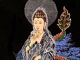

  
[Intangible Textual Heritage](../../index)  [Buddhism](../index) 
[Index](index)  [Previous](cbu35) 

------------------------------------------------------------------------

[Buy this Book at
Amazon.com](https://www.amazon.com/exec/obidos/ASIN/B0029LHUYM/internetsacredte)

------------------------------------------------------------------------

  
*Chinese Buddhism*, by Joseph Edkins, \[1893\], at Intangible Textual
Heritage

------------------------------------------------------------------------

p. 444 p. 445

### ALPHABETICAL INDEX

###### OF

#### TITLES OF BOOKS MENTIONED IN THIS WORK.

A Catena of Buddhist Scriptures from the Chinese, [3](cbu05.htm#page_3),
[283](cbu22.htm#page_283), [410](cbu31.htm#page_410).

Abhidharma Kosha, [120](cbu11.htm#page_120).

Abhidharma-lun, [110](cbu11.htm#page_110). See *Shastra of Metaphysics*.

Abhinishkramana Sutra, [287](cbu22.htm#page_287). See
*Fo-pen-hing-tsi-king*.

Account of Buddhist Kingdoms, [91](cbu11.htm#page_91),
[121](cbu11.htm#page_121). See *Fo-kwo-ki*.

Additional Agama Sutra, [110](cbu11.htm#page_110).

Agama Sutras, [20](cbu06.htm#page_20), [51](cbu09.htm#page_51).

Amida Sutra, [171](cbu12.htm#page_171). See *Amitabha Sutra* and
*A-mi-ta-king*.

Amitabha Sutra, [198](cbu14.htm#page_198), [233](cbu18.htm#page_233),
[234](cbu18.htm#page_234), [236](cbu18.htm#page_236). See *Amida Sutra*,
*A-mi-ta-king*, and *Wu-liang-sheu-king*.

A-mi-ta-king, [180](cbu13.htm#page_180). See *Amida Sutra*.

An Account of Astronomy by the Brahman Gigarishi,
[123](cbu11.htm#page_123). See *Ba-la-men-gih-ga-sien
jen-t‘ien-wen-shwo*.

Asangkhyea Vinaya, [109](cbu11.htm#page_109). See *Seng-ki-lü*.

 

Ba-la-men-gih-ga-sien jen-t‘ien-wen-shwo, [123](cbu11.htm#page_123). See
*An Account of Astronomy by the Brahman Gigarishi*.

Ba-la-men-swan-fa, [123](cbu11.htm#page_123).

Ba-la-men-swan-king, [123](cbu11.htm#page_123).

Ba-la-men-yin-yang-swan-li, [124](cbu11.htm#page_124).

Book for shaking the Dragon, [339](cbu26.htm#page_339). See
*Han-lung-king*.

Book of a Hundred Parables, [286](cbu22.htm#page_286). See *Pe-yü-king*.

Book of a Thousand Characters, [281](cbu22.htm#page_281). See
Tsien-tsï-wen.

Book of Changes, [324](cbu25.htm#page_324), [378](cbu28.htm#page_378).
See *Yi-king*.

Book of Forty-two Sections, [20](cbu06.htm#page_20),
[188](cbu14.htm#page_188), [283](cbu22.htm#page_283).

Book of History, [159](cbu12.htm#page_159).

Book of Kwan-yin, [367](cbu27.htm#page_367). See *Kwan-yin-king*.

Book of Miscellaneous Parables, [287](cbu22.htm#page_287). See
*Tsa-yü-king*.

Book of Odes, [362](cbu27.htm#page_362).

Book of Reason and Virtue, [372](cbu28.htm#page_372). See *Tau-te-king*.

p. 446

Book of the Dharma in Sentences, [286](cbu22.htm#page_286). See
*Fa-kü-king*.

Book of the Nirvâna, [178](cbu13.htm#page_178). See *Nirvâna Sutra*.

Brahmajala, [287](cbu22.htm#page_287). See *Fan-wang-king*.

Brahmanical Astronomy, [123](cbu11.htm#page_123). See
*P‘o-lo-men-t‘ien-wen*.

Bright Sutra, [109](cbu11.htm#page_109). See *Ming-king*.

 

Central Agama Sutra, [215](cbu16.htm#page_215).

Central Shastra, [171](cbu12.htm#page_171), [219](cbu16.htm#page_219),
[230](cbu18.htm#page_230). See *Chung-lun*.

Ceylon Friend, [287](cbu22.htm#page_287).

Ch‘ang-a-han-king, [110](cbu11.htm#page_110). See *Longer Agama Sutra*.

Chan-tsï-king, [287](cbu22.htm#page_287). See *Sâma Jâtaka*.

Ch‘eng-shih Sutra, [109](cbu11.htm#page_109). See *Complete Sutra*.

Cheng-sin-kiuen, [374](cbu28.htm#page_374).

Ch‘eng-wei-shï-lun, [278](cbu22.htm#page_278),
[279](cbu22.htm#page_279).

Cheu-li, [270](cbu21.htm#page_270).

Cheu-shu-yi-ki, [16](cbu06.htm#page_16).

Chih-fang wai-ki, [121](cbu11.htm#page_121).

Chinese Recorder, [127](cbu11.htm#page_127), [211](cbu15.htm#page_211),
[412](cbu31.htm#page_412), [419](cbu31.htm#page_419).

Chinese Repository, [167](cbu12.htm#page_167).

Ching-tsz-t‘ung, [6](cbu05.htm#page_6).

Chï-tu-lun, [41](cbu08.htm#page_41). See *Shastra of the Measure of
Wisdom*.

Chï-yue-luh, [103](cbu11.htm#page_103),
[159](cbu12.htm#page_159)-[161](cbu12.htm#page_161),
[277](cbu22.htm#page_277).

Chung-lun, [170](cbu12.htm#page_170), [171](cbu12.htm#page_171),
[184](cbu13.htm#page_184), [230](cbu18.htm#page_230),
[278](cbu22.htm#page_278). See *Central Shastra* and *Medial Shastra*.

Chung-sheng-tien-ki, [16](cbu06.htm#page_16).

Chung-yin-tu-na-lan-to-ta-tau-ch‘ang-king, [289](cbu23.htm#page_289).
See *The Sutra of Nalanda*, *the great seat of worship in Central
India*, and *Leng-yen-king*.

Chwang-tsï, [321](cbu25.htm#page_321), [372](cbu28.htm#page_372).

Chwen-ts‘ai-king, [387](cbu29.htm#page_387). See *Liturgy for turning
the coffin*.

Complete Sutra, [109](cbu11.htm#page_109). See *Ch’eng-shih Sutra*.

Curse of Kehama, [197](cbu14.htm#page_197).

 

Daily Prayers, [119](cbu11.htm#page_119).

Description of Western Countries, [121](cbu11.htm#page_121). See
*Mêmoires sur les Contrées Occidentales*.

Dharmapitaka Sutra, [86](cbu10.htm#page_86).

Diamond Classic, [4](cbu05.htm#page_4), [41](cbu08.htm#page_41). See
*Diamond Sutra*.

Diamond Sutra, [8](cbu05.htm#page_8), [97](cbu11.htm#page_97). See
*Kin-kang-king*.

Dictionary of Greek and Roman Biography and Mythology,
[342](cbu26.htm#page_342).

Discipline of the Four Divisions, [110](cbu11.htm#page_110),
[169](cbu12.htm#page_169). See *Sï fun-lü*.

Discipline of the Ten Chants, [110](cbu11.htm#page_110). See
*Shih-sung-lü*.

 

Eastern Monachism, [106](cbu11.htm#page_106), [169](cbu12.htm#page_169),
[244](cbu19.htm#page_244), [277](cbu22.htm#page_277),
[317](cbu24.htm#page_317), [410](cbu31.htm#page_410).

p. 447

Essai sur le Pali, [416](cbu31.htm#page_416).

Essay on Buddhism, [317](cbu24.htm#page_317).

 

Fa-hwa Sutra, [47](cbu09.htm#page_47), [108](cbu11.htm#page_108),
[109](cbu11.htm#page_109). See *Fa-hwa-king*.

Fa-hwa-hwei-i, [186](cbu13.htm#page_186), [231](cbu18.htm#page_231).

*Fa-hwa-king*, [38](cbu08.htm#page_38), [43](cbu08.htm#page_43),
[100](cbu11.htm#page_100), [172](cbu12.htm#page_172),
[180](cbu13.htm#page_180), [184](cbu13.htm#page_184),
[208](cbu15.htm#page_208), [209](cbu15.htm#page_209),
[214](cbu16.htm#page_214), [231](cbu18.htm#page_231),
[235](cbu18.htm#page_235), [269](cbu21.htm#page_269),
[283](cbu22.htm#page_283), [415](cbu31.htm#page_415). See *Lotus of the
Good Law* and *Saddharma pundarika*.

Fa-kü-king, [286](cbu22.htm#page_286). See *Book of the Dharma in
Sentences*.

Fang-kwang-pat-nia-king, [109](cbu11.htm#page_109). See *Light-emitting
Prajna Sutra*.

Fan-wang-king, [51](cbu09.htm#page_51), [190](cbu14.htm#page_190),
[287](cbu22.htm#page_287). See *Brahmajala*.

Fan-wang Sutra, [216](cbu16.htm#page_216). See *Fan-wang-king*.

Fan-yi-ming-i, [35](cbu08.htm#page_35).

Fa-yuen-chu-lin, [86](cbu10.htm#page_86), [106](cbu11.htm#page_106),
[135](cbu11.htm#page_135), [158](cbu12.htm#page_158),
[215](cbu16.htm#page_215), [218](cbu16.htm#page_218),
[340](cbu26.htm#page_340).

Foĕ kouĕ ki, [88](cbu11.htm#page_88), [91](cbu11.htm#page_91),
[207](cbu15.htm#page_207), [408](cbu31.htm#page_408).

Fo-ki-siang-king, [137](cbu11.htm#page_137). See *Sutra of Good
Fortune*.

Fo-kwo-ki, [91](cbu11.htm#page_91). See *Foĕ* *koĕ ki*, *Travels of
Fa-hian* and *Sung-yün*, and *Records of Buddhistic Kingdoms*.

Fo-pen-hing-tsi-king, [287](cbu22.htm#page_287). See *Abhinishkramana
Sutra* and *The Romantic Legend of Sâkya Buddha*.

Fo-tsu-t‘ung-ki, [15](cbu06.htm#page_15), [32](cbu07.htm#page_32),
[41](cbu08.htm#page_41), [42](cbu08.htm#page_42),
[56](cbu09.htm#page_56), [72](cbu10.htm#page_72),
[73](cbu10.htm#page_73), [82](cbu10.htm#page_82),
[85](cbu10.htm#page_85), [86](cbu10.htm#page_86),
[156](cbu12.htm#page_156).

 

Gatha of One Shloka, [306](cbu24.htm#page_306). See *The Shastra of One
Shloka*.

Golden Light Sutra, [109](cbu11.htm#page_109). See *Kin-kwang-king*.

Great cloud Sutra, [122](cbu11.htm#page_122). See *Ta-yün-king*.

Great Lotus of the Good Law, [43](cbu08.htm#page_43). See *Lotus of the
Good Law*.

Great Prajna, [116](cbu11.htm#page_116). See *Ma-ha-pat-nia*.

 

Hai-kwo-t‘u-chï, [357](cbu27.htm#page_357).

Han-lung-king, [339](cbu26.htm#page_339), [345](cbu26.htm#page_345). See
*Book for shaking the Dragon*.

Han-wei-ts‘ung-shu, [91](cbu11.htm#page_91).

Handbook for the Student of Chinese Buddhism, [6](cbu05.htm#page_6),
[31](cbu07.htm#page_31), [35](cbu08.htm#page_35),
[39](cbu08.htm#page_39), [403](cbu30.htm#page_403),
[412](cbu31.htm#page_412), [415](cbu31.htm#page_415),
[417](cbu31.htm#page_417).

Heart Classic, [387](cbu29.htm#page_387). See *Sin-king*.

Hing-kio-kiuen, [374](cbu28.htm#page_374).

Histoire de la Vie de Hiouen-thsang, [117](cbu11.htm#page_117),
[292](cbu23.htm#page_292), [408](cbu31.htm#page_408).

History of Modern Philosophy, [312](cbu24.htm#page_312).

History of the Northern Wei dynasty, [106](cbu11.htm#page_106),
[107](cbu11.htm#page_107).

History of the Sui dynasty, [112](cbu11.htm#page_112),
[123](cbu11.htm#page_123).

History of the Sung dynasty, [94](cbu11.htm#page_94),
[96](cbu11.htm#page_96).

History of the T‘ang dynasty, [116](cbu11.htm#page_116).

History of the Wei dynasty, [16](cbu06.htm#page_16),
[111](cbu11.htm#page_111).

History of T‘ien-t‘ai-shan, [137](cbu11.htm#page_137).

Hundred Discourses, [210](cbu15.htm#page_210).

p. 448

Hwa-yen Sutra, [20](cbu06.htm#page_20), [110](cbu11.htm#page_110),
[131](cbu11.htm#page_131), [170](cbu12.htm#page_170). See
*Hwa-yen-king*.

Hwa-yen-king, [18](cbu06.htm#page_18), [21](cbu06.htm#page_21),
[24](cbu06.htm#page_24), [109](cbu11.htm#page_109),
[139](cbu11.htm#page_139), [180](cbu13.htm#page_180),
[230](cbu18.htm#page_230), [231](cbu18.htm#page_231),
[237](cbu18.htm#page_237), [238](cbu18.htm#page_238),
[265](cbu20.htm#page_265), [278](cbu22.htm#page_278),
[279](cbu22.htm#page_279), [415](cbu31.htm#page_415). See *Hwa-yen
Sutra*.

 

Influence of Tropical Climates on Europeans, [339](cbu26.htm#page_339).

In-ming-lun, [120](cbu11.htm#page_120).

In-ming-shu-kiai, [120](cbu11.htm#page_120).

Institutes of Manu, [302](cbu24.htm#page_302). See *Laws of Manu*.

Introduction a l’Histoire du Buddhisme Indien,
[106](cbu11.htm#page_106), [229](cbu18.htm#page_229).

Introduction to the Study of the Chinese Characters,
[112](cbu11.htm#page_112), [399](cbu30.htm#page_399),
[400](cbu30.htm#page_400).

 

Japanese Encyclopædia, [62](cbu10.htm#page_62).

Jen-wang-king, [124](cbu11.htm#page_124). See *Sutra of the Benevolent
king*.

 

K‘ai-yuen-chan-king, [123](cbu11.htm#page_123).

K‘ai-yuen-shi-kiau-lu, [278](cbu22.htm#page_278),
[280](cbu22.htm#page_280).

K‘ang-hi's Dictionary, [392](cbu29.htm#page_392),
[398](cbu30.htm#page_398).

Kan-ying-p‘ien, [367](cbu27.htm#page_367).

Kià-yü, [325](cbu25.htm#page_325).

Kiau-ch’eng-fa-shu, [189](cbu14.htm#page_189),
[190](cbu14.htm#page_190).

Kieu-chï-li, [211](cbu15.htm#page_211). See *Kieu-chï-shu*.

Kieu-chï-shu, [123](cbu11.htm#page_123). See *Kieu-chï-li*.

Kin-kana-king, [8](cbu05.htm#page_8), [21](cbu06.htm#page_21),
[153](cbu11.htm#page_153), [180](cbu13.htm#page_180),
[269](cbu21.htm#page_269). See *Diamond Sutra*.

Kin-kang-pat-nia-pa-la-mi-ta-king, [119](cbu11.htm#page_119). See
*Vajra-chedika-prajna-paramita Sutra*.

*Kin-kwang-king*, [109](cbu11.htm#page_109). See *Golden Light Sutra*.

Kin-kwang-sling-king, [206](cbu15.htm#page_206),
[240](cbu19.htm#page_240). See *The Bright Sutra of Golden Light*.

Kin-shï-t‘u-shu-pu, [117](cbu11.htm#page_117).

K‘i-sin-lun, [278](cbu22.htm#page_278). See *Shastra for awakening
Faith*.

Kung-ch‘io-king, [211](cbu15.htm#page_211). See *Peacock Sutra*.

Kwang-tse-li, [122](cbu11.htm#page_122). See *The Calendar of the Bright
house*.

Kwan-wu-liang-sheu-king, [234](cbu18.htm#page_234).

Kwan-yin-king, [387](cbu29.htm#page_387). See *Book of Kwan-yin*.

 

Laws of Manu, [93](cbu11.htm#page_93), [363](cbu27.htm#page_363). See
*Institutes of Manu*.

Lenga Sutra, [39](cbu08.htm#page_39), [51](cbu09.htm#page_51),
[103](cbu11.htm#page_103), [130](cbu11.htm#page_130).

Leng yen-king, [19](cbu06.htm#page_19), [20](cbu06.htm#page_20),
[36](cbu08.htm#page_36), [37](cbu08.htm#page_37),
[149](cbu11.htm#page_149), [153](cbu11.htm#page_153),
[253](cbu19.htm#page_253), [269](cbu21.htm#page_269),
[288](cbu22.htm#page_288), [289](cbu23.htm#page_289).

Les Avadanas, [3](cbu05.htm#page_3), [408](cbu31.htm#page_408).

Liang History, [104](cbu11.htm#page_104), [108](cbu11.htm#page_108),
[113](cbu11.htm#page_113).

Life of Buddha, [143](cbu11.htm#page_143), [192](cbu14.htm#page_192).

Light-emitting Prajna Sutra, [109](cbu11.htm#page_109). See
*Fang-kwang-pat-nia-king*.

Li-ki, [351](cbu26.htm#page_351).

p. 449

Li-men-lun, [120](cbu11.htm#page_120).

Liturgy for turning the coffin, [387](cbu29.htm#page_387). See
*Chwen-ts‘ai-king*.

Longer Agama Sutra, [110](cbu11.htm#page_110). See *Ch‘ang-a-han-king*.

Lothair, [415](cbu31.htm#page_415).

Lo-tsu-ch‘u-shï-t‘ui-fan-ping-pau-kiuen, [373](cbu28.htm#page_373).

Lotus of the Good Law, [2](cbu05.htm#page_2), [19](cbu06.htm#page_19),
[38](cbu08.htm#page_38), [46](cbu09.htm#page_46),
[47](cbu09.htm#page_47), [89](cbu11.htm#page_89),
[100](cbu11.htm#page_100). [108](cbu11.htm#page_108),
[180](cbu13.htm#page_180), [214](cbu16.htm#page_214),
[269](cbu21.htm#page_269), [283](cbu22.htm#page_283). See *Fa-hwa-king*.

 

Ma-ha-pat-nia, [116](cbu11.htm#page_116). See *Great Prajna*.

Maha Prajna paramita, [275](cbu22.htm#page_275),
[281](cbu22.htm#page_281). See *Ta-poh-je-king*.

Mahavanso, [106](cbu11.htm#page_106).

Manual of Buddhism, [189](cbu14.htm#page_189),
[217](cbu16.htm#page_217), [230](cbu18.htm#page_230),
[410](cbu31.htm#page_410).

Manual of Buddhist Regulations and Festivals, [205](cbu15.htm#page_205),
[210](cbu15.htm#page_210). See *Pe-chang-ts‘ing-kwei*.

Medial Shastra, [184](cbu13.htm#page_184). See *Central Shastra* and
*Chung-lun*.

Mélanges Asiatiques, [6](cbu05.htm#page_6).

Mémoires sur les Contrées Occidentales, [292](cbu23.htm#page_292),
[408](cbu31.htm#page_408). See *Description of Western Countries*.

Méthode pour Déchifrer et Transcrire les noms Sanscrits,
[93](cbu11.htm#page_93), [400](cbu30.htm#page_400).

Miau-fa-lien-hwa-king, [3](cbu05.htm#page_3), [100](cbu11.htm#page_100),
[180](cbu13.htm#page_180). See *Fa-hwa-king*.

Ming-king, [109](cbu11.htm#page_109).

Mirror of History, [111](cbu11.htm#page_111). See *T‘ung-kien-kang-mu*.

Mythology of the Hindoos, [14](cbu06.htm#page_14).

 

Narrative of Buddha pacifying and subduing Samidhi,
[308](cbu24.htm#page_308). See *Tiau-fuh-san-mih-t‘i-king*.

Neng-twan-kin-kang-pat-nia-pa-la-mi-ta-king, [119](cbu11.htm#page_119).
See *Vajra-chedika-prajna paramita Sutra*.

New Testament, [275](cbu22.htm#page_275).

Nirvâna Sutra, [53](cbu09.htm#page_53), [108](cbu11.htm#page_108),
[109](cbu11.htm#page_109), [114](cbu11.htm#page_114),
[180](cbu13.htm#page_180). See *Book of the Nirvâna*.

Ni-wan-king, [109](cbu11.htm#page_109). See *Nirvâna Sutra*.

Notions of the Chinese concerning God and spirits,
[216](cbu16.htm#page_216).

 

Olanggi sodar, [237](cbu18.htm#page_237). See *Hwa-yen-king*.

Old Testament, [333](cbu26.htm#page_333).

O-mi-to-king-su-ts‘au, [198](cbu14.htm#page_198).

 

Pat-no-pa-la-mit-ta, [40](cbu08.htm#page_40). See *Prajna paramita*.

Pau-tsih Sutra, [131](cbu11.htm#page_131).

Pau-ying-lu, [367](cbu27.htm#page_367).

Peacock Sutra, [211](cbu15.htm#page_211). See *Kung-ch‘io-king*.

Pe-Chang-ts‘ing-kwei, [205](cbu15.htm#page_205),
[209](cbu15.htm#page_209), [210](cbu15.htm#page_210). See *Manual of
Buddhist Regulations and Festivals*.

Pei-hwa-king, [236](cbu18.htm#page_236).

p. 450

Pei-tsang-mu-lu, [275](cbu22.htm#page_275).

Pen-hing-king, [391](cbu29.htm#page_391).

Pen-ting-lü, [109](cbu11.htm#page_109), [110](cbu11.htm#page_110).

Pe-ye-kie-la-nan, [120](cbu11.htm#page_120).

Pe-yü-king, [286](cbu22.htm#page_286). See *Book of a Hundred Parables*.

Ping-shu-pi-t‘an, [382](cbu29.htm#page_382).

P‘i-shih-shï-chu-wang, [152](cbu11.htm#page_152). See *The Errors of the
Buddhists Exposed*.

P‘o-lo-men-t‘ien-wen, [123](cbu11.htm#page_123). See *Brahmanical
Astronomy*.

P‘o-sie-kiuen, [374](cbu28.htm#page_374).

Pradimoksha Sutra, [55](cbu09.htm#page_55). See *Pratimoksha*.

Prajna paramita, [20](cbu06.htm#page_20), [40](cbu08.htm#page_40),
[42](cbu08.htm#page_42), [47](cbu09.htm#page_47),
[119](cbu11.htm#page_119), [184](cbu13.htm#page_184),
[266](cbu20.htm#page_266), [279](cbu22.htm#page_279).

Prajna-teng-lun, [278](cbu22.htm#page_278).

Pratimoksha, [288](cbu22.htm#page_288). See *Pradimoksha Sutra*.

 

Records of Buddhistic kingdoms, [408](cbu31.htm#page_408).

Réligiose Bildung, u. s. w. der Hindus, [156](cbu12.htm#page_156).

Researches of the Members of the Russian Mission in Peking,
[411](cbu31.htm#page_411).

 

Sacred Edict, [152](cbu11.htm#page_152), [379](cbu28.htm#page_379).

Saddharma pundarika, [43](cbu08.htm#page_43), [108](cbu11.htm#page_108),
[214](cbu16.htm#page_214). See *Fa-hwa-king*.

Sâma Jâtaka, [287](cbu22.htm#page_287). See *Chan-tsï-king*.

Sankhya Karika, [313](cbu24.htm#page_313).

San-kiau-yi-su, [13](cbu06.htm#page_13), [72](cbu10.htm#page_72),
[73](cbu10.htm#page_73), [157](cbu12.htm#page_157),
[160](cbu12.htm#page_160). See *Supplementary Account of the Three
Religions*.

San-mei-king, [104](cbu11.htm#page_104).

Seng-ga Sutra, [104](cbu11.htm#page_104).

*Seng-ki-lü*, [109](cbu11.htm#page_109), See *Asangkhyea Vinaya*.

Shanghai Almanac, [124](cbu11.htm#page_124).

Shastra for awakening faith, [278](cbu22.htm#page_278). See
*K‘i-sin-lun*.

Shastra of fixed position, [110](cbu11.htm#page_110). See *Ti-ch‘ï-lun*.

Shastra of Metaphysics, [110](cbu11.htm#page_110). See *Abhidharma-lun*.

Shastra of the Measure of Wisdom, [40](cbu08.htm#page_40). See
*Chï-tu-lun*.

Shastra of the Method of Great Wisdom, [77](cbu10.htm#page_77). See
*Ta-chï-tu-lun*.

Shastra of the Non-ego, [76](cbu10.htm#page_76). See *Sutra of the
Not-me*.

Shastra of the ten positions, [110](cbu11.htm#page_110). See
*Shi-ti-lun*.

Sheng-t‘ien-shïh-kiai-king, [189](cbu14.htm#page_189). See *The book of
birth in heaven through keeping the ten prohibitions*.

Sheu-shan-ko-ts‘ung-shu, [119](cbu11.htm#page_119).

Shi-er-men-lun, [278](cbu22.htm#page_278).

Shih-sung-lü, [110](cbu11.htm#page_110). See *Discipline of the Ten
Chants*.

Shih-tsien, [51](cbu09.htm#page_51). See *Tallies of the Shakya
communities*.

Shing-ming-lun, [120](cbu11.htm#page_120).

Shi-ti-lun, [110](cbu11.htm#page_110). See *Shastra of the Ten
Positions*.

p. 451

Shuî-hu, [270](cbu21.htm#page_270).

Shu-king, [321](cbu25.htm#page_321).

Shwo-fu, [91](cbu11.htm#page_91).

Siang-cheng-ki, [16](cbu06.htm#page_16).

Sï-fun-lü, [110](cbu11.htm#page_110). See *Discipline of the Four
Divisions*.

Sing-king, [322](cbu25.htm#page_322). See *Star classic*.

Sin-king, [387](cbu29.htm#page_387). See *Heart classic*.

Sï-pu-lü, [168](cbu12.htm#page_168).

Si-yeu-chen-ts‘euen, [121](cbu11.htm#page_121). See *Si-yeu-ki*.

Si-yeu-ki, [121](cbu11.htm#page_121). See *Si-yeu-chen-ts‘euen*.

Star classic, [322](cbu25.htm#page_322). See *Sing-king*.

Sung History, [144](cbu11.htm#page_144)-[146](cbu11.htm#page_146).

Supplement to Wen-hien-t‘ung-k‘au, [132](cbu11.htm#page_132),
[149](cbu11.htm#page_149).

Supplementary account of the three religions, [13](cbu06.htm#page_13).
See *San-kiau-yi-su*.

Sutra of Boundless Age, [137](cbu11.htm#page_137). See
*Wu-liang-sheu-king*.

Sutra of Forty-two Sections, [19](cbu06.htm#page_19),
[88](cbu11.htm#page_88), [120](cbu11.htm#page_120),
[400](cbu30.htm#page_400), [416](cbu31.htm#page_416).

Sutra of Good Fortune, [137](cbu11.htm#page_137). See
*Fo-ki-siang-king*.

Sutra of Pure name, [177](cbu13.htm#page_177). See *Tsing-ming-king*.

Sutra of the Benevolent King, [124](cbu11.htm#page_124). See
*Jen-wang-king*.

Sutra of the Diamond, [21](cbu06.htm#page_21). See *Diamond Sutra*.

Sutra of the dying instructions of Buddha, [418](cbu31.htm#page_418).

Sutra of the Lotus of the Good Law, [43](cbu08.htm#page_43). See
*Fa-hwa-king*.

Sutra of the Not-me, [83](cbu10.htm#page_83).

Sutra of the ten points of rest, [108](cbu11.htm#page_108).

Sutra of Tombs in connection with sympathetically operating causes,
[55](cbu09.htm#page_55). See *Tsung-mu-yin-yuen-king*.

Syllabic Dictionary, [413](cbu31.htm#page_413).

 

*Ta-chï-tu-lun*, [77](cbu10.htm#page_77), [160](cbu12.htm#page_160),
[278](cbu22.htm#page_278). See *Shastra of the Method of Great Wisdom*.

T‘ai-shan-kiuen, [374](cbu28.htm#page_374).

Tallies of the Shakya communities, [51](cbu09.htm#page_51). See
*Shih-tsien*.

T‘ang-yün, [146](cbu11.htm#page_146).

T‘an-shï-kiuen, [374](cbu28.htm#page_374).

Ta-pei-ch‘an, [269](cbu21.htm#page_269).

Ta-pei-ts‘an, [140](cbu11.htm#page_140), [187](cbu13.htm#page_187).

Ta-poh-je-king, [275](cbu22.htm#page_275). See *Maha Prajna-paramita*.

Ta-t‘ang-si-yü-ki, [119](cbu11.htm#page_119). See *Mémoires sur les
Contrées Occidentales*.

Ta-tsi-king, [39](cbu08.htm#page_39).

Tau-te-king, [168](cbu12.htm#page_168), [372](cbu28.htm#page_372). See
*Book of Reason and Virtue*.

Ta-yün-king, [122](cbu11.htm#page_122). See *Great Cloud Sutra*.

The book of birth in heaven through keeping the ten prohibitions,
[189](cbu14.htm#page_189). See *Sheng-tien-shïh-kiai-king*.

p. 452

The Bright Sutra of Golden Light, [206](cbu15.htm#page_206). See
*Kin-kwang-ming-king*.

The calendar of the bright house, [122](cbu11.htm#page_122). See
*Kwang-tse-li*.

The Errors of the Buddhists exposed, [152](cbu11.htm#page_152). See
*P‘i-shih-shi-chu-wang*.

The magical formula of the Bodhisattwa Kwan-shï-yin, who has a thousand
hands and eyes and a merciful heart, [132](cbu11.htm#page_132). See
*Ts‘ien-sheu-ts‘ien-yen-kwan-shï-yin-p‘u-sa-ta pei-sin-to-lo-ni*.

The Romantic Legend of Sâkya Buddha, [3](cbu05.htm#page_3),
[33](cbu07.htm#page_33), [410](cbu31.htm#page_410).

The Shastra of One Shloka, [302](cbu24.htm#page_302),
[303](cbu24.htm#page_303), [308](cbu24.htm#page_308),
[316](cbu24.htm#page_316). See *Yih-shu-lu-kia-lun*.

The Sutra of Nalanda the great seat of worship in Central India,
[289](cbu23.htm#page_289). See
*Chung-yin-tu-na-lan-to-ta-tau-ch’ang-king*.

Thousand Character Classic, [281](cbu22.htm#page_281). See
*Tsien-tsï-wen*.

Three Lectures on Buddhism, [419](cbu31.htm#page_419).

Tiau-fuh-san-mih-t‘i-king, [308](cbu24.htm#page_308). See *Narrative of
Buddha pacifying and subduing Samidhi*.

*Ti-ch‘ï-lun*, [110](cbu11.htm#page_110). See *Shastra of fixed
position*.

T‘ien-t‘ai-shan-chï, [177](cbu13.htm#page_177). See History of
*T‘ien-t‘ai-shan*.

Ti-tsang Sutra, [218](cbu16.htm#page_218), [225](cbu17.htm#page_225).
See *Ti-tsang-king*.

Ti-tsang-king, [195](cbu14.htm#page_195), [269](cbu21.htm#page_269). See
*Ti-tsang Sutra*.

Transactions of the Second Oriental Congress, [107](cbu11.htm#page_107),
[287](cbu22.htm#page_287).

Travels of Fa-hian and Sung-yun, [408](cbu31.htm#page_408).

Treatise on the four tones, [113](cbu11.htm#page_113).

Ts‘an-t‘ung-ki, [321](cbu25.htm#page_321), [322](cbu25.htm#page_322).

Tsa-yü-king, [287](cbu22.htm#page_287). See *Book of Miscellaneous
Parables*.

Ts‘ien-sheu-ts‘ien-yen-kwan-shï-yin-p‘u-sa-ta-pei-sin-to-lo-ni,
[132](cbu11.htm#page_132). See *The magical formula of the Bodhisattwa
Kwan-shï-yin, who has a thousand hands and eyes and a merciful heart*.

Tsien-tsï-wen, [281](cbu22.htm#page_281). See *Book of a Thousand
Characters*.

Ts‘in history, [90](cbu11.htm#page_90).

Tsing-ming-king, [177](cbu13.htm#page_177). See *Sutra of Pure Name*.

Ts‘ing-tsing-kiuen, [374](cbu28.htm#page_374).

Tsing-tu-sheng-hien-luh, [278](cbu22.htm#page_278).

Tsing-tu-shï, [174](cbu12.htm#page_174).

Tsing-tu-wen, [411](cbu31.htm#page_411).

Tso-chwen, [16](cbu06.htm#page_16).

Tsung-mu-yin-yuen-king, [55](cbu09.htm#page_55). See *Sutra of tombs in
connection with sympathetically-operating causes*.

T‘ung-kien-kang-mu, [89](cbu11.htm#page_89), [100](cbu11.htm#page_100),
[105](cbu11.htm#page_105), [111](cbu11.htm#page_111). See *Mirror of
History*.

Twan-tsi-sin-yau, [163](cbu12.htm#page_163).

 

Über den Buddhaismus in Hoch Asien und in China,
[410](cbu31.htm#page_410).

p. 453

Vajra chedika prajna paramita Sutra, [119](cbu11.htm#page_119). See
*Kin-kang-pat-nia-pa-la-mi-ta-king*.

Vibhasha-lun, [278](cbu22.htm#page_278). See *Vibhasha Shastra*.

Vibhasha Shastra, [83](cbu10.htm#page_83). See *Vibhasha-lun*.

Vie de Gaudama, [202](cbu14.htm#page_202).

Vishnu Purana, [106](cbu11.htm#page_106).

 

Wan-kwo-kung-pau, [366](cbu27.htm#page_366).

Wei-ma Sutra, [108](cbu11.htm#page_108), [109](cbu11.htm#page_109),
[284](cbu22.htm#page_284).

Wei-shï-lun, [169](cbu12.htm#page_169).

Wu-liang-sheu king, [137](cbu11.htm#page_137),
[171](cbu12.htm#page_171), [233](cbu18.htm#page_233),
[234](cbu18.htm#page_234). See *Amitabha Sutra*.

 

Yih-shu-lu-kia-lun, [302](cbu24.htm#page_302),
[303](cbu24.htm#page_303). See *The Shastra of One Shloka*.

Yi-king, [320](cbu25.htm#page_320), [322](cbu25.htm#page_322),
[325](cbu25.htm#page_325), [339](cbu26.htm#page_339). See *Book of
Changes*.

Yin-chï-wen, [367](cbu27.htm#page_367).

Ying-hwan-chï-lio, [357](cbu27.htm#page_357).

Yi-sho-lo-ka-lun, [306](cbu24.htm#page_306). See *The Shastra of One
Shloka*.

Yi-ts‘ie-king-yin-i, [222](cbu17.htm#page_222),
[231](cbu18.htm#page_231).

Yo-shï-king, [235](cbu18.htm#page_235).

Yo-sï-lieu-li-kwang ju-lai-kung-te-king, [120](cbu11.htm#page_120).

Yuen History, [148](cbu11.htm#page_148).

Yü-k‘ia-yen-k‘eu, [132](cbu11.htm#page_132), [137](cbu11.htm#page_137).

Yü-lan-p‘en Sutra, [210](cbu15.htm#page_210).

Yü-li, [358](cbu27.htm#page_358), [360](cbu27.htm#page_360),
[365](cbu27.htm#page_365).

Yü-li-ch‘au-chwen, [367](cbu27.htm#page_367).

Yü-p‘ien, [112](cbu11.htm#page_112), [146](cbu11.htm#page_146).

 

Printed by BALLANTYNE, HANSON & Co.  
Edinburgh &London

 

 

 
