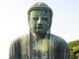
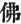
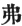
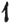
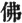

  
[Intangible Textual Heritage](../../index)  [Buddhism](../index) 
[Index](index)  [Previous](chj14)  [Next](chj16) 

------------------------------------------------------------------------

[Buy this Book at
Amazon.com](https://www.amazon.com/exec/obidos/ASIN/B0029LHTGG/internetsacredte)

------------------------------------------------------------------------

  
*The Creed of Half Japan*, by Arthur Lloyd, \[1911\], at Intangible
Textual Heritage

------------------------------------------------------------------------

p. 117

### CHAPTER XIII

The Missionaries of the Han

If we could construct a comparative
Chronological Table of the religious phenomena of Europe and Asia during
the first two centuries, we should see that the next Buddhist mission
(A.D. 147) coincided with a mission sent by the Kushan sovereigns to the
Han emperors, partly, it may be, to carry out negotiations for a
matrimonial alliance, and partly, no doubt, to arrange for concerted
action for defence against the Huns and other barbarians who were
threatening both China and India. Political negotiation and religious
propaganda would seem to have gone hand-in-hand.

The two pioneer missionaries were Anshikao (who, from his rank as Prince
of Parthia, may well have bad some political commission) and Lokaraksha.
The two arrived simultaneously at Lôyang, or, at any rate, with only a
comparatively short interval between them; the rest came at intervals
during the seventy years that still remained for the Han dynasty to
rule. Six of them are mentioned by Nanjo, [1](#fn_154) but none of them can be compared for
industrious translation with the first two. There must have been other
missionaries as well: there are sixteen translations by unknown hands,
and there must surely have been some missionaries whose methods were not
literary. In all, ninety-six Sūtras were translated during the latter
years of the Han dynasty, of which Anshikao

p. 118

claims fifty-six and Lokaraksha twelve. The other six men only produced
twelve Sūtras between them.

The first notable point with regard to these pioneer missionaries is
that none came from India proper, and, in particular, none from Magadha
and the plains of the Ganges. Two were Parthians; three are described as
coming from Thibet; one from the country of the Yuetchi; the others
vaguely as from the Western region. They were all subjects of the Kushan
kingdom, and had therefore all been more or less influenced by the
Gandhāra Buddhism which had come in with the new era.

The leader of this successful mission to China was a Parthian prince
known to us as Anshikao. His real personal name is not given (Anshikao
merely means "Prince of the Ansi," *i.e.* Parthians), but it is said
that he resigned his throne to his uncle in order to become a monk, and
that he was the son of a famous king who had been the enemy of Trajan
and the friend of Hadrian. All this enables us to identify him with
Axidares, the son of Pachorus, whom his father had nominated to the
Armenian throne, shortly after A.D. 100, thereby giving much offence to
the Emperor Trajan. Pachorus’ successor on the Parthian throne, his
brother Chosroes, at once apologized to Rome for the error in judgment
that Pachorus had made, deposed Axidares in haste, nominated his younger
nephew Parthamasiris in his stead, and wrote to Rome begging for
investiture on his behalf. But Trajan refusing to listen, Parthamasiris
surrendered himself, and was at first treated with clemency, but was
afterwards murdered about A.D. 115. There seems to be little doubt that
the prince Axidares, deposed about A.D. 108 by his uncle, and ousted
from his Armenian kingdom, after his brother's death, by a distant
relative, retired to a cloister, as others have done who have
experienced

p. 119

the sorrows of a vain world, and eventually, as an elderly man and a
tried ecclesiastic, became the leader of the Buddhist mission to China.

But Axidares (may we call him by his title Anshikao?) was the nephew of
Chosroes, and the son of Pachorus. He was therefore the nephew of King
Tiridates, and consequently the nephew of that King of Armenia who had
sent an invitation to the Apostle Thomas to preach the gospel in the
Parthian dominions. [1](#fn_155)

"And here comes in the most remarkable incident in a remarkable
story:—Tiridates had been a Mazdean priest, and was so strict an
observer of Mazdean rites and ceremonies that, to prevent any
possibility of defiling the element water, he, instead of taking the
ordinary route and embarking at Antioch direct for Rome, insisted on
making the long journey overland through the entire length of Asia Minor
to the Hellespont, and thence round the head of the Adriatic to the
Capital. His grand-nephew, Axidares, or Vargash, had taken orders in
Buddhism. In his desire to quit the vanities of a life of royalty, whose
instabilities mocked him at every step, he had found no refuge in
Mazdeism and no place in which a sorely tried spirit could find relief.
The preaching of the sage As’vaghosha had thrown a bridge over the chasm
between Mazdeism and Buddhism, and the doctrines of Christianity as
taught by St. Thomas had shown how superior to the bondage of the
ceremonial law was the freedom inculcated by it as well as the new
Buddhism. Buddhism, without breaking away from Mazdean tradition,
offered in its conventional monasticism just that escape for which the
soul of the sorely tried

p. 120

prince was longing; was it any wonder that it, with the prospect that it
offered of converting a world, should have prevailed." [1](#fn_156)

"Already before the time of As’oka the logical void involved in the
acceptance of Nirvana had led to the evolution of a Maitreya Buddha, the
"Future Buddha" of Kindness, who was to mitigate the ills of an
inflexible Karma; but the movement did not here end, and once started,
its mere *vis inertiæ* carried it on. Pratyeka Buddhas, those who had
without regard to others attained an individual Buddhahood, and
Bodhisattvas, those whose progressive Karma was insensibly leading them
along the "path" to Buddhahood, were the natural outcome of the
movement, and of these, two—Manjuśri, the Gracious-one, and
Avalokiteśvara, the Pitiful-one—gradually came to the front. At first
only mental abstractions, the inevitable tendency was to segregate from
the magma, and condense as personal Buddhas. In the process they came
under the influence of the school of As’vaghosha, when Manjuśri easily
was found to take the place of Cpenta Ârmaita, Holy Wisdom, and
Avalokiteśvara in like manner of Khshathra Vairya, Perfect Sovereignty,
both lieutenants of Ahura Mazda in ruling mundane affairs. So it was
that when Amida came to take in the celestial hierarchy the place of The
Buddha, seats beside him were found for the two great Bodhisattvas,
Avalokiteśvara and Manjuśri."

Yet it is noteworthy that a very great portion of this literature thus
early translated into Chinese is Hīnayāna.

p. 121

\[paragraph continues\] Many of the
extra-Indian provinces of the Kushan Empire, Khotan to wit, and portions
of Bactria, had been converted to Buddhism long before the commencement
of the Mahāyāna movement, and, having been converted to Hīnayāna,
remained constant to their allegiance, though sectarian differences, as
well as the nature of the mountainous countries between them, cut them
off from their Hīnayāna brethren on the southern slopes of the Himalaya.
Besides, the dividing-line between the two Vehicles was hardly as yet
sharply drawn.

We may therefore safely conclude that the second-century Buddhist
mission to China was mainly an effort made by the Kushans to gain the
friendship of that portion of the Chinese people that was predisposed to
religion; that its members came from extra-Indian countries which had
long since been Buddhist, and which had now passed under the sway of the
Kushans; and that, whilst it contained the beginnings of Mahāyānism, it
was in the main Hīnayāna.

The next thing that strikes us is the very elementary character of the
Hīnayāna Buddhism that these men taught. There are some extremely
elementary treatises amongst the Sūtras translated—tracts, for instance,
on the Four Truths, the Twelvefold Chain of Causation, the causes of
Pain, the duty towards parents, the punishments of sin, the rewards of
Virtue. The publication of these tracts seems to show that the Buddhist
missionaries were doing pioneer work on untouched ground. The previous
mission of Kaśyapa Matanga and Dharmaraksha (if indeed it had been a
Buddhist mission at all) had evidently died out completely, and these
men had to begin again. It is only thus that we can account for the
necessity of publishing these elementary treatises. It is not yet more
than fifty years since the re-introduction of

p. 122

\[paragraph continues\] Christianity into
Japan, but the day for elementary treatises is past already. We have our
Bibles, our Testaments, our Prayer-books, our Catechisms—all standard
books, in fact—in Japanese translations, and it would be next to an
impossibility that they should be swept away even by a wholesale
"destruction of books" such as the Chinese indulged in.

Had the "Heralding of the Son of Man," [1](#fn_157) as I venture to call it, been a
permanent or successful Buddhist mission, it would have left behind it
literary memorials which would have made it unnecessary for the
successors of those men to insist so much on the elements of Buddhism,
the more so as both missions seem to have laboured in the same city of
Loyang and its immediate vicinity.

There are, however, certain very distinctly Mahāyānistic elements to be
found in these ninety-six books of the Han translators, and notably in
the twelve books attributed to Lokaraksha, who comes from the country of
the Yuetchi, the very heart of the Kushan Empire. There are likewise
Mahāyānistic traces to be found in the writings of Anshikao, who was
very possibly a Parthian hostage at the court of the Kushan kings.

Thus we find the use both of *mudrā* and of *mantra*, of mystic
gesticulations and of apparently meaningless

p. 123

formulæ of incantation. [1](#fn_158) These
formulæ and practices, which have not as yet received much attention
from scholars, are valuable to the student of religion as showing how
far-spread was the use of cognate practices during the second century.
We find the *mudrā* and *mantra* in Egypt; we find them in the
Gnosticism of Asia Minor, *e.g.* amongst the Marcosians mentioned by
Irenæus, in North-Western India, in China, and, in process of time, in
Japan. The sacred language used for the mantras differs; in the West it
is Hebrew, in the East it is Sanskrit; but the manual signs made by the
worshippers are the same, as are also the seals or characters used
conventionally to denote certain objects. One most interesting case in
point is the so-called sixteen-petalled Imperial Chrysanthemum of Japan.
Dr. Munro of Yokohama [2](#fn_159) has, as I
have said, found it in Egypt on a tomb. It is also given in the newly
discovered book of Jao [3](#fn_160) as a
"seal," with its appropriate though meaningless mantra: it comes to
Japan *viâ* China and appears at Kyoto as the "seal" of the god of
Peace. In the twelfth century it appears as the *mon* or crest of the
Emperor Toba, who was a religious-minded person, much devoted to the
worship of the "god of Peace." It is to-day the Imperial Crest, sacred
to the uses of the Imperial House. No subject may have it on anything
that belongs to him; and yet, for the modest outlay of a halfpenny, he
can procure at the (modern) Heian-Jingū, or Temple of the God of Peace,
at Kyoto, amulets and charms, protective against evil, which bear the
Imperial Chrysanthemum Crest. [4](#fn_161)

p. 124

Another Mahāyāna trace will be found in the Sutra on the use of Images
of the Buddha, ascribed to Lokaraksha. [1](#fn_162) That it was not until the inauguration
of the Gandhāra Buddhism that images were made to represent the Buddha
and other prominent personages, is shown in Japan by the use of the term
"Image Law" to denote the second phase of their religion. For five
centuries after the Nirvana, so they say, the "Upright Law" continued.
This was to be followed by a thousand years of "Image Law," after which
should come the Age of the Destruction of the Law in which we now are.
It was, apparently, the Image Worship of the Buddhists that incited the
Confucianists to make images of their own revered master. The Buddhists
were inspired by Gandhāra art, that art was Greek and Roman in its
ideals, and thus it has come to pass that the art of China, and
eventually that of Japan, has drawn its inspiration from Antioch and
Alexandria.

Another trace, again, of the Mahāyāna teachings may be found in the
presence of Buddhas and Bodhisattvas other than S’akyamuni. The Hīnayāna
knows of S’akyamuni's predecessors, Five Previous Buddhas, as they are
called. The Mahāyāna has many of them. In the "Sukhāvati Vyūha," for
instance, which is one of the Han versions, there are eighty-one Buddhas
previous to Hōzō Biku, who is afterwards known as Amitābha, besides a
large number of Buddhas exercising their functions simultaneously with
and independently of S’akyamuni. One of these is Akshobya, another
Amitābha, the one representing the East, the other the West; the one
that perfect wisdom which is unmovable because it rests firmly on the
thought of Buddha, the other that same perfect wisdom which has run its
course and destroyed its doubts, and so is at rest. Many new
Bodhisattvas appear: S’ariputra,

p. 125

\[paragraph continues\] Maudgalyâyana,
Kâtyâyana, have not attained to Buddhahood, but Samantaprabha, Manjuśri,
Avalokiteśvara, Maitreya, Bhadrapāla, are all mentioned. Some of these
are evidently human Bodhisattvas. Bhadrapāla, said to have been one of
the few laymen to attain to the Bodisattvaship, is now sometimes
installed in Japan as the patron-deity of a temple bathroom. Manjuśri
and Maitreya, once fabled as disciples of S’akyamuni's, appear again in
re-incarnations. The one appears in China at Wutaishan; the other, while
dwelling permanently in the Tushita Heaven, is fabled at a later time to
have come down on earth to preach for Asangha. Only Avalokiteśvara is an
eternal Being. He is the son of Amitābha. He has no earthly history; he
has come down to earth at divers times and in sundry manners, but always
to help man. He is intimately connected with Maitreya, the Buddha of the
Future, for whose coming Japan still waits. [1](#fn_163)

p. 126

It is no longer the old canon of the Tripitaka that is in use. Kaśyapa's
collection of the Tripitaka is discussed, as are also the charges
against Ananda which kept him outside the first Council of the Sthavira
held in the Rajagriha Cave after S’akyamuni's death. But Anshikao to
some extent, and Lokaraksha almost exclusively, uses the third canon of
the Scriptures, the collection fabled to have been made, independently
of Sthaviras and Mahāsanghikas, by S’ariputra and Maudgalyayana, parts
of which were brought back to India by Katyāyana at the close of the
last century B.C., and the remainder by Nāgārjuna from the Dragon's
Palace. There is also some mention of the books which Nāgārjuna is said
to have received from Vajrasattva at the Iron Temple in South India.
There are selections from the Prajnāparāmitā, from the Avataṃsakas, from
Abhidharma S’āstras, all of which are books of late origin.

Five accounts are given of S’akyamuni's life. The Mahāyānists were as
busy with the life of their Founder as were the Gnostics with their
Apocryphal Lives of Christ. (The most advanced of higher critics will, I
think, allow that the received Gospels had all been written before the
latter half of the second century.) There is a striking resemblance
between the Apocryphal Gospels and the Mahāyāna Lives of S’akyamuni. In
both, the whole stress is laid on the events connected with the infancy.
Only one of the Apocryphal Gospels, that of Nicodemus, deals with the
Death of Christ. Not one of the lives of S’akyamuni taken to China by
the Han missionaries touches on the Nirvana of the Buddha. The silence
is not without its significance. Gnostic and Mahāyānist alike were by
this time face to face with the higher claims of the Resurrection. The
insistence on the mysteries of the Nativity of the Buddha may have

p. 127

seemed to be the right way to offset the Crucifixion of the "Son of Man"
and the Gospel of His Resurrection. [1](#fn_164)

A great number of the Sūtras deal with quite practical subjects—the
curse of drunkenness, the evils of impurity, the twelvefold chain of
causation, the causes of death the duty of kindness to children, etc.
Many of this class are to be found in the various Agama Collections. Of
those which deal with the life of S’akyamuni, from his birth to the
commencement of his ministry, one especially, the
*Adbhūta-dharmapariyaya* by an unknown translator, treats the whole
subject in a theological and supernatural manner. Some introduce
Bodhisattvas unknown to earlier Sūtras, *e.g.* Maitreya and Manjuśri,
sometimes as interlocutors, and sometimes as principal exponents of the
doctrines taught, and we may notice the gradual development of the
Mahāyāna in the fact that whereas the Sutra of Forty-two Sections
constantly speaks of *Arhats*, the books translated by the missioners
from Central Asia often speak of *Bodhisattvas*, [2](#fn_165) and there is a Sūtra given which
contains an explanation of the office, duties, and

p. 128

privileges of a Bodhisattva. The new school of Prajnã philosophy is
represented by a translation of the Prajnã Parāmitā Sūtra [1](#fn_166) in 10,000 couplets, but without
Nāgārjuna's commentary, which was possibly not accepted until the
following century (say about A.D. 220). Little is apparently said about
the Previous Buddhas, but two of the Dhyāni Buddhas are mentioned,
Akshobya and Amitābha, although the whole system of the Five Dhyāni
Buddhas does not yet seem to have been elaborated.

Akshobya appears in the completed system of the Dhyāni Buddhas as the
Buddha specially connected with the East. There is practically only one
Sūtra devoted to him either in the Chinese Tripitaka or in the Thibetan
Collection. I believe the Sūtra has never yet been translated into
English, but a translation into modern Japanese has recently been
published, which is, however, in its modern form, almost as obscure as
the Chinese original. [2](#fn_167) Akshobya is
especially connected with Manjuśri. He is the author of long life, and
much worshipped by means of *Dharani*.

Amitābha we have mentioned before. It is claimed by the Buddhists of
Japan that he was preached about by S’akyamuni himself during the last
years of his ministry. After S’akyamuni's time he apparently vanished
from Buddhist consciousness; possibly he was taken across the Himalayas
along with some travelling Buddhists, and so disappeared from the eyes
of India. As’vaghosha [3](#fn_168) and
Nāgārjuna both worshipped from afar; with Anshikao and

p. 129

\[paragraph continues\] Lokaraksha he
reappears in a literary form, fully developed. As’vaghosha and Nāgārjuna
would only know him by repute, as being natives of India proper;
Anshikao and Lokaraksha, as coming from Central Asia, knew him more
fully.

The doctrine of Amitābha is more fully developed now. When S’akyamuni
consoled the Queen of Bimbisara he merely pointed her to Amitābha, whose
mercies are Infinite, and who is ever near to comfort the
distressed [1](#fn_169) In the Sukhāvati Vyūha,
nearly every Chinese translation of which is by Central Asian hands,
Amitābha is strangely and significantly changed. He has (*more Buddhico*
again) been euhemerized, so to say; his genealogy is given; he is
practically God Almighty; but he was once a man, and his present high
station as the Lord of the Western Paradise, the Father and Saviour of
them that trust in him, the ψυχοπομπός meeting the soul at death and
placing it in the mansion prepared for it, is all the result of a vow
made countless centuries ago by a mere man, and pursued diligently
through many lives, till it has resulted in the formation of a Paradise,
and the opening of a salvation through Faith for them that invoke his
name.

And, again significantly strange, more than a century after the
Christian revelation, in a country in which Jews, Israelites, and
Christians dwelt side by side with Buddhists and others, Amitābha is
produced in literary form, developed into the first member of a
quasi-Trinity. He is accompanied by his son, Avalokiteśvara, the
bisexual expression of his mercy, who in many forms and as many persons,
was manifested upon earth to save the suffering, [2](#fn_170)

p. 130

just as in the account of Peratæ and other Gnostics, given in the
"Philosophumena," [1](#fn_171) the Christ is
manifested, in many forms and characters, with the Birth at Bethlehem
among them, to give expression to the mercy of His Father.
Avalokiteśvara (the "Lord that looked down") descended even into Hell to
manifest the mercies of Amitābha; his companion Mahāsthāmaprāpta [2](#fn_172) is the embodiment of Amitābha's
strength, the Spirit of Might, and the three together are a significant
shadow of the Persons of the Christian Trinity. It is hard to avoid
drawing an inference. [3](#fn_173)

------------------------------------------------------------------------

### Footnotes

[117:1](chj15.htm#fr_155) Nanjo, "Catalogue of
the Tripitaka," Appendix II.

[119:1](chj15.htm#fr_156) This and the
following paragraphs I take from a kind review of my book "The Wheat
amongst the Tares," published in *The Anglican* (Shanghai, June, 1909)
by the late Mr. T. W. Kingsmill. See also *East and West* for July,
1911.

[120:1](chj15.htm#fr_157) I quote another
passage from Mr. Kingsmill's essay, because it seems to throw some light
on the origin of that remarkable Trinity—Amida, Seishi, Kwannon, which
plays such an important part in the later developments of the Mahāyāna.
He traces the origin of these ideas to the religion of Parthia during
the Arsacid sovereigns, a theory not at all inconsistent with the few
traces we get of the worship of Amida in the time of Anshikao and his
brother translators.

[122:1](chj15.htm#fr_158) I have already
pointed out that the character for Fo or Butsu ( ) consists of three elements,
"man," "arrows," "bow"—a reminiscence of Ming-ti's Vision, which bears a
striking analogy to the three first letters of our Lord's name. But the
symbols for "arrows" and "bow" (
) are also used in combination, *e.g.* in translating
the name S’ariputra into Chinese, as an equivalent for the Sanskrit word
*putra*, "a son." Bearing this in mind, we shall see that the addition
of the element "man" ( ),
which completes the whole compound (
), produces a word which may mean "Son of Man." See
the Sūtra on the *True Man* (Nanjo, "Cat. Trip.," No. 565).

[123:1](chj15.htm#fr_159) Nanjo, "Cat. Trip.,"
Nos. 451, 478.

[123:2](chj15.htm#fr_160) In a lecture
delivered before the Asiatic Society of Japan, in April, 1910.

[123:3](chj15.htm#fr_161) I. Book of Jao., cap.
12; in Schmidt's German translation, p. 269.

[123:4](chj15.htm#fr_162) Heian was the old
name of Kyoto; it means "the city of peace," the haven of refuge to
which Kwammu fled from the turbulence and intrigues of the Nara monks.

[124:1](chj15.htm#fr_163) Nanjo, "Cat. Trip,"
No. 289.

[125:1](chj15.htm#fr_164) It is said that the
great Kōbō Daishi is still awaiting in his tomb at Kōya San the coming
of Maitreya, the friendly one, to restore the old Faith to Japan. His
body, it is said, does not decay, though from time to time he requires a
new suit of clothes. Thousands of devout Buddhists lie buried round him
at Kōya San. They want to be present when Maitreya comes to wake Kōbō
from his sleep. That Maitreya and Avalokiteśvara are connected may be
shown from the following mantra in debased Sanskrit, which I do not
pretend to be able to understand, but which evidently contains both
names: *Nobaratanno Tarayāya nōmaku Aryāvalokitei jimbaraya
Bodhisattvaya Mahasattvāya Mahākiyaronikyāya taniyata on, Maitareyi,
Maitararano sei maitarakiu babei maitrōto banbei mahamammaya sovaka. Om
Maitreya sōvaka.* Christian imagination has always fixed itself on
Maitreya as the type of Christ; but the Buddhist sees more clearly the
analogies in Avalokiteśvara. Avalokiteśvara, they say, is the spiritual
son of Amitābha, and it is only through Avalokiteśvara that Amitābha can
manifest himself. Thus when Amitābha came down to fulfil his vow, he
came as Avalokiteśvara under the earthly name of Hōzō Biku. And many
Japanese have told me that Christ is an incarnation of this same
Avalokiteśvara, the son of Amida, who is the one, self-originated,
Buddha.

[127:1](chj15.htm#fr_165) In connection with
the A.D. 67 Mission to China, it must be remembered that early in the
first century a rumour was current in China that Sū Wang Mu, the goddess
of the West, had given birth to a child who should be the Saviour of the
world. This event is, as it were, crystallized in Buddhism, in the
female Kwan-yin, the goddess of Mercy, who is so constantly represented
with a babe in her arms. It is said of this babe that he was originally
an enemy to Buddhism, but was afterwards converted. I seem to see in
this a trace of that very early "heralding of the Son of Man" in China.
It was merely a heralding, merely a preaching for a witness. The
remaining converts of that early mission, or their descendants, may have
offered some resistance to the Buddhist onslaught, and then in the end
agreed to some compromise.

[127:2](chj15.htm#fr_166) *Arhat* is the
Hīnayāna term for the full-blown disciple. In the Mahāyāna, such a
person is termed a Bodhisattva, the distinction between the two
consisting in the fact that the Bodhisattva's faith is the more
altruistic.

[128:1](chj15.htm#fr_167) This work forms one
of the great books of the Nepaulese Canon, which does not, however, seem
to have been finally drawn up before the time of Vasubandhu, *circ*.
A.D. 300.

[128:2](chj15.htm#fr_168) In a popular book
called "Jusan Butsu no Yūrai" (Tokyo, 1908).

[128:3](chj15.htm#fr_169) For As’vaghosha, see
Suzuki's "Awakening of the Faith," p. 146. Nāgārjuna is said to have
died with his face directed to the Western Paradise.

[129:1](chj15.htm#fr_170) In the
"Amitāyur-dhyāni Sūtra," *S.B.E.*, vol. xlix. With the help of some
Buddhist friends, I have nearly completed an English translation of
Lokaraksha's edition of the S.V.

[129:2](chj15.htm#fr_171) I have a small
Japanese "Catechism of Kwannon," which states the doctrine about this
deity very succinctly.

[130:1](chj15.htm#fr_172) "Philosoph.," vi. 12.

[130:2](chj15.htm#fr_173) The Japanese Seishi.
He is sometimes spoken of as having "destroyed death." He is not a very
popular deity.

[130:3](chj15.htm#fr_174) I would strongly
recommend, in connection with this chapter, a perusal of a paper by the
late Dr. Rehatsek on "Christianity in the Persian Dominions," published
in the Journal of the Bombay Branch of the Royal Asiatic Society, vol.
xiii., 1877. It shows very clearly the knowledge of Christianity which
Anshikao and his companion must have had.

------------------------------------------------------------------------

[Next: Chapter XIV. Dharmagupta](chj16)
