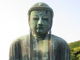
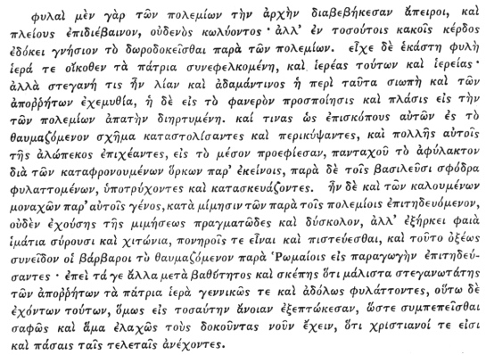

  
[Intangible Textual Heritage](../../index)  [Buddhism](../index) 
[Index](index)  [Previous](chj15)  [Next](chj17) 

------------------------------------------------------------------------

[Buy this Book at
Amazon.com](https://www.amazon.com/exec/obidos/ASIN/B0029LHTGG/internetsacredte)

------------------------------------------------------------------------

  
*The Creed of Half Japan*, by Arthur Lloyd, \[1911\], at Intangible
Textual Heritage

------------------------------------------------------------------------

p. 131

### CHAPTER XIV

Dharmagupta [1](#fn_174)

One of the most important services that
S’akyamuni rendered to his immediate disciples, as well as to posterity,
was to supply them with a set of disciplinary rules of life. This
discipline, known as the *Vinaya*, was not given in any formal manner.
As the occasion arose the Master spoke his mind, and thus, little by
little, during the long years of his ministry, there was formed as it
were a *corpus* of miscellaneous rulings delivered without any definite
plan or system. Yet there was no contradiction among these rulings, for
it was one mind that gave them all, and that mind a singularly
consistent and clear-seeing one.

What the Vinaya rulings lacked in system was, furthermore, more than
compensated by the definiteness which came to them from the fact that in
every case they were based on some real fact or some concrete
difficulty. If the Sūtras—those I mean, such as most of the Agamas,
which can be distinctly traced back to the life of the Master—give us a
true picture of S’akyamuni's life, we cannot but conclude that his mind
vacillated at times between two or more alternative sets of speculative
doctrines. Is there a god? Is there such

p. 132

a thing as a soul? Does the physical universe really exist, or is it all
a mere illusion? On these points he spoke in such a way as to leave his
followers the largest room for speculative differences, and if we are
disposed (not being metaphysicians) impatiently to throw aside the
speculations of Sarvāstivādins, Sautrāntikas, and all the babble of
Hīnayāna sectarianism, if we find it difficult to see how the term
"Buddhism" can be stretched wide enough to cover all the variations of
the so-called Mahāyāna, we must remember that it was the studied
vagueness of the Master's own teaching that gave his followers the
boldness to wander so far afield in the wide daring of their later
speculations.

From all this vagueness of the Sūtra pitaka the Vinaya pitaka was saved.
When the Master gave rules to his communities for the sabbath meetings,
for the confession of sins, for the admission of women, for the
regulation of dress, etc., he was obliged to be terse, clear, and
definite. The Vinaya rules, therefore, give us a more trustworthy
picture of the Master's mind than do any of the Sūtras. They make us
feel that we are dealing with the real Buddha, with the real community
of monks.

It fell to the lot of Upali, the barber, to record, from his memory, at
the orthodox Council at Rājagṛiha, the disciplinary decisions of his
Master, and to form them into a connected whole. His collection met with
favour, was adopted, and for more than a century was the authorized
canon of discipline enforced by the successive Patriarchs—Kaśyapa,
Ananda, Madhyantika, S’ānavaśas, and Upagupta. Upagupta was a
contemporary of As’oka's, and we know from some of As’oka's monuments
that many corruptions had come into Buddhism by then, and that the monks
were beginning to form cliques and

p. 133

schisms and to withdraw from communion with their brethren. Dharmagupta,
Upagupta's successor, whom we place, therefore, somewhere about B.C. 240
or a little later, reformed the Vinaya by a new recitation, [1](#fn_175) and thus withdrew his followers formally
from communion with the others. This, says Gyōnen (p. 343), was the
first schism.

After this the process of sect-forming went on very rapidly, and each
sect feeling itself justified in drawing up a modified discipline of its
own, it was not long before there were twenty disciplines where
originally there had been but one.

We need not stay to inquire what these twenty disciplines were. Only
four of them reached China, and these four were ultimately merged into
one, the survivor being a reformed edition of Dharmagupta's reformed
code. [2](#fn_176)

According to the Dharmagupta system of discipline, a system which is
still largely in vogue in Japan, though the old Vinaya or Ritsu sect has
long ceased to have a separate corporate existence of its own, [3](#fn_177) the faithful here on earth are divided
into seven classes. At the bottom of the scale come (i) the *Ubasoku*,
and (ii) the *Ubai*, laymen and laywomen, who, without leaving their
homes, desire to lead a life of religion. Of these persons it was
required that they should keep the five precepts—not to kill, not to
steal, not to be guilty of any form of

p. 134

lewdness, not to lie, to abstain from intoxicants. Further, on the
sabbath day, [1](#fn_178) the prohibition of
lewdness became the prohibition of even lawful sexual intercourse, and
there were added a prohibition of the use of perfumes and oils, of
dances and spectacular shows, of luxurious couches—of all things, in
short, that might prove an incitement to the passions. To these was
added as a counsel of perfection, not to eat at odd hours.

Above the Ubasoku and Ubai came (iii) the *Shami*, and (iv) *Shamini*,
whom we may call the Buddhist Endeavourers. [2](#fn_179) These persons undertook to keep all the
above rules permanently. They further added a rule which forbade them to
receive gold, silver, or precious objects of any kind; they made a vow,
that is, of Perpetual Poverty. Higher up in the scale came (v) the
*Shiki Shamana*, a higher grade of ascetics, who added what are known as
the Six Doctrines. They would not kill even a mosquito; they undertook
to be scrupulously honest, even in regard to the smallest sums of money;
they would not touch a woman; they would not tell even a white lie; they
never drank fermented liquors; and they never took meals out of hours.

Finally came the full-fledged monks and nuns, (vi) the *Biku*, and (vii)
the *Bikuni*. These, as the Vinaya carne to be influenced more and more
by Mahāyānistic ideas, were looked upon as candidates for the rank of
Bodhisattva, and were consequently called upon to undertake the *Bosatsu
Kai* or *Gusoku Kai*, the rules of the Bodhisattva, or the Complete
Rules.

The Bodhisattva, in the Mahāyāna Conception, is the

p. 135

man who has arrived at the "jumping-off place" of life, if we may so
call it. He might enter into Nirvana if he chose, but he does not
choose. He is freed from the necessity of life and death; there is
nothing to force him back to the monotonous wheel of life; but of his
own free will, and moved by compassion for the ignorance and misery of
his fellow-creatures, he deliberately chooses a continuance of his
earthly existence in order that he may live for others and not for
himself. Such is the by no means unworthy aim that is set before the
Buddhist follower of the Mahāyāna Discipline. [1](#fn_180)

In order to reach to that end the candidate for Bodhisattvaship must
observe a multitude of rules (250 for a man, 348 for a woman), [2](#fn_181) of which we may give the following
summary account, taken, however, from sources posterior to the Wei
period, and representing the system in its fuller developments.

There are four deadly sins for which there is no forgiveness in this
life: sexual intercourse, theft, murder,

p. 136

falsehood. He who commits these sins forfeits all hope of the
Bodhisattvaship for the present. These sins are known as *harai* (Sans.
*Parājikā*).

Another set of sins, thirteen in number, are considered as very grave,
though they do not altogether destroy the spiritual character of the
sinner. They are (i) self-defilement; (ii) coming into contact with a
woman; (iii) slander; (iv) self-praise, with a view to getting an
increase of alms; (v) acting as a go-between in arranging a marriage;
(vi) speaking evil to the clergy; (vii) calumnies against the clergy;
(viii) disobedience to the orders of a religious superior; (ix) exciting
another monk to such disobedience; (x) going to the house of a layman to
cause quarrels; (xi) to disregard the wishes of the community and to
cause divisions. Two more rules (xii and xiii) concerned the building of
a house, with one's own money, or with the contributions of the
faithful.

Another set of offences against the law of Poverty could only be removed
by purificatory ceremonies. These concerned the prohibition of two
coats, the one garment that is always to be worn even at home,
unnecessary dishes, importunity in asking for alms, etc.

Again, others would necessitate a sojourn in Purgatory (*Jigoku*) before
emancipation could be accomplished: white lies, duplicity, digging the
earth, cruelty to animals, intoxicants, meals at unseasonable hours,
etc.

Then followed minute rules for the deportment of the monks and nuns. The
Vinaya sects laid great stress on the observation of these rules, for
they said, again with a certain amount of truth, that if a man would
follow the discipline of Buddha he would come to know of his
doctrine. [1](#fn_182)

The Han translators had spoken only on *Sila*, or

p. 137

\[paragraph continues\] Morality. Anshikao
had translated a Sūtra, said to have been spoken by the Buddha himself,
on "the lightness and heaviness of the sin of transgressing the
*Sila;*" [1](#fn_183) and Ch’ Huen had
translated another which illustrated the Mahāyāna conception of the Sila
by showing how the Bodhisattva (*i.e.* S’akyamuni in his earthly
ministry) had kept the Six Parāmitās, or Cardinal Virtues of the
Mahāyāna. [2](#fn_184) He, whose life was a
pattern for the Buddhist monk, had shown (i) liberality and generosity;
(ii) the morality of self-restraint and chastity; (iii) patience; (iv)
steadfastness of purpose and energy in the pursuit of Truth; (v)
self-collectedness and the power of meditative concentration of self;
(vi) the power of applying to daily life the lessons acquired by the
steadfast and thoughtful pursuit of the truth by a generous and pure
mind.

But the Han translators had apparently been contented with a mere sowing
of Buddhistic seed—another indication of the fact that they were truly
the pioneers of Buddhism. They said nothing about discipline, and they
had made no attempt to introduce into China the order of monks.

The great Han dynasty came to an end in A.D. 214, having held China in
one way or another under its continuous sway ever since B.C. 206. [3](#fn_185) The assassination of the last Han ruler
led to a prolonged civil war, at the conclusion of which we find China
divided into the kingdoms of the Wei, the Wu, and the Shū. Buddhism had
been before the people for several years now—fully seventy, if we reckon
only from the time of Anshikao's

p. 138

mission. Several important events had taken place in China during that
time. Perhaps the most significant was the arrival in China of a Roman
mission which reached Lôyang by way of the sea, in A.D. 166, thus
opening another route to China of which the Indians and Arabs soon
learned to avail themselves.

The gradual desiccation of Central Asia, the process of the drying up of
the waters, which laid waste the fertile plains of Khotan, Ferghana,
Bokhara, and Transoxiana, and which drove forth to more happy lands the
hosts of the barbarians, was in full swing. The Hans in China, the
Kushans in India, were equally concerned in defending their territories
against these dreaded invaders, and many embassies passed between them
during the last half of the second era. It was the age which saw Pao
Chao's noble sacrifice and his victory over his barbarous foes. [1](#fn_186)

After the fall of the Han dynasty and the division of China into three
hostile camps, the Kushans sent no more embassies. It was useless to
appeal for help to the helpless kingdoms of China. The Kushans
themselves had suffered from the inroads of their enemies. In spite of
temporary successes during the first decade of the third century, they
lost ground rapidly and steadily; by 221 A.D. they were confined to
Sind, Punjaub, Kabulistan, and Kashmir. Several of their fairest
Buddhist provinces had been lost, and the hegemony of Hindustan was
passing into other hands. The Andhras were in possession for the time
being; the rise of the Imperial Gupta Dynasty was already a "coming
event."

The short-lived Chinese kingdom of Shū has no

p. 139

importance for the Buddhist historian. It contained within its
boundaries no already established centre of Buddhist teaching, and
apparently attracted no missionaries. The southern kingdom of Wu will
require a special note; [1](#fn_187) to the
translators of the Wei dynasty (A.D. 220–265) I will devote a few words
as a fitting conclusion to this chapter.

There are only five names, responsible for seven Sūtras, and there are,
besides, two Sūtras by unknown hands. Of the five men, two (Thân-ti and
Ân-fah-hien, A.D. 254) come from the country of the Ânsi, *i.e.*
Parthia, one (Po-Yen) from the Western Regions (Khotan), one
(Dharmakâla) from Central India, and a fifth (Sanghavarman) from India
*viâ* Thibet, or *vice versâ*. Three of these men brought with them the
Vinaya of the Dharmagupta School, which I have been explaining in this
chapter, and thus laid the foundation on which in later years the
Chinese and Japanese orders of monks were erected.

Of other subjects, outside of the Vinaya, they give us two volumes of
the dialogues of which Buddhists are so fond, the Questions of Ugra (No.
23) and those of Surata (No. 43), a translation of the Sūtra of the
Great Decease (No. 5, now lost); one on the Names and Surnames of the
Seven Buddhas (No. 626); a treatise on Immortality as contained in the
Abhidharma (No. 1278), and three translations of the Sukhāvatī Vyūha, of
which only Sanghavarman's (No. 27) has survived.

It says much for the opinion that the Doctrine of Faith in Amitābha is
the true representative of the

p. 140

\[paragraph continues\] Japanese
Mahāyāna. [1](#fn_188) We have already seen it
dimly in As’vaghosha; we have seen Nāgārjuna learning it from the Nāga
chieftain. In A.D. 147 the book containing that doctrine is taken to
China; before A.D. 250 *five* versions of that book had been made. It
looks as though the Han and Wei missionaries were using the historical
S’akyamuni as a means whereby to point men to the unhistorical Amitābha
and his spiritual son, in whose story there lies enshrined the essence
of the story of man's redemption as preached by St. Paul. The story of
Amitābha was needed by those early missionaries of the faith of
S’akyamuni to give life to the otherwise dead rules of the Dharmagupta
Vinaya. Its historical counterpart is now changing and quickening the
dead bones of Japanese Buddhism and preparing the way for what will be
one of the most remarkable conversions in the religious history of the
world.

From the fall of Han in A.D. 220 to the rise of the Tang in A.D. 618,
China was rarely united. For the greater part of this period of four
centuries, two, three, four, even five or more dynasties ruled side by
side, as rivals and competitors, within the empire. It is almost
impossible to write a history of the China of the fourth and fifth
centuries; it is still more difficult to give anything like an adequate
description of the religious policy of the conflicting states, or to
trace, step by step, the gradual growth or decline of Buddhist doctrines
in the whole empire during this period.

Some of the dynasties were influenced mainly by the

p. 141

literati, who were, to a man, the followers of Confucius, and the
enemies of everything that called itself a religion of the supernatural.
Others, again, were Taoists from conviction, and others Buddhists or
Taoists from conviction or policy. Occasionally attempts were made to
unite these conflicting faiths. Thus we have, about A.D. 240, an attempt
at unifying Confucianism and the Mahāyāna, by introducing the images of
the *Wuti*, or Five Rulers (*i.e.* the five Dhyāni Buddhas), into the
Temples of Confucius, made without success. An equally unsuccessful
attempt forcibly to effect an amalgamation of Buddhism with the religion
of Tao, in A.D. 555, was probably the measure which gave to the Japanese
a few years later the idea of the *Ryobu-Shinto*, or amalgamation of
Buddhism with Shinto, which lasted until the restoration of Meiji.

India, in the meanwhile, was undergoing many a political and religious
convulsion, and the monks, persecuted by the Brahmans at home, took
refuge in China, bringing with them each the books that had affected him
in his native land, and translating them into Chinese for the benefit of
the native peoples. It is interesting to turn over the leaves of the
Appendix to Nanjo's Catalogue and analyse the lists of translators by
dynasties, by books, and by the countries from which they came. Thus the
translators of the *Wei* dynasty, which ruled at Lôyang from 220 to 265,
come either from Central India or Parthia, but all bring with them the
Vinaya books of the Dharmagupta sect of the Hīnayāna. Under the *Wu*
(222–280) at Nankin, we get none but Central Indian monks, and scarcely
any but Hīnayāna books, or at least books which, like the Dharmapada,
belong equally to both Vehicles. The Western Tsin at Lôyang (265–316),
with Dharmaraksha, as *facile princeps* of the band, give

p. 142

us mostly theological treatises of the Mahāyāna, from the pens of
translators who come from Ansi, Khotan, and the western provinces of
China proper. The former Lian, with capital at Kutsan (302–376), furnish
but one book, translated by a man from the Yuetchi country. The Eastern
Tsin (at Nankin, 317–420) give us a long list of translators from Kabul,
Kharachar, Central Asia—one of them a descendant of S’akyamuni's
uncle—and some translate works of a practical rather than a religious
character: spells for relieving toothache, bad eyes, crying babies, and
people suffering from summer sickness. [1](#fn_189) The Lian (502–557) at Nanking have
translators who come by sea from Siam. It would be unprofitable to
continue this list any further. Suffice it to say that books came in by
the thousand, representing all the conflicting schools of Buddhist
thought, and hailing from every country, north, west or south, in which
Buddhism was represented. Buddhism itself almost died under the weight
of its own books, and of the institutions which it had brought with it
from India.

Several practical reforms ought to be noticed. In A.D. 335 a monk named
Buddhoganga persuaded King She-hu of the Posterior Chow dynasty to
institute ordinations and allow Chinese natives to take monastic
vows. [2](#fn_190) This permission greatly
changed the nature of Chinese Buddhism. In India it had been the custom
for kings to support the Order by their royal bounty, and the custom
obtained at first in China also, thus keeping the Order as an exotic and
aristocratic institution. But when Chinese natives took the vows, the
Order increased very rapidly, and Buddhism became a thing belonging to
the people rather than to the sovereign.

p. 143

In A.D. 401, Kumarajīva was brought to China, and was welcomed at
Chang-an by the sovereign of the Latter Tsin Dynasty. Kumarajīva
suggested, and carried out, a revision and retranslation of the older
works, some of which had been but roughly translated by the earlier
missionaries. This secured a large measure of popularity for the revised
versions of the Tripitaka. In 520, Bodhidharma, the then patriarch of
Mahāyānism, left India and came to China to avoid the persecution of the
Brahmanists, where, finding the block of literature, he swept the whole
of the Tripitaka aside, declaring that the essence of Buddhism is to
find the "heart of Buddha" by meditation, as Buddha himself had done. In
399, Fahian started on a journey to India, to investigate Buddhism at
its fountain-head.

It is noteworthy, says M. Ch. Pithon, in an article in the *China
Review* (vol. xi.), on the History of China under the Tsin Dynasty, that
the Posterior Chow and the Tsin, who did so much for Chinese Buddhism,
were really Huns, and ruled over a large proportion of Hiungnu subjects.
The Huns all over the world stood by one another, and the chief of all
the Huns was Attila (A.D. 445), whose word was law from the frontiers of
Gaul to those of China. How much of Buddhist teaching came into
Christian folklore and superstition through Hunnish soldiers in the
regiments of Attila, it would require a large treatise to
investigate. [1](#fn_191)

In 372 a Chinese monk preached Buddhism in the

p. 144

\[paragraph continues\] Korean kingdom of
Koma, or Kaoli, and thus at length, after a long and eventful history,
the Way was brought to Japan in the year 545 A.D.

------------------------------------------------------------------------

### Footnotes

[131:1](chj16.htm#fr_175) I take this chapter
mainly from Gyōnen's sketch of the Eight Buddhist Sects in Japan
("*Revue de l’Histoire des Religions*," vol. xxv. p. 341).

[133:1](chj16.htm#fr_176) The Sacred Books had
possibly not yet been committed to writing; they were orally recited,
and the oral recitation must have been a frequent cause of inadvertent
error.

[133:2](chj16.htm#fr_177) These four were: (a)
*Jūbunritsu*, the Vinaya (in Ten Recitations) of the Sarvāstivadins; (b)
*Shibunritsu* (Four Recitations), of the Dharmaguptas: (c) *Gobunritsu*
(Five Recitations), of the Mahis’akas; and (d) *Sōritsu*, the Vinaya of
the clergy.

[133:3](chj16.htm#fr_178) Early in the Meiji
era the Government forced the Ritsu sect to amalgamate itself with the
Shingon.

[134:1](chj16.htm#fr_179) The observance of the
weekly sabbath was one of the primitive features of Buddhism. The
Buddhists of Japan are beginning to observe the day; perhaps in time to
come they will do so still more.

[134:2](chj16.htm#fr_180) The Sanskrit word
*S’ramana* has the idea of "endeavouring."

[135:1](chj16.htm#fr_181) It must be remembered
that there are two kinds of Bodhisattvas and Buddhas—human and
superhuman. *Ningen no uchi ni mo Hotoke ga ari, Bosatsu ga aru. Ningen
igwai ni ni mo Hotoke ga ari, Bosatsu ga arimasu*. The superhuman
Bodhisattvas, such as Avalokiteśvara and Mahāsthāmaprāpta, have no human
history; they are essentially extra-human and unborn, and, though they
may from time to time assume human or other forms, are incapable of
death. But S’akyamuni is the example *par excellence* of a human Buddha
or Bodhisattva. After his Enlightenment he might have passed at once
into his Nirvana of Rest; but for the sake of suffering humanity he
remained where he was. During the whole of his ministry he was a
Bodhisattva, with power to lay down his life and to take it again
whenever he chose. At his Nirvana he became a Buddha. The Japanese use
the phrase sokushinjōbutsu, "'attainment of Buddhahood in the present
body," to describe the state of the Bodhisattva who "need not return
again" (*fu tai ten*).

[135:2](chj16.htm#fr_182) The 250 *Bosatsu Kai*
are explained in the Bommūkyō (Brahmajālasutra).

[136:1](chj16.htm#fr_183) See Nanjo, "Twelve
Buddhist Sects," p. 20.

[137:1](chj16.htm#fr_184) Nanjo, "Cat. Trip.,"
No. 1112.

[137:2](chj16.htm#fr_185) *Ibid*., No. 435.

[137:3](chj16.htm#fr_186) The Former or Western
Han were in power from B.C. 206 to A.D. 25; the Latter or Eastern Han
from A.D. 25 to A.D. 214.

[138:1](chj16.htm#fr_187) Pao Chao's wife and
mother fell into the hands of the barbarians, who placed them in the van
of their army, and threatened to put them cruelly to death unless Pao
Chao withdrew his forces. Pao Chao was in great distress, but the
exhortations of his wife and mother prevailed, and he resolved to do his
duty by his country.

[139:1](chj16.htm#fr_188) It was from the
kingdom of Wu that Japan obtained its first acquaintance with Chinese
letters, and especially with Confucianism. To this day the ordinary
pronunciation of Chinese words in Japan is called *Go-on*, the *Wu
pronunciation*. The Buddhists have a pronunciation of their own, known
as *Kan-on*, "the pronunciation of Han," *i.e.* Northern China. The
numbers are from Nanjo's Catalogue.

[140:1](chj16.htm#fr_189) The Japanese and
Chinese Vinaya sects afterwards adopted Vairoc’ana as their central
deity, and it was for this reason that they were forced to join
themselves with the Shingon. But Vairoc’ana and Amitābha are in idea
identical. They both represent, in idea at least, the "Son of
Righteousness with healing in His wings," preached to the Far East by
Gnostics who used Buddhist terminology.

[142:1](chj16.htm#fr_190) In the popular
*Buukkyōgimon Kaitōshū*, vol. iii., there is an exposition of several of
these short "spell-sūtras."

[142:2](chj16.htm#fr_191) This I touch on again
in my chapter on Heian Buddhism.

[143:1](chj16.htm#fr_192) The annexed quotation
may possibly throw some light on these Buddhist ordinations. The reader
will remember that the period with which we are now dealing was the
period when Europe was being overrun by barbarian hordes from Central
Asia. Eunapius, "Historia," pp. 82–83 (in "Scriptores Historiæ
Byzantinæ"), has an interesting paragraph relating to this subject. It
deals with the year 376, and speaks about the Goths. If these are to be
identified with the Yuetchi, they may (must?) have been Buddhists before
entering Europe. (See Flinders Petrie on "Migrations" in *Journal of
Anthropological Inst.*)

 

In the above extract, note (i) that the religion is τὰ πάτρια ἱερά, a
faith brought with them from Central Asia; (ii) that the institution of
quasi-bishops seems to be spoken of as a recent innovation, and that it
corresponds in point of time with what we know of Chinese ordinations';
(iii) that black (φαιός) suits what we know of Shinshū and Jōdo monks;
(iv) that it corresponds with what we know from other sources about the
confusion between Buddhist arhats and Christian "saints." The object of
the ruse was to deceive the Romans into believing that the barbarians
were already Christians. The work of Ulfilas came later, at any rate in
its influence, and his institutions could not be described as being
"ancestral rites" of the Goths.

------------------------------------------------------------------------

[Next: Chapter XV. Manichæism](chj17)
