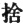
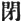
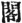
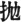
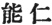

  
[Intangible Textual Heritage](../../index)  [Buddhism](../index) 
[Index](index)  [Previous](chj26)  [Next](chj28) 

------------------------------------------------------------------------

[Buy this Book at
Amazon.com](https://www.amazon.com/exec/obidos/ASIN/B0029LHTGG/internetsacredte)

------------------------------------------------------------------------

  
*The Creed of Half Japan*, by Arthur Lloyd, \[1911\], at Intangible
Textual Heritage

------------------------------------------------------------------------

p. 307

### CHAPTER XXV

“Risshō Ankoku Ron”

The "Risshō Ankoku ron" is the title of
Nichiren's essay which, being presented to the Kamakura Regent, brought
down upon its author all manner of persecutions and troubles. It was
Nichiren's warning against the evil courses which were bringing his
country to decay. It has by no means ceased to have its prophetic value
in the present day. I have, during the last few months, met with two new
editions in Japanese of this essay, which, so the Nichirenists tell us,
is as applicable to the Japan of to-day as it was to the Japan of
Nichiren's time. The essay has, to the best of my belief, never been
translated into any European language up to the present.

It is in the form of a dialogue. The reader must imagine the master of a
house, who must be Nichiren himself, seated before his books in his
study. The house is probably the hermitage which Nichiren built for
himself among the sandhills behind Kamakura, where he gathered round him
his earliest disciples, and where he actually composed this historic
treatise. To him comes in a visitor, who at once plunges into the
subject that lies nearest to his heart.

*The Visitor*. We have seen many signs in heaven and in earth:—a famine,
a plague; the whole country is filled with misery. Horses and cows are
dying on the roadsides, and so are men, and there is no one to bury
them.

p. 308

\[paragraph continues\] One half of the
population is stricken, and there is no house that has escaped
scot-free. [1](#fn_415)

Hence many minds are turning to religion. "A sharp sword is the Name of
Mida," [2](#fn_416) say some, and turn in
prayer to the Lord of the Western land, whilst others take up the magic
charms and formula against disease, which belong to the Lord of the
Eastern Quarter. [3](#fn_417) Others, again,
comfort themselves with the thought that disease is but a short-lived
phenomenon, that old age and death are but phantasies, and stay
themselves with the comfortable doctrines of the Hokke Truth. [4](#fn_418) Others, again, say that "the seven
troubles come merely as a matter of rotation, soon to be succeeded by
the seven forms of prosperity," [5](#fn_419)
and with this thought they set themselves to the details of countless
services and litanies. Others, again, in accordance with the doctrines
of the Secret Shingon, [6](#fn_420) use copious
sprinklings of Holy Water from the

p. 309

five vases. Then, again, some enter into ecstatic meditation, and calmly
contemplate the truth free from all care. [1](#fn_421) Some write the names of the Seven gods
of luck [2](#fn_422) on pieces of paper, and
affix them by the hundreds to the doorposts of their houses, whilst
others do the same with the pictures of the Five Dairiki [3](#fn_423) and the various (Shinto) gods of Heaven
and Earth.

In other parts of the country the lords are in fear. They remit taxes
and govern their people with benevolence. But let men do what they will,
the famine and the plague still rage, there are beggars on every hand,
and the unburied corpses line the roads.

Now, Sir, when we see Sun, Moon, and Stars go on in their courses, when
the Three Treasures (of Religion) continue to be respected, and when
kings rule peaceably, we know that the world is not going to come to an
end. But look around at the misery of the age, at the decay of Buddhism.
What can be, think you, the cause of all this?

*The Master*. That is just what I have been moaning

p. 310

about to myself. I see that our thoughts are running in the same
channels. Pray forgive me if I enlarge on this topic.

When a man embraces the Buddhist religion he expects that his religion
will be a means of obtaining Buddhaship; but, at the present day,
neither does the power of the gods manifest itself, nor are there any
signs to be seen of men attaining Buddhaship. When I look around me, my
foolishness fills me with doubts about the future, when I look up to the
sky I am filled with resentment, when I contemplate the earth I see
matter for earnest thought. But when I come to examine things more
closely [1](#fn_424) in the light of the
Scriptures, I find that the whole world is in rebellion against what is
right, and that men have universally become the slaves of evil; further,
that on account of this not only have the good deities left the country,
but even the saints abandon the place and refuse to come back to it.
Evil spirits and demons have come to take their places, and calamities
and sorrows have befallen us. These are matters that we cannot help
speaking of, and that we can but fear.

*The Visitor*. I know that I am not the only one that bewails the
sorrows of the Empire [2](#fn_425) and the
miseries of my country. But I have never before heard the suggestion
made that the gods and the saints were forsaking the country, and that
demons and evil spirits were taking their places. Please tell me what
Scriptural proof have you for your statement?

*The Master*. The proofs are many and most varied. For instance, it is
said in the "Konkōmyōkyō," [3](#fn_426)
"Although this

p. 311

\[paragraph continues\] Sūtra exists in
the land, it has no proper power or influence, for the people are
backsliders at heart. They do not wish to hear it read, they do not
offer it worship, nor respect, nor reverence. Neither are they able to
pay proper respect and homage to the men of the Four sections when they
see them. For this reason both we [1](#fn_427)
and our families and all the hosts of heaven have lost our proper
dignity and power; for men close their ears to the deep mysteries of the
Sūtra; they turn with aversion from the sweet dew (of religion), and get
out of the current of the stream of true Buddhism.

"These men cherish the causes of evil, they do despite to men and
angels, they fall into the river of life and death, and wander from the
road of Nirvana. Therefore, O world-honoured One, we, the Four Kings,
and all our followers, with the Yashas and others, seeing these things
taking place, shall forsake that country and cease to act as its
protectors. And not only shall we forsake the king, but all the good
deities whatsoever, that are the guardians of the land, will depart from
it. When this forsaking shall have been accomplished then shall many
calamities befall this land, so that it shall entirely lose its dignity
and self-respect. Its people shall lose their virtuous minds and become
criminals and malefactors, they shall rage against one another, they
shall slander one another, and even wag their tongues against the
innocent. There shall be plagues and comets; two suns shall appear
simultaneously in the sky, with disturbed courses; [2](#fn_428) two-coloured rainbows, black and white,
shall be seen with distressful omens; there shall be falling stars and
earthquakes, and

p. 312

voices shall come forth from wells. Storms and hurricanes shall come out
of their due seasons; there shall be constant famines, and the rice
shall perish even in its tender shoots. Brigands shall invade the
country from foreign lands, and plunder it. The inhabitants shall suffer
all manner of evils, and peace and comfort shall not be found there."

\[Similar prophecies relating to the condition of the world in the days
when Buddhism shall have perished are given from various Sūtras of the
Mahāyāna. They differ from the one I have reproduced only in minor
details. I therefore omit them here, and pass on to the conclusion of
the Master's speech.\]

These Sūtras put the case very clearly, and there can be no doubt as to
their meaning. But men's ears are deaf and their eyes blinded: they
believe in the corrupt teaching because they want to believe it, and
they have lost the power to distinguish between truth and falsehood. In
short, the whole world has departed from Buddha and the Holy Scriptures,
and there is no desire to protect them. Can you wonder that the good
deities and the saints should forsake the land, and that evil spirits
and heretics [1](#fn_429) should bring about
calamities and distress?

*The Visitor* (changing colour). The Emperor Ming-ti of the Later Han
Dynasty understood the meaning of the vision of the Golden Man, and
accepted the teaching that was brought to him on the White Horse, and
our own Venerable Crown Prince, [2](#fn_430)
when he had defeated the rebel Moriya, built temples and pagodas in our
land. Ever since that time every one, from the Emperor down to the
lowest of the people, has reverenced Buddhism and paid respect to the
Scriptures. The great temples, Enryakuji, Kōfukuji,

p. 313

\[paragraph continues\] Onjōji, Tōji, and
others, erected in all parts of the land, bear witness to the continuity
of the Faith; copies of the Scriptures are as plentiful as the stars in
the firmament, and the overhanging roofs of the temples are like a
protecting cloud over the land. The sons of S’ariputra [1](#fn_431) still set their faces to the Vulture's
Peak; the disciples of Kakuroku still preserve the holy garments and
vessels of S’akyamuni. How can you say that the traces of the Three
Precious Things have disappeared, and despise the teaching of the
present day? If you have any proof for your assertion, please show it
me.

*The Master*. Quite true. Temples are very plentiful, and there is an
abundance of sacred books. Buddhism has never lost its outward
succession of preachers and adherents. But the priesthood is so corrupt
that they lead men away from the paths of virtue, and the rulers are so
ignorant that they cannot distinguish good from evil. Hear what is said
in the Sūtra of the Merciful King (Ninnōkyō): "Evil monks, whose
thoughts are on their own aggrandizement and wealth, preach doctrines
which are destructive of religion and social order; princes and rulers,
whose minds are ignorant and who cannot tell right from wrong, issue
decrees and ordinances which are not after the Law. When these things
come to pass, religion perishes and the country is brought to
confusion." Again, it is written in the Sūtra of the Great Decease: "The
Bodhisattva need not fear the rutting elephant: but evil knowledge is a
thing to be dreaded. The rutting

p. 314

elephant can kill the body, but the soul may be saved: the evil
knowledge which comes through bad friends will cast a man's soul into
hell." [1](#fn_432) The same thing is said in
the Saddharma pundarika Sūtra, [2](#fn_433) and
there is a passage in the Sūtra of the Great Decease which tells us that
when, at the end of the Period of the Upright Law, all the saints shall
have entered into Nirvana, there will be monks, in the period of Image
Law, who shall recite the Sūtras only as a means of gaining a
livelihood; who, although wearing the monkish *Kesa*, [3](#fn_434) shall be like hunters in search of prey,
like cats watching for mice. Pretending to be wise and righteous, they
will be full of jealousy and covetousness. Through them will the way of
Buddhism be evil spoken of.

Now, sir, when I look round me at the world, that is exactly what I see.
How can I help speaking my mind about the wickedness of the monks?

*The Visitor* (angrily). I assure you you are wrong. Wise kings rule
over their countries according to the eternal rules of Heaven and Earth;
holy men bear rule by showing them the differences between right and
wrong. By virtue of his being a holy man, it is the office of a priest
to exercise influence in the State, and none but a good man

p. 315

ever gets the respect and reverence of ruler and people, however great
may be his merits in other respects. But we see in our country a
continued succession of wise men and saints who have been venerated by
the people, and we may infer that the fact that they have been so
venerated shows that they were deserving of reverence. Why, then, do you
speak evil of dignities, and say that they were bad monks 2

*The Master*. In the reign of Gotoba (A.D. 1184–1196) there was a monk
of the name of Honen, who wrote a book called the "Senchakushū," in
which he abused the holy teachings of the age, and misled men by the
thousands. Now this man, basing his arguments (*again I abbreviate*) on
a mistaken interpretation of Nāgārjuna's writings, in which he follows
Dōshaku, Donran, and Zendō, [1](#fn_435) his
predecessors in heresy, divides Buddhism into two gates, the gate of
Holy Practices, and the gate of Faith in the Pure Land, and advises all
men, in this age of decay, to embrace the latter. As to the other forms
of Buddhism, and as to the other Sūtras, including even the Saddharma
pundarika and the Sūtras of the Shingon tradition, he uses four words to
describe what should be our attitude towards them. "Give them up," he
says, "close the books, lay them aside, fling them away." [2](#fn_436) By means of this doctrine he has misled
thousands of his followers, both lay and clerical.

p. 316

Now, this teaching is in direct contradiction to one of Amida's
Vows, [1](#fn_437) as contained in the three
Pure Land Sūtras in which alone he puts his trust. I mean the Vow that
Amida takes to "clear away the five obstacles to the truth, and to
remove the abuses of true Buddhism." It is in contradiction, likewise,
to the teachings of the "whole life according to the five
periods." [2](#fn_438) It can lead its author
nowhere but to the lowest hell. We live in an age when saints are few;
there are not many that can discern the dangerous nature of these
teachings. Woe unto them! They do not smite the offender. Woe, woe! they
acquiesce in the propagation of a false faith. From the princes and
barons down to the common people, every one is now saying, that there
are no Scriptures but the Three of the Pure Land, and no Buddha but the
Triune Amida. [3](#fn_439) But in ancient days
it was not so. The teachings which famous priests, [4](#fn_440) such as Dengyō, Gishin, Jikaku, and
Chisho, brought with them from over the seas were revered by all the
people. Mountains, rivers, and valleys were consecrated by the erection
of sacred images of the Buddhas, and pilgrims flocked from all parts to
worship at these holy places. S’akyamuni and

p. 317

\[paragraph continues\] Yakushi
Nyorai, [1](#fn_441) Kokūzō and Jizō, duly
reverenced, bestowed peace after death upon their worshippers. Princes
and nobles were generous in finding endowments for temples, and the
services were frequent and reverent. And then came Hōnen, who turned
away from his master, rejected his disciples, and bade men worship none
but the Buddha of the Western land.

Hōnen pushed aside the Nyorai of the Eastern Quarter, [2](#fn_442) he exalted only the four volumes
containing the Three Books of the Pure Land, and threw away the whole
sacred Canon of the "Whole Life in Five Periods." As a consequence of
his preaching, men refused to make contributions to temples that were
not dedicated to Amida, and forgot to pay their tithes to priests who
were not of the Nembutsu. Thus temples and halls have fallen into ruin,
so that for a long time they have been uninhabitable, and many cloisters
have fallen into disrepair, and are covered with rank vegetation on
which the dew lies thick and undisturbed. But none heeded the ruin of
the temples, none would repair or give support; and therefore the
priests who lived there, and the deities who protected the people, have
left the temples and refuse to return. For all this who is to blame but
Hōnen and his Senchaku?

Woe, woe! During the last thirty or forty years, thousands of people
have been enchanted and led astray, so that they wander in Buddhism as
men without a guide. Is it not to be expected that the good deities
should be angry when men depart from the truth? Is it not natural that
evil spirits should make the most of their

p. 318

opportunities, when they see men forsake justice and love unrighteous
deeds? It is better far to exert ourselves to stay an impending calamity
than to repeat the vain Nembutsu.

*The Visitor* (changing colour). Since the time when our true teacher
S’akyamuni preached the Three Sūtras of the Pure Land, [1](#fn_443) we have had a succession of teachers
elaborating this theme. Donran Hōshi preached much on the Four
S’āstras [2](#fn_444) and devoted himself
solely to the subject of the Pure Land; Doshaku ceased to think about
the great work of the Nirvana, and gave himself wholly to the service of
the Western Direction; Zendō laid aside all miscellaneous devotions to
concentrate himself upon this special worship; Genshin organized (within
the Tendai) a society of Nembutsu worshippers whose faith rested on many
Sūtras. All these men worshipped Amida. Were not their labours blessed
to the salvation of many? (*Ōjō nō hito sore ikubaku zo ya?*)

Again, you must remember that Hōnen Shōnin, as a young man, went up
Mount Tendai (*i.e.* Hieizan), where he read through sixty volumes [3](#fn_445) of Sūtras, though he was but a young
man, and mastered the principal doctrines of all the eight sects. He
read the Sūtras through, seven times in all, and no commentaries or
biographies escaped his attention. His knowledge was as bright as the
sun,

p. 319

and his virtue was higher than that of any of his predecessors. Yet he
lost his way in Buddhism, and could not lay hold of Nirvana. Then he
studied more diligently and meditated more profoundly than he had ever
done before, and at last, throwing aside the Sūtras, he devoted himself
to the invocation of Amida's Name. This he did by revelation, [1](#fn_446) having been commanded to hand down to
posterity the practice of the Nembutsu.

Men spoke of him as an incarnation of Seishi, or that he was Zendō come
to life again, and crowds of all ranks and of both sexes flocked to his
sermons. His doctrines have now stood the test of many years, and yet
you presume to set yourself up against the authority of S’akyamuni, and
to deride the faith in Amida.

Why do you lay on the august administration the blame for the
misfortunes of recent years? And how do you dare to abuse the teachers
and saints of the preceding ages? You are blowing hair to find a wound;
you are cutting the skin to make the blood flow. [2](#fn_447) I have been astonished at the violence
of your language, and I advise you to be cautious and to fear, lest
trouble befall you. Even now it is risky to be seen speaking to you.

(Rises from his seat, takes his cane, and prepares to leave the house.)

*The Master* (detaining his visitor, and smiling). A

p. 320

bitter taste and a bad smell are nothing when we are used to them. But
when you are not used to a thing you are apt to be troubled by it. When
you hear truth for the first time you think it is falsehood; you mistake
a rogue at a first glance for a saint, and a true teacher for a false
prophet. But let me explain the whole matter to you. When our master
Shaka was preaching the Sūtras of his whole life arranged according to
the Five Periods, he preached his doctrines in a consecutive series so
that he might the more easily distinguish the apparent Truth from the
Absolute. [1](#fn_448) Donran, Dōshaku, and
Zendō, however, seized hold of an Apparent Truth, and forgot the
Absolute Truth that was yet to come. They did not understand the whole
Truth of Buddhism. Hōnen was worse than they, for instead of merely
following, he went beyond them, and advocated the giving up, closing,
laying aside, and flinging away of all the many thousand works of the
Mahāyāna Scriptures, as well as of all the innumerable Buddhas,
Bodhisattvas, and gods. And it was by such preaching that he deceived
the people. [2](#fn_449)

p. 321

But in all this he was preaching, not Buddhism, but his own private
opinions. He was a deceiver (*mōgo*) and blasphemer (*akku*) such as we
have but seldom seen hitherto, though now there are many of them, and it
is a great pity that so many people should be captivated by his
preaching and admire his Senchaku. The Books are now neglected, for no
one reads anything but the three Sūtras of the Pure Land; it is all the
Buddha of the Western Paradise now, and the other Buddhas and Saints may
go hang! A man like Hōnen can only be termed the pronounced enemy of the
Buddhas, of the Scriptures, of the Saints, and of the common people. It
is a terrible calamity that this heresy should have spread so widely.

You found fault with me just now for laying the blame of our recent
calamities on the shoulders of the present administration. I have been
afraid of the consequences myself, but allow me to give you a few
historical examples to prove my assertion. \[The historical examples are
taken from China, and are intended to prove that when a Government
neglects to promote the interests of true religion the country always
has to suffer for it. The most striking instance is that of the troubles
from invasions by barbarians which followed the Tang Emperor Wutsung's
attacks on Buddhism in the seventh century A.D.\] Hōnen himself lived
during the administration of Gotoba; [1](#fn_450)

p. 322

we cannot find, even in the history of the Tang, a more striking
instance than that. Please do not doubt or wonder at what I say. It is
our duty to turn from wickedness and to follow after justice; to check
wickedness at its source, and cut evil at the root.

*The Visitor*. I catch your drift, though I do not fully understand your
meaning. I would, however, suggest that Buddhism is a wide topic, and
that there are many ways of looking at it. By the way, have you ever yet
presented a memorial to the authorities on this matter? Until you have
done so, you, a man of the middle classes, have no right to speak as you
do.

*The Master*. It is quite true. I am an insignificant person. Still, I
have some knowledge of the Mahāyāna, and I know that a fly can ride a
thousand miles on the tail of a racehorse, and that ivy can climb a
thousand feet with the help of a pine tree. I am the servant of the
Buddhas, and owe them fealty. How can I help being grieved when I hear
the ruin of my Faith 2 It is said, in the Sūtra of the Great Decease,
that if a monk sees a man injuring Buddhism and fails to reprove him, he
is a worthless brother; but that if he speaks up and reproves him, he is
a true brother. I am scarcely worthy to be called a monk, yet I am
trying to do my duty.

Are you aware that during the year of Gennin (1224–5) the monks of the
Enryakuji and Kōfukuji [1](#fn_451)
memorialized

p. 323

the throne on the subject of the punishment of Hōnen; and that, in
consequence, the plates from which the Senchaku was printed were
forfeited, and publicly burned as a thankoffering for the mercies of the
Buddhas of the Three Worlds? Did you know that Inujin-nin of the
Kanjin-in [1](#fn_452) was ordered to destroy
the tomb of Hōnen? Or that Hōnen's disciples, Ryukwan, Shōkō, Jogaku,
and Sassho, [2](#fn_453) were sent into exile
and have not yet been pardoned? I don't think you can say that the
authorities have not been memorialized on the subject.

*The Visitor* (somewhat mollified). I quite agree with you that Hōnen
did advise his disciples to have nothing to do with the Sūtras, or with
the other Buddhas and Bodhisattvas. What he always impressed upon his
disciples was that they ought constantly to pray to Amida, and if men
would always pray, the country would be at peace. The peace of the
country is what we all desire. I cannot see how it can be the duty of
the Government to put these people down.

*The Master*. I am not speaking from my own wisdom. I can but repeat
that which I find in the Sūtras. And there I find the doctrine laid down
most clearly. I cannot quote all the instances; I will give a few.
\[Here follow various instances from Sūtras in which the doctrine is
laid down that the extirpation of heretics with the sword is the duty of
every right-minded Government. S’akyamuni is brought in in one case as
relating that in a previous existence, when he was the king of a country
in Southern India, he had once slain a Brahman for speaking evil of
Buddhism. But he had not suffered for his crime

p. 324

in hell, because the Brahman was a heretic, and the killing of a heretic
is no murder. [1](#fn_454)\] Thus Buddha
provided for the preservation of his doctrines. But these men, the
slanderers of Buddhism, have departed from the true ways. They have made
graven images of Honen himself, and have carried his impious opinions
from one end of the Empire to another. They have mutilated the images of
Shaka, and placed Amida in his stead. They have removed Akshobya from
his seat, and placed thereon the Lord of the Western Paradise. They have
ceased to copy out and reverence the Scriptures, and their zeal is only
for the Three Books of the Pure Land. They refuse to hear the lectures
of Tendai Daishi, [2](#fn_455) and have ears
only for those of Zendō. Woe be to this people. They disregard the
warnings of S’akyamuni, and listen to the foolish words of the false
prophets. If a man wish to secure the peace of the country, let him
first begin by bridling the slanderers of Buddhism.

*The Visitor*. But is it necessary to punish with death such
transgressions against religion? Do the Sūtras you quote bear you out in
this? Is not such a punishment in reality a murder, and is not murder a
sin? I find it written in the *Mahāsampāta Sūtra*, that "when a man
shaves his head and assumes the monk's cowl, whether he keep the
commandments or not, he is one whom angels and men should reverence, for
he is a son of Mine. To

p. 325

thrash him is to thrash a son of Mine, to revile him is to revile Me."
Now, is it right for me to grieve the heart of our Great Father by
injuring his sons? The man who attacked Maudgalyāyana fell into the
lowest hell, and Devadatta, for the murder of an ecclesiastic, suffered
long and continued torments. I cannot accept your doctrine, I cannot
agree with your views. You may perhaps be able to prevent men from
slandering the law of Buddha, but you will only do so by violating the
Precepts.

*The Master*. After all that you have heard, after all my quotations
from the Scriptures, do you still hold this position? Can you not
perceive the truth of my arguments? I am talking about the hatred we
should have for the slanderers of Buddhism: I am putting no limitations
on the sons of Buddha. Beheading was the punishment assigned by the law
of Buddhism before Shaka's times; the principle of the Sūtras since
Nōnin has been only so accommodate the principles of the primitive faith
to the prejudices of later ages. [1](#fn_456)
If only all classes of people everywhere in the country would unite in
abjuring error and following that which is righteous and true, what
trouble or misfortune could happen?

*The Visitor* (composedly). Buddhism is a very wide subject. It embraces
a very wide range of opinions, some of which are very obscure, so that
it is hard to discover the exact meanings. Hōnen's Senchaku is still in
circulation, despite its condemnation, and the entire rejection of the
Scriptures, of the Buddhas and Bodhisattvas, is still being preached.
You have given me Scriptural authority for your assertion that, under
such circumstances,

p. 326

saints and good deities will forsake the land, and I am more than half
convinced by your arguments. And it is my sincere desire that the
country henceforth may be peaceful and happy, from the sovereign on the
throne to the lowest classes of the people. If we cease paying reverence
to a single heretic, and, instead, reverence the mass of the priesthood,
we can, I think, calm the white waves on the sea of Buddhism and clear
its mountain-sides of scrub, so that our land will compare with the
happiest periods of Chinese history, and men shall rightly appreciate
the good points of Buddhism by noting its depths and its shallows.

*The Master* (highly gratified). Ah! A dove transformed into an eagle, a
sparrow into a clam! This is delightful. You have come here and have
been enlightened. It is true: if men will consider our misfortunes in
this light, and will believe the words of Scripture, then the storms
will abate, and the billows settle down, and the harvest be plenteous.
But, unfortunately, men's minds change with their circumstances, like
the reflection of the moon on waters, smooth and rough, like the aspect
of an army with its swords sheathed, and with them drawn and brandished.
You believe me now, but what guarantee have I that you will not speedily
forget your good resolutions? But mark my words, if you wish the country
to be peaceful and blest, you must consider well, and punish the wrong.

Five misfortunes out of the seven mentioned in the *Yakushi Kyō* have
befallen us. Two still remain—a foreign invasion and a rebellion. [1](#fn_457)

Two of the three mentioned in the *Mahāsampāta Sūtra* have been
fulfilled, the one remaining is a foreign war.

p. 327

\[paragraph continues\] Of all the
misfortunes mentioned in the *Suvarnaprabhāsa* and in the *Ninnōkyō*,
but one remains that we have not yet experienced, the misfortune of
foreign invasion. When a country is badly governed, the first result is
that the deities are disturbed: when the deities are disturbed, the
minds of the people are thrown into confusion. When I consider these
Scriptural prophecies and then look at the world around me, I am bound
to confess that both the gods and the minds of the people are confused.
You see the fulfilment of the prophecy in the past: dare we say that the
remaining prophecies will fail of their fulfilment? And if, by reason of
the bad state of our religion, these remaining calamities should come
upon us, in what condition are we to bear them?

An Emperor can rule, because he is the Lord of his country; a Prince can
rule, because he is the owner of his barony. But if a foreign invasion
should come, or if rebellion should raise its head amongst us, what
then? If country and home be lost, whither shall we turn? Is it not
right to pray for one's country, if one desires its welfare?

But now men are anxious about their happiness in the world to come. So,
forgetting present duties, they listen to the words of this heresy, and
reverence the blasphemer of the Buddhas. They do it in ignorance: they
have no desire to turn from the right way, and yet they have not the
courage to follow the true Buddhism. In their hearts they are
faithful—why, then, do they give ear to this heresy? They will die in
their stubborn ignorance, and their souls will not return to the earth,
but will sink to the bottomless pit of Hell (*mugen no jigoku*).

It is said in the *Mahāsampāta Sūtra*, that though a

p. 328

king be respectful towards the clergy, though he obey the precepts of
morality, though he have wisdom to discern the right from the wrong, yet
if he fail to protect Buddhism from the attacks that are made against
it, his rule will only serve to bring unhappiness to his land, sickness
and misery to himself, his queen, his children, and his courtiers, and
in the end he will fall into Hell. The same is the testimony of the
Ninnōkyō. As sure as the sound follows the striking of the drum, as sure
as the shadow follows the substance, or as characters written in the
light remain (though invisible) after the light has been extinguished,
so surely is it a fact that a grievous sin brings its own punishment.
And what sin more grievous than to blaspheme against the Buddhas?

Woe unto them! They have missed the entrance gate that leads to the true
Buddhism, and have fallen into the prison-house of a false sect. They
are fettered, entangled, bewildered. Whither will their blind wanderings
lead them? Stir up, I pray you, your slight desire for salvation and
devote yourself with your whole mind to the unique excellence of the
True Vehicle.

If you do this, then shall the Three Worlds become truly Buddha Lands,
and the Ten Quarters treasure-houses that cannot be destroyed. If there
be no decay and no destruction, the body will be in health, and the mind
at rest. And the country will be in peace.

\[The rest of the dialogue is unimportant. The visitor professes himself
converted to the Master's views, and promises to take part in the active
warfare against heresy.\]

------------------------------------------------------------------------

### Footnotes

[308:1](chj27.htm#fr_417) A chronological study
(if possible) would show that this statement is no exaggeration. During
the whole thirteenth century Japan was visited, as were other countries,
with the black plague.

[308:2](chj27.htm#fr_418) This is a quotation
from a book called the "Hanshūsan." It reminds one of the "two-edged
sword" of the New Testament.

[308:3](chj27.htm#fr_419) The Lord of the
Eastern Quarter is Akshobya. The Sūtras connected with him are mostly
incantations, very different from the Amida Sūtras. The Chinese are much
given to magic and sorcery, even Confucius having written a book on the
subject. This may have been one of the reasons why one of the Han
translators took with him some of the Akshobya Sūtras. Those men, with a
strange inconsistency, discouraged astrology whilst advocating the use
of magic formulæ.

[308:4](chj27.htm#fr_420) *Hokke Shinjitsu*,
"the Truth of the Hokke." I believe this to be the name of some
interpretation of the "Saddharma pundarika," possibly a commentary. It
is interesting to find the tenets of "Christian Science" thus
anticipated in Japan.

[308:5](chj27.htm#fr_421) As the seven fat kine
in Pharaoh's dream were succeeded by the seven lean ones.

[308:6](chj27.htm#fr_422) According to the
Secret Rules of the Shingon ritual, the Holy Water, which is used both
for baptismal purposes and also for lustrations, is not absolutely pure.
It is mixed with Five Treasures p. 309 (I do
not know what they are), Five Cereals, Five Drugs, and Five Species of
Incense. When mixed, the water is placed in five jars or vessels on the
altar, and used for lustrations.

[309:1](chj27.htm#fr_423) The practice of Zen,
or meditation, is still in constant use, and it is always more popular
in times of stress and anxiety.

[309:2](chj27.htm#fr_424) The Seven gods of
luck are to be seen constantly as charms on the doorposts of Buddhist
houses. So are many of the Shinto deities.

[309:3](chj27.htm#fr_425) I have never yet come
across the *Dairiki* (the Five Powerful Ones) in actual use. Their names
are Kongōku, Ryūōku, Muibōku, Raidenku, Muryōrikiku. They are probably
Chinese, and may have come into Japan through the Kegon sect, which,
though based on the Avataṃsaka Scriptures, was actually organized in
China. There is a fable about the demons having once invaded a certain
country (Midaikoku), and having been driven out thence by the Dairiki
invoked by means of amulets and charms. There are so many thousands of
different amulets in use in Japan that it would be impossible to say
that the Dairiki have now gone out of fashion.

[310:1](chj27.htm#fr_426) Lit. "Looking through
a hollow reed."

[310:2](chj27.htm#fr_427) *Ten ka*, "under
Heaven."

[310:3](chj27.htm#fr_428) I.e. Suvarnaprabhāsa
sūtra, "the Sūtra of the Golden Light" (see Nanjo's "Cat. Trip."). It is
a late Sūtra, certainly much posterior to S’akyamuni's time. But it was
much read in Japan in the early Buddhist centuries.

[311:1](chj27.htm#fr_429) The speaker is one of
the Four Guardian Kings whom Buddhism has adopted from the Hindus. They
stand "at the four corners of the earth."

[311:2](chj27.htm#fr_430) I am quite uncertain
of the translation.

[312:1](chj27.htm#fr_431) *Gedō*, "outside of
the way." It is a common word for all non-Buddhist
religions—Confucianism, Manichaeism, Christianity.

[312:2](chj27.htm#fr_432) I.e. Shōtoku Taishi.

[313:1](chj27.htm#fr_433) If this translation
is the right one, I believe it refers to sects, such as the Kegon, who
accepted as genuine the collection of Sūtras said to have been made
independently by S’ariputra and Maudgalyāyana. The scene of all these
Sūtras is laid on the Vulture's Peak near Benares. I have not been able
to identify Kakuroku; but there have always been sects that have laid
much stress on the possession of personal relics of S’akyamuni.

[314:1](chj27.htm#fr_434) *Cf*. St. Luke xii.
5.

[314:2](chj27.htm#fr_435) I have omitted the
quotation from the Saddharma pundarika and abbreviated the one from the
Sūtra of the Great Decease. I will here merely call attention to a
parallelism between Christian and Buddhist history. About A.D. 70 or a
little later all Christ's disciples have passed to their rest, and a new
era begins. About this time in Buddhism comes the era of the Image Law.
About A.D. 1000 commences a new era of ignorance with the Crusades,
followed by a very imperfect Reformation. It is the period of *Mappō*,
during which in both religions the doctrines of Faith are preached. This
second Millennium is not yet finished, but one can see the dawn of
better things beginning shortly after Clive's victory at Plassey—in the
simultaneous and gradual religious awakening of both East and West.

[314:3](chj27.htm#fr_436) The monk's stole.

[315:1](chj27.htm#fr_437) I must refer my
reader to what I have said concerning these Patriarchs of the Pure Land
Sects in my little book, "Shinran and his Work" (Tokyo: Kyōbunkwan). I
would also refer him to Dr. Haas’ very excellent treatise, "Amida unsere
Zuflucht," in the "Religionsurkunden der Völker" (Leipzig: Dietrich).
Dr. Haas has made a very useful collection of the writings of leading
Amidaists, and I am very thankful to have had the opportunity of
consulting his work before sending these pages to the printer.

[315:2](chj27.htm#fr_438) The words in Japanese
are *sha* ( ), *hei*
( ), kaku ( ), bō ( ).

[316:1](chj27.htm#fr_439) This charge is
perfectly true. As a matter of fact, the believers of the Pure Land
sects never talk of any except the eighteenth Vow, leaving the other
forty-seven strictly on one side. But then it is quite clear (see my
Shinran and his Work") that there is a non-Buddhistic strain in their
doctrines, which is almost Pauline.

[316:2](chj27.htm#fr_440) According to the
Tendai, who accept the whole of the Mahāyāna Canon, Shaka's ministerial
life fell into five distinct periods, according to which the whole body
of the Scriptures ought to be arranged.

[316:3](chj27.htm#fr_441) *Amida sanzon*,
referring to the Three Bodies of Amida—a striking parallel to our
conception of the Trinity.

[316:4](chj27.htm#fr_442) All these priests
belong to the Tendai sect, which was marvellously comprehensive in its
attempts to arrange all the Sūtras according to one system.

[317:1](chj27.htm#fr_443) Yakushi Nyorai, the
Master of Medicines, had twelve disciples, and went about healing
sickness.

[317:2](chj27.htm#fr_444) I.e. Akshobya, whose
special virtues were magic and a supposed gift of long life.

[318:1](chj27.htm#fr_445) We must remember that
it is the constant teaching of Japanese Buddhism that these Sūtras were
actually spoken by Buddha. The Visitor evidently belongs to the Tendai,
but the Tendai opened its wide heart to Amida worship as well as to
other forms.

[318:2](chj27.htm#fr_446) The sect of the Four
S’āstras is one which never reached Japan; it was purely Chinese.

[318:3](chj27.htm#fr_447) Fasciculus, though
rather a pedantic word, would be a better translation for the word
*Kwan*. *Kwan* is really a bundle of six or eight volumes, enclosed in a
case. Sixty *kwan* would therefore be 360 volumes at least.

[319:1](chj27.htm#fr_448) This was in A.D. 1206
or 1207. Honen (otherwise known as Genkū) acted upon it, left Hieizan,
built himself a cabin at Kurodani, near Kyōto, and there commenced his
preaching of salvation by faith, thus being the founder of the older
Jōdo. It is noteworthy that Nichiren never attacks his contemporary
Shinran, who went much further than Hōnen in his preaching of Faith.
This is, I think, due to the fact that Shinran's activities were at that
time confined to remote districts.

[319:2](chj27.htm#fr_449) Proverbial
expressions for needlessly scratching old sores or raking up forgotten
controversies.

[320:1](chj27.htm#fr_450) According to the
"Five Periods," Shaka preached (i) the *Kegon*, which was *absolute
Truth*, but which was too strong for mortal ears. The Kegon was
delivered in the Heavenly Regions; (ii) *Agon*, the elementary truth of
the Agamas for ordinary mortals; (iii) *Hannya;* and (iv) *Hōdō*,
periods of apparent Truth, *i.e.* absolute Truth adapted to the
circumstances and capabilities of the hearers—"accommodations; (v)
*Hokke-Nehan*, "absolute Truth." Between Amidaists and others the
controversy is, which Sūtras most truly represent this period, the
Saddharma pundarika, or the Amida books? It is very difficult to decide;
it is also very difficult to fit the three Amide Sūtras into any place
in the Canon.

[320:2](chj27.htm#fr_451) One difficulty which
Amidaists have to face is that their doctrine of the Sole Supremacy of
Amida is not quite borne out by the teaching of the three books
themselves, in which there are many other Buddhas mentioned, though
undoubtedly in inferior positions to Amida. But of the joy with which
the common people heard this simplified doctrine (from whatever source
it was taken) there can be no doubt.

[321:1](chj27.htm#fr_452) The Emperor Gotoba
reigned from A.D. 1184–1198. Then he abdicated in favour of his son
Tsuchimikado, and became a monk. But asp a monk (Gotoba-*in*) he
continued to direct affairs in the name of his two sons, Tsuchimikado
and Juntoku. When, in 1219, the real power passed into the hands of the
Hōjō family, Gotoba tried to recover the lost prestige of the Crown, but
was utterly defeated. The Hōjō used their victory without mercy. Gotoba,
Tsuchimikado, Juntoku, were all banished, and Juntoku's baby son,
Chūkyō, deposed after a reign of only seventy days. And yet the stupid
hyper-loyalists of p. 322 Japan try to make
out that the Japanese loyalty to the sovereign has always been a far
superior article to anything produced elsewhere Gotoba was a steadfast
patron of Hōnen Shōnin. Hence Nichiren's criticism.

[322:1](chj27.htm#fr_453) These two temples,
the one at Hieizan, the other at Nara, represent practically the old
Indian sects and the newly established Japonicized establishment. It is
as though we should say "Canterbury and Westminster," to denote
Anglicans and Roman Catholics in England.

[323:1](chj27.htm#fr_454) I have not been able
to find the particulars about this incident.

[323:2](chj27.htm#fr_455) It is noteworthy that
Shinran is never mentioned by Nichiren. Still, though Shinran's main
activities lay in districts far remote from the places where Nichiren
laboured, he was also exiled.

[324:1](chj27.htm#fr_456) It would be amusing,
if it were not so inexpressibly sad, to remember that this treatise was
written in 1258. In 1229 the Council of Toulouse revised the measures of
Innocent III. for "the detection and punishment of heretics," and in
1232 the Inquisition in several countries was put into the hands of the
Dominicans. Three centuries later, the Dominicans and Nichirenists meet
face to face in Japan! The parallel is very striking; it is one of the
bitterest sarcasms of history.

[324:2](chj27.htm#fr_457) Not Dengyō, but the
original founder of the Tendai in China.

[325:1](chj27.htm#fr_458) I must confess myself
to be utterly at sea as to the interpretation of this sentence. I do not
know where to look for a description of Buddhism before Buddha, and the
Buddhist dictionary (*Bukkyō Iroha Jiten*) which I have consulted throws
no light on Nōnin ( ).

[326:1](chj27.htm#fr_459) The invasion came in
1280; the rebellions were really going on all the while.

------------------------------------------------------------------------

[Next: Chapter XXVI. The Mongols](chj28)
