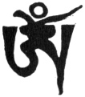

  
[Intangible Textual Heritage](../../index)  [Buddhism](../index) 
[Index](index)  [Previous](ettt02)  [Next](ettt04) 

------------------------------------------------------------------------

  
*Esoteric Teachings of the Tibetan Tantra*, by C.A. Musés, \[1961\], at
Intangible Textual Heritage

------------------------------------------------------------------------

p. 31

### CHAPTER TWO

*From the Treasury of Consciousness This Is*

### THE INITIATION RITUAL

### OF THE

### FIERCE GURU WITH PHURBA[1](ettt03.htm#an_n_2:1)

|                    |
|--------------------|
|  |

Before the execution of the Initiation Ritual of the Fierce Guru with
Phurba, the preparation of Vase, Gtor-ma, etc., should all be arranged
as instructed in the foregoing ritual. The Taking-in-Refuge Prayers and
the Arising of Bodhi Heart should be practiced first, and so forth.
\[*Note:* The reference here is to standard ritual.\] And
instantaneously one should think that the Samaya Buddha is identified
with the Wisdom Buddha. The Visualization process is thus completed.

*Oṃ Ah Hūṃ!* Welcome the Wisdom Buddhas!

The Initiation Buddhas all hold the Vase of Wisdom in their hands.

In their hearts stands the *Hūṃ* word.

Encircling the *Hūṃ* is the garland of mantras.

The garland of mantras evolves swiftly,

Glowing with infinite beams of light,

Which shine forth to the Pure Land of the Golden
Mountain[2](ettt03.htm#an_n_2:2),

Attracting numerous Fierce Gurus to come down here.

They all coalesce with the Samaya Buddhas.

*Oṃ Atsiga Nitsiga Namo Bhagavade Ba-tsa Gili Gilaya Hūṃ Pai!*

p. 32

(Thus, the phurba practice of the Fierce Guru is completed. *Samaya,
Chia Chia Chia!*)

The instruction of the ritual, incantation, and visualization are given
as follows:

"Think yourself become the Fierce Guru;

From out of his body fire blazes.

Think that this flame consumes all the devils and demons…

You should think that all manifestations and forms are the body of the
Fierce Guru.

You should think that all sounds are the Fierce Incantation of Buddha.

You should thus think that no demon or devil can possibly harm
you[3](ettt03.htm#an_n_2:3)."

Recite the chief incantation; then recite the following incantation:

*Ba-tsa Merda Ba-tsa Sumerda Ba-tsa Hora Merda Ba-tsa Hūṃ Merda Ba-tsa
Racha Merda Ba-tsa Ma Merda Ba-tsa Gha Merda Ba-tsa Yam Merda Ba-tsa De
Merda Ba-tsa Merda Merda Ye Merda Svaha!*

(*Samaya Chia Chia Chia. Ka Tam Gu Haya Chia Mum Gana Ta!*)

After this initiation ritual (for the guru), the offerings and apology
practice should be performed according to one's capability.

After this, the Eight Offerings should be served. The prayer to
Padmasambhava should be recited. Then the disciples should gather and
offer the Mandala.

(The Guru addresses the disciples.)

Padmasambhava himself said,

"I, the Lotus-Born of *A*o-rgyng[4](ettt03.htm#an_n_2:4),

Preach the Dharma of the Nine Vehicles[5](ettt03.htm#an_n_2:5).

p. 33

In the East and in the West,

I also spread the Teaching of Knowledge and the Teaching of Practice.

In the Snow Country of Tibet,

I promulgate Dharma and fulfill the wishes of Buddha's sons.

I display my power and perform miracles

And help all the faithful ones by leading them to the path.

The inimical devils and demons are all subdued by me

And restrained under oath.

I am Dharmakaya, the All-Perfect Buddha.

My real being is absorbed in the plane of Universal Quintessence.

I am Sambhogakaya, the body of the Fierce and Peaceful
Buddhas[6](ettt03.htm#an_n_2:6);

My consciousness manifests in the form of Buddha's body and Wisdom.

I am Nirmanakaya, the Lord of the Esoteric Doctrine.

I am the Treasury of Tantras and Instructions.

Guru Gara-rdor-rje and Mañjuśri,

Nagarjuna and the *Hūṃ*-Practicer Sabhava;

Bemala Medra and Darna, the Rambu Guha Shan Dhava,

The Secret Buddha Goamadhi,

And King Indra Bodhi and Guru Tilopa,

Guru Naropa, Biwashidhapa, Gu Gu Ripa and Andhaba,

The Holy Being Dhawa Draba,

Madi Tsidar Dhava Zun and Gub Dha—

All these Gurus are not different beings;

They are actually one being.

I, Padmasambhava, am also identical with them.

I am the one who has all perfections,

p. 34

I am omnipresent and absorbed in all.

One may visualize me either as the Peaceful Buddha or the Fierce Buddha.

Whatsoever the forms, ornaments, and holdings of the
Yidam[7](ettt03.htm#an_n_2:7), it makes no
difference \[one may visualize me whatever the form he choose and attain
enlightenment like mine\];

Do not be confused that sometimes I manifest many faces and arms,

and sometimes I manifest few.

After all, what difference does the number of faces and arms make?

You should remember that I manifest all!

I shall transform myself into numerous bodily forms in the world to
benefit the world.

The innumerable transformation bodies of mine

Will fill every corner of the world!

Although I appear myself before every man,

They do not see me,

Because their extremely disturbing thoughts hinder them.

My love and compassion is so great

That I can not delay a single moment to come to the person who calls for
help.

Especially for the Tibetans, I always give them my blessing.

Though apparently I am in the Northwestern Land,

My performances and teachings will never cease to exist in Tibet.

I even appear myself in person before my faithful and sincere disciples.

My Transformation Body will never cease to exist in Tibet.

p. 35

None will get a faster response in praying to other Buddhas than in
praying to me.

If a good wish cannot be accomplished by peaceful means,

I will use the powerful one!

For the welfare of others, I use both the peaceful ways and the forceful
ways—

In the Mandala I am the chief Buddha and am also the retinues.

I manifest in various forms—\[as\] many or few deities in a Mandala—

According to the nature and capacity of the individual.

I will protect my disciples from the affliction of the Eight Earthly
Demons.

I will bestow all the Siddhis like rainfall upon my followers.

If one desires to be born in the Pure Land of
Non-Regression[8](ettt03.htm#an_n_2:8),

He should look to me.

If one wants to help others, he should appeal to me.

If one wants longevity and prosperity, he should pray to me.

For the afflicted ones, I also destroy demons, hindrances, sins, and
illness.

If one wants power, I grant that to him.

If one wills to conquer the proud enemy,

I will fulfill his wishes.

I give the Siddhis of the Four Performances,

The desirable Lotus of Wish-Granting also comes from me.

I am the one who fulfills all wishes without delay.

With my body, speech, mind, merits, and performances,

p. 36

I send forth numerous transformation bodies and sub-transformation
bodies.

I am the shelter, the refuge, the protector, and Wish-granter of all
beings.

I am the one who cures all illness, kleśas, and sufferings.

In the dangerous state of Bardo,

When one beholds the frightful scenes

And hears the terrible voices,

I shall be his savior and protect him from fear.

I am the one who creates the Essence of Buddha's Pure Land.

I am the Lord of the Lotus, the Yidam of all devas.

I elucidate the Pith-meaning of the radiant Dharmakaya.

I am the Lotus-Born Wish-Granting Guru.

By merely hearing my name,

One's hair stands up and one's tears flow."

(The Guru says:)

"Thus one should have faith in his teaching and lineage.  
 O the Lotus Lord! Through his miraculous Phurba,  
 All wishes are granted and accomplishments realized."

Again, you should know that the Father and Mother Guru are embodied in
the P’urbu-dagger. Today's initiation is called the Initiation of the
*A*o-rgyng Yabyum[9](ettt03.htm#an_n_2:9)
embodied in the Buddha Rdo-rje-gyoun-nu, or the Teaching of Elimination
of Evil through the Fierce Guru with Phurba.

Says Padmasambhava's prophecy:

*"In the time of sinful, soiled, and corrupt custom—in the future—  
 The demons and spirits of the Planets*[10](ettt03.htm#an_n_2:10) *will infest the world.  
 At that time, the Demon King Pehar will be very powerful and dominant
\[his teachings will spread afar\].*"

  [  
Click to enlarge](img/pl01.jpg)  
PLATE I  

Folios 6 *verso* and 7 *recto* (Muses MS, vol. I)
showing the major portion, in the cursive "headless" Tibetan script, of
the unique prophecy of Padmasambhava in his role as "The Fierce Guru
with Phurba" voiced through the lama prodigy Mi-gyur-rdorje, inspired at
the age of 13, as the manuscript relates. The prophecy foretells a time
of utter disaster for Tibet, when it will be conquered and decimated by
evil and deranged, demon-like men.

p. 37

*Thus he said. Because of the powerful influence of the Demon King
Pehar, the cases of insanity \[Tib. smyo\] and nervous disturbance
\[abog\] will be many, the cases of violent death will also be great in
number*.

\[This remarkable prophecy is now explained further:\]

In ancient times, there was an Indian scholar who was very fond of gold.
He had devoted his lifetime to practicing the worship of Yamantaka and
was about to achieve the Siddhis. But he raised dispute and became very
angry; then the Black Yamantaka put him to death. Whereupon he became
the Black King Demon called Hala. Later he came to Tibet and enslaved
half of the Tibetan population.

Maji Lab Dran[11](ettt03.htm#an_n_2:11) (the
greatest woman philosopher of Tibet) in her previous life was the Indian
scholar Rin-Chin-Drab who subdued and converted many heretic
philosophers of India. Among them there was a scholar who became very
angry and revengeful after his defeat in debating with Rin-Chin-Drab. He
then made a malignant vow and immediately flew away to a cave and died
by committing suicide.

By the power of his malignant vow and hate \[joined to all other evil\],
he became a plague-spreading gnome, the one who appeared in the form of
life-and-vow-destroyer. He appeared both in the East and in the West. He
spread all kinds of disease and made people insane and mentally
disturbed. Furthermore, the King Demon Pehar then gathered all the
breath of the oath-breakers[12](ettt03.htm#an_n_2:12) and made them his retinues, filling many
countries like husks scattered by the wind pervading a whole valley.

This was prophesied \[also by Padmasambhava\]:

*At that time half of the populations \[of all nations\] will become
insane; most of the people will cut short their own lives *

p. 38

*by themselves (suicide); and at that time China will become a dark
land. Powerful men and wealth will follow the steps of the evil spirits
and their three cousins*[13](ettt03.htm#an_n_2:13)*; all Tibet will be broken into small pieces. At
that time, here in the Snow Country, the life and breath of the lamas,
the officials, the teachers, the kings, the high officers, and those who
follow the Buddhist teachings will be taken away (and persecuted). All
the good teachers and virtuous persons will be cut in the middle by the
evil demons. People will suffer
excessively*[14](ettt03.htm#an_n_2:14).

Thinking of benefitting the world \[later on\] at this miserable time,
on the evening of the fifth lunar day—a significant date—in the year of
Rooster, the Fierce Guru with Phurba himself (red and with one face)
appeared before the Living Buddha, Mi-rgyur-rdo-rje, when he was
thirteen years old, and imparted to him this initiation and teaching.
Therefore this teaching is a very near one (to the original source), and
has great power and blessing. If one attains this initiation and
practices it many times, he may certainly cure the illness of
Life-Prana[15](ettt03.htm#an_n_2:15) and the
pain of fainting.

To attain this initiation, you disciples should now follow me in
reciting the following prayers:

"I pray the Three Pillars and all Deities,  
 I pray the Fierce Guru and his retinues,  
 Considering my sincere prayer and earnest request,  
 Please grant me the Initiation of the Vase.  
 I take refuge in the Three Precious Ones.  
 I confess all the sins and evil doings that I have committed.  
 I shall view all the good deeds and merits of sentient beings with
sympathetic joy.  
 I pray that all the Buddhas and Bodhisattvas ceaselessly remember me in
their minds. p. 39  
 From now until the time of attaining the perfect Buddhahood,  
 I take refuge in the Buddha, the Dharma, and the Sangha.  
 For the benefit of self and others  
 I raise the incomparable Heart for Bodhi.  
 When this prime vow of the Heart for Bodhi is made,  
 I shall render my services to all sentient beings.  
 I hope the day I attain Buddhahood will come soon!"

Recite this prayer not less than three times.

(Then the Guru holds the Human Skull, filled with nectar, and addresses
the disciple.)

"You are born in a well-gifted lineage;  
 I now impart to you the Vajra of Wisdom and grant you the Siddhis.  
 *Deyata Jaha Hūṃ Neya!*"

(The disciple drinks the nectar from the human skull) and thinks that he
has drunk the nectar that can cure all poisonous disease and bring all
prosperity and auspiciousness.

The Guru says:

"This is the Water of Hell for you

If you break your oath or violate the precepts,

It will become a great fire and burn you to ashes.

If you observe the precepts and keep your oath

It will bring you all Siddhis and accomplishments.

*Samaya Gahi Hasa Hūṃ!*"

Now, follow me in reciting this prayer;

"Oh, Guru, you are the embodiment of all Buddhas;

In you, I take refuge.

In you [I](errata.htm#5) find shelter.

In the endless and miserable Saṃsara Ocean

I look forward to you—to ferry me to the safe shore!

*Ha Ha Ha Ha Ha Ha Ha. Hūṃ Hūṃ Hūṃ Hūṃ!*

p. 40

Now, you disciples should think that nothing any more exists; there is
only a vast void. Suddenly from this great voidness you become the
Fierce Guru [with](errata.htm#6) Phurba, four faces all looking in one
direction, for this is the manner of conquering and subduing all devils
and demons. His first hand holds the thunderbolt with knife; the other
hand holds the scorpion. The lower hand holds the symbolic staff,
Khadramga, and at the lower part of his body stands the powerful Phurba
with grooves, the weapon that kills the evils, agonizing and tormenting
them.

*Oṃ Ah Hūṃ!*

From the three places, the three words radiate beams of light to the
Golden Pure Land in the northwestern direction, and enter the heart of
Guru Padmasambhava, who sits on the summit of the hill in the Pure Land.
Instantaneously, with great vibration and thundering sound, the Fierce
Guru with Phurba descends here. He enters into your body and mind and
unites with you.

(Play all musical instruments)

*Hūṃ!* O Fierce Guru With Phurba, and thy holy retinues,

I pray you to come here and bless me!

I pray you to protect me from the dangers and obstacles of my life.

(In addition to the basic incantation add: *Ba-tsa Ah Wei Sha Ya Ah Ah*.
Recite it several times.)

The Guru then puts the rdo-rje on the head of the disciple and says:

"*Di Char Ba-tsa!*" (Thus the Initiation of Vases is given.)

"*Hūṃ!* This is the Heaven-Made[16](ettt03.htm#an_n_2:16) Phurba,  
 The powerful and inconceivable one!  
 This is the illumination of the Fierce Guru,  
 I now place it on your head. *Ba-tsa Ah Bi Itsa Hūṃ!*"

p. 41

The Guru then holds the sword in his hand and says:

"*Hūṃ!* This is the blazing sword of the Fierce Guru! I now place it on
your head,  
 And wish you to obtain the superb initiation of the Fierce Guru."

Then recite the main incantation \[not given here *Ed*.\] up to \[the
words\] *Dike Ahbi*.

The Guru then holds the scorpion (usually a picture or image) and says:

"This is the nine-headed scorpion of the Fierce Guru.  
 I now place it on your head,  
 And wish you to obtain the superb Initiation of the Fierce Guru."

Recite the main incantation and add Rag Cha Ah Bi.

\[Following the same manner, the Initiation of Staff is given as
follows:\]

"*Hūṃ!* This is the Staff of the Fierce Guru,  
 The blazing Staff held in his hand,  
 I now place it upon your head and grant you the initiation of the
Fierce Guru."

Recite the main incantation and add Dre Shu La Ahi.

(Thereupon the disciples offer the lamp and recite the following
incantation with great sincerity.)

"*Maha Guru Tsida Ma Ma Da Ri Ga Ah Ha Na Haya!*" Then the Initiation of
Fruit:

"*Hūṃ!* This is the fruit of great value.  
 I now place it on your throat,  
 I now grant you all the Secret Initiation of the Fierce Guru with
Phurba.  
 *Ah Gei Ha Ge Ge Ge Ge Be Ge Na Savha Ga Ye Ga Ye Hehi Heye Hagadi
Gagadi!*"

The Guru holds the shell in hand and says:

p. 42

\[paragraph continues\] "*Hūṃ!* this is
the right-circled shell \[*Ed*.: clockwise\] that symbolizes the
perfection and merit of all Buddhas.

I now place it on your heart and bless you,

I wish you to attain the powerful initiation of the Fierce

Guru with Phurba.

*Ah Ah Ah Ah Ah Dum Dum Dum Dum Ha Ha Ha Ha Ha Ha Ha Ga Di Ma Pa Ya Na
Ga Go Sen Nga Ba Di*.

The Guru holds the wand in his hand and says:

"*Hūṃ!* my good disciple,

I now place this wand upon your head

And grant you the Initiation of Performance of the Fierce Guru with
Phurba.

*Gehura hasaya de ah mum hūm*.

*Hūṃ!* This Gtor-ma itself is the Fierce Guru With Phurba;

All the Buddhas and Bodhisattvas dwell in it.

I now place it on your head

And grant you the complete Four Initiations of Tantra.

Bhagavan, the Lord of Infinite Light, Guru Padmasambhava,

Dakini Ye-shes-mtsho-rgyal, the Superb Deva, Rdo-rje Youth—

O all ye holy beings!

You now become embodied in the form of the Fierce Guru with Phurba,

I pray, grant your grace and blessing to my disciples.

Please at this very moment cure my disciples’ Sickness-of-Life-Prana.

Please cure their insanity, psychosis, mania, faintness,
depression[17](ettt03.htm#an_n_2:17)—

In short, please cure all their mental diseases, if any at this very
moment.

p. 43

Please protect my disciples from the injuries of the Male Demon,
King-Ghost, Gon-po Demon, Nine Devils of Bun, white and black devils,
the old and new demons, the poisonous devils, evil spirits and all the
malignant ghosts.

From now on until they reach the final enlightenment, please protect
them and remember them!

*Ma Nyan Da Ya Ga Dim Hu, Hasayale Sayaselege Lei Lei Sya Deyataya Hūṃ
Haya, Oṃ Ah Hūṃ Ahtsi Netriga Namo Bhagavade Ba-tsa Gi Li Gi La Ya Hūṃ
Pai, Ba-tsa Sa Sa Nan, Ba-tsa Ragcha Nan, Homlan Nan, Bala Dana Nan, Gu
Haya Di La Nan, Ba-tsa Da Di Nan, Di La Di La Nan, Ba-tsa Ba-tsa Ha Jun
Rag Cha Rag Cha, Sidi U Su Nan, Ratsa Ah Mu Ga, Tsi Da Be, Mam Sa Be, Ra
Dah Be, Gi Ni Ra Di Be, Go Re Tsa Na Be, Ba Su Da Be, Tsida Jun, Tsida
Duob, Ahdi Labi Dhide Savha!*"

Now you have obtained the initiation of the Fierce Guru with Phurba.
From now on you should always identify yourself with the Fierce Guru,
and think that you yourself are the Fierce Guru inflamed with fire, no
evil spirits can harm you.

All the manifestations you should behold as the play of the Fierce Guru.

All the sounds you should hear as the Fierce Guru's Mantras.

You should think that no evil spirits can harm you—

In such a manner should you practice.

Now follow me in reciting this incantation:

*Gadiga Samaya Ahr Da Ah Ai Ha La Ha La Sagha Samaya Ah Di Wa Ah Samaya
Na Ra Ga Ga Cha Savha!*

Then offer the Mandala.

p. 44

This is a very strict, powerful, and dangerous initiation. It cannot be
given to many people. If a proficient Yogi, who has achieved to some
extent the Siddhis of Mantra, cannot overcome the illness of life-prana
and the mental disturbances caused by the King-Demons, and nothing can
cure him: for such an extreme case, this initiation ritual should be
practiced, in front of the sick Yogi, one thousand times. It will
definitely cure him. The ordinary person, who has not practiced
meditation or Mantra, or is merely a beginner, will be much easier to
cure. Usually, reciting the Mantra for one or two rotations of the
rosary \[the Tibetan rosary of 108 beads. *Ed*.\] will be quite
sufficient to cure him. It is a rare case that a few recitations of
Mantra cannot help… Occasionally, when the spittle comes
up[18](ettt03.htm#an_n_2:18), the Yogi
should carefully observe whether the patient has also been affected by
the Mantra. In case a great many Mantras have been practiced, but
without help, the Yogi should then practice the Visualization with
Action and also apply the Frightening Acts together with the recitation
of the Mantra. This will definitely help.

If one is not affected by King-Demons’ Disease, but merely feels minor
mental disturbance because of the time element (at certain times the
King-Demons and evil spirits are very active and powerful), he should
meditate on this teaching for a little while to protect himself; and
reciting the Mantra a few times will certainly help.

The King-Demons (the makers of mental disturbances) are numerous,
forming many diabolic families and ranks. Whichever King-Demon harms
you, you should visualize that the sharp tip of the Purbu is stabbed
into the joiningpart of the white and black part of the demon's heart,
torturing him. Absorb yourself in this visualization to recite the
Mantra.

p. 45

The foregoing initiation ritual is one of the instructions from the
Heavenly Dharma, which includes not only the initiation ritual itself
but also explanations. This ritual was written and arranged by the monk
named Brtson-agrus, the Diligent One. If I have ever committed the sin
of expressing too obviously and clearly the esoteric teachings which are
supposed to be kept secret, I beg forgiveness from the Shelter
Berha[19](ettt03.htm#an_n_2:19), the
Protector and his retinues. If any merits have accrued to me through
writing down this ritual, I dedicate them to all the demon-afflicted
sentient beings to pacify them and calm their disturbed minds. I also
wish them to attain happiness of body and mind.

Good wishes to all.

p. 46

##### NOTES

[1](ettt03.htm#an_r_2:1). Padmasambhava,
wishing to combat the demonic evils and mental diseases of this dark
time, extended his manifestation as the Fierce Guru into that of Fierce
Guru with Phurba (dagger) \[actually a ritual dagger of triangular
pyramidal blade *Ed*.\] for this purpose. This initiation is a
sub-initiation of the Fierce Guru.

[2](ettt03.htm#an_r_2:2). The Golden Mountain
is a name for the Pure Land of Padmasambhava.

[3](ettt03.htm#an_r_2:3). According to
Buddhist tradition, there are various ways to subdue evils. The highest
teaching, however, urges the disciple to look upon all untoward
manifestations and obstacles as themselves representing an aspect of
Buddha—in this case, of the Fierce Guru. The yogi, seeing frightful
visions or hearing demonic voices, should identify them as a
manifestation of the Fierce Guru.

[4](ettt03.htm#an_r_2:4). *A*o-rgyng is
another name for the Pure Land of Padmasambhava. Padmasambhava is called
Ao-rgyng Rimpoche, meaning "the Precious One of *A*o-rgyng".

[5](ettt03.htm#an_r_2:5). The Nine Vehicles
are (1) the Vehicle of Hearing (Sravaka); (2) the Vehicle of Self-Buddha
(Pratyeka-Buddha); (3) the Vehicle of Bodhisattva; (4) the Vehicle of
the Tantra of Affairs; (5) the Vehicle of the Yoga Tantra; (7) the
Vehicle of the Maha Yoga; (8) the Vehicle of Ah Nu Yoga; and (9) the
Vehicle of Adi Yoga. The first two vehicles are Hinayana Buddhism; the
third is general Mahayana Buddhism. The remaining six all belong to
Tantricism. Among them the fourth, fifth, and sixth are the so-called
three lower divisions, or preparatory Tantra. The seventh, eighth, and
ninth belong to the highest division of Tantra, the Annutara Tantra,
which is practiced in Tibet; while the lower division of Tantra,
Tang-Mig (the esotericism of the Tang Dynasty), is practiced in China
and Japan.

[6](ettt03.htm#an_r_2:6). The Fierce and
Peaceful Buddhas are both the manifestations of the Dharmakaya.

[7](ettt03.htm#an_r_2:7). Yidam is the patron
Buddha one relics on.

[8](ettt03.htm#an_r_2:8). Unfavorable
circumstances for practicing Dharma will usually cause the disciples to
regress. Therefore it is their wish

p. 47

to be born in a land of favorable circumstances for their practice, so
that regression cannot occur.

[9](ettt03.htm#an_r_2:9). The Ao-rgyng Yabyum
is the Father-Mother Buddha in the Pure Land of Ao-rgyng.

[10](ettt03.htm#an_r_2:10). Tibetans believe
that certain mental illnesses are caused by the demons and spirits of
the eight planets.

[11](ettt03.htm#an_r_2:11). Maji Lab Dran
formed her own school, which still prevails in a part of Tibet. She was
Tibet's greatest woman philosopher and yogi.

[12](ettt03.htm#an_r_2:12). Oath-breakers
are disciples who violate the Tantric precepts.

[13](ettt03.htm#an_r_2:13). This is the
translation of the prophecy, which is quite clear except for the meaning
of the phrase "three evil spirits and their cousins."

[14](ettt03.htm#an_r_2:14). Tibetan text:
*Bde Sdug-ahi Bya Wa Spyod Bai Dus*. Although literally *Bde* means
happiness and *Sdug* means suffering, this seems to be an idiomatic
expression denoting "the coming into being of the sufferings," or "great
changes and sufferings will come to pass."

[15](ettt03.htm#an_r_2:15). According to
Tantrism, most mental disturbances are caused by irregular or abnormal
activity of the Life Prana that usually functions in the central nervous
system.

[16](ettt03.htm#an_r_2:16). See previous
note on the thunderbolt (Note 30, Chapter I).

[17](ettt03.htm#an_r_2:17). The Tibetan word
for insanity is *smyo-wa;* for neurosis \[so changed from the
translator's "psychosis". *Ed*.\], a*bog;* for mania, *srog-rbin-nad;*
for faintness, *brgyl-nad;* for depression, a*tibs*.

[18](ettt03.htm#an_r_2:18). The meaning of
this statement is not obvious from the text; it may have a hidden
meaning. The translator presumes that, when the incantation is
effective, the yogi as well as the patient will feel the spittle rise
into his mouth.

[19](ettt03.htm#an_r_2:19). Shelter Berha
(*Mgong-b’o Berha*) is the Protector of the Old School.

------------------------------------------------------------------------

[Next: Chapter Three: The Initiation Ritual of the All-Merciful
One](ettt04)

