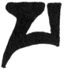

  
[Intangible Textual Heritage](../../index)  [Buddhism](../index) 
[Index](index)  [Previous](ettt05)  [Next](ettt07) 

------------------------------------------------------------------------

  
*Esoteric Teachings of the Tibetan Tantra*, by C.A. Musés, \[1961\], at
Intangible Textual Heritage

------------------------------------------------------------------------

p. 82

### CHAPTER FIVE

*Of the Heart Treasury of Heavenly Dharma, Among the Oceanlike Teachings
in the Whisper Succession, This is*

### THE INITIATION RITUAL OF THE RED GSHIN-RJE[1](ettt06.htm#an_n_5:1)

|                    |
|--------------------|
|  |

*Namo Guru Diwa Dargini Shidi Hūṃ!* \[Note Tibetan transliterations of
Sanskrit words like Deva and Ḍākinī. Ed.\]

If one wants to practice the Three Pillars[2](ettt06.htm#an_n_5:2) Red Gshin-rje, he should arrange the Mandala as in
that of the foregoing rituals. He should prepare a hill-shaped Gtor-ma.
At the back of the Gtor-ma, a vase with red decorations on its brim
should be placed.

Both the preparation for the initiation by the Guru and the actual
initiation ritual (by the deity) require only the general Gtor-ma and
offerings. Before the initiation ceremony takes place, the teacher
should perform and meditate at least once on the following prayers,
which include the Self-Front-Arising Yoga, confession, and other
prayers. If one wants to perform a very comprehensive ritual, he may
elaborate by reciting the prayers of the Three Pillars as well as the
Bodhisattva's Vow and the like. After these practices the Guru should
follow the instructions given below:

I, myself, become the Red Gshin-rje;

Three faces, six arms, and four legs, stretched apart.

The right face is blue; the left, black; and the center, red.

The three arms on the right side hold the club, Vajra, and knife.

p. 83

The three arms on the left side hold the bloodskull, bell, and stick.

Also adorning him are the complete ornaments of a Fierce Buddha.

He (I) sits on the cushion of the Sun-Moon-Lotus Wheel.

Absorbing himself in this meditation, the teacher should recite the
following incantation:

*Ah Śri Hūṃ Śri Hūṃ Soha!*

(By reciting this incantation the Red Gshin-rje is consolidated).

*Sa Ma Yu Chia Chia Chia!*

"Sa Ma Yu Chia Chia Chia!"

The Guru recites and meditates:

In front of me is the Buddha of the Vase,

In the center of his heart there is a Sun Disc,

Upon which stands a red *Hūṃ* letter.

Around this *Hūṃ* circle the words of this incantation in a clock-wise
order.

From his body shine forth splendid rays of light.

The Buddhas, Bodhisattavas, Three Pillars, and all deities in the ten
directions and three times, all become the red Gshin-rje.

Like rain falling, they descend here and are absorbed into the Buddha of
the Front Vase.

From the body of the Vase Buddha incessantly flows out the Water of
Heaven.

Thus should one meditate, also reciting the incantation as much as he
can. Then the disciples should gather near the Mandala and offer flowers
and food. If conditions permit, it is desirable to conduct a complete
performance, including the preparation ritual with offerings,
confessions, consecration, and exorcising.

p. 84

The Guru then addresses the disciples:

Now, you are to be given the Initiation of the Red Gshin-rje. He is
identical with Mañjuśri[3](ettt06.htm#an_n_5:3) in essence. The Sutra of Mañjuśri says:

"If one repeatedly calls the names of numerous Buddhas as numerous as
the total number of sands in the sixty-two Ganges rivers—his merits are
great; but if he calls the name of Mañjuśri only once, his merits are
even greater." Hence it is obvious that if one attains the Initiation of
Mañjuśri, his merits should be greater than the merits of those who
attain the initiations of Buddhas as numerous as the sands of the
Ganges. Among the Four Divisions of Tantra, this initiation belongs to
the most profound Tantra, namely, the Highest Division Tantra (Anuttara
Tantra). Of the two forms of Mañjuśri, this is the fierce one. Among all
the Fierce Buddhas, this one is most powerful and effective. As said in
a Tantra:

"When some fierce deities behold the Fierce Gshin-rje, they are
frightened, they tremble, and the weapons they brandish slip from their
hands."

Furthermore, we, all the scientist beings, are going to see the
Gshin-rje, for he is the King of Death for everyone. No one in this
world is immortal; therefore everyone is destined to see the Gshin-rje
one day.

As said in the Sutra:

"From the Buddhas of the three times

Down to the lowest animals, the insects and worms,

All should be wise to keep good relations with the

King of Death, the Life-eater, the powerful one!

This Deva Yama is conjured by Bodhisattva Mañjuśri. If one attains the
initiation of this Deva, all the retinues of Yama will not harm him. He
is freed from the Untimely

p. 85

\[paragraph continues\] Death. He will
also be immune from illness and sufferings at the moment of his death.
The hostile demons, such as Dur-mi, Dun-zur, She-yi, and She-ga never
harm him. This Deva Yama is an extremely formidable one; therefore, keep
on good terms with him."

Thus the Sutra says.

This initiation of Deva Yama, extremely powerful and dynamic, yet easy
to practice and to accomplish, was given by the All-Perfect Buddha to my
first Guru [\*](#fn_3), Mi-jyur-rdo-rje (The
Immutable Vajra), early one morning in the Dragon Month of the Monkey
Year when he was twelve years old. I obtained this initiation from him,
the Adi-Buddha like Illumination-Possessor, directly. Hence, this
teaching has a very close and warm succession—the conduit through which
the grace-waves are transmitted. Therefore, you should all join the
initiation ceremony with great reverence and high spirits. You should
now think that I and all the initiation symbols are identical with the
Red Yama himself.

In the preparation of the initiation, the disciples are to follow the
Guru in reciting the following prayers.

I pray to all the Buddhas in the three times,

I especially pray to the Red Yama,

I pray Thee to grant me the Initiation.

(Repeat three times. Then the disciples should recite the prayer of
taking the Three Refuges and the confession, and so on).

I take refuge in the Three Precious Ones,

I take refuge in the Red Yama.

I confess all the sins that I have committed.

p. 86

I raise the sympathetic joy toward all good deeds.

To the Buddhas and Bodhi, I aspire.

From now on till the time of my attaining the Bodhi,

I shall take refuge in the Three Precious Ones,

For the sake of benefitting others and self,

I now raise the all-virtuous Bodhi Heart.

I will serve all sentient beings as their servant.

I will practice the all-virtuous Action-of
Bodhi[4](ettt06.htm#an_n_5:4).

For the benefit of sentient beings,

I offer my heart in the pursuit of Bodhi-Fruit.

(Recite three times; bless the disciples with the holy grass.)

Now, disciples, you should visualize the Red Yama as follows:

You all, each of you instantaneously, become the Red Yama,

Three faces, six arms, and four feet extending apart.

The right face, blue; the left, black; and the center, red.

The three right arms hold club, Vajra, and knife.

The three left arms hold blood-skull, bell, and long club.

You become completely adorned with all the Fierce ornaments

And sit on the Lotus-cushion of the Sun-Moon disc.

In this manner you should visualize yourself as the Red Yama. See a
white *Oṃ* placed at your forehead, a red *Ah* at your throat, a blue
*Hūṃ* at your heart. From them emanate infinite rays of light reaching
to the Buddha's Pure Land and also the Land of
Self-Nature[5](ettt06.htm#an_n_5:5) inviting
all the Buddhas and the Red Yama together with infinite incantation,
tantric symbols and seeds[6](ettt06.htm#an_n_5:6) to come here, and they all enter and are absorbed
in you as the rain falls into the ocean and merges with it.

p. 87

(Play all musical instruments.)

*Hūṃ!* the Red Yama and all deities!

I pray you to come down here and to bless these faithful and gifted
disciples!

I pray you to grant them the highest initiation;

Thus they may eschew temptations and not go astray,

Thus they may be freed from all the causes of accidental and untimely
death[7](ettt06.htm#an_n_5:7).

*Oṃ Śri Hūṃ Śri Hūṃ Savha Betsa Ah Bi Sha Ya Ah Ah*

(Recite this incantation as much as possible and play the musical
instruments. Next, the Guru places the Diamond Flower on the heads of
the disciples.) [\*](#fn_4)

Now the disciples should think that the Wisdom Buddha is consolidated.

*Di Cha Ben Tsa!*

Thereupon the Guru holds the vase in his hand and says:

This is the vase in which the Red Yama resides; I now place it on your
head,

I now grant you the Four Initiations of the Red Yama.

*Oṃ Śri Hūṃ Śri Hūṃ Savha Ga Na Sha Gu Hap Tsa Dur Ah Bi Ai Tsa Hūṃ!*

(He places the Vase on the heads of the disciples and baptizes them.)

Then the Guru holds the Gtor-ma in hand and says:

*Hūṃ!* This is the body of the Red Yama,

This is the complete body of the Red Yama.

By him, the Four Initiations are given to you.

p. 88

\[paragraph continues\] Pray! that you
will attain all the accomplishments of the Four Initiations.

I pray the Dharmakaya, the All-Perfect Buddha; I pray the Sambhogakaya,
the Buddha Amida; I pray the Nirmanakaya, the Guru Padmasambhava; I pray
Dakini Yeshes-mtsho-rgyal; the twenty-five disciples; the
hundred-and-eight Treasury Finders; and all the Ocean-like
Illumination-Holders. I pray the peaceful and wrathful tutelary deities.
I pray the Red Yama and the Ocean-like Dakinis, Guardians. Pray all of
you to bless my disciples. I pray you to grant your grace-wave to them,
and to bestow the initiations upon them. I pray you to protect them from
the afflictions of the self-demon, others-demon; the demon of Dun-zur,
Drug-drum, Gshed-bzhe; the demon of illness, death; the demon-afflictor
of Mdung-bsu, Rjes-rgyal—in short, all the three-hundred-and-sixty
different demons. I pray you to protect them from the eighteen different
kinds of untimely death. I pray you to grant them the one hundred
Siddhis, the Four Performances[8](ettt06.htm#an_n_5:8), the mundane and transcendental accomplishments. I
pray you to give them these accomplishments without delay!

*Oṃ Śri Hūṃ Śri Hūṃ Savha Gayawaga Tsida Sarva Ah Bi Ditsa Hūṃ!*

(Recite this incantation three times.)

Thereupon, the Guru holds in his hand the consecrated white shell whose
curve is clockwise and says:

*Hūṃ!* The Body, mouth, and mind of all Buddhas in the Three Times,

Are embodied in this right-direction-circled shell. I now place it on
the four centers of your body.

Pray that you will attain the Four Initiations of the Red Yama.

p. 89

*Oṃ Śri Hūṃ, Śri Hūṃ Savha Gayawaga Tsida Guna Garma Ah Bi Ditsa Hūṃ!*

(At the same time, the Guru places the shell on the four centers
\[chakras\] of the disciples.)

Thereupon, all should throw flowers and recite the auspicious wishes and
prayers. Among the Ocean-like Teachings in the Whisper Succession, this
is the Initiation of the Red Yama of "The Heavenly Dharma Treasury of
Heart," in which one may find forty different Initiations at the
concluding section. This Initiation of Yama which has just been given to
you is one of them. From now on, you will be protected and be taken care
of by the Red Yama. Therefore, let us all recite this prayer:

Whatever you have admonished us, we shall all obey and practice.

From now on you are my master,

Pray consider and remember me as your disciple,

Pray bless me and grant me the superlative Siddhis.

Thereupon the disciples should render their gifts and perform the
Mandala Offering.

This initiation belongs to the teachings of the Heaven Dharma. It is
based on the sayings of Buddha in its ritual and arrangement. No
alterations or modifications were made. If, however, I have made any
mistake in recording it, I pray that the Buddhas and all the Guardians
of Dharma will forgive me and allow me to make apology.

Good wishes to all sentient beings.

p. 90

##### NOTES

[1](ettt06.htm#an_r_5:1). *The Red Gshin-rje
(Yama):* How does Buddhism come to have a "judge of the dead" if,
according to Buddhist doctrine, the Law of Karma responding to the
individual's action brings of itself full punishment or reward? To
understand why the position of Yama as Judge of the Dead is not
contradictory, we must examine Buddhist thought on this doctrine. First,
it should, however, be pointed out that while deities like Yama,
Mahakala, and others may found in Hinduism, their meaning and
interpretation is quite different in Buddhism.

There are three Buddhist views on the subject of Yama. One, briefly
stated, is that Yama is not an objective god but the subject
manifestation of an individual's conscience, which punishes him. Certain
Sutras offer another explanation; that often a Bodhisattva declares he
will transform his body into that of the Fierce Yama, in order to
benefit many sinful people. For instance, in order to reduce a
murderer's retribution, the Bodhisattva takes the place of the
slaughterer. A third theory is that a number of sentient beings are
connected to Yama by Karma. Because of their Karma, they must stand
judgment in the after-death state. This is not necessary, however, for
humans who have taken certain initiations or reached a certain
enlightenment. The doctrine concerning Yama will be understood best,
perhaps, if the reader remembers that Buddhism is very fluid in its
teachings which best fit the different levels of human development.

[2](ettt06.htm#an_r_5:2). *Three Pillars:*
Guru, Patron Buddha, and Garuda.

[3](ettt06.htm#an_r_5:3). *Mañjuśri:* A great
Bodhisattva who represents the wisdom of all Buddhas.

[4](ettt06.htm#an_r_5:4). *Action-of-Bodhi:*
The Wish-for-Heart-of-Bodhi must be followed by Action for-Bodhi,
practical application of the Bodhisattva's precepts.

[5](ettt06.htm#an_r_5:5). *Land of
Self-nature:* Reality, the eternal world.

[6](ettt06.htm#an_r_5:6). *Seeds:* The
'seed-words' such as *Śri* and *Hūṃ*, which the disciple visualizes
placed in the various centers of the body according to the initiator's
instructions.

p. 91

[7](ettt06.htm#an_r_5:7). Untimely death:
According to Buddhism, there are two kinds of death. The first is that
arising from the inevitable decay and running down of the bodily machine
and its functions. The second, or untimely death is that which results
from Karma of this or a previous life. This kind of death might have
been prevented. Examples are death from accident, war, poison, capital
punishment, or other man-made causes. This kind of death can be
prevented by certain Yoga. Untimely death cannot be prevented by
hygiene; Yoga is the antidote.

[8](ettt06.htm#an_r_5:8). Four Performances:
(1) to subdue ominous evils; (2) to increase whatever is auspicious,
such as Wisdom and Merits; (3) to gain the power to attract human beings
and animals; (4) to uproot and finally conquer various stubborn evils.

------------------------------------------------------------------------

### Footnotes

[85:\*](ettt06.htm#fr_3) The Guru-Scribe is
speaking.—*Ed*.

[87:\*](ettt06.htm#fr_4) In the "Diamond Flower"
the symbolism of the combined natures of active love (upāya) with the
lotus of wisdom (prajñā) or padma. The same symbolism exists in the
sacred phrase "The Jewel or Vajra-Diamond is in the lotus."—*Ed*.

------------------------------------------------------------------------

[Next: Chapter Six. The Superb Initiation Ritual of Ahm Gtsug
Vajrapāṇi](ettt07)

