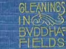

  
[Intangible Textual Heritage](../../index)  [Buddhism](../index) 
[Shinto](../../shi)  [Index](index)  [Previous](gbf00)  [Next](gbf02) 

------------------------------------------------------------------------

[Buy this Book at
Amazon.com](https://www.amazon.com/exec/obidos/ASIN/B0029F2GHE/internetsacredte)

------------------------------------------------------------------------

  
*Gleaings in Buddha-Fields*, by Lafcadio Hearn, \[1897\], at Intangible
Textual Heritage

------------------------------------------------------------------------

# CONTENTS

|        |                                          |                                 |
|--------|------------------------------------------|---------------------------------|
|        |                                          | PAGE |
| I.     | A LIVING GOD                             | [1](gbf02.htm#page_1)           |
| II\.   | OUT OF THE STREET                        | [29](gbf03.htm#page_29)         |
| III\.  | NOTES OF A TRIP TO KYÔTO                 | [43](gbf04.htm#page_43)         |
| IV\.   | DUST                                     | [84](gbf05.htm#page_84)         |
| V.     | ABOUT FACES IN JAPANESE ART              | [97](gbf06.htm#page_97)         |
| VI\.   | NINGYÔ-NO-HAKA                           | [124](gbf07.htm#page_124)       |
| VII\.  | IN ÔSAKA                                 | [122](gbf06.htm#page_122)       |
| VIII\. | BUDDHIST ALLUSIONS IN JAPANESE FOLK-SONG | [185](gbf09.htm#page_185)       |
| IX\.   | NIRVANA                                  | [211](gbf10.htm#page_211)       |
| X.     | THE REBIRTH OF KATSUGORÔ                 | [267](gbf11.htm#page_267)       |
| XI\.   | WITHIN THE CIRCLE                        | [291](gbf12.htm#page_291)       |

------------------------------------------------------------------------

[Next: I. A Living God](gbf02)
