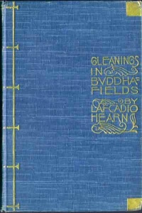

  
[Intangible Textual Heritage](../../index)  [Buddhism](../index) 
[Shinto](../../shi) 

------------------------------------------------------------------------

[Buy this Book at
Amazon.com](https://www.amazon.com/exec/obidos/ASIN/B0029F2GHE/internetsacredte)

------------------------------------------------------------------------

<table width="75%">
<colgroup>
<col style="width: 50%" />
<col style="width: 50%" />
</colgroup>
<tbody>
<tr class="odd">
<td width="50%" data-valign="TOP"> 
Cover of Gleanings in Buddha Fields</td>
<td width="50%" data-valign="CENTER"><h1 id="gleanings-in-buddha-fields" data-align="CENTER">Gleanings in Buddha-Fields</h1>
<h2 id="by-lafcadio-hearn" data-align="CENTER">by LAFCADIO HEARN</h2>
<h4 id="section" data-align="CENTER">[1897]</h4></td>
</tr>
</tbody>
</table>

------------------------------------------------------------------------

[Contents](#contents)    [Start Reading](gbf00)    [Page
Index](pageidx)    [Text \[Zipped\]](gbf.txt.gz)

------------------------------------------------------------------------

|                                                                                                                           |
|---------------------------------------------------------------------------------------------------------------------------|
|  |

This is a wonderful collection of Lafcadio Hearn's essays on Buddhism,
Japan, and Japanese folklore.--J.B. Hare

------------------------------------------------------------------------

 [Title Page](gbf00)  
[Contents](gbf01)  
[I. A Living God](gbf02)  
[II. Out of the Street](gbf03)  
[III. Notes of a trip to Kyôto](gbf04)  
[IV. Dust](gbf05)  
[V. About Faces in Japanese Art](gbf06)  
[VI. Ningyô-no-Haka](gbf07)  
[VII. In Ôsaka](gbf08)  
[VIII. Buddhist Allusions in Japanese Folk-Song](gbf09)  
[IX. Nirvana, A Study in Synthetic Buddhism](gbf10)  
[X. The Rebirth of Katsugorô](gbf11)  
[XI. Within the Circle](gbf12)  
