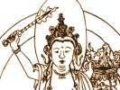

  
[Intangible Textual Heritage](../../index)  [Buddhism](../index) 
[Index](index)  [Previous](glg37)  [Next](glg39) 

------------------------------------------------------------------------

[Buy this Book at
Amazon.com](https://www.amazon.com/exec/obidos/ASIN/B0026P3WHK/internetsacredte)

------------------------------------------------------------------------

  
*The Gateless Gate*, by Ekai, called Mu-mon, tr. Nyogen Senzaki and Paul
Reps \[1934\], at Intangible Textual Heritage

------------------------------------------------------------------------

### 38. An Oak Tree in the Garden

A monk asked Joshu why Bodhidharma came to China.

Joshu said: "An oak tree in the garden."

 

*Mumon's comment:* If one sees Joshu's answer clearly, there is no
Shakyamuni Buddha before him and no future Buddha after him.

*Words cannot describe everything.  
The heart's message cannot be delivered in words.  
If one receives words literally, he will be lost,  
If he tries to explain with words, he will not attain enlightenment in
this life*.

------------------------------------------------------------------------

[Next: 39. Ummon's Sidetrack](glg39)
