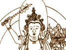

  
[Intangible Textual Heritage](../../index)  [Buddhism](../index) 
[Index](index)  [Previous](glg46)  [Next](glg48) 

------------------------------------------------------------------------

[Buy this Book at
Amazon.com](https://www.amazon.com/exec/obidos/ASIN/B0026P3WHK/internetsacredte)

------------------------------------------------------------------------

  
*The Gateless Gate*, by Ekai, called Mu-mon, tr. Nyogen Senzaki and Paul
Reps \[1934\], at Intangible Textual Heritage

------------------------------------------------------------------------

### 47. Three Gates of Tosotsu

Tosotsu built three barriers and made the monks pass through them. The
first barrier is studying Zen. In studying Zen the aim is to see one's
own true nature. Now where is your true nature?

Secondly, when one realizes his own true nature he will be free from
birth and death. Now when you shut the light from your eyes and become a
corpse, how can you free yourself?

Thirdly, if you free yourself from birth and death, you should know
where you are. Now your body separates into the four elements. Where are
you?

 

*Mumon's comment:* Whoever can pass these three barriers will be a
master wherever he stands. Whatever happens about him he will turn into
Zen.

Otherwise he will be living on poor food and not even enough of that to
satisfy himself.

*An instant realization sees endless time.  
Endless time is as one moment.  
When one comprehends the endless moment  
He realizes the person who is seeing it*.

------------------------------------------------------------------------

[Next: 48. One Road of Kembo](glg48)
