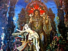

  
[Intangible Textual Heritage](../../index)  [Buddhism](../index) 
[Index](index)  [Previous](ipc10)  [Next](ipc12) 

------------------------------------------------------------------------

[Buy this Book at
Amazon.com](https://www.amazon.com/exec/obidos/ASIN/0766135209/internetsacredte)

------------------------------------------------------------------------

  
*India in Primitive Christianity*, by Arthur Lille, \[1909\], at
Intangible Textual Heritage

------------------------------------------------------------------------

p. 131

### CHAPTER VIII

#### THE CAVE TEMPLE AND ITS MYSTERIES

Maurice on Temple Worship—Description of Cave
Temples—Worship the same in Egypt and Persia—Immense labour employed in
constructing them. Cave Mysteries everywhere an object of dread—Cicero
on them—Elusis—Lucian on Tree Festival at Hieropolis—Bacchantic
Festivals derived from S’iva as Somnâth (Lord of Soma, the first
intoxicant)—These Festivals still secretly celebrated in India.

A book was published in 1806 entitled
"Indian Antiquities." Its author was named Maurice. On some points no
doubt its knowledge is behind our present knowledge, but we get a
learned and intelligent writer dealing freely with the matter that was
available. The question of the Cave temple and its mysteries specially
attracted him.

Mr. Maurice holds that the old Cave temple was an apparatus so
accurately fitted in all its parts to certain special requirements, that
the Cave temples of India, Egypt, and Eleusis, exhibiting as they do the
same means to the same end, must have had the same origin. In the case
of Eleusis we know that the idea was brought from Egypt by Melampus.

From Mr. Maurice we can get a fairly good idea of one of these Indian
Cave temples. They are said by the natives to be "the work of giants and
genii in the earliest ages of the world." They are "admitted to be of
the most profound [antiquity](errata.htm#22), of such profound
antiquity, indeed, that we are unable to obtain any

p. 132

light concerning the [particular](errata.htm#23) era of their
fabrication." Of the excavations in the Island of Salsette he writes
that Grose in his "Voyage to the East Indies" declares that "their
formation would have required a labour equal to that of erecting the
pyramids of Egypt." In the same caves are "above six hundred idols,
ninety of them in and about the great pagoda." An artist who made
sketches there for Governor Boon was so struck with the magnitude of the
colossal work that he declared the labour must have occupied forty
thousand men for forty years together.

Maurice tells us that the mighty stone giants in these caves were
carefully painted, a fact which made them more awful and imposing in the
dim light. Two figures at Salsette were twenty-seven feet in height. The
great triple bust at Elephanta is "fifteen feet from the base to the top
of the cap," whilst the face of another statue, measured by Mr. Grose,
is five feet in length.

We must now turn to Maurice's description of an Indian Cave temple. He
starts with Elephanta:—

"This astonishing Pantheon of the gods presents itself about half-way up
the steep ascent of the mountain, from whose strong bosom it is
excavated. Ovington states the dimensions of this temple at about one
hundred and twenty feet, and the height at eighteen feet. The enormous
mass of solid rock above is supported by four rows of pillars of
beautiful proportion, but of an order of architecture totally different
from that of Greece. The Capital is also fluted, and is described by Mr.
Hunter as having the appearance of a cushion pressed fiat by the
superincumbent mountain. Along the sides of the cavern are ranged those
mighty colossal statues before alluded to, to the number of forty or
fifty, each of them twelve or fifteen feet in height. Some of them have
aspects that inspire the beholder with terror, and in the words of

p. 133

  [  
Click to enlarge](img/pl10.jpg)  
PLATE 10.  
A CAVE TEMPLE  

\[paragraph continues\] Linschoten are
distorted into 'such horrible and fearfull formes that they make a man's
hayre stand upright.'"

The temple was an observatory, a model of the Kosmos, the figures
sculptured on the walls were in their ultimate the heavenly bodies.

"At the west end of the grand pagoda is a dark recess, or Sacellum,
twenty feet square, totally destitute of any external ornament except
the altar in the centre, and the gigantic figures which guard the four
several doors that lead into it. These figures, according to Niebuhr,
are naked; are eight in number, two to each door. They are of the
enormous height of thirteen feet and a half, and appear starting from
the wall to which they are attached. These formidable guardians of this
sacred recess point out the use to which it was applied. It was devoted
to the most sacred mysteries of their religion." [\*](#fn_137)

This, by the worshippers of S’iva, is deemed the Holy of Holies in their
temples. It is called the "Sanctuary of the S’iva Lingam," the Lingam
that is specially holy. "The Catechism of the Shaiva Religion," by a
Hindu writer, Sabhapati Maudalyar, may be here consulted. He announces
that none but Ati Shaiva Brahmins may enter this recess (p. 53).

Additional details are furnished by a German Orientalist.

Lassen, in his "Indische Alterthumskunde," has furnished us with an
account of the Greater Mysteries in an Indian Cave temple. Mr.
Mackenzie, an English Freemason, gives a capital digest of this, he
considering that these rites are very like the secret rites of Masonry.
At eight years of age the child girded on the sacred Cord. For the
"Fellow Craft degree of the Mason," as Mr. Mackenzie, calls it, the
disciple was "led into a gloomy cavern in which the apporheta

p. 134

were to be displayed to him. Here a striking similarity to the Masonic
system may be found." Three chief officers or hierophants are seated in
the east, west, and south, attended by their subordinates. After an
invocation to the sun, an oath was demanded of the aspirant of implicit
obedience to his superiors, purity of body, and inviolable secrecy.
Water was then sprinkled over him. He was deprived of his sandals and
shoes, and was made to circumambulate the cavern (query the Mahâdeo in
the middle of it) thrice. Suitable addresses were then made to him,
after which he was conducted through seven ranges of caverns in utter
darkness. The piercing shrieks of Mahâdevî rent the air, she like
Mylitta and Isis bewailing the fact that S’iva, or Time, had grown
impotent in the winter, and that earth without him would lack food and
perish.

The ancient mysteries depicted the passage of a soul through hell to
heaven, and in the scenes described by Lassen, the initiate in the midst
of his trepidations was suddenly confronted with the φωτισμος. A
brilliant light flashed into the darkness and disclosed Kailas, the
heaven of S’iva, "redolent with perfume and radiant with all the
gorgeous beauty of an Indian clime, the Gandharves sounded their vînas
and sang their sublime songs. Beautiful Apsaras danced around to give a
representation of Heaven. This they certainly got in the Cave temple of
Elora. The patient Indians, provided only with a small steel chisel and
an iron mallet, had converted a mountain into a paradise, into one of
the wonders of the world."

Cicero declared that the word "mysteries" was in his day almost
synonymous with "abominations," because it was generally believed that
human flesh was eaten in them. Human sacrifices were offered at Saturn's
festivals. Plutarch, in Themistocles, mentions three beautiful women who
were at the same

p. 135

time offered to Bacchus. Clement, of Alexandria, states that Erectheus,
King of Athens, and Marius, a Roman general, both sacrificed their
daughters. Livy describes the bloody rites of the worship of Bacchus.

These mysterious rites at first were imparted only to few, but
afterwards communicated to a great number of both men and women. To the
religious ceremonies of these were added the pleasures of wine and
feasting in order to allure a greater number of proselytes. Livy goes on
to declare that horrible scenes of debauchery were witnessed, as well as
secret murders. There was loud shouting, and the noise of drums and
cymbals so that none of the cries of persons suffering violation or
murder could be heard abroad. One, Rutilus, had a step-son named
Aebutius whom he wanted to get rid of. He persuaded the young man's
mother to get him initiated into the mysteries of Bacchus. Aebutius had
a female friend named Hispalia. He told her of his resolve.

"May the gods forbid, "she cried. "Better for both of us to die." Asked
for the meaning of these words she confessed that she had accompanied
her mistress once to Bacchanalian celebrations, and that the orgies she
witnessed there were too awful for words. To think nothing unlawful was
the grand maxim of this religion, and that all who showed any
disinclination in submitting to dishonour, or the commission of vice,
were sacrificed at once as sacred victims.

It is to be observed that the food offered to the gods was considered
the food, of the gods, and as such immortal food. What wonder that in
the Greek rites of Bacchus folk battled for the wine and the warm blood.

But in dealing with ancient mysteries if we treat the question from the
point of view of naturalism,

p. 136

we are liable to go wrong. The excitement produced by the new
intoxicants was viewed at first like the frenzy of the prophet, an
influence beyond the earth, and supremely holy. This mistake could
by-and-bye give birth to many excesses, but there is no doubt that an
intoxicant soon became the chief ingredient in all temple worship. Even
in our own days the "Cup" is forbidden to the laity in the Roman Church
because originally the laity represented the non-initiates.

Turning to Eleusis, a suburb of Athens, we find a Cave temple, and
similar ceremonies. All the city in solemn procession marches to the
"Holy Fig Tree" along the "Sacred Way," the Mustai proud of their
garlands, the Epoptai or complete initiates in their white garments bear
proud myrtle on their brows. A monotonous low chant such as we hear at
Indian festivals goes up into the balmy air, recounting the woes of the
mighty mother, the wife of Kronos.

That lady, who gave Agriculture to Greece, comes flaunting along in her
car drawn by dragons.

The procession now reaches the great Temple, and all who are not
initiates are warned away, for the penalty is death to all who reveal
the mysteries and all who discover them. There are seven dark caverns
and seven light ones. Ceres, and Bacchus, with his torch, are supposed
to be seeking [Proserpine](errata.htm#24) in hell. Earth abandoned by
the goddess no longer bears fruits, like the Indian soil deprived of
S’iva's creative force. Hence the wailings and lamentations that occur.
The initiate goes through the dark caverns, and the light ones. Thrice
blessed is the postulant who is able at last to repeat the culminating
formula:—

"I have fasted. I have drunk the Cyceon. I have taken out of the Cista
and placed that which I took into the Kalatheon. I have taken out of the

p. 137

\[paragraph continues\] Kalatheon and
placed that which I took into the Cista." [\*](#fn_138)

Lucian gives an account of the Tree festival at Hieropolis which reads
very like the Durgâ-Pûjah in India. The sacrifices and processions are
described as being of the splendid and extravagant description.
Multitudes flocked there from all countries, including Brahmins from
India. And it is said that the visitors brought their gods with them, a
detail that throws light on the similarities that we find everywhere.
The two mighty Mahâdeo Columns in front had an inscription that
unblushingly stated what these columns symbolised. Maurice draws a
parallel between the Kusbis of the Indian temples and the Syrian
matrons, who as Bunsen puts it "could only escape being sacrificed to
the gods by prostitution." The main thesis of Lucian is that the Dea
Syria was taken from the Greek Rhea, the wife of Kronos; and that the
noise of the drums and the clashing of cymbals denoted the warring winds
and boiling waters, and the roar and crackle of the subterranean fires,
to show the grief of earth that her womb was still uncultivated.
Especially noisy were the rattling sistra and the clashing of the
various implements of husbandry, which in the first instance were of
brass. The priests were said to be eunuchs, and many young men
dismembered themselves during the frenzies of the rites.

Of the actual tree worship, Lucian gives an interesting picture. "They
cut down," he says, "a number of large trees and set them upright in the
fore court of the temple. Then bringing together goats, sheep, and other
victims proper for their purpose, they hang them up alive on these
trees. To these are added birds, articles of apparel, and various sorts
of furniture, jewels, in short, whatever the devout in their benevolence
pleased to contribute to so solemn

p. 138

a sacrifice." Then the trees are set on fire, and the poor animals burnt
alive.

But Mylitta had rites more sinister still. Near the temple was a mighty
chasm made by the gods in order to drain off the water of Deucalion's
Deluge, so ran the legends. Into this chasm animals are flung, and
babies in sacks. The tree goddess, Mylitta, was fond of babies. Had this
rift and its sinister rites any connection with S’iva and his
subterranean home? The two great columns were said to be very much older
than the rest of the temple, and to represent some earlier worship. The
place was then called "Mahog," which name Colonel Wilford connects with
the Mahâbhâga of the Purânas?

Love, lust, wine, gluttony, cruelty, mixed with religious fervour, have
they not had their orgies in all lands? The carnival was always the
carnival, and the Feast of Fools in the Middle Ages with its "Boy
Bishop," and his rollicking companions burlesquing for three days all
the holy rites in the cathedral,—that, with much else, was Bacchantic
enough.

Mr. Mackenzie, a Freemason, in the passage he cites from Lassen, says
that the initiation of the Freemasons is very like the initiation in the
Indian temple. One or two of these details can easily be learned by a
non-initiate, from Masonic tractates. Over the "Grand-master's" head is
a canopy marked with the equilateral triangle which is the special
emblem of S’iva. It symbolises also the God worshipped by the Masons,
and is called "Le Delta sacré," in France. The triangle is somewhat
lamely repeated in the Masonic trowel. Then when the frightened
postulant with a "cable tow" (Durgâ's pasha) round his neck is
introduced to the conclave, he finds each initiate clutching his neck in
a throttling manner to emphasise the absolute necessity of secrecy. The
crowning ceremony of all the circling round the "Copestone" need not be

p. 139

dwelt on in these pages. Plainly the "Copestone" is the Mahâdeo. One
thing is certain. The terrible secret society of the Thugs or Bhurtotes
in India is very ancient. Colonel Meadows Taylor found evidence of these
stranglers in the bas reliefs of Elora. They most probably date from a
day when the religion of S’iva was furiously persecuted by the Brahmans,
and terrorism had to oppose terrorism.

An article in the Asiatic Researches, Vol. VIII., seems to furnish the
backbone of the Mystery of S’iva. It gives from the Mahâkâla Sanhita,
the death of the Year-god. S’iva dies at Easter and rises up almost
immediately as Bâlishwara the Baby-S’iva, the New year. This death in
all the old religions took place March 24th, and the resurrection on
March 25th. A human victim personified the god.

The "abominations" that shocked Cicero have been going on in India from
the earliest days. The Bacchantic festivals seem, even in name, to have
been derived from India, for the word Bacchus with some Orientalists is
a form of the Sanscrit word Bhâga, the special emblem of maternity.
S’iva as Somnâth, is Lord of the Soma, the earliest intoxicant; and he
figures as in Greece as a drunken Silenus at the festivals. [\*](#fn_139) Intoxicating liquors, blood (sometimes
human), flesh, and fish, are ingredients of the banquet. A woman, stark
naked, personifies the Goddess. "These votaries of Sakti assemble at
midnight in retired places," says the Reverend W. Simpson, the editor of
"Moor's Pantheon," every stage of the proceedings is invested with a
mystical meaning, and the whole terminates in licentious sensual
indulgence." This author declares that he had good authority for the
statement that they still existed in Madras in his day. [†](#fn_140) It must, however, be mentioned that the
rites of the followers of S’iva are

p. 140

divided into two sections, the Right-handed Tantrik rites, the
Dakshinas, and the Left-handed Tantrik rites, the Vâmâcharîs. This means
practically Black and White magic. The early gods were ranged at
different sides of the [Zodiac](errata.htm#25), and the Tantrikas were
the worship of the wicked gods, the worship of S’iva as Bhairava and
Durgâ as Kâlî. At the beginning, all were no doubt wicked, and much like
the gods of Dahomey. And perhaps the rudest excesses of the festivals
were deemed logical in some rude days of polyandry. The Sakti sect
represents only a small portion of S’iva's followers.

------------------------------------------------------------------------

### Footnotes

[133:\*](ipc11.htm#fr_138) Crawfurd, "Hist.
Indian Archipelago," p. 226.

[137:\*](ipc11.htm#fr_139) "Eleusinian and
Bacchic Mysteries," T. Taylor, p. 16.

[139:\*](ipc11.htm#fr_140) "Jacobs’s
Mythological Dictionary," Article "S’iva."

[139:†](ipc11.htm#fr_141) Moor, "Hindu
Pantheon," Madras edition, p. 365.

------------------------------------------------------------------------

[Next: Chapter IX. Architecture](ipc12)
