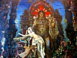

  
[Intangible Textual Heritage](../../index)  [Buddhism](../index) 
[Index](index)  [Previous](ipc12)  [Next](ipc14) 

------------------------------------------------------------------------

[Buy this Book at
Amazon.com](https://www.amazon.com/exec/obidos/ASIN/0766135209/internetsacredte)

------------------------------------------------------------------------

  
*India in Primitive Christianity*, by Arthur Lille, \[1909\], at
Intangible Textual Heritage

------------------------------------------------------------------------

p. 161

### CHAPTER X

#### THE ESSENES

Was Essenism due to Buddhist missionaries?—Testimony
of Asoka—The μοναστήριον compared with the Sangharâma"—Apostles of the
Bloodless Oblation"—Tertullian on the similarity between the rites of
the Christians and the Mithraists—Testimony of Philo—Thirty thousand
monks go from Alexandria to Ruanwelli in Ceylon, and are hospitably
received on the occasion of the consecration of the great temple there,
B.C. 170.

We have now reached the critical chapters
of the work. Its main contention is that it was through the Jewish sect
of the Essenes that Buddhist influences reached Palestine, and were
passed on to Christianity. We have therefore to consider:

\(1\) Was Essenism due to Buddhism?

\(2\) Did Christianity emerge from Essenism.

The first question will form the subject of this chapter, and the second
will be treated afterwards. In my first edition of this work I attached
great importance to the evidence of King Asoka. That monarch, as we have
seen in Chapter V., has given to Buddhism a record which no other
religion can boast of, simply because in lieu of a reed and leaves of
plantain trees or other ephemeral methods he has used a chisel and hard
stone. By this means he has baffled the pious improver of sacred
records, but the King's system was necessarily a little crude. On one
pillar he tells us about his "double system of medical aid," on another
of the "villages set apart for the

p. 162

monks," on a third, the accommodation of men and animals, on others we
read of "the planting of trees and digging of wells," and then of monks
"exercising solitary austerities."

Thus when I read in the inscription of the Girnar Rock in Guzerat the
king's statement that he had sent into the domains of King Antiochus his
"medicaments," and his "double system of medical aid," I thought that
the king's statement about his medicaments was important as proving an
early connection between India and Egypt, but I did not see how far
reaching and overwhelming that evidence was.

A recent and more careful study of the king's inscriptions has proved to
me that his Sangharâmas, the establishments that he set up upon roads
and in jungles, were all of a pattern and all complete. They were for
utilitarian as well as religious purposes. The problem before the king
was to send abroad his laws, his religion, his commerce, his officials
wherever he could, and especially to reclaim and pierce the vast jungles
of his dominions. These had potent sentries, the tiger and the fever.
The Indian epics tell us how these were dreaded. Thus roads, wells,
herbs for medicines, grain for food, and trees for shade, would be
required everywhere, for each Sangharâma was a rude caravanserai,
hospital, college, monastery, church, burying-ground, as well as a
collection of little leafy pansils where the ascetic could dream his
dreams of God.

This gives the Girnar rock-inscription an importance that it is
impossible to estimate. If Asoka spread through the dominions of
Antiochus his "root drugs and herbs," and his "medical aid for men and
animals," the remainder of the Sangharâma, the religion and the fasting
monks, must have been present likewise, a pregnant fact.

Let us read the passage carefully. "And moreover within the dominions of
Antiochus, the Greek king,

p. 163

of which the generals of Antiochus are the rulers, everywhere the double
system of medical aid of the Beloved of the Angels (Asoka) is
established, both medical aid for men and medical aid for
animals." [\*](#fn_154)

Indeed, these conclusions are completely confirmed by a second passage
on the Girnar Rock.

"And the Greek king besides, by whom the four Greek kings (Chapta Yona
rajah) Ptolemaios, and Gengakenos and Magas . . . have been induced to
permit . . . both here and in foreign countries everywhere (the people)
follow the doctrine of the religion of Devanampiya (the friend of the
Angels) wherever it reacheth." [†](#fn_155)

The king's name is never actually mentioned on the inscriptions. He is
called the "Friend of the Angels" or Devas. According to Polybius,
Antiochus the Great led his army into India and renewed his alliance
with Sophagasenes, king of that country. As the Asoka edicts were
incised on rocks some six years after Antiochus came to the throne,
Prinsep and Wilford believe that this was King Asoka. Meanwhile the
building of Alexandria had given a powerful fillip to the intercourse
with India by sea. Alexander had designed it to be the capital of his
vast empire, and the bridge between India and the West. This project was
ably carried out after his death by his lieutenant, the first Ptolemy.
Under his wise government and that of his successors, Alexandria soon
became the first commercial city in the world. Of more importance was
his large tolerance of creeds, whether Egyptian, Grecian, or Jewish. In
the year tog B.C. Ptolemy Evergetes was on the throne. He conquered
Abyssinia and the greater part of Asia, including Syria, Phœnicia,
Babylonia, Persia, Media.

p. 164

\[paragraph continues\] His conquests
extended to Bactria, and he had a large fleet on the Red Sea. This
placed him in contact with India from two different directions. He
married the daughter of the "Magas" of the inscriptions, the king of
Cyrene.

We have now to consider whether there is any evidence corroborating the
testimony of Asoka. Jumping over some two hundred years we reach Philo
(25 B.C. to 45 A.D.), Josephus (born 37 A.D.) and Pliny (23 to 79 A.D.).
These witnesses describe an institution pin for pin like the Sangharâma,
namely the μοναστήριον, and we get from them a knowledge of two
remarkable sects of the Jews, the Essenes and the Therapeuts.

When did these sects arise? On that point evidence is scanty. Eusebius
declared that they were Christian monks brought there by St. Mark, but
Philo, Josephus, and Pliny, if they know nothing very definite, disprove
this. Philo declares that their laws, which. differ radically from the
Jewish laws, date from Moses. "Our law giver trained into fellowship
great numbers of pupils whom he calls Essenes." [\*](#fn_156) He repeats this statement in the same
work. He says likewise that they possess commentaries of ancient men who
were founders of the school. This throws the Therapeuts back a long way.
Josephus also gives to the Essenes Moses as a law giver, and states that
anyone who blasphemed him was to be punished with death. He says, too,
that the Essenes are as old as the Pharisees and Sadducees. [†](#fn_157) And Pliny the elder, who witnessed the
Essene gatherings on the shores of the Dead Sea, their central haunt,
affirms that they had existed there "through thousands of ages."

It is to be observed too, that these Therapeuts were spread widely
about, especially in Egypt, to which as we have seen, Asoka sent his
Sangharâmas. Says

p. 165

\[paragraph continues\] Philo: "There are
many parts of the world in which these folks are found, for both Greece
and the Barbarian lands must needs have their share in what is good and
perfect. They are, however, in greatest abundance in Egypt, in every one
of the so-called departments, and especially round about Alexandria. The
principal persons draw up their colony from all quarters as to a
fatherland of Therapeuts, unto a well-regarded spot which lies on Lake
Marea, on a somewhat low hill, very well situated both with regard to
security and the mildness of the air." [\*](#fn_158) In fact Egypt swarmed with monks, for
many centuries after Christ as well as before, and it was difficult to
distinguish the sect of Christians from the worshippers of Serapis, whom
we shall by-and-by show to have been S’iva a little disguised. From
Rufinus and St. Gerome, three centuries after Christ's death, we get
pictures of them.

The theatre of the Eremites was chiefly the valley of the Nile. The huge
deserts on each side of the river were peopled with Eremites and
monasteries, that of Oxyrinque harboured ten thousand monks and two
thousand nuns. Another near Nechia, forty miles from Alexandria, had
five thousand monks. To get the dates of the rise of these is now
impossible.

Philo, as we have seen, announced that in his day the forty-two
districts of Egypt were full of them.

But a question arises: Were the Essenes and the Therapeuts the same, or
closely like each other? Some Christian apologists deny this, and they
cite Josephus to show that the Essenes dwelt in cities and "employed
themselves solely to the labour of agriculture." [†](#fn_159)

I think a description of a Buddhist monastery may throw a light on these
and similar contradictions.

p. 166

A modern Buddhist monastery consists of a quadrangle with a line of
separate huts along each side just like the "huts lightly built" of
Philo. Each hut is tenanted by a monk and his two servant pupils. Each
hut has guest chambers, for two or more guests. The huts in Asoka's
time, and also in modern times when the community migrates to the jungle
for the Varsha or Lent, were called pansils, and have simply a covering
of boughs and leaves, and perhaps mud walls, that as in the days of Job,
thieves can "dig into." In the centre of the quadrangle is the
sanctuary, a larger building whither the monks resort for worship.
Nocturnal worship was a prominent feature with Asoka's monks, and with
the Therapeuts and Christians.

A Buddhist Sangharâma consists of:—

\(1\) Contemplative ascetics trying to develop "visions," and what St.
Paul calls "spiritual gifts." Josephus tells us that the Essenes had
"knowledge of divine things." Philo calls the Therapeuts "Citizens of
Heaven," and says they seek a "divine illumination," an "alliance with
the upper world."

\(2\) Their pupil servants—who in return for spiritual initiation attend
to their material wants, like Josephus with Banus.

\(3\) Inferior monks who have small vocation for the spiritual life.
These till the ground in countries like Tibet, and work the convent
farms.

\(4\) Brothers who have found that they have no vocation at all. These
may return to civil life, and marry and trade. But the Essenes in cities
were bound by "oaths that make one shudder," as Josephus puts it, "never
to betray the brethren, and to such of their persuasion as are come from
any other place, whatever they have is thrown open as freely as if it
were their own, and they go to visit those they have never seen before,
as if they were most intimate." This reminds us of the disciples of
Christ. and explains

  [  
Click to enlarge](img/pl14.jpg)  
PLATE 14.  
BUDDHIST MONASTERY, SIAM.  

p. 167

the anathemas they were called upon to pronounce "if any receive you
not."

\(5\) Prophets dreaming in solitude and prophets who had failed in life
were both part of the same mechanism; for the prophet when he had
obtained the inner light was turned into an itinerant missionary. In a
work recently recovered, the "Teaching of the Apostles," the Christian
missionaries are called "Prophets," and they were only allowed to remain
three nights in one place. The Parivrâjikas, or wandering missionaries
of Buddhism, could only sleep one night in the same place, and that not
in a house. These wandering missionaries, although their work is
finished, still exist in Tibet. In that cold climate they say their home
is "the starry tent of Buddha," and as often as not sleep in the open on
the snow.

It is evident that in countries like Palestine where any doctrines that
in the least swerved from Mosaism were promptly punished, the city monks
would be a necessary complement to the missionaries.

The analogies between the Essenes and Therapeuts are close enough. Both
believed in the immortality of the soul. Both explained the sacred
scriptures allegorically. Both lived in monasteries and had goods in
common, despised wealth, and before entering the community they parted
with all their property. Both considered marriage and sexual intercourse
inimical to the higher life. Both abstained from flesh meat and wine,
and refused to take part in the animal sacrifices in the Temple. For
each was an active cohort in the Great Army which, led as it were by
Buddha, assailed sacrificial religion everywhere, and sought to
substitute the religion of conscience for religion by body-corporate.

In point of fact, Buddha's missionaries were preaching in Persia long
before the days of King Asoka. The Mithraists, the Neo Pythagoreans, the
Hermitists

p. 168

were similar secret societies, grouped together as the "Apostles of the
Bloodless Altar."

There are two Zoroasters. One of these Zoroasters lived 6,000 years B.C.
according to Darmesteter, and the other about 500 years B.C.

The earlier Zoroaster swathed Persia in a network of silly rites and
regulations. A culprit who "threw away a dead dog" was to receive a
thousand blows with the horse-goad, and one thousand with the Craosha
charana. A culprit who slew a dog with a "prickly back" and a "woolly
muzzle" was to receive a similar punishment. [\*](#fn_160) This Zoroaster was particular about the
number of gnats, ants, lizards that the devout were enjoined to
kill. [†](#fn_161) This Zoroaster proclaimed a
god who loved to see on his altar a "hundred horses, a thousand cows,
ten thousand small cattle," and so on. [‡](#fn_162) But the second Zoroaster proclaimed a
bloodless altar, and sought to tear the network of the first Zoroaster
to shreds. What was the meaning of this? Simply that the Buddhist
Wanderers had by this time invaded Persia, and had fastened their
doctrines upon the chief local prophet. This was their habit. A study of
this second religion, the religion of Mithras, will help us to some of
the secrets of Buddhist propagandism.

Mr. Felix Oswald cites Wassiljew as announcing that the Buddhist
missionaries had reached Western Persia B.C. 450. This date would, of
course, depend on the date of Buddha's life and Buddha's death. The
latter is now definitely fixed by Buhler's translation of Asoka Rupnath
rock-inscription, B.C. 470. Wassiljew, citing Daranatha, announces that
Madeantica, a convert of Ananda, Buddha's leading disciple, reached
Ouchira in Kashmir. From Kashmir Buddhism

p. 169

passed promptly to Kandahar and Kabul (p. 40) . Thence it penetrated
quickly to Bactria, and soon invaded "all the country embraced by the
word Turkistan, where it flourished until disturbed by Mahomet."

Tertullian has two passages which describe the religion of Mithras.

He says that the devil, to "pervert the truth," by "the mystic rites of
his idols, vies even with the essential portions of the sacraments of
God. He, too, baptises some—that is, his own believers and faithful
followers. He promises the putting away of sins by a laver (of his own),
and, if my memory still serves me, Mithras there (in the kingdom of
Satan) sets his mark on the foreheads of his soldiers, celebrates also
the oblation of bread, and introduces an image of the resurrection, and
before a sword wreathes a crown." [\*](#fn_163)

Here is another passage:—

"Some soldier of Mithras, who at his initiation in the gloomy cavern,—in
the camp, it may well be said, of darkness,—when at the sword's point a
sword is presented to him as though in mimicry of martyrdom, and
thereupon a crown is put upon his head, is admonished to resist and cast
it off, and, if he likes, transfer it to his shoulders, saying that
Mithras is his crown. He even has his virgins and his ascetics
(continentes). Let us take note of the devices of the devil, who is wont
to ape some of God's things." [†](#fn_164)

From this it is plain that the worshippers of Mithras had the simple
rites of Buddhist and Christian, baptism and the bloodless altar; also
an early Freemasonry, which some detect veiled in the Indian life of
Buddha. Thus the incident of the sword and crown in the Mithraic
initiation is plainly based on the menacing sword of Mara in the "Lalita
Vistara,"

p. 170

and the crown that he offered Buddha. In modern Masonry it is feigned
that Hiram Abiff, the architect of Solomon's temple, made three efforts
to escape from three assassins. These are plainly Old Age, Disease and
Death. He sought to evade the first at the east of the temple, in the
same way that Buddha tried to escape by the eastern gate. The second and
third flights of Hiram and Buddha were to the same points of the
compass. Then Buddha escaped the lower life through the Gate of
Benediction, and Hiram was killed. The disciples of Mithras had, in the
comedy of their initiation, "seven tortures,"—heat, cold, hunger,
thirst, fire, water, etc.—experiences by no means confined to
histrionics in the experience of Buddha's Wanderers. A modern mason goes
through the comedy of giving up his gold and silver, and baring his
breast and feet, a form that once had a meaning. Mithras was born in a
cave; and at Easter there was the ceremony called by Tertullian the
"image of the resurrection." The worshippers, Fermicus tells us, [\*](#fn_165) placed by night a stone image on a bier
in a cave and went through the forms of mourning. The dead god was then
placed in a tomb, and after a time withdrawn from it. Then lights were
lit, and poems of rejoicing sounded out: and the priest comforted the
devotees. "You shall have salvation from your sorrows!" Dupuis naturally
compares all this to the cierge pascal and Catholic rites. In Jerusalem
the Greek pontiff goes into the cave called Christ's sepulchre and
brings out miraculous fire to the worshippers, who are fighting and
biting each other outside, imaging unconsciously Buddha's great battle
with Mara and the legions of hell, its thunder and lightning and
turmoil, followed by a bright coruscation, and by the angels who greeted
his victory. This sudden illumination, which is the chief rite of

p. 171

\[paragraph continues\] Freemasonry, of
Mithraism, and of Christianity, has oddly enough been thrown overboard
by the English Church.

That Mithraism was at once Freemasonry and Buddhism is proved by its
great spread. Judaism and the other old priestcrafts were for a "chosen
people." At the epoch of Christ, Mithraism had already honeycombed the
Roman paganism. Experts have discovered its records in Arthur's Oon and
other British caves.

A similar Freemasonry was Pythagoreanism in Greece. Colebrooke, the
prince of Orientalists, saw at once that its philosophy was purely
Buddhist. Its rites were identical with those of the Mithraists and
Essenes. Alexandria was built by the great invader of India, to bridge
the East and the West. And an exceptional toleration of creeds was the
result.

On the subject of the Essenes Philo wrote a most interesting letter to a
man named Hephæstion, of which the following is a portion:—

"I am sorry to find you saying that you are not likely to visit
Alexandria again. This restless, wicked city can present but few
attractions, I grant, to a lover of philosophic quiet. But I cannot
commend the extreme to which I see so many hastening. A passion for
ascetic seclusion is becoming daily more prevalent among the devout and
the thoughtful, whether Jew or Gentile. Yet surely the attempt to
combine contemplation and action should not be so soon abandoned. A man
ought at least to have evinced some competency for the discharge of the
social duties before he abandons them for the divine. First the less,
then the greater.

"I have tried the life of the recluse. Solitude brings no escape from
spiritual danger. If it closes some avenues of temptation, there are few
in whose case it does not open more. Yet the
[Therapeutæ](errata.htm#29), a

p. 172

sect similar to the Essenes, with whom you are acquainted, number many
among them whose lives are truly exemplary. Their cells are scattered
about the region bordering on the farther shore of the Lake Mareotis.
The members of either sex live a single and ascetic life, spending their
time in fasting and contemplation, in prayer or reading. They believe
themselves favoured with divine illumination—an inner light. They
assemble on the Sabbath for worship. and listen to mystical discourses
on the traditionary lore which they say has been handed down in secret
among themselves. They also celebrate solemn dances and processions of a
mystic significance by moonlight on the shore of the great mere.
Sometimes, on an occasion of public rejoicing, the margin of the lake on
our side will be lit with a fiery chain of illuminations, and galleys,
hung with lights, row to and fro with strains of music sounding over the
broad water. Then the Therapeutæ are all hidden in their little
hermitages, and these sights and sounds of the world they have abandoned
make them withdraw into themselves and pray.

"Their principle at least is true. The soul which is occupied with
things above, and is initiated into the mysteries of the Lord, cannot
but account the body evil, and even hostile. The soul of man is divine,
and his highest wisdom is to become as much as possible a stranger to
the body with its embarrassing appetites. God has breathed into man from
heaven a portion of His own divinity. That which is divine is
indivisible. It may be extended, but it is incapable of separation.
Consider how vast is the range of our thought over the past and the
future, the heavens and the earth. This alliance with an upper world, of
which we are conscious, would be impossible were not the soul of man an
indivisible portion of that divine and blessed spirit. Contemplation of
the

p. 173

divine essence is the noblest exercise of man; it is the only means of
attaining to the highest truth and virtue, and therein to behold God is
the consummation of our happiness here."

Here we have the higher Buddhism, which seeks to reach the plane of
spirit, an "alliance with the upper world," by the aid of solitary
reverie. That Philo knew where this religion had come from is, I think,
proved by another passage.

"Among the Persians there is the order of Magi who deeply investigate
the works of nature for the discovery of truth, and in leisure's quiet
are initiated into, and expound in clearest significance, the divine
virtues.

"In India, too, there is the sect of the Gymnosophists, who, in addition
to speculative philosophy, diligently cultivate the ethical also, and
have made their life an absolute ensample of virtue.

"Palestine, moreover, and Syria are not without their harvest of
virtuous excellence, which region is inhabited by no small portion of
the very populous nation of the Jews. There are counted amongst them
certain ones, by name Essenes, in number about four thousand, who derive
their name in my opinion by an inaccurate trace from the term in the
Greek language for holiness (Essen or Essaios—Hosios, holy), inasmuch as
they have shown themselves pre-eminent by devotion to the service of
God; not in the sacrifice of living animals, but rather in the
determination to make their own minds fit for a holy offering." [\*](#fn_166)

Plainly here the Essenes are pronounced of the same faith as the
Gymnosophists of India, who abstain from the bloody sacrifice, that is
the Buddhists.

I think I have now proved that Essenism was due to a Buddhism influence.
Few deny this now, and

p. 174

fewer would support that energetic but rather wild apologist, Dr.
Lightfoot, in his assertion that "there is no notice in either heathen
or Christian writers, which points to the presence of a Buddhist within
the limits of the Roman Empire till long after the Essenes ceased to
exist."

But supposing this to be true, we have at any rate an historical
statement that 30,000 Buddhist monks went back to India if they did not
come from it. In the Mahâwanso, or ancient Buddhist history of Ceylon,
it is announced that on the occasion of the consecration of the famous
Buddhist tope at Ruanwelli (160 to 137 B.C.), Buddhist monks came from
all parts, including "30,000 from the vicinity of A’lasadda, the capital
of the Yona country." (Alexandria, the capital of Greece). [\*](#fn_167)

Dr. Lightfoot, the champion controversialist of his day, springs up at
this and maintains that the Yona country is Bactria alone, and that the
Alexandria here mentioned is a small town fifteen miles from Caubul. The
first assertion disappears in the presence of Asoka's Girnar
inscription. The "dominions of Ptolemaios" must certainly have included
Egypt; and no town in Afghanistan could possibly be called "The capital
of the Greek dominions."

The second suggestion of this distinguished controversialist, brings
with it developments that its author could never have anticipated, for
the Cingalese historian announces that the invited monks arrived at
Ruanwelli and were properly fêted.

Let us suppose for a moment that Dr. Lightfoot's *ipse dixit* is
correct, and that 30,000 monks were at Alexandria in Afghanistan. This
Alexandria must have been a small village. It is not now discoverable on
any map. Imagine 30,000 monks living by daily begging in such a thrifty
place. It took the English

p. 175

government three and a half months to prepare supplies for the Tirah
campaign. Imagine 30,000 monks marching from Caubul to Peshawur. Did
they lay in a vast store of food with camels, mules, etc., for carriage?
If so, had they armed men with them to protect this food from the
starving robbers of the passes? And how did they traverse the fifteen or
sixteen hundred miles that separate Peshawur from Adam's bridge? How
were they fed in the numerous dense jungles and wastes that crossed
their path? Also, could 30,000 Buddhists march safely across the
kingdoms in India that had never been converted to Buddhism, and who
viewed the followers of Buddha as graceless heretics, and burnt them on
red hot iron beds?

------------------------------------------------------------------------

### Footnotes

[163:\*](ipc13.htm#fr_155) Translation by
Prinsep, "Journ. Bung. As. Soc., "Vol. VII., p. 159.

[163:†](ipc13.htm#fr_156) *Ibid*, p. 261.

[164:\*](ipc13.htm#fr_157) Fragment of "Apology
for the Jews."

[164:†](ipc13.htm#fr_158) "Antiquities," Book
XVIII., C.1.

[165:\*](ipc13.htm#fr_159) Vita Contemp.

[165:†](ipc13.htm#fr_160) "Antiq.," XVIII., 1,
par. 5.

[168:\*](ipc13.htm#fr_161) "Zendavesta,"
Fargard, XXX.

[168:†](ipc13.htm#fr_162) *Ibid*, XIV.

[168:‡](ipc13.htm#fr_163) "Khordah Avesta,"
XII.

[169:\*](ipc13.htm#fr_164) Pres., V., Hoer,
Chap. XI.

[169:†](ipc13.htm#fr_165) "De Corona," XV.

[170:\*](ipc13.htm#fr_166) "De Errore," XXIII.

[173:\*](ipc13.htm#fr_167) Philo, "Every
virtuous man is free."

[174:\*](ipc13.htm#fr_168) "Mahâwanso"
(Turnour's translation), p. 171.

------------------------------------------------------------------------

[Next: Chapter XI. The Essene Jesus](ipc14)
