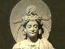

  
[Intangible Textual Heritage](../../index)  [Buddhism](../index) 
[Index](index)  [Previous](j1139)  [Next](j1141) 

------------------------------------------------------------------------

  
*The Jataka, Volume I*, tr. by Robert Chalmers, \[1895\], at Intangible
Textual Heritage

------------------------------------------------------------------------

### No. 137.

### BABBU-JĀTAKA.

"*Give food to one cat*."--This story was told by the Master while at
Jetavana, about the precept respecting Kāṇā's mother. She was a
lay-sister at Sāvatthi known only as Kāṇā's mother, who had entered the
Paths of Salvation and was of the Elect. Her daughter Kāṇā [1](#fn_192) was married to a husband of the same
caste in another village, and some errand or other made her go to see
her mother. A few days went by, and her husband sent a messenger to say
he wished her to come back. The girl asked her mother whether she should
go, and the mother said she could not go back empty-handed after so long
an absence, and set about making a cake. Just then up came a Brother
going his round for alms, and the mother sat him down to the cake she
had just baked. Away he went

p. 295

and told another Brother, who came up just in time to get the second
cake that was baked for the daughter to take home with her. He told a
third, and the third told a fourth, and so each fresh cake was taken by
a fresh comer. The result of this was that the daughter did not start on
her way home, and the husband sent a second and a third messenger after
her. And the message he sent by the third was that if his wife did not
come back, he should get another wife. And each message had exactly the
same result. So the husband took another wife, and at the news his
former wife fell a-weeping. Knowing all this, the Master put on his
robes early in the morning and went with his alms-bowl to the house of
Kāṇā's mother and sat down on the seat set for him. Then he asked why
the daughter was crying, and, being told, spoke words of consolation to
the mother, and arose and went back to the Monastery.

Now the Brethren came to know how Kāṇā had been stopped three times from
going back to her husband owing to the action of the four Brothers; and
one day they met in the Hall of Truth and began to talk about the
matter. The Master came into the Hall \[478\] and asked what they were
discussing, and they told him. "Brethren," said he, "think not this is
the first time those four Brothers have brought sorrow on Kāṇā's mother
by eating of her store; they did the like in days gone by too." So
saying he told this story of the past.

\_\_\_\_\_\_\_\_\_\_\_\_\_\_\_\_\_\_\_\_\_\_\_\_\_\_\_\_\_

Once on a time when Brahmadatta was reigning in. Benares, the Bodhisatta
was born a stone-cutter, and growing up became expert in working stones.
Now in the Kāsi country there dwelt a very rich merchant who had amassed
forty crores in gold. And when his wife died, so strong was her love of
money that she was re-born a mouse and dwelt over the treasure. And one
by one the whole family died, including the merchant himself. Likewise
the village became deserted and forlorn. At the time of our story the
Bodhisatta was quarrying and shaping stones on the site of this deserted
village; and the mouse used often to see him as she ran about to find
food. At last she fell in love with him; and, bethinking her how the
secret of all her vast wealth would die with her, she conceived the idea
of enjoying it with him. So one day she came to the Bodhisatta with a
coin in her mouth. Seeing this, he spoke to her kindly, and said,
"Mother, what has brought you here with this coin?" "It is for you to
lay out for yourself, and to buy meat with for me as well, my son."
Nowise loth, he took the money and spent a halfpenny of it on meat which
he brought to the mouse, who departed and ate to her heart's content.
And this went on, the mouse giving the Bodhisatta a coin every day, and
he in return supplying her with meat. But it fell out one day that the
mouse was caught by a cat.

"Don't kill me," said the mouse.

"Why not?" said the cat. "I'm as hungry as can be, and really must kill
you to allay the pangs."

"First, tell me whether you're always hungry, or only hungry today."

"Oh, every day finds me hungry again."

"Well then, if this be so, I will find you always in meat; \[479\] only
let me go."

p. 296

"Mind you do then," said the cat, and let the mouse go.

As a consequence of this the mouse had to divide the supplies of meat
she got from the Bodhisatta into two portions and gave one half to the
cat, keeping the other for herself.

Now, as luck would have it, the same mouse was caught another day by a
second cat and had to purchase her release on the same terms. So now the
daily food was divided into three portions. And when a third cat caught
the mouse and a like arrangement had to be made, the supply was divided
into four portions. And later a fourth cat caught her, and the food had
to be divided among five, so that the mouse, reduced to such short
commons, grew so thin as to be nothing but skin and bone. Remarking how
emaciated his friend was getting, the Bodhisatta asked the reason. Then
the mouse told him all that had befallen her.

"Why didn't you tell me all this before?" said, the Bodhisatta. "Cheer
up, I'll help you out of your troubles." So he took a block of the
purest crystal and scooped out a cavity in it and made the mouse get
inside. "Now stop there," said he, "and don't fail to fiercely threaten
and revile all who come near."

So the mouse crept into the crystal cell and waited. Up came one of the
cats and demanded his meat. "Away, vile grimalkin," said the mouse; "why
should I supply you? go home and eat your kittens!" Infuriated at these
words, and never suspecting the mouse to be inside the crystal, the cat
sprang at the mouse to eat her up; and so furious was its spring that it
broke the walls of its chest and its eyes started from its head. So that
cat died and its carcase tumbled down out of sight. And the like fate in
turn befell all four cats. And ever after the grateful mouse brought the
Bodhisatta two or three coins instead of one as before, and by degrees
she thus gave him the whole of the hoard. In unbroken friendship the two
lived together, till their lives ended and they passed away to fare
according to their deserts.

\_\_\_\_\_\_\_\_\_\_\_\_\_\_\_\_\_\_\_\_\_\_\_\_\_\_\_\_\_

The story told, the boaster, as Buddha, uttered this stanza:-- \[480\]

Give food to one cat, Number Two appears:  
A third and fourth succeed in fruitful line;  
--Witness the four that by the crystal died.

His lesson ended, the Master identified the Birth by saying, "These four
Brethren were the four cats of those days, Kāṇā's mother was the mouse,
and I the stone-cutter."

\[*Note*. See Vinaya IV. 79 for the Introductory Story.\]

------------------------------------------------------------------------

### Footnotes

[294:1](j1140.htm#fr_193) The name Kāṇā means
'one-eyed'.

------------------------------------------------------------------------

[Next: No. 138. Godha-Jātaka](j1141)

