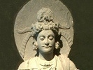

  
[Intangible Textual Heritage](../../index)  [Buddhism](../index) 
[Index](index)  [Previous](j1144)  [Next](j1146) 

------------------------------------------------------------------------

  
*The Jataka, Volume I*, tr. by Robert Chalmers, \[1895\], at Intangible
Textual Heritage

------------------------------------------------------------------------

p. 304 

### No. 142.

### SIGĀLA-JĀTAKA.

"*Thy tightening grip*."--This story was told by the Master while at the
Bamboo-grove, about Devadatta's going about to kill him. For, hearing
the Brethren talking together as to this in the Hall of Truth, the
Master said that, as Devadatta acted now, so he acted in times gone by,
yet failed--to his own grievous hurt--of his wicked purpose. And so
saying, he told this story of the past.

\_\_\_\_\_\_\_\_\_\_\_\_\_\_\_\_\_\_\_\_\_\_\_\_\_\_\_\_\_

Once on a time when Brahmadatta was reigning in Behaves, the Bodhisatta
was born a jackal, and dwelt in a charnel-grove with a great following
of jackals of whom he was king. And at that time there was a festival
held at Rājagaha, and a very wet festival it was, with everybody
drinking hard. Now a parcel of rogues got hold of victual and drink in
abundance, and putting on their best clothes sang and made merry over
their fare. By midnight the meat was all gone, though the liquor still
held out. Then on one asking for more meat and being told there was none
left, said the fellow, "Victuals never lack while I am about. I'll off
to the charnel-grove, kill a jackal prowling about to eat the corpses,
and bring back some meat." So saying he snatched up a club and made his
way out of the city by the sewer to the place, where he lay down, club
in hand, feigning to be dead. Just then, followed by the other jackals,
the Bodhisatta came up and marked the pretended corpse. Suspecting the
fraud, he determined to sift the matter. So he went round to the lee
side and knew by the scent that the man was not really dead. Resolving
to make the man look foolish before leaving him, the Bodhisatta stole
near and took hold of the club with his teeth and tugged at it. The
rascal did not leave go: not perceiving the Bodhisatta's approach, he
\[490\] took a tighter grip. Hereon the Bodhisatta stepped back a pace
or two and said, "My good man, if you had been dead, you would not have
tightened your grip on your club when I was tugging at it, and so have
betrayed yourself." So saying, he uttered this stanza:--

Thy tightening grip upon thy club doth show  
Thy rank imposture--thou’rt no corpse, I trow.

Finding that he was discovered, the rogue sprang to his feet and flung
his club at the Bodhisatta, but missed his aim, "Be off, you brute,"
said

p. 305

he, "I've missed you this time." Turning round, the Bodhisatta said,
"True you have missed me, but be assured you will not miss the torments
of the Great Hell and the sixteen Lesser Hells."

Empty-handed, the rogue left the cemetery and, after bathing in a ditch,
went back into the city by the way he had come.

\_\_\_\_\_\_\_\_\_\_\_\_\_\_\_\_\_\_\_\_\_\_\_\_\_\_\_\_\_

His lesson ended, the Master identified the Birth by saying, "Devadatta
was the rogue of those times, and I the king of the jackals."

------------------------------------------------------------------------

[Next: No. 143. Virocana-Jātaka](j1146)

