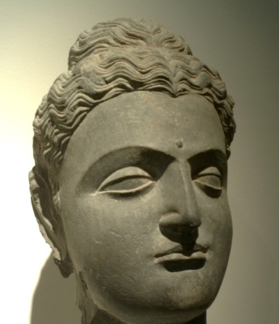

  
[Intangible Textual Heritage](../../index)  [Buddhism](../index) 

------------------------------------------------------------------------

<table width="75%">
<colgroup>
<col style="width: 50%" />
<col style="width: 50%" />
</colgroup>
<tbody>
<tr class="odd">
<td width="50%" data-valign="TOP"></td>
<td width="50%" data-valign="CENTER"><h1 id="the-jataka" data-align="CENTER">The Jataka</h1>
<h2 id="volume-iii" data-align="CENTER">Volume III</h2>
<h4 id="tr.-by-h.t.-francis-and-r.a.-neil" data-align="CENTER">tr. by H.T. Francis and R.A. Neil</h4>
<h5 id="ed.-e.-b.-cowell" data-align="CENTER">ed. E. B. Cowell</h5>
<h4 id="section" data-align="CENTER">[1897]</h4></td>
</tr>
</tbody>
</table>

------------------------------------------------------------------------

[Contents](#contents)    [Start Reading](j3000)    [Page
Index](pageidx)    [Text \[Zipped\]](j3.txt.gz)

------------------------------------------------------------------------

[VOLUME I](../j1/index)   \|    [VOLUME II](../j2/index)   \|   
**VOLUME III**   \|    [VOLUME IV](../j4/index)   \|    [VOLUME
V](../j5/index)   \|    [VOLUME V](../j6/index)

------------------------------------------------------------------------

This is volume three of six of the complete Jataka translation edited by
E.B. Cowell. The Jataka is the treasury of tales of the past lives of
the Buddha.

------------------------------------------------------------------------

 [Title Page](j3000)  
[Table of Contents](j3001)  
[No. 301.: Cullakāliṅga-Jātaka](j3002)  
[No. 302.: Mahāassāroha-Jātaka.](j3003)  
[No. 303.: Ekarāja-Jātaka.](j3004)  
[No. 304.: Daddara-Jātaka.](j3005)  
[No. 305.: Sīlavīmaṁsana-Jātaka.](j3006)  
[No. 306.: Sujāta-Jātaka.](j3007)  
[No. 307.: Palāsa-Jātaka.](j3008)  
[No. 308.: Javasakuṇa-Jātaka.](j3009)  
[No. 309.: Chavaka-Jātaka.](j3010)  
[No. 310.: Sayha-Jātaka.](j3011)  
[No. 311.: Pucimanda-Jātaka.](j3012)  
[No. 312.: Kassapamandiya-Jātaka.](j3013)  
[No. 313.: Khantivādi-Jātaka.](j3014)  
[No. 314.: Lohakumbhi-Jātaka.](j3015)  
[No. 315.: Maṁsa-Jātaka.](j3016)  
[No. 316.: Sasa-Jātaka.](j3017)  
[No. 317.: Matarodana-Jātaka.](j3018)  
[No. 318.: Kanavera-Jātaka.](j3019)  
[No. 319.: Tittira-Jātaka.](j3020)  
[No. 320.: Succaja-Jātaka.](j3021)  
[No. 321.: Kuṭidūsaka-Jātaka.](j3022)  
[No. 322.: Daddabha-Jātaka.](j3023)  
[No. 323.: Brahmadatta-Jātaka.](j3024)  
[No. 324.: Cammasāṭaka-Jātaka.](j3025)  
[No. 325.: Godha-Jātaka.](j3026)  
[No. 326.: Kakkāru-Jātaka.](j3027)  
[No. 327.: Kākāti-Jātaka.](j3028)  
[No. 328.: Ananusociya-Jātaka.](j3029)  
[No. 329.: Kālabāhu-Jātaka.](j3030)  
[No. 330.: Sīlavīmaṁsa-Jātaka.](j3031)  
[No. 331.: Kokālika-Jātaka.](j3032)  
[No. 332.: Rathalaṭṭhi-Jātaka.](j3033)  
[No. 333.: Godha-Jātaka.](j3034)  
[No. 334.: Rājovāda-Jātaka.](j3035)  
[No. 335.: Jambuka-Jātaka.](j3036)  
[No. 336.: Brahāchatta-Jātaka.](j3037)  
[No. 337.: Pīṭha-Jātaka.](j3038)  
[No. 338.: Thusa-Jātaka.](j3039)  
[No. 339.: Bāveru-Jātaka.](j3040)  
[No. 340.: Visayha-Jātaka.](j3041)  
[No. 341.: Kaṇḍari-Jātaka.](j3042)  
[No. 342.: Vānara-Jātaka.](j3043)  
[No. 343.: Kuntani-Jātaka.](j3044)  
[No. 344.: Ambacora-Jātaka.](j3045)  
[No. 345.: Gajakumbha-Jātaka.](j3046)  
[No. 346.: Kesava-Jātaka.](j3047)  
[No. 347.: Ayakūṭa-Jātaka.](j3048)  
[No. 348.: Arañña-Jātaka.](j3049)  
[No. 349.: Sandhibheda-Jātaka.](j3050)  
[No. 350.: Devatāpañha-Jātaka.](j3051)  
[No. 351.: Maṇikuṇḍala-Jātaka.](j3052)  
[No. 352.: Sujāta-Jātaka.](j3053)  
[No. 353.: Dhonasākha-Jātaka.](j3054)  
[No. 354.: Uraga-Jātaka.](j3055)  
[No. 355.: Ghata-Jātaka.](j3056)  
[No. 356.: Kāraṇḍiya-Jātaka.](j3057)  
[No. 357.: Laṭukika-Jātaka.](j3058)  
[No. 358.: Culladhammapāla-Jātaka.](j3059)  
[No. 359.: Suvaṇṇamiga-Jātaka.](j3060)  
[No. 360.: Sussondi-Jātaka.](j3061)  
[No. 361.: Vaṇṇāroha-Jātaka.](j3062)  
[No. 362.: Sīlavīmaṁsa-Jātaka.](j3063)  
[No. 363.: Hiri-Jātaka.](j3064)  
[No. 364.: Khajjopanaka-Jātaka.](j3065)  
[No. 365.: Ahiguṇḍika-Jātaka.](j3066)  
[No. 366.: Gumbiya-Jātaka.](j3067)  
[No. 367.: Sāliya-Jātaka.](j3068)  
[No. 368.: Tacasāra-Jātaka.](j3069)  
[No. 369.: Mittavinda-Jātaka.](j3070)  
[No. 370.: Palāsa-Jātaka.](j3071)  
[No. 371.: Dīghitikosala-Jātaka.](j3072)  
[No. 372.: Migapotaka-Jātaka.](j3073)  
[No. 373.: Mūsika-Jātaka.](j3074)  
[No. 374.: Culladhanuggaha-Jātaka.](j3075)  
[No. 375.: Kapota-Jātaka.](j3076)  
[No. 376.: Avāriya-Jātaka.](j3077)  
[No. 377.: Setaketu-Jātaka.](j3078)  
[No. 378.: Darīmukha-Jātaka.](j3079)  
[No. 379.: Neru-Jātaka.](j3080)  
[No. 380.: Āsaṅka-Jātaka.](j3081)  
[No. 381.: Migālopa-Jātaka.](j3082)  
[No. 382.: Sirikālakaṇṇi-Jātaka.](j3083)  
[No. 383.: Kukkuṭa-Jātaka.](j3084)  
[No. 3841.: Dhammaddhaja-Jātaba.](j3085)  
[No. 385.: Nandiyamiga-Jātaka.](j3086)  
[No. 386.: Kharaputta-Jātaka.](j3087)  
[No. 387.: Sūci-Jātaka.](j3088)  
[No. 388.: Tuṇḍila-Jātaka.](j3089)  
[No. 389.: Suvaṇṇakakkaṭa-Jātaka.](j3090)  
[No. 390.: Mayhaka-Jātaka.](j3091)  
[No. 391.: Dhajaviheṭha-Jātaka.](j3092)  
[No. 392.: Bhisapuppha-Jātaka.](j3093)  
[No. 393.: Vighāsa-Jātaka.](j3094)  
[No. 394.: Vaṭṭaka-Jātaka.](j3095)  
[No. 395.: Kāka-Jātaka.](j3096)  
[No. 396.: Kukku-Jātaka.](j3097)  
[No. 397.: Manoja-Jātaka.](j3098)  
[No. 398.: Sutano-Jātaka.](j3099)  
[No. 399.: Gijjha-Jātaka.](j3100)  
[No. 400.: Dabbhapuppha-Jātaka.](j3101)  
[No. 401.: Dasaṇṇaka-Jātaka.](j3102)  
[No. 402.: Sattubhasta-Jātaka.](j3103)  
[No. 403.: Aṭṭhisena-Jātaka.](j3104)  
[No. 404.: Kapi-Jātaka.](j3105)  
[No. 405.: Baka-Brahma-Jātaka.](j3106)  
[No. 406.: Gandhāra-Jātaka.](j3107)  
[No. 407.: Mahākapi-Jātaka.](j3108)  
[No. 408.: Kumbhakāra-Jātaka.](j3109)  
[No. 409.: Daḷhadhamma-Jātaka.](j3110)  
[No. 410.: Somadatta-Jātaka.](j3111)  
[No. 411.: Susīma-Jātaka.](j3112)  
[No. 412.: Koṭisimbali-Jātaka.](j3113)  
[No. 413.: Dhūmakāri-Jātaka.](j3114)  
[No. 414.: Jāgara-Jātaka](j3115)  
[No. 415.: Kummāsapiṇḍa-Jātaka.](j3116)  
[No. 416.: Parantapa-Jātaka.](j3117)  
[No. 417.: Kaccāni-Jātaka.](j3118)  
[No. 418.: Aṭṭhasadda-Jātaka.](j3119)  
[No. 419.: Sulasā-Jātaka.](j3120)  
[No. 420.: Sumaṅgala-Jātaka.](j3121)  
[No. 421.: Gaṅgamāla-Jātaka.](j3122)  
[No. 422.: Cetiya-Jātaka.](j3123)  
[No. 423.: Indriya-Jātaka.](j3124)  
[No. 424.: Āditta-Jātaka.](j3125)  
[No. 425.: Aṭṭhāna-Jātaka.](j3126)  
[No. 426.: Dīpi-Jātaka.](j3127)  
[No. 427.: Gijjha-Jātaka.](j3128)  
[No. 428.: Kosambī-Jātaka.](j3129)  
[No. 429.: Mahāsuka-Jātaka.](j3130)  
[No. 430.: Cullasuka-Jātaka.](j3131)  
[No. 431.: Hārita-Jātaka.](j3132)  
[No. 432.: Padakusalamāṇava-Jātaka.](j3133)  
[No. 433.: Lomasakassapa-Jātaka.](j3134)  
[No. 434.: Cakkavāka-Jātaka.](j3135)  
[No. 435.: Haliddirāga-Jātaka.](j3136)  
[No. 436.: Samugga-Jātaka.](j3137)  
[No. 437.: Pūtimaṅsa-Jātaka.](j3138)  
[No. 438.: Tittira-Jātaka.](j3139)  
[Index](j3140)  
