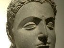

  
[Intangible Textual Heritage](../../index)  [Buddhism](../index) 
[Index](index)  [Previous](j3104)  [Next](j3106) 

------------------------------------------------------------------------

  
*The Jataka, Vol. III*, tr. by H.T. Francis and R.A. Neil, \[1897\], at
Intangible Textual Heritage

------------------------------------------------------------------------

p. 218

### No. 404.

#### KAPI-JĀTAKA. [1](#fn_132)

*"Let not the wise man," etc.*—The Master told this tale while dwelling
in Jetavana, concerning Devadatta being swallowed up by the earth.
Finding that the Brethren were talking about this in the Hall of Truth,
he said, "Devadatta has not been destroyed with his company now for the
first time: he was destroyed before," and he told an old tale.

------------------------------------------------------------------------

Once upon a time when Brahmadatta was king in Benares, the Bodhisatta
was born in the womb of a monkey, and lived in the king's garden with a
retinue of five hundred monkeys. \[356\] Devadatta was also born in the
womb of a monkey, and lived there also with a retinue of five hundred
monkeys. Then one day when the king's family priest had gone to the
garden, bathed and adorned himself, one tricky monkey going ahead of him
sat above the gateway arch of the garden, and let excrement fall on the
priest's head as he went out. When the priest looked up, he let it fall
again in his mouth. The priest turned back, saying in threat to the
monkeys, "Very well, I shall know how to deal with you," and went away
after washing. They told the Bodhisatta that he had been angry and
threatened the monkeys. He made announcement to the thousand monkeys,
"It is not well to dwell near the habitation of the angry; let the whole
troop of monkeys flee and go elsewhere." A disobedient monkey took his
own retinue and did not flee, saying, "I will see about it afterwards."
The Bodhisatta took his own retinue and went to the forest. One day a
female slave pounding rice had put some rice out in the sun and a goat
was eating it: getting a blow with a torch and running away on fire, he
was rubbing himself on the wall of a grass-hut near an elephant-stable.
The fire caught the grass-hut and from it the elephant-stable; in it the
elephants' backs were burnt, and the elephant doctors were attending the
elephants. The family priest was always going about watching for an
opportunity of catching the monkeys. He was sitting in attendance on the
king, and the king said, "Sir, many of our elephants have been injured,
and the elephant doctors do not know how to cure them; do you know any
remedy?" "I do, great king." "What is it?" "Monkey's fat, great king."
"How shall we get it?" "There are many monkeys in the garden." The king
said, "Kill monkeys in the garden and get their fat." The archers went
and killed five hundred monkeys with arrows. One old

p. 219

monkey fled although wounded by an arrow, and though he did not fall on
the spot \[357\], fell when he came to the Bodhisatta's place of abode.
The monkeys said, "He has died when he reached our place of abode," and
told the Bodhisatta that he was dead from a wound he had got. He came
and sat down among the assembly of monkeys, and spoke these stanzas by
way of exhorting the monkeys with the exhortation of the wise, which is
"Men dwelling near their enemies perish in this way:"—

Let not the wise man dwell where dwells his foe:  
One night, two nights, so near will bring him woe.

A fool's a foe to all who trust his word:  
One monkey brought distress on all the herd.

A foolish chief, wise in his own conceit,  
Comes ever, like this monkey, to defeat.

A strong fool is not good to guard the herd,  
Curse to his kindred, like the decoy-bird.

One strong and wise is good the herd to guard,  
Like Indra to the Gods, his kin's reward.

Who virtue, wisdom, learning, doth possess,  
His deeds himself and other men will bless.

Therefore virtue, knowledge, learning, and himself let him regard,  
Either be a lonely Saint or o'er the flock keep watch and ward.

\[358\] So the Bodhisatta, becoming king of monkeys, explained the way
of learning the Discipline.

------------------------------------------------------------------------

After the lesson, the Master identified the Birth: "At that time the
disobedient monkey was Devadatta, his troop was Devadatta's company and
the wise king was myself."

------------------------------------------------------------------------

### Footnotes

[218:1](j3105.htm#fr_134) Cf. *Kākajātaka,* no.
140, vol. i. and *Tibetan Tales,* xliii.

------------------------------------------------------------------------

[Next: No. 405.: Baka-Brahma-Jātaka.](j3106)

