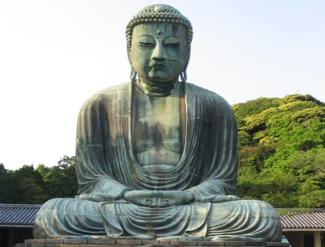

  
[Intangible Textual Heritage](../../index)  [Buddhism](../index) 

------------------------------------------------------------------------

<table width="75%">
<colgroup>
<col style="width: 50%" />
<col style="width: 50%" />
</colgroup>
<tbody>
<tr class="odd">
<td width="50%" data-valign="TOP"></td>
<td width="50%" data-valign="CENTER"><h1 id="the-jataka" data-align="CENTER">The Jataka</h1>
<h2 id="volume-iv" data-align="CENTER">Volume IV</h2>
<h4 id="tr.-w.h.d.-rouse" data-align="CENTER">tr. W.H.D. Rouse</h4>
<h5 id="ed.-e.-b.-cowell" data-align="CENTER">ed. E. B. Cowell</h5>
<h4 id="section" data-align="CENTER">[1901]</h4></td>
</tr>
</tbody>
</table>

------------------------------------------------------------------------

[Contents](#contents)    [Start Reading](j4000)    [Page
Index](pageidx)    [Text \[Zipped\]](j4.txt.gz)

------------------------------------------------------------------------

[VOLUME I](../j1/index)   \|    [VOLUME II](../j2/index)   \|    [VOLUME
III](../j3/index)   \|    **VOLUME IV**   \|    [VOLUME
V](../j5/index)   \|    [VOLUME V](../j6/index)

------------------------------------------------------------------------

This is volume four of six of the complete Jataka translation edited by
E.B. Cowell. The Jataka is the treasury of tales of the past lives of
the Buddha.

------------------------------------------------------------------------

 [Title Page](j4000)  
[Contents](j4001)  
[Additional Notes And Corrections.](j4002)  
[No. 439.: Catu-Dvāra-Jātaka.](j4003)  
[No. 440.: Kaṇha-Jātaka.](j4004)  
[No. 441.: Catu-Posathika-Jātaka.](j4005)  
[No. 442.: Saṅkha-Jātaka.](j4006)  
[No. 443.: Culla-Bodhi-Jātaka.](j4007)  
[No. 444.: Kaṇhadīpāyana-Jātaka.](j4008)  
[No. 445.: Nigrodha-Jātaka.](j4009)  
[No. 446.: Takkaḷa-Jātaka.](j4010)  
[No. 447.: Mahā-Dhamma-Pāla-Jātaka.](j4011)  
[No. 448.: Kukkuṭa-Jātaka.](j4012)  
[No. 449.: Maṭṭa-Kuṇḍali-Jātaka.](j4013)  
[No. 450.: Biḷāri-Kosiya-Jātaka.](j4014)  
[No. 451.: Cakka-Vāka-Jātaka.](j4015)  
[No. 452.: Bhūri-Pañha-Jātaka.](j4016)  
[No. 453.: Mahā-Maṅgala-Jātaka.](j4017)  
[No. 454.: Ghata-Jātaka.](j4018)  
[No. 455.: Māti-Posaka-Jātaka.](j4019)  
[No. 456.: Juṇha-Jātaka](j4020)  
[No. 457.: Dhamma-Jātaka.](j4021)  
[No. 458.: Udaya-Jātaka.](j4022)  
[No. 459.: Pānīya-Jātaka.](j4023)  
[No. 460.: Yuvañjaya-Jātaka.](j4024)  
[No. 461.: Dasaratha-Jātaka.](j4025)  
[No. 462.: Saṁvara-Jātaka.](j4026)  
[No. 463.: Suppāraka-Jātaka.](j4027)  
[No. 464.: Culla-Kuṇāla-Jātaka.](j4028)  
[No. 465.: Bhadda-Sāla-Jātaka.](j4029)  
[No. 466.: Samudda-Vāṇija-Jātaka.](j4030)  
[No. 467.: Kāma-Jātaka.](j4031)  
[No. 468.: Janasandha-Jātaka.](j4032)  
[No. 469.: Mahā-Kaṇha-Jātaka.](j4033)  
[No. 470.: Kosiya-Jātaka.](j4034)  
[No. 471.: Meṇḍaka-Jātaka.](j4035)  
[No. 472.: Mahā-Paduma-Jātaka.](j4036)  
[No. 473.: Mittāmitta-Jātaka.](j4037)  
[No. 474.: Amba-Jātaka.](j4038)  
[No. 475.: Phandana-Jātaka.](j4039)  
[No. 476.: Javana-Haṁsa-Jātaka.](j4040)  
[No. 477.: Culla-Nārada-Jātaka.](j4041)  
[No. 478.: Dūta-Jātaka.](j4042)  
[No. 479.: Kāliṅga-Bodhi-Jātaka.](j4043)  
[No. 480.: Akitta-Jātaka.](j4044)  
[No. 481.: Takkāriya-Jātaka](j4045)  
[No. 482.: Ruru-Jātaka.](j4046)  
[No. 483.: Sarabha-Miga-Jātaka.](j4047)  
[No. 484.: Sālikedāra-Jātaka.](j4048)  
[No. 485.: Canda-Kinnara-Jātaka.](j4049)  
[No. 486.: Mahā-Ukkusa-Jātaka.](j4050)  
[No. 487.: Uddālaka-Jātaka.](j4051)  
[No. 488.: Bhisa-Jātaka.](j4052)  
[No. 489.: Suruci-Jātaka.](j4053)  
[No. 490.: Pañc-Ūposatha-Jātaka.](j4054)  
[No. 491.: Mahā-Mora-Jātaka.](j4055)  
[No. 492.: Taccha-Sūkara-Jātaka.](j4056)  
[No. 493.: Mahā-Vāṇija-Jātaka.](j4057)  
[No. 494.: Sādhīna-Jātaka.](j4058)  
[No. 495.: Dasa-Brāhmaṇa-Jātaka.](j4059)  
[No. 496.: Bhikkhā-Parampara-Jātaka.](j4060)  
[No. 497.: Mātaṅga-Jātaka.](j4061)  
[No. 498.: Citta-Sambhūta-Jātaka.](j4062)  
[No. 499.: Sivi-Jātaka.](j4063)  
[No. 500.: Sirimanda-Jātaka.](j4064)  
[No. 501.: Rohanta-Miga-Jātaka.](j4065)  
[No. 502.: Haṁsa-Jātaka.](j4066)  
[No. 503.: Sattigumba-Jātaka.](j4067)  
[No. 504.: Bhallāṭiya-Jātaka.](j4068)  
[No. 505.: Somanassa-Jataka.](j4069)  
[No. 506.: Campeyya-Jātaka.](j4070)  
[No. 507.: Mahā-Palobhana-Jātaka.](j4071)  
[No. 508.: Pañca-Paṇḍita Jātaka.](j4072)  
[No. 509.: Hatthi-Pāla Jātaka.](j4073)  
[No. 510.: Ayoghara-Jātāka.](j4074)  
