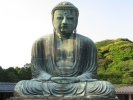

  
[Intangible Textual Heritage](../../index)  [Buddhism](../index) 
[Index](index)  [Previous](j4069)  [Next](j4071) 

------------------------------------------------------------------------

  
*The Jataka, Vol. IV*, tr. by W.H.D. Rouse, \[1901\], at Intangible
Textual Heritage

------------------------------------------------------------------------

p. 281

### No. 506.

#### CAMPEYYA-JĀTAKA.

*"Who is it like," etc.*—This story the Master told while dwelling in
Jetavana, about the fast-day vows. The Master said, "It is well done,
lay Brethren, that ye have taken upon you the fast-day vows. Wise men of
old likewise even renounced the glory of being a Serpent King, and lived
under these vows." Then at their request he told a story of the past.

------------------------------------------------------------------------

Once upon a time, when Aṅga was king in the kingdom of Aṅga, and Magadha
king in Magadha, betwixt the realms of Aṅga and Magadha was a river
Campā, where was a place where serpents dwelt, and here a serpent king
Campeyya held sway.

Sometimes King Magadha took the Aṅga country, sometimes King Aṅga took
Magadha. One day King Magadha, having fought a battle with Aṅga and got
the worse, mounted his charger and took to flight, pursued by Aṅga's
warriors. When he came to the Campā river, it was in flood. But he said,
"Better death drowned in this river than death at the hands of my
enemies!" Then man and horse plunged in the stream.

Now the serpent king Campeyya had built him under the water a jewelled
pavilion; and there at this moment in the midst of his court he was
carousing deep. But the king and his horse plunged into the river just
in front of the Serpent King. The serpent, beholding this magnificent
monarch, conceived a liking for him. Rising from his seat, he made the
king sit down upon his own throne, bidding him fear nought, and asked
why he came plunging into the water. The king told him all as it was.
Then said the serpent, "Fear nothing, O great king! I will make you
master of both kingdoms." Thus he consoled him, and for seven days he
showed him high honour. On the seventh day he with King Magadha left the
serpent palace. Then by the Serpent King's power, King Magadha got
possession of King Aṅga, and slew him, and ruled over the two realms
together. From that time there was firm affiance between him and the
Serpent King. \[455\] Year by year he caused a jewelled pavilion to be
built on the bank of the river Campā, and offered tribute to the Serpent
King at great cost: the Serpent King would come forth with a large
retinue from his palace to receive the tribute, and all the people
beheld the glory of the Serpent King.

p. 282

At that time the Bodhisatta was one of a poor family, and he used to go
down with the king's people to the riverside. There seeing the Serpent
King's glory, he became covetous of it; and in this desire [1](#fn_399) he died, and seven days after the death
of the serpent king Campeyya, the Bodhisatta, having given alms and
lived a virtuous life, came into being in his palace on his royal couch:
his body was like a great festoon of jessamine. When he saw it, he was
filled with remorse. "As a consequence of my good deeds," quoth he, "I
have power laid up in the six chief worlds of sense [2](#fn_400), as corn is laid up in a granary. But
see, here am I born in this reptile shape; what care I for life!" And so
he had thoughts of putting an end to himself. But a young female
serpent, named Sumanā, seeing him, gave the lead to the rest, "This must
be Sakka, mighty in power, born here to us!" Then they all came and made
offering to him, with all manner of musical instruments in their hands.
That serpent's palace of his became as it were the palace of Sakka, the
thought of death left him: he put off his serpent shape, and sat on the
couch in magnificence of dress and adornment. From that time great was
his glory, and he ruled over the serpents. Another time again he
repented, thinking, "What care I for this reptile shape? I will live
under the fasting vows, and from this place I will shake myself free,
amongst men I will go, and learn the Truths, and I will make an end of
pain." But afterwards he still remained in that same palace, fulfilling
the fasting vows, and when the young female serpents came about him all
gaily adorned, he generally violated his rule of virtue. After that he
went forth from the palace into the park, but they followed him thither,
and his vow was broken as before. Then he thought: "I must leave this
palace, and go into the world of men, and there must I live under the
fasting vows." \[456\] So then on the fast-days he went forth from the
palace, and lay on the top of an antheap by the high road, not far from
a frontier village. Said he, "Those who desire my skin or any part of
me, let them take it; or if any would have me a dancing snake, let them
make me so." Thus did he yield his body as a gift, and contracting his
hood he lay there observing the fast-day vows.

Those who went to and fro on the highway espying him, did him worship
with scents and perfumes. And the dwellers in that frontier village,
holding him to be a serpent king of great power, set up a pavilion over
him, spread sand before it, did worship with perfumes and scented
things. Now people began to crave sons by his aid, having faith in the
Great Being and doing him worship. The Great Being kept there the
fasting vows on the fourteenth and fifteenth days of the half-moon,
lying upon the antheap; and on the first day of the lunar half he would
return to his palace; and as he thus fulfilled his vows, time went by.

p. 283

One day his consort Sumanā spoke to him thus: "My lord, you are wont to
go among men to keep your fast-vows. The world of men is dangerous, full
of fear. Suppose some danger should come upon you, tell me now by what
sign I shall learn of it." Then the Great Being led her to the side of a
lucky pond, and said, "If any one strike me or do me hurt, the water in
this pond will become turbid. If a roc bird carry me off, the water will
disappear. If a snake-charmer seize me, the water will turn to the
colour of blood." These three signs explained to her, he went forth from
his palace to keep the fast of the fourteenth day, went and lay down on
the antheap, illuminating the antheap with the sheen of his body. White
was his body as a coil of pure silver, like a ball of red wool was his
head: now in this Birth the Bodhisatta's body was thick as a
plough-head, in the Bhūridatta Birth [1](#fn_401) thick as a thigh, in the Saṅkhapāla
Birth [2](#fn_402) as big round as a
trough-canoe with an outrigger.

In those days there was a young brahmin of Benares come to Takkasilā to
study at the feet of a world-renowned teacher, from whom \[457\] he had
learned the charm which commands all things of sense. Going home along
that road, what should he see but the Great Being."This snake I will
catch," thinks he, "and I will travel through town and village and royal
city, making him dance and amassing great profits." Then he procured
magical herbs, and repeating the magic charm he approached the snake. No
sooner he heard the sound of this charm, than the Great Being felt his
ears as it were pierced by burning splinters, his head was as though
broken by the blow of a sword. "What have we here!" thought he; putting
forth his head from the hood, he beheld the snake-charmer. Then he
thought, "My poison is powerful, and if I am angry and send forth the
breath of my nostrils [3](#fn_403) his body
will be shattered and scattered like a fist-full of chaff; then my
virtue will be broken. I will not look upon him. "Closing his eyes he
drew his head within the hood. The brahmin snake-charmer ate a herb,
repeated his charm, spat upon him: by virtue of herb and charm, wherever
the spittle touched him, blains arose. Then the man seized him by the
tail, dragged him, laid him out at full length: with a goat's-foot staff
he squeezed him till he was weak, then catching tight hold on his head,
crushed him hard. The Great Being opened his mouth wide; the man dropt
spittle in it, and by the herb and charm broke his teeth; the mouth was
full of blood. But the Great Being so feared lest he break his virtue,
that he bore all this torment and never so much as opened an eye to
glance at him. Then the man said, "I'll weaken this royal snake!" From
tail to head he squeezed the snake's body as though he would crush his
very bones to powder. Then he wrapt him in

p. 284

what they call the cloth-wrap, gave him what they call the rope-rubbing,
caught him by the tail and gave him the cotton blow, as they call
it [1](#fn_404). The Great Being's body was all
smeared with blood, and he was in great pain. Seeing that the serpent
was now weak, \[458\] the man made an osier basket in which he laid the
snake. Then he carried him to the village, and made him perform to the
crowd. Black or blue or what not, round figure and square figure, little
or large—whatever the brahmin desires, that the Great Being will do,
dancing, spreading his hood as if by hundreds or by thousands [2](#fn_405). The people were so pleased that they
gave much money: in one day he would take a thousand rupees, and things
worth another thousand. At the first the man had intended to let him go
free when he should gain a thousand pieces of money; but when he got it,
he thought, "In a small frontier village I have gained all this: from
kings and courtiers how much wealth may I look to win!" So he bought a
cart and a pleasure-car, and in the cart loaded his goods, while he sat
in the carriage. Thus with an attendant throng he traversed town and
village, making the Great Being perform, and went on with the intent to
show him off before King Uggasena in Benares; and then he would let him
go.

He used to kill frogs and give them to the royal snake. But the snake
each time refused to eat, that none might be killed for his sake. Then
the man gave him honey and fried corn. But the Great Being refused to
eat these also; for he thought, "If I take food, I shall be in this
basket till I die."

In a month's time the brahmin was come to Benares. There he got much
money by making the snake perform in the villages beyond the gates. The
king also sent for him, and commanded a performance: the man promised
this for the morrow, which was the last day of the half-month. Then the
king sent a drum beating about the city, with proclamation, that on the
morrow a royal snake would dance in the palace court; let the people
then gather to see it in their multitudes. Next day the courtyard of the
palace was adorned, and the brahmin summoned. He brought in the Great
Being in a jewelled basket on a gay rug, which he set down, and himself
took a seat. "The king came down from the upper storey, and sat on his
royal seat in the midst of a great concourse of people. The brahmin took
out the Great Being, and made him dance. The people could not keep
still: thousands of kerchiefs waved in the air; a shower of jewels in
all seven kinds fell about the Bodhisatta.

It was now the full month since the Serpent was caught; and for all that
time he had taken no food. \[459\] Now Sumanā began to think—

p. 285

\[paragraph continues\] "My dear husband
tarries long. It is now a month since he has not returned; what can the
matter be?" So she went and looked at the pond: lo, the water was red as
blood! Then she knew that he must have been caught by a snake-charmer.
Forth from the palace she came, and to the antheap; she saw the place
where he had been caught, and the place where he had been tormented, and
she wept. Then she went to the frontier village, and enquired; and
learning all the fact, she went on to Benares, and in the midst of the
people, above the palace court in the air she stood now lamenting. The
Great Being as he danced looked up in the air, and saw. her, and being
ashamed crept into his basket, and there he lay. When he crept into the
basket, the king cried out, "What is the matter now?" Looking this way
and that way, he saw her poised in the air, and recited the first
stanza:

"Who is it like the lightning shines, or like a blazing star?  
Goddess or Titaness? methinks no human thing you are."

Their conversation is given in the stanzas following:

"No Goddess I, nor Titaness, nor human, mighty king  
A female of the serpent kind, come for a certain thing."

"Full of wrath and rage you show,  
From your eyes the teardrops flow:  
    Say what wrong or what desire  
Brings you, lady? I would know."

"Crawling serpent, fierce as flame!  
So they called him: one there came,  
    Seized him for his profit, sire:  
Freedom for my lord I claim!"

How could such a starveling wight  
Catch a creature full of might?  
    Daughter of the serpents, say,  
How to discern the snake aright?"

\[460\] "Such his might, that e’en this town  
He could burn to cinders down.  
    But he loves the holy way,  
And seeks austerity's renown."

Then the king asked how the man had caught him. She replied in the
following stanza:

"On holy days [1](#fn_406) the royal snake  
At the four-ways used to take  
    Holy vows: a juggler caught him.  
Free my husband for my sake!"

After these words she added yet these other two stanzas, begging his
release:

"Lo sixteen thousand women gay with jewel and with ring,  
Beneath the waters counted him their refuge and their king.

p. 286

"Justly, gently set him free,  
Buy the Serpent liberty,  
    With gold, a hundred kine, a village:  
That will merit win for thee."

\[461\] Then the king recited three stanzas:

"Justly now and gently see  
I buy the Serpent liberty  
    With gold, a hundred kine, a village,  
That will merit win for me."

"A jewelled earring give I thee, a hundred drachms of gold,  
A lovely throne like flower of flax with cushions laid fourfold! [1](#fn_407)

"A bull, a hundred kine, two wives of equal birth with thee:  
Release the holy Snake: the deed will meritorious be."

To this the hunter made reply:

"I want no gifts, your majesty,  
But let the Serpent now go free.  
    Thus I now release the Serpent:  
The deed will meritorious be."

After this speech he took the Great Being out of his basket. The Serpent
King came forth and crept into a flower, where he put off his shape and
reappeared in the form of a young man magnificently arrayed: there he
stood, as though he had cleft the earth and come through. And down from
the sky came Sumanā, and stood beside him. The Serpent King stood
reverently joining his hands in respect to the king.

------------------------------------------------------------------------

\[462\] To make all clear, the Master recited two stanzas:

"The Serpent King Campeyyaka addressed the King, now free:  
"O King of Kāsi, fostering lord, all honour now to thee!  
I do thee reverence, ere I go again my home to see."

"Superhuman beings may  
Hardly win belief, they say.  
    If you speak the truth, O Serpent,  
Where's your palace? Show the way."

------------------------------------------------------------------------

But the Great Being, to make him believe, swore an oath as follows in
these two stanzas:

"Should the wind move mountains high,  
Moon and sun fall from the sky,  
    Flow upstream the running rivers,  
I, O King! could never lie.

"Split the sky, the sea run dry,  
Bounteous mother earth awry  
    Crumpling [2](#fn_408) roll, uproot Mount
Meru,  
Yet, O King, I could not lie!"

p. 287

But notwithstanding this assurance, he still disbelieved the Great
Being, and said—

"Superhuman beings may  
Hardly win belief, they say.  
\[463\]    If you speak the truth, O Serpent!  
Where's your palace? Show the way."

Again he repeated the same stanza, adding, "You must be grateful for the
good deeds wrought by me: whether I should believe you to be right or
not, however, that is for me to decide." This he made clear in the next
stanza:

"Deadly envenomed, full of might,  
Quick in quarrel, shining bright,  
    You are freed by me from prison:  
Then is gratitude my right."

The Great Being made oath thus to win his belief:

"He that will no thanks return,  
Happiness should never learn:  
    He should die in basket-prison,  
He in horrid hell should burn!"

Now the king believed him, and thanked him thus:

"As that vow of thine is true,  
Anger flee and hate eschew:  
    As we flee the fire in summer,  
May the roc-birds flee from you!" [1](#fn_409)

The Great Being too on his part said another stanza meaning to thank the
king:

"As a mother would have done  
To an only well-loved son,  
    You are kind to all the serpents:  
We will serve you, every one."

\[464\] Now the king eager to visit the serpent's world, gave command
that his army should be made ready to go in the following stanza:

"Yoke the royal cars, and stand  
Trained Cambodian mules at hand,  
    Elephants in golden trappings:  
We will visit serpent-land!"

------------------------------------------------------------------------

The next is a stanza of the Perfect Wisdom:

"Bounce the tabors, thump the drums,  
Conch and cymbal sounds and thrums,  
    Glorious mid a host of women  
See King Uggasena comes."

------------------------------------------------------------------------

p. 288

At the moment he left the city, the Great Being by his power made
visible in the serpent world an enclosing wall of seven precious things,
and gate-towers, and all the road of approach to the abode of the
serpents he made to be gloriously adorned. By this road the king with
his following entered the palace, and saw a delightful spot with
mansions in it.

------------------------------------------------------------------------

Explaining this, the Master said:

"The lord of Kāsi saw the ground sprinkled with golden sand,  
Fair flowers of coral [1](#fn_410) strewn
around, gold towers on every hand.

"So then the King did enter in Campeyya's halls divine,  
Which like the brazen thunderbolt [2](#fn_411)
or ruddy sun did shine.

"Into Campeyya's halls divine the King his entrance made:  
A thousand perfumes scent the air, a thousand trees give shade.

"Within Campeyya's palace once the King his step advanced,  
Celestial harps made melody, fair serpent-maidens danced."

\[465\] "He is shown a golden seat  
Cushioned and with sandal sweet,  
    Where the bevy of fair maidens  
Tread the halls with thronging feet."

------------------------------------------------------------------------

No sooner was he there seated, than they set before him food divine of
choice flavour, and they gave it also to the sixteen thousand women and
to the rest of the company. For seven days he with his retinue partook
of the divine food and drink, and enjoyed all manner of pleasure.
Sitting in his fair seat he praised the glory of the Great Being. "O
King of the serpents," said he, "why did you leave all this
magnificence, to lie on an ant-heap, in the world of men, and to keep
the fast-day vows?" The other told him.

------------------------------------------------------------------------

To explain this, the Master said:

"There the King in pleasure stayed.  
To Campeyya then he said:  
"Glorious mansions these of thine!  
Ruddy like the sun they shine.  
Such on earth are none to see:  
Why wouldst thou a hermit be?

"Fair and fine these damsels stand,  
    Who with taper-fingers hold  
Drink in either red-stained hand,  
    Breast and body girt with gold.  
Such on earth are none to see:  
Why wouldst thou a hermit be?

p. 289

\[466\] 

"River, fishpond, glassy-fair,  
Each with well-built landing-stair,  
Such on earth are none to see:  
Why wouldst thou a hermit be?

"Heron, peacock, heavenly geese,  
Charms of cuckoo like to these,  
Such on earth are none to see:  
Why wouldst thou a hermit be?

"'Mango, sal, and tilak grown,  
Cassia [1](#fn_412), trumpet-flower [2](#fn_413) full-blown,  
Such on earth are none to see:  
Why wouldst thou a hermit be?

"See the lakes! and wafted o’er  
Scents divine on every shore:  
Such on earth are none to see:  
Why wouldst thou a hermit be?"

"'Not for life or sons or pelf  
Do I wrestle with myself;  
’Tis my craving, if I can,  
To be born again as Man."

------------------------------------------------------------------------

To this answer the king replied:

"Bravely drest, eyes red and bleared,  
Broad-shouldered, shaven head, and beard,  
    Like an angel-King addressing  
All the world, with sandal smeared.

"Great in might, in power divine,  
Lord of all desires, incline,  
    Serpent-King, to rede my question—  
How our world surpasses thine?"

\[467\] This was answered by the Serpent-King as follows:

"Comes control and cleansing when  
One is in the world of men,  
    Only there: once man, I'll never  
See nor birth nor death again."

The, king listened, and thus replied:

"Surely ’tis good to venerate the wise  
In whom deep wisdom and high thoughts arise [3](#fn_414).  
When thee and all these maids I behold,  
I will do virtuous actions manifold."

To him the Serpent-King said:

"Surely ’tis good to venerate the wise  
In whom deep wisdom and high thoughts arise.  
When me and all these maids thou dost behold,  
Then do thou virtuous actions manifold."

p. 290

After this speech, Uggasena wished to go, and he took leave, saying,
"Serpent King, I have stayed long here, and I must go." The Great Being
pointed to his treasure, and offered him whatever he wished to take,
saying this,

"I renounce it, gold untold,  
Tree-high silver-heaps, behold!  
    Take and make you walls of silver,  
Take and houses make of gold.

\[468\] "Pearls, five thousand loads, I ween,  
Coral blushing in between,  
    Take and spread them in thy palace  
Till nor earth nor dirt be seen.

"Such a mansion as I tell  
Build, and there, O monarch! dwell:  
    Rich will be Benares city:  
Rule it wisely, rule it well."

The king agreed to this suggestion. Then the Great Being sent
proclamation about the city by beat of drum: "Let all the attendants of
the king take what they will of my wealth, gold and fine gold!" And he
sent the treasure to the king loaded in several hundred carts. After
this the king left the serpent world with great pomp, and returned to
Benares. From that time, they say, the ground was all golden throughout
India.

------------------------------------------------------------------------

This discourse ended, the Master said, "Thus wise men of old left the
glories of the serpent world, to keep the fast-day vows." Then he
identified the Birth: "At that time, Devadatta was the snake-charmer,
Rāhula's mother was Sumanā, Sariputta was Uggasena, and I was myself
Campezya King of the Snakes."

------------------------------------------------------------------------

### Footnotes

[282:1](j4070.htm#fr_409) Reading with two MS.,
*patthayamāno.*

[282:2](j4070.htm#fr_410) The six *devalokā.*

[283:1](j4070.htm#fr_411) No. 543 (vi. 157
Pali).

[283:2](j4070.htm#fr_412) No. 524 (v. 161
Pali).

[283:3](j4070.htm#fr_413) Reputed to be
poisonous. Compare ii. 55 and 206 of this translation.

[284:1](j4070.htm#fr_414) These appear to be
technical terms.

[284:2](j4070.htm#fr_415) That is, by his swift
motion giving the appearance of thousands of hoods.

[285:1](j4070.htm#fr_416) Fourteenth and
fifteenth are named.

[286:1](j4070.htm#fr_417) This couplet, and
half the next, occur above, p. 422.

[286:2](j4070.htm#fr_418) Reading *saṁvaṭṭaye,*
as Fausball suggests.

[287:1](j4070.htm#fr_419) "The serpent tribe"
is the literal translation.

[288:1](j4070.htm#fr_420) See Schol. p. 142.

[288:2](j4070.htm#fr_421) Bronze thunderbolts,
shaped somewhat like those which Zeus grasps in Greek vase paintings,
are still used in North India as charms.

[289:1](j4070.htm#fr_422) *Cassia Fistula.*

[289:2](j4070.htm#fr_423) *Bignonia
Suaveolens.*

[289:3](j4070.htm#fr_424) See above, p. 280;
and iii. 306 (translation, p. 190).

------------------------------------------------------------------------

[Next: No. 507.: Mahā-Palobhana-Jātaka.](j4071)

