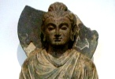

  
[Intangible Textual Heritage](../../index)  [Buddhism](../index) 
[Index](index)  [Previous](j5000)  [Next](j5002) 

------------------------------------------------------------------------

  
*The Jataka, Vol. V*, tr. by H.T. Francis, \[1905\], at Intangible
Textual Heritage

------------------------------------------------------------------------

p. vii

### PREFACE

The delay in the issue of this volume
calls for a few words of explanation. I had hoped that the late Mr. Neil
of Pembroke would have collaborated with me in the fifth volume of the
Jātaka Translation as he had already done in Vol. III. But this was not
to be, and his premature death in 1901, which was generally acknowledged
to be a serious loss to the cause of Oriental learning, no less than to
that of Classical scholarship, threw upon me the burden of undertaking
the entire volume without his efficient aid and criticism. The beloved
Master of our "Guild of Translators," the late Professor Cowell,
assisted me in my task so long as his increasing years and infirmities
allowed him to continue his unwearied efforts for the advancement of
Oriental studies, but he was not able to give to the work that minute
and careful revision which he had so generously lavished on the four
preceding volumes. My labours were also somewhat prolonged by the larger
proportion of this volume which had to be versified. In rendering the
*gāthās* I have done my best to give the exact sense of the Pali, so far
as it was compatible with the exigencies of a metrical version, and if
the result at times should strike the reader as rather feeble and
pointless, I might urge in extenuation that the original is sometimes
equally prosaic and commonplace. Moreover, although I have always
regarded Childers' Pali Dictionary as a work of extraordinary merit for
the time at which it appeared, yet it would no doubt greatly lighten the
labours of translators from the Pali,

p. viii

if the mass of critical annotations now scattered throughout the Pali
Text Society's Publications and various other Oriental Journals could be
gathered together and embodied in the new Pali Dictionary which
Professor Rhys Davids has promised us. Meanwhile I have to thank Mrs.
Bode for her very useful *Index to Pali words discussed in Translations*
which appeared in the *P. T. Journal* for 1897-1901.

It only remains for me to acknowledge my debt of gratitude to Professor
Bendall for the kind help he has given me in the many difficulties I
have referred to him, and for the readiness with which he has placed at
my disposal the stores of his wide reading and critical scholarship. The
sixth and last volume of the Translation, which was left unfinished by
Professor Cowell, is now in the capable hands of Dr Rouse and will
appear in due course edited and completed by him.

#### H. T. FRANCIS.

GONVILLE AND CAIUS COLLEGE,  
       *Oct. 25th,* 1905.

------------------------------------------------------------------------

[Next: Contents](j5002)

