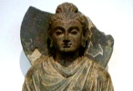

  
[Intangible Textual Heritage](../../index)  [Buddhism](../index) 
[Index](index)  [Previous](j5027)  [Next](j5029) 

------------------------------------------------------------------------

  
*The Jataka, Vol. V*, tr. by H.T. Francis, \[1905\], at Intangible
Textual Heritage

------------------------------------------------------------------------

### No. 535.

#### SUDHĀBHOJANA-JĀTAKA [2](#fn_189).

*"No huckster I," etc.* This was a story told by the Master, while
dwelling at Jetavana, concerning a liberally minded Brother. He was said
to be a man of gentle birth, living at Sāvatthi, who after hearing the
Law preached by the Master was converted and adopted the religious life.
Being perfected in the moral virtues and furnished with the dhuta
precepts [3](#fn_190) and with a heart full of
love for his fellow priests he thrice every day zealously ministered to
the service of the Buddha, the Law, and the Assembly, and showed himself
exemplary in conduct

p. 203

and devoted to charity. Fulfilling the obligations of kindly
civility [1](#fn_191), whatever he received, so
long as there were any recipients, he would give away till he was
himself without food. And his liberality and charitable disposition were
noised abroad in the Assembly of the Brethren. So one day the topic was
started in the Hall of Truth, how that a certain Brother was so
liberally minded and devoted to charity that if he received only
sufficient drink to fill the hollow of the hand, free from all greed, he
would give it to his fellow priests—his will being even as that of a
Bodhisatta. The Master by his divine sense of hearing caught what they
were saying, and issuing forth from his Perfumed Chamber drew nigh and
asked what was the nature of their discussion. And when they answered,
"It was so and so," he said, "This Brother of old, Brethren, was far
from liberal, nay, so stingy that he would not give so much as a drop of
oil on the tip of a blade of grass. So I converted and made him
self-denying and by praising the fruits of charity I firmly established
him in almsgiving; so that on receiving water just enough to fill the
hollow of the hand he would say, "I will not drink a drop without giving
some away," and he received a boon at my hands, and as a result of his
almsgiving he became liberally minded and devoted to charity," and with
these words he told a story of the past.

------------------------------------------------------------------------

Once upon a time when Brahmadatta was king of Benares there lived a
wealthy householder possessed of eighty crores and the king conferred on
him the office of Treasurer. Being thus honoured by the king and highly
esteemed by citizens and country folk alike, he was one day dwelling
upon his worldly prosperity, and he thought, "This glory was not won by
me by slothfulness and sinful acts in a former existence \[383\] but was
attained by accomplishing deeds of virtue; it behoves me to make my
salvation sure in the future." So he sought the king's presence and
addressed him thus, "In my house, sire, is treasure amounting to eighty
crores: accept it from me." And when the king said, "I have no need of
your riches; I have abundant wealth: henceforth take and do whatever you
like with it," he said, "Can I, sire, bestow my money in charity?" The
king said, "Do as you please": and he had six alms-halls built, one at
each of the four city gates, one in the heart of the city and one at the
door of his dwelling-house, and by a daily expenditure of six hundred
thousand pieces of money he set on foot almsgiving on a grand scale, and
so long as he lived he dispensed alms and instructed his sons, saying,
"See that you do not break away from this tradition of mine, of giving
alms," and at the close of his life he was reborn as Sakka. His son, in
like manner giving alms, was reborn as Canda, Canda's son as Suriya,
Suriya's son as Mātali, Mātali's son as Pañcasikha. Now Pañcasikha's
son, the sixth in descent, was the Treasurer named Maccharikosiya (the
Millionaire Miser)) and he still owned eighty crores. But he thought,
"My forefathers were fools. They flung away the wealth that was so
sorely scraped together, but I will guard my treasure. I will not give a
penny to a soul." And he demolished and burned down the alms-hall and
became a confirmed miser. So the beggars assembled at his gate and
stretching forth their arms cried with a loud voice "O Lord High
Treasurer, do not away with,

p. 204

the tradition of your forefathers, but give alms." On hearing this the
people blamed him, saying, "Maccharikosiya has done away with the
tradition of his family." Being ashamed he set a watch to prevent the
beggars from standing at his gate, and being thus left utterly destitute
they never again set eyes upon his door. Thenceforth he continued to
roll money together [1](#fn_192), but he
neither enjoyed it himself nor shared it with his wife and children. He
lived on rice with its red powder, served with sour gruel, and wore
coarse garments, being merely the filaments of roots and stalks of
berries, shading his head with a parasol of leaves, and he rode upon a
crazy old chariot, yoked to worn-out oxen. Thus all this wicked fellow's
money \[384\] was as it were a cocoa-nut found by a dog [2](#fn_193). Now one day when he was going to wait
upon the king he thought he would take the sub-treasurer [3](#fn_194) with him, and at the moment when he
reached his house he found the sub-treasurer seated in the midst of his
wife and children, and eating some rice porridge prepared with powdered
sugar to sweeten it [4](#fn_195) and cooked
with fresh ghee. On seeing Maccharikosiya he rose from his seat and
said, "Come and sit on this couch, Lord High Treasurer, and have some
rice porridge with me." When he saw the rice porridge, his mouth watered
and he longed to partake of it, but the thought occurred to him, "If I
should take some porridge, when the sub-treasurer comes to my house I
shall have to make him some return of hospitality and in this way my
money will be wasted. I will not eat it." Then on being pressed again
and again he refused, saying, "I have already dined; I am sated." But
while the sub-treasurer was enjoying his food, he sat looking on with
his mouth watering, and when the meal was ended he repaired with him to
the palace. On returning home he was overwhelmed with a craving for rice
porridge, but thought, "If I should say I wanted to eat rice porridge, a
lot of people would also want to eat it and a quantity of husked rice
and the like would be wasted. I will not say a word to a creature." So
night and day he passed his time thinking of nothing but porridge, but
from fear of spending his money he told no one and kept his craving to
himself. But being unable to bear with it he gradually grew paler and
paler, and so through fear of wasting his substance he spoke of his
craving to no one, and by and bye becoming very weak he lay down,
hugging his bed. Then his wife came to see him and stroking his back
with her hand she inquired, "Is my lord ill?" "Ill yourself!" he cried,
"I am quite well." "My

p. 205

lord, you have grown pale. Have you anything on your mind? Is the king
displeased or have you been treated with disrespect by your children? Or
have you conceived a craving for something?" "Yes, I have a craving."
"Tell me what it is, my lord." "Can you keep a secret?" "Yes, I will be
silent about any cravings that ought to be kept secret." \[385\] But
even so, through fear of wasting his substance he had not the courage to
tell her, but being repeatedly pressed by her he said, "My dear, one day
I saw the sub-treasurer eating rice porridge prepared with ghee, honey,
and powdered sugar, and from that day I have had a craving to eat the
same kind of porridge." "Poor wretch, are you so badly off? I will cook
porridge enough for all the inhabitants of Benares." Then he felt just
as if he had been struck on the head with a stick. Being angry with her
he said, "I am well aware that you are very rich. If it comes from your
family, you may cook and give rice porridge to the whole city." "Well
then I will make and cook enough for the dwellers in a single street."
"What have you to do with them? Let them eat what belongs to them."
"Then I will make enough for seven households taken at random here and
there." "What are they to you?" "Then I will cook it for the attendants
in this house." "What are they to you?" "Well, then, I will cook for our
kinsfolk only." "What are they to you?" "Then I will cook, my lord, for
you and me." "And pray who are you? It is not allowable in your case."
"I will cook it for you only, my lord." "Pray do not cook it for me: if
you cook it in the house, a lot of people will look for it. But just
give me a measure of husked rice, a quartern of milk, a pound [1](#fn_196) of sugar, a pot of honey and a cooking
vessel, and going into the forest I will there cook and eat my
porridge." She did so, and bidding a slave take it all he ordered him to
go and stand in such and such a place. Then sending the slave forward,
all alone he made himself a veil and in this disguise he went there and
by the river side at the foot of a shrub he had an oven made and
firewood and water brought to him and he said to the slave, "Go and
stand in yonder road and, if you see anyone, make a sign to me, and when
I call you come back to me." Sending off the slave he made a fire and
cooked his porridge. At that moment Sakka, king of heaven, contemplating
the splendid city of the gods, ten thousand leagues in extent, \[386\]
and the golden street sixty leagues long, and Vejayanta [2](#fn_197) reared a thousand leagues high, and
Sudhammā [3](#fn_198) compassing five hundred
leagues, and his throne of yellow marble, sixty leagues in extent, and
his white umbrella with its golden wreath, five leagues in
circumference, and his own person accompanied with a glorious array of

p. 206

twenty-five millions of heavenly nymphs—contemplating, I say, all this
glory of his he thought, "What can I have done to have attained to such
honour as this?" And he saw in his mind's eye the almsgiving he had
established when he was Lord High Treasurer at Benares, and then he
thought, "Where are my descendants born?" and considering the matter he
said, "My son Canda was born in an angel-form, and his son was Suriya."
And marking the birth of all of them, "What," he cried, "has been the
fate of the son of Pañcasikha?" And on reflection he saw that the
tradition of the race had been done away with, and the thought occurred
to him, "This wicked fellow being niggardly neither enjoys his wealth
himself nor gives aught to others: the tradition of the race has been
destroyed by him. When he dies he will be reborn in hell. By admonishing
him and by re-establishing my tradition I will show him how to be reborn
in the city of the gods." So he summoned Canda and the rest and saying,
"Come, we will visit the haunts of men: the tradition of our family has
been abolished by Maccharikosiya, the alms-halls have been burned down
and he neither enjoys wealth himself nor gives aught to others, but now
being desirous of eating porridge and thinking, "If it is cooked in the
house, the porridge will have to be given to someone else as well," he
has gone into the forest and is cooking it all alone. We will go and
convert him and teach him the fruits of almsgiving. If however he were
asked by all of us at once to give us some food, he would fall dead on
the spot. I will go first and when I have asked him for porridge and
have taken my seat, then do you come, one after another, disguised as
brahmins, and beg of him." So saying he himself in the likeness of a
brahmin approached him and cried, "Ho! which is the road to Benares?"
Then Maccharikosiya said, "Have you lost your wits? Do you not even know
the way to Benares? Why are you coming this way? Get you gone from
hence." Sakka, pretending not to hear what he said, came close up to
him, asking him what he said. \[387\] Then he bawled, "I say, you deaf
old brahmin, why are you coming this way? Go yonder." Then Sakka said,
"Why do you bawl so loud? Here I see smoke and a fire, and rice porridge
is cooking. It must be some occasion for entertaining brahmins. I too
when the brahmins are being fed will take somewhat. Why are you driving
me away [1](#fn_199)?" "There is no
entertainment of brahmins here. Be off with you." "Then why are you so
angry? When you eat your meal, I will take a little." He said, "I will
not give you even a single lump of boiled rice. This scanty food is only
just enough to keep me alive, and even this was got by begging. You go
and look for your food elsewhere"—and this he said in reference to the
fact of his having asked his wife for the rice—and he spoke this stanza:

p. 207

No huckster I to buy or vend,  
No stores are mine to give or lend:  
This dole of rice ’twas hard to gain,  
’Tis scarce enough to serve us twain.

On hearing this Sakka said, "I too with honey-sweet voice will repeat a
stanza for you; hearken to me," and though he tried to stop him, saying,
"I do not want to hear your stanza," Sakka repeated a couple of stanzas:

From little one should little give, from moderate means likewise,  
From much give much: of giving nought no question can arise.

This then I tell thee, Kosiya, give alms of that is thine:  
Eat not alone, no bliss is his that by himself shall dine,  
By charity thou mayst ascend the noble path divine.

\[388\] On hearing his words he said, "This is a gracious saying of
thine, brahmin; when the porridge is cooked, thou shalt receive a
little. Pray, take a seat." Sakka sat down on one side. When he was
seated, Canda in like manner drew nigh and starting a conversation in
the same way, though Maccharikosiya kept trying to stop him, he spoke a
couple of stanzas:

Vain is thy sacrifice and vain the craving of thy heart,  
Shouldst thou eat food and grudge to give thy guest some little part.

This then I tell thee, Kosiya, give alms of that is thine, etc.

On hearing his words, the miser very reluctantly said, "Well, sit down,
and you shall have a little porridge." So he went and sat down near
Sakka. Then Suriya in like manner drew nigh and starting a conversation
in the same way, though the miser tried to stop him, he spoke a couple
of stanzas:

Real thy sacrifice nor vain the craving of thy heart,  
Shouldst thou not eat thy food alone, but give thy guest a part.

This then I tell thee, Kosiya, etc.

On hearing his words the miser with great reluctance said, "Well, sit
down, and you shall have a little." So Suriya went and sat by Canda.
Then Mātali in like manner drew nigh and starting a conversation, though
the miser tried to stop him, spoke these stanzas:

Who offers gifts to lake or flood of Gayā's stream that laves  
Or Timbaru or Doṇa shrine with rapid-flowing waves,  
Herein gains fruit of sacrifice and craving of his heart,  
If with a guest he shares his food nor sits and eats apart.

This then I tell thee, Kosiya, etc.

\[389\] On hearing his words also, overwhelmed as it were with a
mountain peak, he reluctantly said, "Well, sit down, and you shall have
a little." Mātali came and sat by Suriya. Then Pañcasikha in like manner
drew nigh and starting a conversation, though the miser tried to stop
him, spoke a couple of stanzas:

p. 208

Like fish that swallows greedily hook fastened to a line  
Is he who with a guest at hand all by himself shall dine.

This then I tell thee, Kosiya, etc.

Maccharikosiya on hearing this, with a painful effort and groaning
aloud, said, "Well, sit down, and you shall have a little." So
Pañcasikha went and sat by Mātali. And when these five brahmins had just
taken their seats, the porridge was cooked. Then Kosiya taking it from
the oven told the brahmins to bring their leaves. Remaining seated as
they were they stretched forth their hands and brought leaves of a
creeper from the Himalayas. Kosiya on seeing them said, "I cannot give
you any porridge in these large leaves of yours: get some leaves of the
acacia and similar trees." They gathered such leaves and each one was as
big as a warrior's shield. So he helped all of them to some porridge
with a spoon. By the time he had helped the last of all, there was still
plenty left in the pot. After serving the five brahmins he himself sat
down, holding the pot. At that moment Pañcasikha rose up and putting off
his natural form was changed into a dog and came and stood in front of
them and made water. Each of the brahmins covered up his porridge with a
leaf. A drop of the dog's water fell on the back of Kosiya's hand.
\[390\] The brahmins fetched water in their jars and mixing it with the
porridge pretended to eat it. Kosiya said, "Give me too some water and
after washing my hand I will take some food." "Fetch water for
yourself," they said, "and wash your hand." "I gave you porridge; give
me a little water." "We do not make a business of exchanging alms [1](#fn_200)." "Well then guard this cooking pot and,
after I have washed my hand, I will come back," and he descended to the
river side. At that moment the dog filled the pot with urine. Kosiya on
seeing him make water took a big stick and drew nigh, threatening him.
The dog was now transformed into a spirited blood horse and, as it
pursued him, it assumed various colours. Now it was black, now white,
now gold-coloured, now dappled. At one time high, at another time low of
stature. Thus in many different appearances it pursued Maccharikosiya,
who frightened with the fear of death drew nigh to the brahmins, while
they flew up and stood fixed in the air. On seeing their supernatural
power he said:

Ye noble brahmins, standing in mid air,  
Why does this hound of yours thus strangely wear  
A thousand varied forms, though one he be,  
And tell me truly, brahmins, who are ye?

On hearing this, Sakka, the king of heaven, said:

Canda and Suriya lo! both are here,  
And Mātali the heavenly charioteer,  
I Sakka am, chief god of Thirty-Three,  
And Pañcasikha there is chasing thee.

p. 209

And celebrating Pañcasikha's fame Sakka spoke this stanza:

With tabour, drum, and tambourine they rouse him from his sleep,  
And as he wakes, glad music makes his heart with joy to leap.

On hearing his words Kosiya asked, "By what acts do men attain to
heavenly glory such as this'?" "They that do not practise charity, evil
doers and misers reach not the angel-world, but are reborn in hell." And
by way of showing this Sakka said:

\[391\] 

Whoe’er are miserly niggards born,  
Or priests and holy brahmins scorn,  
Their earthly frame now laid aside,  
In hell, dissolved by death, abide.

And speaking the following stanza, to show how those that are steadfast
in righteousness attain to the angel-world, he said:

Steadfast in right who heaven would win  
Give alms and keep themselves from sin,  
And, with their body laid aside  
By death's decay, in heaven abide.

After these words Sakka said, "Kosiya, we have not come to you for the
sake of the porridge, but from a feeling of pity and compassion for you
are we come," and to make it clear to him he said:

Thou, though to us in former births akin,  
A miser art, a man of wrath and sin;  
’Tis for thy sake we have come down to earth,  
To avert from thee sin's doom—in hell rebirth.

Hearing this Kosiya thought, "They tell me they are my well-wishers;
plucking me out of hell they would fain establish me in heaven." And
being highly pleased he said:

In that ye thus admonish me, ye doubtless seek my good,  
I too will follow your advice, so far as understood.

Henceforth I'll cease from stingy ways, from sinful deed abstain,  
\[392\] Give alms of all, nor e’en a cup, unshared [1](#fn_201), of water drain.

Thus ever giving, Sakka, soon my wealth will minished be,  
Then will I orders take, and lusts of every kind [2](#fn_202) will flee.

Sakka after converting Maccharikosiya taught him the fruits of
alms-giving and made him self-denying, and when by preaching the law he
had established him in the five moral virtues, together with his
attendant gods he returned to the angel-city. Maccharikosiya too went
into the city of Benares and having asked the king's permission he bade
them take and fill all the vessels they could lay hands on with his
treasure and gave it to the beggars. And now he started from the Himavat
upon the right-hand side and on a spot between the Ganges and a natural
lake he built a hut of leaves and becoming an ascetic he lived on roots
and wild berries.

p. 210

\[paragraph continues\] There he dwelt a
long time till he reached old age. At that time Sakka had four
daughters, Hope, Faith, Glory, and Honour, who taking with them many a
heavenly scented garland came to lake Anotatta, to disport themselves in
the water, and after amusing themselves there seated themselves on mount
Manosilā. Just at that moment Nārada, a brahmin ascetic, went to the
palace of the Thirty-Three to rest during the heat of the day and
constructed a dwelling-place for the day in the bowers of Cittakūṭa in
the Nanda grove. And holding in his hand the flower of the coral tree,
to serve as a sunshade, he repaired to Golden Cave, the place where he
dwelt on the top of Manosilā. The nymphs on seeing this flower in his
hand begged it from him.

\[393\] The Master, to make the matter clear, said:

In Gandhamādana's lordly height,  
These nymphs, great Sakka's care, delight;  
To them a saint of world-wide fame  
With goodly bough in hand there came.

This bough with flowers so pure and sweet  
Is deemed for gods and angels meet:  
No demon, none of mortal birth  
Can claim this flower of priceless worth.

Then Faith, Hope, Glory, Honour, those  
Four maids with skins like gold, arose,  
And, peerless ’midst all nymphs confessed,  
The brahmin Nārada addressed,

"Give us, O sage, this coral flower,  
If still to give is in thy power,  
As Sakka's self we'll honour thee,  
And thou in all things blest shalt be."

When Nārada their prayer had heard,  
He straight a mighty quarrel stirred:  
"I need it not; whom ye allow  
To be your queen shall claim the bough."

\[394\] The four nymphs on hearing what he said spoke this stanza:

O Nārada, supreme art thou,  
On whom thou wilt the boon bestow:  
Whom thou shalt with such gift invest,  
Amongst us shall be counted best.

Nārada, on hearing their words, addressing them said:

Fair one [1](#fn_203), such counsel is not
right;  
What brahmin strife would dare excite?  
Take to the lord of sprites your quest,  
If ye would know who's worst or best.

------------------------------------------------------------------------

Then the Master spoke this stanza:

With pride of beauty mad and rage  
Excited by the cunning sage,

p. 211

To Sakka, lord of sprites, they go,  
Who ’mongst them all is best to know.

------------------------------------------------------------------------

\[395\] As they stood asking this question,

These nymphs so earnest in their quest  
Sakka with due respect addressed,  
Ye all in beauty equal are,  
Who thus with strife your peace would mar?"

Being thus addressed by him they said:

Nārada, world-traversing, a sage of might,  
Truth-piercing, steadfast ever in the right,  
Thus spake to us on Gandhamādana's height;  
"To Sakka, lord of spirits, straightway go,  
If who is first or last ye fain would know."

Hearing this Sakka thought, "If I shall say that one of these four
daughters of mine is virtuous beyond the others, the rest will be angry.
This is a case impossible for me to decide; I will send them to Kosiya,
the ascetic in the Himalayas: he shall decide the question for them.".
So he said, "I cannot decide your case. In the Himalayas is an ascetic
called Kosiya: to him I will send a cup of my ambrosia. He eats nothing
without sharing it with another, and in giving he shows discrimination
by bestowing it upon the virtuous. Whichsoever of you shall receive food
at his hand, she must be the best amongst you." And so saying he
repeated this stanza:

The sage that dwells in yon vast wood  
Will not unshared touch any food;  
Kosiya with judgment gifts confers,  
To whom he gives, first place is hers.

\[396\] So he summoned Mātali and sent him to the ascetic, and in
sending him he repeated the following stanza:

On Himavat slopes where Ganges glides  
Towards the south a saint resides:  
Ambrosia, Mātali, take to the saint,  
For food and drink he's waxing faint.

------------------------------------------------------------------------

Then the Master said:

At the god's behest went Mātali,  
On a car with a thousand steeds rode he;  
Unseen he soon by the hermitage stood  
And offered the sage ambrosial food.

------------------------------------------------------------------------

Kosiya took it and even as he stood spoke a couple of stanzas:

A flame of sacrifice while I did raise [1](#fn_204),  
The sun that drives away all gloom to praise,  
Sakka supreme o’er spirit-world that stands—  
Who else?—ambrosia placed within my hands.

p. 212

White like a pearl was it, beyond compare,  
Fragrant and pure, and marvellously fair,  
Never before seen by these eyes of mine;  
What god puts in my hands this food divine?

Then Mātali said:

\[397\] 

I come, O mighty sage, by Sakka sent,  
In haste to bring thee heavenly nutriment:  
This best of food, pray, eat without all fear,  
Thou seest here Mātali, heaven's charioteer.

By eating this twelve evil things are slain,  
Thirst, hunger, discontent, fatigue, and pain,  
Cold, heat, rage, enmity, strife, slander, sloth—  
This heavenly essence eat thou, nothing loth.

Hearing this Kosiya, to make it clear that he had taken a vow upon him,
spoke this stanza:

’Twas wrong to eat alone I thought, so took a vow one day  
To touch no food, unless I gave some part of it away.  
To eat alone is ne’er approved by men of noble mind,  
Whoso with others does not share no happiness may find.

And when Mātali questioned him, saying, "Holy sir, what did you discover
was wrong in eating without giving a portion to others that you took
this vow upon you?" he answered:

All who commit adultery or womenkind do slay,  
Who holy men curse and revile or friendly souls betray,  
And misers, worst of all—that I may ne’er be ranked with such,  
Not e’en a drop of water I unshared will ever touch.

\[398\] On men and women both alike my gifts shall ever flow,  
Sages will praise all such as shall their goods in alms bestow;  
All that are generous in this world and niggard ways eschew,  
Approved by all, will ever be esteemed good men and true.

On hearing this Mātali stood before him in a visible form. At that
moment these four heavenly nymphs stood at the four points of the
compass. Glory at the east, Hope at the south, Faith at the west, Honour
at the north.

------------------------------------------------------------------------

The Master; to clear up the matter, said:

Four nymphs with golden forms so bright,  
Hope, Glory, Faith, and Honour hight,  
At Sakka's bidding earthward sent,  
To Kosiya's cell their footsteps bent.

The maids with forms that glowed like flame  
To each of earth's four quarters came;  
’Fore Mātali (now god confest)  
The sage o’erjoyed one thus addressed,

"Who art thou, nymph, like morning star,  
Illuming Eastern skies afar?

p. 213

Thy form in robe [1](#fn_205) of gold arrayed  
Tell me thy name, O heavenly maid."

\[399\] "I Glory am, man's honoured friend,  
The sinless soul prompt to defend:  
To claim this food, lo! here am I;  
With this my prayer, great sage, comply.

I bliss confer on whom I will  
And all his heart's desire fulfil;  
High priest, my name is Glory, know,  
On me thy heavenly food bestow."

------------------------------------------------------------------------

On hearing this Kosiya said:

Men may be skilful, virtuous, wise,  
Excel in all their wits devise,  
Yet without thee they ne’er succeed;  
In this I blame thy evil deed.

Another slothful, greedy, see,  
Low-born and ugly as may be:  
Blest by thy care and rich withal  
He makes one nobly born his thrall.

Thee then as false and dull, Glory, I recognise,  
Reckless in courting fools and laying low the wise;  
No claim hast thou in sooth to seat or water-pot,  
Much less ambrosial food. Begone, I like thee not.

\[400\] So did she straightway vanish from sight. Then holding converse
with Hope he said:

Who art thou, maiden fair, with teeth so pure and white,  
With rings of burnished gold and spangled bracelets dight,  
In robe of watered sheen and wearing on thy head  
A sprig like ruddy flame by tufts of kusa fed?

Like a wild doe all but by hunter's arrow grazed,  
Thou lookst dull-eyed around as ’twere some creature dazed,  
O softly-glancing maid, what comrade hast thou here,  
That through lone forest glade thou strayst without a fear?

Then she spoke this stanza:

No comrade have I here; from Sakka's heavenly home  
Masakkasāra called, angelic-born I come:  
To claim ambrosial food Hope now appears to thee;  
O hearken, noble sage, and grant this boon to me.

\[401\] On hearing this Kosiya. said, "They tell me that whosoever
pleases you, to him by accomplishing the fruition of hope you grant
hope, and whosoever pleases you not, to him you grant it not. Success
does not come to him through you in this case, but you bring about his
destruction," and by way of illustration he said:

p. 214

Merchants through hope seek treasure far and wide,  
And taking ship on ocean's billows ride:  
There sometimes do they sink to rise no more,  
Or else escaping their lost wealth deplore.

In hope their fields the farmers plough and till,  
Sow seeds and labour with their utmost skill;  
But should some plague, or drought afflict the soil  
No harvest will they reap for all their toil.

Ease-loving men, led on by hope, take heart  
And for their lord's sake play a manly part,  
Oppressed by foes on every side they fall  
And fighting for their lord lose life and all.

Grain-stores and wealth renouncing for their kin,  
Through hope aspiring heavenly bliss to win,  
Long time harsh penances they undergo,  
And by bad ways attain to state of woe.

Deceiver of mankind, thy suit is vain,  
Thy idle craving for this boon restrain,  
No claim hast thou to seat or water-pot:  
Much less to heavenly food. Begone, I like thee not.

\[402\] She too on being rejected straightway vanished from sight. Then
holding converse with Faith he spoke this stanza:

Famed nymph in blaze of glory drest,  
Standing towards the ill-omened West,  
Thy form in robe of gold arrayed,  
Tell me thy name, illustrious maid.

Then she repeated a stanza:

My name is Faith, man's honoured friend,  
The sinless soul prompt to defend:  
To claim this food, lo! here am I;  
With this my prayer, great sage, comply.

Then Kosiya said, "Those mortals that in believing the words of first
one and then another do this or that, do that which they ought not to do
more often than that which they ought to do, and verily it is all done
through you," and he repeated these stanzas:

Through faith at times men freely alms dispense,  
Show self-control, restraint and abstinence:  
\[403\] At times again through thee from grace they fall,  
Slander and lie and cheat and steal withal.

With wives, chaste, faithful, and of high degree,  
A man may circumspect and prudent be,  
May curb his passions well in such a case,  
Yet in some harlot his whole trust may place.

Through thee, O Faith, adultery is rife,  
Forsaking [1](#fn_206) good thou lead'st a
sinful life.  
No claim hast thou to seat or water-pot:  
Much less ambrosial food. Begone, I like thee not.

p. 215

She too straightway vanished from sight. But Kosiya holding converse
with Honour, as she stood on the north side, repeated these two stanzas:

Like Dawn that gilds the skirts of hateful Night,  
So doth thy beauty burst upon my sight;  
\[404\] O heavenly nymph in form so passing fair,  
Tell me thy name and who thou art declare.

Like to a tender plant [1](#fn_207) whose roots
are fed  
On soil o’er which devouring flames [2](#fn_208) have spread,  
Its wealth of scarlet leaves by summer breezes shed,  
Why dost thou look at me with bashful air,  
Fain as it were to speak, yet standing silent there?

Then she uttered this stanza:

Honour am I, man's cherished friend,  
Who aid to righteous mortals lend;  
Lo here am I this food to claim,  
Yet scarcely dare my wish to frame;  
To woman suing counts as shame.

On hearing this the ascetic repeated two stanzas:

No need for thee to beg and sue,  
Receive what is thy right and due:  
I grant the boon thou durst not crave,  
Accept the food thou fain wouldst have.

\[405\] Deign, nymph, all golden clad, I pray,  
To feast within my cell this day:  
First honouring thee with dainties rare,  
I too this heavenly food would share.

Then follow some stanzas inspired by divine wisdom:

Thus Honour, glorious nymph, at his behest  
In Kosiya's home was welcomed as a guest:  
Fruits and perennial streams therein abound,  
And thronging saints are in its precincts found.

Here flowering shrubs [3](#fn_209) in a dense
mass we see,  
The mango, piyal, bread-fruit, Judas-tree;  
Here sál and bright rose-apple deck the glade,  
There fig and banyan cast their holy shade.

Here many a flower with fragrance scents the wind,  
Here peas and beans, panic and rice we find:  
Bananas everywhere rich clusters show,  
And bamboo reeds in thickest tangle grow.

On the north side, hemmed in by smooth and level bank,  
And fed by purest streams, behold a sacred tank.

There happy fish [4](#fn_210) in peace disport
themselves at will,  
And ’midst abundant food enjoy to take their fill.

\[406\] There happy birds in peace enjoy abundant fare,  
Swans, herons, ospreys too, peacocks with plumage rare,  
Cuckoos and pheasants eke with ruddy geese are there.

p. 216

Hither do lions, tigers, boars resort their thirst to slake.  
This bears, hyenas, wolves are wont their drinking-place to make.

The buffalo, rhinoceros and gayal too are here,  
With antelope, elk, herds of swine, and red and other deer,  
And cats with ears like to a hare's in numbers vast appear.

The mountain slopes are gaily pranked with flowers of varied shade  
And echo to the song of birds that haunt each forest glade.

Thus did the Blessed One sing the praises of Kosiya's hermitage. And now
to show forth the manner of the goddess Honour's entrance therein he
said:

\[407\] 

The fair one leaning on a branch, all clothed with foliage green,  
Like lightning front a thunder-cloud straight flashed upon the scene.  
For her was set a dainty couch  [1](#fn_211),
rich drapings at its head,  
All wrought of fragrant kusa grass, with deer-skin overspread.  
And thus to Honour, heavenly nymph, the holy hermit spake:  
"For thy delight the couch is set; be pleased a seat to take."

The ascetic then pure water from the spring  
In freshly gathered leaves with haste did bring,  
And knowing what her inmost soul would crave  
The ambrosial food to her he gladly gave.

As in her hands the welcome gift she pressed,  
The nymph thus overjoyed the saint addressed:  
"Worship to me and victory thou hast given,  
Lo! now once more I'll seek my native heaven."

The maid intoxicate with pride of fame,  
With Kosiya's blessing, back to Indra came,  
"And see," she cried, "god of the thousand eyes,  
The ambrosia's here—to me award the prize."

Then Sakka and his host of angels paid  
Due honour to the peerless heavenly maid,  
And as she sat on her new seat enthroned,  
Her presence gods and men adoring owned.

\[408\] While thus honouring her this thought occurred to Sakka, "What
can be the reason why Kosiya refusing it to the others gave the ambrosia
to this one alone?" To ascertain the reason of this he again sent
Mātali.

------------------------------------------------------------------------

The Master, in making the matter clear, repeated this stanza:

So Sakka, lord of the Thirty-Three,  
Once more addressing Mātali,  
Said, "Go and bid the saint explain  
Why Honour should the ambrosia gain."

------------------------------------------------------------------------

In obedience to his word Mātali, mounting the car called Vejayanta [2](#fn_212), departed thither.

------------------------------------------------------------------------

p. 217

The Master, to explain the matter, said:

So Mātali then launched a car to voyage through the air,  
With fittings all to match itself, in splendour wondrous fair,  
Its pole of gold, gold well refined, and all its framework built  
With ornament elaborate and overlaid with gilt.

Peacocks in gold depicted were in numbers not a few,  
Horses and cows and elephants, tigers and panthers too,  
Here antelopes and deer are seen as if prepared for fight,  
Here wrought in precious stones are jays and other birds in flight.

To it they yoked a thousand royal steeds of golden hue,  
Each strong as youthful elephant, a splendid sight to view;  
\[409\] Their breasts in golden network clad, with wreaths
begarlanded,  
With loosened trace [1](#fn_213), at a mere
word, swift as the wind they sped.

As Mātali this lordly car ascended with a bound  
The firmament in all ten points re-echoed to the sound:  
And as he journeyed through the air, he made the world to quake,  
And sky and sea and earth with all its rocks and woods did shake.

Right soon he gained the hermitage and wishing to declare  
Due reverence for the holy man he left one shoulder bare,  
And speaking to this brahmin sage, a wise and learned man,  
Well trained in holy lore, ’twas thus that Mātali began:

Hear now, O Kosiya, the words of Indra, heavenly king,  
As to what he is fain to learn, this message, lo! I bring,  
"While Hope and Faith and Glory's claims thou wilt not recognise,  
Pray, why should Honour at thy hands alone receive the prize?"

------------------------------------------------------------------------

\[410\] On hearing his words the ascetic spoke this stanza:

Glory to me, O Mātali, appears a partial jade,  
While Faith, thou charioteer of gods, proves an inconstant maid,  
Hope ever a deceiver loves its promise to betray,  
Honour alone is stablished firm in holy virtue's way.

And now in praise of her virtue he said:

Maidens that still within their homes live, ever guarded well,  
Women now past their prime, and such as still with husbands dwell,  
In one and all should fleshly lust within their heart arise,  
At Honour's voice they check the thought and sinful passion dies.

Where shafts and spears in battle's van are hurtling fast and free,  
And in the rout when comrades fall or turn them round and flee,  
At Honour's voice they check their flight e’en at the cost of life,  
 [2](#fn_214)And panic-stricken as they were
once more renew the strife.

Just as the shore will stem the rush of billows from the main,  
So Honour too will oft the course of wicked folk restrain.  
Then, Mātali, to Indra quick return and make it clear,  
That saints throughout the whole wide world all Honour's name revere

p. 218

\[411\] On hearing this Mātali repeated this stanza:

Who was it, Kosiya, that did suggest this view to thee,  
Was it great Indra, Brahma, or Pajāpati [1](#fn_215) maybe?

This Honour, mighty sage, be sure, to Indra owes her birth,  
And in the angel-world she ranks foremost of all in worth.

While he was still speaking, at that very instant Kosiya became subject
to re-birth. Then Mātali said to him, "Kosiya, thy aggregate of
life [2](#fn_216) is passing from thee: thy
practice of charity [3](#fn_217) is ended. What
hast thou to do with the world of men? We will now go to the
angel-world," and being minded to conduct him thither he spoke this
stanza:

Come now, O saint, and straightway mount the car so dear to me,  
And let me lead thee to the heaven where reign the Thirty-Three.  
Indra is longing sore for thee, to Indra's self akin,  
To-day thy way to fellowship with Indra thou shalt win.

While Mātali was yet still speaking, Kosiya passing away came into
existence in the ranks of the gods without the intervention of
parents [4](#fn_218) and mounting up took his
stand upon the celestial car. Then Mātali conducted him into the
presence of Sakka. Sakka on seeing him was glad at heart and gave him
his own daughter Honour to wife, as his chief consort, and conferred on
him a boundless sovereignty.

------------------------------------------------------------------------

On perceiving the state of things the Master said, "It is the merit of
some illustrious beings that is thus purified," and he repeated the
final stanza:

’Tis thus the acts of holy men to happy issue lead,  
And evermore abides the fruit of meritorious deed.  
\[412\] Whose beheld the ambrosial food to Honour that was given,  
Straight passed away to fellowship with Indra, lord of heaven.

The Master here ended his discourse with these words, "Not now only,
Brethren, but of old also I converted this niggardly fellow who was a
confirmed miser," and so saying he identified the Birth thus: "At that
time Uppalavaṇṇā was the nymph Honour, a Brother of lordly generosity
was Kosiya, Anuruddha was Pañcasikha, Ānanda Mātali, Kassapa Suriya,
Moggallāna Canda, Sāriputta Nārada, and I myself was Sakka.

------------------------------------------------------------------------

### Footnotes

[202:1](j5027.htm#fr_189) Reading *ciraṁ
jīvantū* for *naciraṁ jīvantū,* as in the previous story, p. 185,
*supra.*

[202:2](j5028.htm#fr_190) Compare vol. i. No.
78, *Illīsa-Jātaka.*

[202:3](j5028.htm#fr_191) Hardy's *Eastern
Monachism,* p. 9, *Jāt.* III. 483. 13.

[203:1](j5028.htm#fr_192) *sārānīya,* see
Senart's *Mahāvastu,* vol. I. p. 599, *Jāt.* VI. 224. 8.

[204:1](j5028.htm#fr_193) *saṁgharati, Jāt.*
II. 413. 24, IV. 36. 16, and *saṁghara, Jāt.* V. 222. 16.

[204:2](j5028.htm#fr_194) Evidently a proverb
to denote a useless possession.

[204:3](j5028.htm#fr_195) *anuseṭṭhi* here
clearly denotes some official subordinate to the Lord High Treasurer.
See Fick's *Die Sociale Gliederung im nordöstlichen Indien zu Buddha's*
*Zeit,* note on pp. 167, 168.

[204:4](j5028.htm#fr_196) For *madhura* we
should perhaps read *madhu,* honey, which occurs as one of the
ingredients of the porridge on the next page of the text.

[205:1](j5028.htm#fr_197) *acchara* must be a
weight or measure of capacity. Can it be akin to *acchera* (Maráṭhí) a
half-sher?

[205:2](j5028.htm#fr_198) Sakka's palace.

[205:3](j5028.htm#fr_199) Sakka's hall of
justice.

[206:1](j5028.htm#fr_200) For *nicchubhati* see
Pischel's *Grammatik der Prākrit-Sprachen,* p. 61, and Trenckner's
*Milindapañho,* p. 423. The participle *chuddha* occurs, *Jāt.* v. 302.
4.

[208:1](j5028.htm#fr_201) Any arrangement for
the exchange of alms was forbidden. Cf. *Jātaka* II. notes on pp. 57 and
214, English version.

[209:1](j5028.htm#fr_202) For *datvā* reading
*’datvā,* i.e. *adatvā.*

[209:2](j5028.htm#fr_203) *yathodhika,* each in
its own place. Cf. *Jātaka* III. 381. 22 and IV. 437. 17.

[210:1](j5028.htm#fr_204) *sugatte.* Though
addressing the four, Nārada singles out one nymph. Compare the analogous
usage in the chorus of a Greek play.

[211:1](j5028.htm#fr_205) With *udaggihutta*
compare *udāyudha,* with uplifted weapon.

[213:1](j5028.htm#fr_206) *velli,* which occurs
also *Jāt.* v. 402. 10, and 405. 2, is probably some part of dress.
Compare *saṁvelli,* v. 306. 6, explained by the scholiast as *kacchā.*
Cf. *Cullavagga,* x. 16, *Vinaya Texts Translation,* III. p. 348 (S. B.
E.).

[214:1](j5028.htm#fr_207) *riñcati,* *Jātaka*
v. 146. 19.

[215:1](j5028.htm#fr_208) *ipomoea*.

[215:2](j5028.htm#fr_209) Virgil, *Georgics* I.
84.

[215:3](j5028.htm#fr_210) Many trees and plants
only known by botanical names have been omitted.

[215:4](j5028.htm#fr_211) The names of many
fish, for the most part unknown, are omitted.

[216:1](j5028.htm#fr_212) For *koccha* see
*Vinaya Texts,* translated by Davids and Oldenberg, I. 34, and III. 165.

[216:2](j5028.htm#fr_213) Sakka's chariot. Cf.
*Jāt.* I. 202. 23, II. 254. 13, IV. 355. 17, VI. 103. 6. Elsewhere it is
the name of Sakka's palace, as in V. 386. 1.

[217:1](j5028.htm#fr_214) *asaṁgita,* i.e.
*nissaṅga,* perhaps the Greek σειραφόρος.

[217:2](j5028.htm#fr_215) The scholiast would
take it thus: "And rallying round their rescued lord once more renew the
strife."

[218:1](j5028.htm#fr_216) The same three gods
occur in *Jāt.* VI. 568. Pajāpati here is clearly distinct from Brahma.

[218:2](j5028.htm#fr_217) *Jātaka* I. 106,
English version.

[218:3](j5028.htm#fr_218) With *dānadhamma*
compare *deyyadhamma,* the usual term in Buddhist inscriptions for a
pious gift or votive offering.

[218:4](j5028.htm#fr_219) *opapātika* is a
being who springs into existence without the intervention of parents
and, as it were, uncaused and seeming to appear by chance, but really
due to the *karma* of a being who has passed away elsewhere. *Buddhist
Suttas,* p. 213 (SḄ.E. XI.).

------------------------------------------------------------------------

[Next: No. 536.: Kuṇāla-Jātaka.](j5029)

