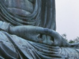

  
[Intangible Textual Heritage](../../index)  [Buddhism](../index) 
[Index](index)  [Previous](j6001)  [Next](j6003) 

------------------------------------------------------------------------

  
*The Jataka, Vol. VI*, tr. by E. B. Cowell and W. H. D. Rouse, \[1907\],
at Intangible Textual Heritage

------------------------------------------------------------------------

p. vi

### ERRATA.

p\. 1, l.4. *Read* Jetavana.

p\. 13, l. 5 from bottom. *Read* transcendent.

p\. 75, l. 2. *Read* Selā.

p.75, l. 27. *Read* Canda's.

p\. 83, l. 25. *Add note:* Compare the trick of Brer Rabbit and the
briar patch.

p\. 126, l. 12. *Read* Sunakkhatta.

p\. 131, l. 23. *Read* Kimpurusa.

p\. 160, last line. *Read* maṁsaṁ.

p\. 164, l. 12. *Read* Goḷakāḷa.

p\. 167, footnotes 1,2. *Read* Sinhalese *for* Burmese. (So
also pp. 1811, 2131, 2181,
2191, 2311,4,6, 236, 2431,
2492, 2511, 2803 2832,
2852, 2872.)

#### VOL. IV.

p\. 304, l. 12 f. *Omit* those *and read:* in the company of the K.
Birth, of the M. Birth, of the C. Birth, of the A. Birth, and of the H.
Birth: these were called the late corners. *Compare* vi p. 30 (p.17 *of
the translation*).

------------------------------------------------------------------------

[Next: Contents](j6003)

