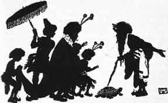

  
[Intangible Textual Heritage](../../index)  [Buddhism](../index) 
[Index](index)  [Previous](jt03)  [Next](jt05) 

------------------------------------------------------------------------

[Buy this Book at
Amazon.com](https://www.amazon.com/exec/obidos/ASIN/B00295RH78/internetsacredte)

------------------------------------------------------------------------

  
*Jataka Tales*, Ellen C. Babbit, \[1912\], at Intangible Textual
Heritage

------------------------------------------------------------------------

### II

### HOW THE TURTLE SAVED HIS OWN LIFE

A KING once had a lake made in the courtyard for the young princes to
play in. They swam about in it, and sailed their boats and rafts on it.
One day the king told them he had asked the men to put some fishes into
the lake.

Off the boys ran to see the fishes. Now, along with the fishes, there
was a Turtle. The boys were delighted with the fishes, but they had
never seen a Turtle, and they were afraid of it, thinking it was a
demon. They ran back to their father, crying, "There is a demon on the
bank of the lake."

The king ordered his men to catch the demon, and to bring it to the
palace. When the Turtle was brought in, the boys cried and ran away.

The king was very fond of his sons, so he ordered the men who had
brought the Turtle to kill it.

"How shall we kill it?" they asked.

"Pound it to powder," said some one. "Bake it in hot coals," said
another.

|                   |
|-------------------|
|  |

So one plan after another was spoken of. Then an old man who had always
been afraid of the water said: "Throw the thing into the lake where it
flows out over the rocks into the river. Then it will surely be killed."

When the Turtle heard what the old man said, he thrust out his head and
asked: "Friend, what have I done that you should do such a dreadful
thing as that to me? The other plans were bad enough, but to throw me
into the lake! Don't speak of such a cruel thing!"

When the king heard what the Turtle said, he told his men to take the
Turtle at once and throw it into the lake.

The Turtle laughed to himself as he slid away down the river to his old
home. "Good!" he said, "those people do not know how safe I am in the
water!"

------------------------------------------------------------------------

[Next: III. The Merchant of Seri](jt05)
