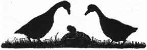
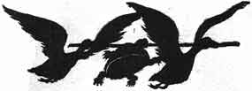

  
[Intangible Textual Heritage](../../index)  [Buddhism](../index) 
[Index](index)  [Previous](jt05)  [Next](jt07) 

------------------------------------------------------------------------

[Buy this Book at
Amazon.com](https://www.amazon.com/exec/obidos/ASIN/B00295RH78/internetsacredte)

------------------------------------------------------------------------

  
*Jataka Tales*, Ellen C. Babbit, \[1912\], at Intangible Textual
Heritage

------------------------------------------------------------------------

### IV

### THE TURTLE WHO COULDN'T STOP TALKING

A TURTLE lived in a pond at the foot of a hill. Two young wild Geese,
looking for food, saw the Turtle, and talked with him. The next day the
Geese came again to visit the Turtle and they became very well
acquainted. Soon they were great friends.

"Friend Turtle," the Geese said one day, "we have a beautiful home far
away. We are going to fly back to it to-morrow. It will be a long but
pleasant journey. Will you go with us?"

"How could I? I have no wings," said the Turtle.

|                   |
|-------------------|
|  |

"Oh, we will take you, if only you can keep your mouth shut, and say not
a word to anybody," they said.

"I can do that," said the Turtle. "Do take me with you. I will do
exactly as you wish."

So the next day the Geese brought a stick and they held the ends of it.
"Now take the middle of this in your mouth, and don't say a word until
we reach home," they said.

|                   |
|-------------------|
|  |

The Geese then sprang into the air, with the Turtle between them,
holding fast to the stick.

The village children saw the two Geese flying along with the Turtle and
cried out: "Oh, see the Turtle up in the air! Look at the Geese carrying
a Turtle by a stick! Did you ever see anything more ridiculous in your
life!"

|                   |
|-------------------|
|  |

The Turtle looked down and began to say, "Well, and if my friends carry
me, what business is that of yours?" when he let go, and fell dead at
the feet of the children.

As the two Geese flew on, they heard the people say, when they came to
see the poor Turtle, "That fellow could not keep his mouth shut. He had
to talk, and so lost his life."

------------------------------------------------------------------------

[Next: V. The Ox Who Won the Forfeit](jt07)
