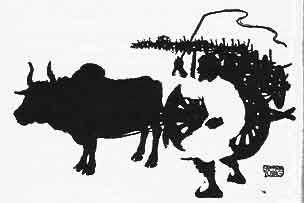
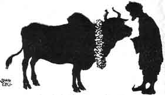

  
[Intangible Textual Heritage](../../index)  [Buddhism](../index) 
[Index](index)  [Previous](jt06)  [Next](jt08) 

------------------------------------------------------------------------

[Buy this Book at
Amazon.com](https://www.amazon.com/exec/obidos/ASIN/B00295RH78/internetsacredte)

------------------------------------------------------------------------

  
*Jataka Tales*, Ellen C. Babbit, \[1912\], at Intangible Textual
Heritage

------------------------------------------------------------------------

### V

### THE OX WHO WON THE FORFEIT

LONG ago a man owned a very strong Ox. The owner was so proud of his Ox,
that he boasted to every man he met about how strong his Ox was.

One day the owner went into a village, and said to the men there: "I
will pay a forfeit of a thousand pieces of silver if my strong Ox cannot
draw a line of one hundred wagons."

The men laughed, and said: "Very well; bring your Ox, and we will tie a
hundred wagons in a line and see your Ox draw them along."

So the man brought his Ox into the village. A crowd gathered to see the
sight. The hundred carts were in line, and the strong Ox was yoked to
the first wagon.

Then the owner whipped his Ox, and said: "Get up, you wretch! Get along,
you rascal!"

|                   |
|-------------------|
|  |

But the Ox had never been talked to in that way, and he stood still.
Neither the blows nor the hard names could make him move.

At last the poor man paid his forfeit, and went sadly home. There he
threw himself on his bed and cried: "Why did that strong Ox act so? Many
a time he has moved heavier loads easily. Why did he shame me before all
those people?"

At last he got up and went about his work. When he went to feed the Ox
that night, the Ox turned to him and said: "Why did you whip me to-day?
You never whipped me before. Why did you call me 'wretch' and 'rascal'?
You never called me hard names before."

Then the man said: "I will never treat you badly again. I am sorry I
whipped you and called you names. I will never do so any more. Forgive
me."

"Very well," said the Ox. "To-morrow I will go into the village and draw
the one hundred carts for you. You have always been a kind master until
to-day. To-morrow you shall gain what you lost."

The next morning the owner fed the Ox well, and hung a garland of
flowers about his neck. When they went into the village the men laughed
at the man again.

|                   |
|-------------------|
|  |

They said: "Did you come back to lose more money?"

"To-day I will pay a forfeit of two thousand pieces of silver if my Ox
is not strong enough to pull the one hundred carts," said the owner.

So again the carts were placed in a line, and the Ox was yoked to the
first. A crowd came to watch again. The owner said: "Good Ox, show how
strong you are! You fine, fine creature!" And he patted his neck and
stroked his sides.

At once the Ox pulled with all his strength. The carts moved on until
the last cart stood where the first had been.

Then the crowd shouted, and they paid back the forfeit the man had lost,
saying: "Your Ox is the strongest Ox we ever saw."

And the Ox and the man went home, happy.

------------------------------------------------------------------------

[Next: VI. The Sandy Road](jt08)
