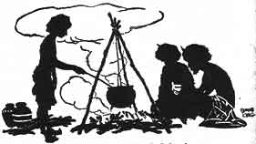
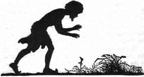

  
[Intangible Textual Heritage](../../index)  [Buddhism](../index) 
[Index](index)  [Previous](jt07)  [Next](jt09) 

------------------------------------------------------------------------

[Buy this Book at
Amazon.com](https://www.amazon.com/exec/obidos/ASIN/B00295RH78/internetsacredte)

------------------------------------------------------------------------

  
*Jataka Tales*, Ellen C. Babbit, \[1912\], at Intangible Textual
Heritage

------------------------------------------------------------------------

### VI

### THE SANDY ROAD

ONCE upon a time a merchant, with his goods packed in many carts, came
to a desert. He was on his way to the country on the other side of the
desert.

The sun shone on the fine sand, making it as hot as the top of a stove.
No man could walk on it in the sunlight. But at night, after the sun
went down, the sand cooled, and then men could travel upon it.

So the merchant waited until after dark, and then set out. Besides the
goods that he was going to sell, he took jars of water and of rice, and
firewood, so that the rice could be cooked.

All night long he and his men rode on and on. One man was the pilot. He
rode first, for he knew the stars, and by them he guided the drivers.

At daybreak they stopped and camped. They unyoked the oxen, and fed
them. They built fires and cooked the rice. Then they spread a great
awning over all the carts and the oxen, and the men lay down under it to
rest until sunset.

|                   |
|-------------------|
|  |

In the early evening, they again built fires and cooked rice. After
supper, they folded the awning and put it away. They yoked the oxen,
and, as soon as the sand was cool, they started again on their journey
across the desert.

Night after night they traveled in this way, resting during the heat of
the day. At last one morning the pilot said: "In one more night we shall
get out of the sand." The men were glad to hear this, for they were
tired.

After supper that night the merchant said: "You may as well throw away
nearly all the water and the firewood. By to-morrow we shall be in the
city. Yoke the oxen and start on."

Then the pilot took his place at the head of the line. But, instead of
sitting up and guiding the drivers, he lay down in the wagon on the
cushions. Soon he was fast asleep, because he had not slept for many
nights, and the light had been so strong in the daytime that he had not
slept well then.

All night long the oxen went on. Near daybreak, the pilot awoke and
looked at the last stars fading in the light. "Halt!" he called to the
drivers. "We are in the same place where we were yesterday. The oxen
must have turned about while I slept."

They unyoked the oxen, but there was no water for them to drink. They
had thrown away the water that was left the night before. So the men
spread the awning over the carts, and the oxen lay down, tired and
thirsty. The men, too, lay down saying, "The wood and water are gone--we
are lost."

But the merchant said to himself, "This is no time for me to sleep. I
must find water. The oxen cannot go on if they do not have water to
drink. The men must have water. They cannot cook the rice unless they
have water. If I give up, we shall all be lost!"

On and on he walked, keeping close watch of the ground. At last he saw a
tuft of grass. "There must be water somewhere below, or that grass would
not be there," he said.

|                   |
|-------------------|
|  |

He ran back, shouting to the men, "Bring the spade and the hammer!"

They jumped up, and ran with him to the spot where the grass grew. They
began to dig, and by and by they struck a rock and could dig no further.
Then the merchant jumped down into the hole they had dug, and put his
ear to the rock. "I hear water running under this rock," he called to
them. "We must not give up!" Then the merchant came up out of the hole
and said to a serving-lad: "My boy, if you give up we are lost! You go
down and try!"

The boy stood up straight and raised the hammer high above his head and
hit the rock as hard as ever he could. He would not give in. They must
be saved. Down came the hammer. This time the rock broke. And the boy
had hardly time to get out of the well before it was full of cool water.
The men drank as if they never could get enough, and then they watered
the oxen, and bathed.

Then they split up their extra yokes and axles, and built a fire, and
cooked their rice. Feeling better, they rested through the day. They set
up a flag on the well for travelers to see.

At sundown, they started on again, and the next morning reached the
city, where they sold the goods, and then returned home.

------------------------------------------------------------------------

[Next: VII. The Quarrel of the Quails](jt09)
