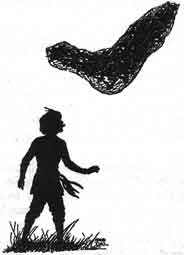
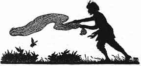

  
[Intangible Textual Heritage](../../index)  [Buddhism](../index) 
[Index](index)  [Previous](jt08)  [Next](jt10) 

------------------------------------------------------------------------

[Buy this Book at
Amazon.com](https://www.amazon.com/exec/obidos/ASIN/B00295RH78/internetsacredte)

------------------------------------------------------------------------

  
*Jataka Tales*, Ellen C. Babbit, \[1912\], at Intangible Textual
Heritage

------------------------------------------------------------------------

### VII

### THE QUARREL OF THE QUAILS

ONCE upon a time many quails lived together in a forest. The wisest of
them all was their leader.

A man lived near the forest and earned his living by catching quails and
selling them. Day after day he listened to the note of the leader
calling the quails. By and by this man, the fowler, was able to call the
quails together. Hearing the note the quails thought it was their leader
who called.

When they were crowded together, the fowler threw his net over them and
off he went into the town, where he soon sold all the quails that he had
caught.

The wise leader saw the plan of the fowler for catching the quails. He
called the birds to him and said, "This fowler is carrying away so many
of us, we must put a stop to it. I have thought of a plan; it is this:
The next time the fowler throws a net over you, each of you must put
your head through one of the little holes in the net. Then all of you
together must fly away to the nearest thorn-bush. You can leave the net
on the thorn-bush and be free yourselves."

The quails said that was a very good plan and they would try it the next
time the fowler threw the net over them.

The very next day the fowler came and called them together. Then he
threw the net over them. The quails lifted the net and flew away with it
to the nearest thorn-bush where they left it. They flew back to their
leader to tell him how well his plan had worked.

|                   |
|-------------------|
|  |

The fowler was busy until evening getting his net off the thorns and he
went home empty-handed. The next day the same thing happened, and the
next. His wife was angry because he did not bring home any money, but
the fowler said, "The fact is those quails are working together now. The
moment my net is over them, off they fly with it, leaving it on a
thorn-bush. As soon as the quails begin to quarrel I shall be able to
catch them."

Not long after this, one of the quails in alighting on their feeding
ground, trod by accident on another's head. "Who trod on my head?"
angrily cried the second. "I did; but I didn't mean to. Don't be angry,"
said the first quail, but the second quail was angry and said mean
things.

Soon all the quails had taken sides in this quarrel. When the fowler
came that day he flung his net over them, and this time instead of
flying off with it, one side said, "Now, you lift the net," and the
other side said, "Lift it yourself."

|                   |
|-------------------|
|  |

"You try to make us lift it all," said the quails on one side. "No, we
don't!" said the others, "you begin and we will help," but neither side
began.

So the quails quarreled, and while they were quarreling the fowler
caught them all in his net. He took them to town and sold them for a
good price.

------------------------------------------------------------------------

[Next: VIII. The Measure of Rice](jt10)
