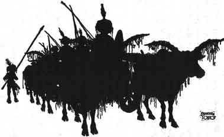
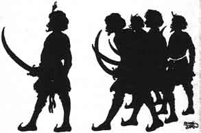

  
[Intangible Textual Heritage](../../index)  [Buddhism](../index) 
[Index](index)  [Previous](jt11)  [Next](jt13) 

------------------------------------------------------------------------

[Buy this Book at
Amazon.com](https://www.amazon.com/exec/obidos/ASIN/B00295RH78/internetsacredte)

------------------------------------------------------------------------

  
*Jataka Tales*, Ellen C. Babbit, \[1912\], at Intangible Textual
Heritage

------------------------------------------------------------------------

### X

### THE WISE AND THE FOOLISH MERCHANT

ONCE upon a time in a certain country a thrifty merchant visited a great
city and bought a great supply of goods. He loaded wagons with the
goods, which he was going to sell as he traveled through the country.

A stupid young merchant was buying goods in the same city. He, too, was
going to sell what he bought as he traveled through the country.

They were both ready to start at the same time.

The thrifty merchant thought, "We cannot travel together, for the men
will find it hard to get wood and water, and there will not be enough
grass for so many oxen. Either he or I ought to go first."

So he went to the young man and told him this, saying, "Will you go
before or come on after me?"

The other one thought, "It will be better for me to go first. I shall
then travel on a road that is not cut up. The oxen will eat grass that
has not been touched. The water will be clean. Also, I shall sell my
goods at what price I like." So he said, "Friend, I will go on first."

This answer pleased the thrifty merchant. He said to himself, "Those who
go before will make the rough places smooth. The old rank grass will
have been eaten by the oxen that have gone before, while my oxen will
eat the freshly grown tender shoots. Those who go before will dig wells
from which we shall drink. Then, too, I will not have to bother about
setting prices, but I can sell my goods at the prices set by the other
man." So he said aloud, "Very well, friend, you may go on first."

At once the foolish merchant started on his journey. Soon he had left
the city and was in the country. By and by he came to a desert which he
had to cross. So he filled great water-jars with water, loaded them into
a large wagon and started across the desert.

Now on the sands of this desert there lived a wicked demon. This demon
saw the foolish young merchant coming and thought to himself, "If I can
make him empty those water-jars, soon I shall be able to overcome him
and have him in my power."

So the demon went further along the road and changed himself into the
likeness of a noble gentleman. He called up a beautiful carriage, drawn
by milk-white oxen. Then he called ten other demons, dressed them like
men and armed them with bows and arrows, swords and shields. Seated in
his carriage, followed by the ten demons, he rode back to meet the
merchant. He put mud on the carriage wheels, hung water-lilies and wet
grasses upon the oxen and the carriage. Then he made the clothes the
demons wore and their hair all wet. Drops of water trickled down over
their faces just as if they had all come through a stream.

|                   |
|-------------------|
|  |

As the demons neared the foolish merchant they turned their carriage to
one side of the way, saying pleasantly, "Where are you going?"

The merchant replied, "We have come from the great city back there and
are going across the desert to the villages beyond. You come dripping
with mud and carrying water-lilies and grasses. Does it rain on the road
you have come by? Did you come through a stream?"

The demon answered, "The dark streak across the sky is a forest. In it
there are ponds full of water-lilies. The rains come often. What have
you in all those carts?"

"Goods to be sold," replied the merchant.

"But in that last big heavy wagon what do you carry?" the demon asked.

"Jars full of water for the journey," answered the merchant.

The demon said, "You have done well to bring water as far as this, but
there is no need of it beyond. Empty out all that water and go on
easily." Then he added, "But we have delayed too long. Drive on!" And he
drove on until he was out of sight of the merchant. Then he returned to
his home with his followers to wait for the night to come.

The foolish merchant did as the demon bade him and emptied every jar,
saving not even a cupful. On and on they traveled and the streak on the
sky faded with the sunset. There was no forest, the dark line being only
clouds. No water was to be found. The men had no water to drink and no
food to eat, for they had no water in which to cook their rice, so they
went thirsty and supperless to bed. The oxen, too, were hungry and
thirsty and dropped down to sleep here and there. Late at night the
demons fell upon them and easily carried off every man. They drove the
oxen on ahead of them, but the loaded carts they did not care to take
away.

A month and a half after this the wise merchant followed over the same
road. He, too, was met on the desert by the demon just as the other had
been. But the wise man knew the man was a demon because he cast no
shadow. When the demon told him of the ponds in the forest ahead and
advised him to throw away the water-jars the wise merchant replied, "We
don't throw away the water we have until we get to a place where we see
there is more."

Then the demon drove on. But the men who were with the merchant said,
"Sir! those men told us that yonder was the beginning of a great forest,
and from there onwards it was always raining. Their clothes and hair
were dripping with water. Let us throw away the water-jars and go on
faster with lighter carts!"

Stopping all the carts the wise merchant asked the men, "Have you ever
heard any one say that there was a lake or pond in this desert? You have
lived near here always."

"We never heard of a pond or lake," they said.

"Does any man feel a wind laden with dampness blowing against him?" he
asked.

"No, sir," they answered.

"Can you see a rain cloud, any of you?" said he.

"No, sir, not one," they said.

"Those fellows were not men, they were demons!" said the wise merchant.
"They must have come out to make us throw away the water. Then when we
were faint and weak they might have put an end to us. Go on at once and
don't throw away a single half-pint of water."

So they drove on and before nightfall they came upon the loaded wagons
belonging to the foolish merchant.

Then the thrifty merchant had his wagons drawn up in a circle. In the
middle of the circle he had the oxen lie down, and also some of the men.
He himself with the head men stood on guard, swords in hand and waited
for the demons. But the demons did not bother them. Early the next day
the thrifty merchant took the best of the wagons left by the foolish
merchant and went on safely to the city across the desert.

|                   |
|-------------------|
|  |

There he sold all the goods at a profit and returned with his company to
his own city.

------------------------------------------------------------------------

[Next: XI. The Elephant Girly-Face](jt13)
