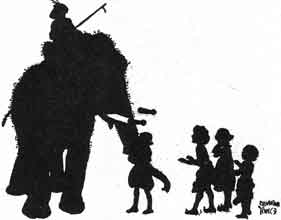

  
[Intangible Textual Heritage](../../index)  [Buddhism](../index) 
[Index](index)  [Previous](jt15)  [Next](jt17) 

------------------------------------------------------------------------

[Buy this Book at
Amazon.com](https://www.amazon.com/exec/obidos/ASIN/B00295RH78/internetsacredte)

------------------------------------------------------------------------

  
*Jataka Tales*, Ellen C. Babbit, \[1912\], at Intangible Textual
Heritage

------------------------------------------------------------------------

### XIV

### THE KING'S WHITE ELEPHANT

ONCE upon a time a number of carpenters lived on a river bank near a
large forest. Every day the carpenters went in boats to the forest to
cut down the trees and make them into lumber.

One day while they were at work an Elephant came limping on three feet
to them. He held up one foot and the carpenters saw that it was swollen
and sore. Then the Elephant lay down and the men saw that there was a
great splinter in the sore foot. They pulled it out and washed the sore
carefully so that in a short time it would be well again.

Thankful for the cure, the Elephant thought: "These carpenters have done
so much for me, I must be useful to them."

|                   |
|-------------------|
|  |

So after that the Elephant used to pull up trees for the carpenters.
Sometimes when the trees were chopped down he would roll the logs down
to the river. Other times he brought their tools for them. And the
carpenters used to feed him well morning, noon and night.

Now this Elephant had a son who was white all over--a beautiful, strong
young one. Said the old Elephant to himself, "I will take my son to the
place in the forest where I go to work each day so that he may learn to
help the carpenters, for I am no longer young and strong."

|                   |
|-------------------|
|  |

So the old Elephant told his son how the carpenters had taken good care
of him when he was badly hurt and took him to them. The white Elephant
did as his father told him to do and helped the carpenters and they fed
him well.

When the work was done at night the young Elephant went to play in the
river. The carpenters' children played with him, in the water and on the
bank. He liked to pick them up in his trunk and set them on the high
branches of the trees and then let them climb down on his back.

|                   |
|-------------------|
|  |

One day the king came down the river and saw this beautiful white
Elephant working for the carpenters. The king at once wanted the
Elephant for his own and paid the carpenters a great price for him. Then
with a last look at his playmates, the children, the beautiful white
Elephant went on with the king.

The king was proud of his new Elephant and took the best care of him as
long as he lived.

------------------------------------------------------------------------

[Next: XV. The Ox Who Envied the Pig](jt17)
