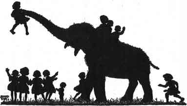
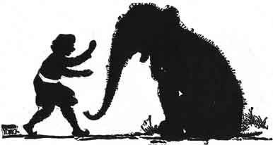
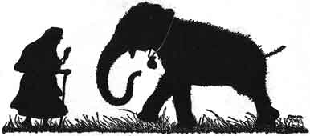

  
[Intangible Textual Heritage](../../index)  [Buddhism](../index) 
[Index](index)  [Previous](jt17)  [Next](jt19) 

------------------------------------------------------------------------

[Buy this Book at
Amazon.com](https://www.amazon.com/exec/obidos/ASIN/B00295RH78/internetsacredte)

------------------------------------------------------------------------

  
*Jataka Tales*, Ellen C. Babbit, \[1912\], at Intangible Textual
Heritage

------------------------------------------------------------------------

### XVI

### GRANNY'S BLACKIE

ONCE upon a time a rich man gave a baby Elephant to a woman.

She took the best of care of this great baby and soon became very fond
of him.

The children in the village called her Granny, and they called the
Elephant "Granny's Blackie."

The Elephant carried the children on his back all over the village. They
shared their goodies with him and he played with them.

"Please, Blackie, give us a swing," they said to him almost every day.

|                   |
|-------------------|
|  |

"Come on! Who is first?" Blackie answered and picked them up with his
trunk, swung them high in the air, and then put them down again,
carefully.

But Blackie never did any work.

He ate and slept, played with the children, and visited with Granny.

One day Blackie wanted Granny to go off to the woods with him.

"I can't go, Blackie, dear. I have too much work to do."

Then Blackie looked at her and saw that she was growing old and feeble.

"I am young and strong," he thought. "I'll see if I cannot find some
work to do. If I could bring some money home to her, she would not have
to work so hard."

So next morning, bright and early, he started down to the river bank.

There he found a man who was in great trouble. There was a long line of
wagons so heavily loaded that the oxen could not draw them through the
shallow water.

When the man saw Blackie standing on the bank he asked, "Who owns this
Elephant? I want to hire him to help my Oxen pull these wagons across
the river."

A child standing near by said, "That is Granny's Blackie."

"Very well," said the man, "I'll pay two pieces of silver for each wagon
this Elephant draws across the river."

Blackie was glad to hear this promise. He went into the river, and drew
one wagon after another across to the other side.

Then he went up to the man for the money.

The man counted out one piece of silver for each wagon.

|                   |
|-------------------|
|  |

When Blackie saw that the man had counted out but one piece of silver
for each wagon, instead of two, he would not touch the money at all. He
stood in the road and would not let the wagons pass him.

The man tried to get Blackie out of the way, but not one step would he
move.

Then the man went back and counted out another piece of silver for each
of the wagons and put the silver in a bag tied around Blackie's neck.

Then Blackie started for home, proud to think that he had a present for
Granny.

The children had missed Blackie and had asked Granny where he was, but
she said she did not know where he had gone.

They all looked for him but it was nearly night before they heard him
coming.

"Where have you been, Blackie? And what is that around your neck?" the
children cried, running to meet their playmate.

But Blackie would not stop to talk with his playmates. He ran straight
home to Granny.

"Oh, Blackie!" she said, "Where have you been? What is in that bag?" And
she took the bag off his neck.

|                   |
|-------------------|
|  |

Blackie told her that he had earned some money for her.

"Oh, Blackie, Blackie," said Granny, "how hard you must have worked to
earn these pieces of silver! What a good Blackie you are!"

And after that Blackie did all the hard work and Granny rested, and they
were both very happy.

------------------------------------------------------------------------

[Next: XVII. The Crab and the Crane](jt19)
