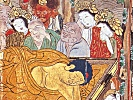

  
[Intangible Textual Heritage](../../index)  [Buddhism](../index) 
[Index](index)  [Previous](lob26)  [Next](lob28) 

------------------------------------------------------------------------

[Buy this Book at
Amazon.com](https://www.amazon.com/exec/obidos/ASIN/B00292BROK/internetsacredte)

------------------------------------------------------------------------

  
*The Life of Buddha*, by A. Ferdinand Herold, tr. by Paul C Blum
\[1922\], at Intangible Textual Heritage

------------------------------------------------------------------------

p. 123

### 5. The Story of the Hermit and the Hare

KAUNDINYA was the first of the five monks to approach the Blessed One.
Fie said: "I have listened, O Master, and if you consider me worthy, I
will be your disciple."

"Did you understand me, Kaundinya?" the Blessed One asked.

"I have faith in the Buddha and the Buddha. I would follow," said
Kaundinya. "I would follow him who has the knowledge, who knows the
worlds, who is a Saint; I would follow him who tames all beings as one
tames wild bulls, whose words are heeded by both Gods and men; I would
follow him who is the supreme Buddha. I have faith in the law and the
law I would follow. The Blessed One has expounded it; it has been
clearly set forth; it leads to salvation, and the wise must acknowledge
its beneficent power. According to your precepts would I live, according
to your saintly precepts, to your precepts that the wise shall praise."

"You have understood, Kaundinya," said the Blessed One. "Come nearer.
Well preached is the law. Lead a saintly life, and have done with
suffering."

p. 124

Then Vashpa came to the Buddha to profess his faith, and he was followed
by Bhadrika, Mahanaman and Asvajit. And presently there were six saints
in the world.

The Blessed One was still in the Deer Park when a young man named Yasas
arrived. Yasas was the son of a wealthy merchant of Benares. He had been
leading a worldly existence, but he had learned the vanity of such
things, and he was now seeking the sacred peace of the woods. The
Blessed One saw Yasas; he spoke to him, and Yasas announced that he was
ready to walk in the path of holiness.

The father of Yasas came to the Deer Park to look for his son. He wanted
to discourage him, to make him turn aside from the path of holiness. But
he heard the Buddha speak; his words impressed him, and he believed in
him. The mother and the wife of Yasas also professed their belief in the
truth of the law, but while Yasas joined the monks, his father, his
mother and his wife returned to their home in Benares.

Four friends of Yasas, Vimala, Subahu, Purnajit and Gavampati, were
amused at the step he had taken. They said:

"Let us go to the Deer Park and look for Yasas. We shall convince him of
his mistake, and he will return with us."

p. 125

Upon entering the wood, they found the Buddha instructing his disciples.
He was saying:

"There was once a hermit who dwelt in a ravine far up in the mountains.
He lived miserably and alone. His clothes were made out of bark; he
drank only water, and he ate nothing but roots and wild fruit. His sole
companion was a hare. This hare could speak like a human being, and he
liked to talk to the hermit. He derived great benefit from his
teachings, and he strove earnestly to attain wisdom. Now, one year,
there was a terrible drought: the mountain springs dried up, and the
trees failed to flower or bear fruit. The hermit could no longer find
food or water; he became weary of his mountain retreat, and, one day, he
cast aside his hermit's robe. The hare saw him and said, 'Friend, what
are you doing?" 'You can see for yourself,' replied the hermit. 'I have
no further use for this robe.' 'What!' exclaimed the hare, 'are you
going to leave the ravine?' 'Yes, I shall go among people. I shall
receive alms, and they will give me food, not just roots and fruit.' At
these words the hare became frightened; he was like a child abandoned by
its father, and he cried, 'Do not go, friend! Do not leave me alone!
Besides, many are ruined who go to live in cities! The solitary life of
the forest is alone praiseworthy.' But the hermit was determined: he had
decided to go, he

p. 126

would go. Then the hare said to him: 'You would leave the mountains?
Then leave! But grant me this favor: wait a day longer, just one day.
Stay here to-day, to-morrow you may do as you please.' The hermit
thought, 'Hares are good foragers; they often have a store of provisions
hidden away. To-morrow this one may bring me something to eat.' So he
promised not to leave until the following day, and the hare scampered
off joyously. The hermit was one of those who held Agni in great
reverence, and he was careful always to keep a fire burning in the
ravine. 'I have no food,' he said to himself, 'but at least I can keep
warm until the hare returns.' At dawn the following day, the hare
reappeared, empty-handed. The hermit's face betrayed his disappointment.
The hare bowed to him and said, 'We animals have neither sense nor
judgment; forgive me, worthy hermit, if I have done wrong.' And he
suddenly leaped into the flames. 'What are you doing?' cried the hermit.
He sprang to the fire and rescued the hare. Then the hare said to him,
'I would not have you fail in your duty; I would not have you leave this
retreat. There is no longer any food to be had. I have given my body to
the flames; take it, friend; feed upon my flesh. and stay in the
ravine.' The hermit was deeply moved. He replied, 'I shall not take the
road to the city; I shall remain here, even if I must die of

p. 127

starvation.' The hare was happy; he looked up at the sky and murmured
this prayer: 'Indra, I have always loved the life of solitude. Deign to
hear me, and cause the rain to fall.' Indra heard the prayer. The rail
fell in torrents, and presently the hermit and his friend found all the
food they wanted in the ravine."

After a moment of silence, the Blessed One added:

"At that time, O monks, the hare was I. As for the hermit, he was one of
the evil-minded young men who have just entered the Deer Park. Yes, you
were he, Vimala!"

He rose from his seat.

"Just as I kept you from following the evil path when I was a hare
living in the ravine, Vimala, so shall I show you the way to holiness,
now that I have become the supreme Buddha, and your eyes will see, your
ears will hear. Why, you are already blushing with shame at having tried
to prevent your best friend from finding salvation!"

Vimala fell at the feet of the Blessed One. He professed his faith in
him, and he was received among the disciples. Then Subahu, Purnajit and
Gavampati also decided to accept the sacred word.

Each day the number of disciples increased, and soon the master had
sixty monks ready to propagate the knowledge. He said to them:

p. 128

"O disciples, I am free of all bonds, human and divine. And you, too,
are now free. So start on your way, O disciples, go, out of pity for the
world, for the world's happiness, go. It is to you that Gods and men
will owe their welfare and their joy. Set out on the road, singly and
alone. And teach, O disciples, teach the glorious law, the law glorious
in the beginning, glorious in the middle, glorious in the end; teach the
spirit of the law; teach the letter of the law; to all who hear,
proclaim the perfect, the pure, the saintly life. There 'are some who
are not blinded by the dust of the earth, but they will not find
salvation if they do not hear the law proclaimed. So go, O disciples, go
and teach them the law."

The disciples scattered, and the Blessed One took the road to Uruvilva.

------------------------------------------------------------------------

[Next: 6. The Story of Padmaka](lob28)
