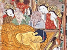
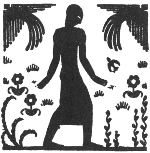

  
[Intangible Textual Heritage](../../index)  [Buddhism](../index) 
[Index](index)  [Previous](lob59) 

------------------------------------------------------------------------

[Buy this Book at
Amazon.com](https://www.amazon.com/exec/obidos/ASIN/B00292BROK/internetsacredte)

------------------------------------------------------------------------

  
*The Life of Buddha*, by A. Ferdinand Herold, tr. by Paul C Blum
\[1922\], at Intangible Textual Heritage

------------------------------------------------------------------------

p. 284

### 18. The Buddha Enters Nirvana

IT was not the season for trees to bloom, yet the two trees that
sheltered the Master were covered with blossoms. The flowers fell gently
upon his couch, and from the sky, sweet melodies slowly drifted down.

The Master said to pious Ananda:

"See: it is not the season for flowers, yet these trees have bloomed,
and the blossoms are raining down upon me. Listen: the air is joyous
with the songs that the happy Gods are singing in the sky in honor of
the Buddha. But the Buddha is paid a more enduring honor than this.
Monks, nuns, believers, all those who see the truth, all those who live
within the law, they are the ones that do the Buddha supreme honor.
Therefore you must live according to the law, Ananda, and, even in the
most trivial matters, you must follow the sacred path of truth."

Ananda was weeping. He walked away, to hide his tears.

He thought, "For many misdeeds I have not yet been forgiven, and I shall
be guilty of many more

p. 285

misdeeds. Oh, I am still far from the saintly goal, and he who took pity
on me, the Master, is about to enter nirvana."

The Master called him back and said:

"Do not grieve, Ananda, do not despair. Remember my words: from all that
delights us, from all that we love, we must one day be separated. How
can that which is born he other than inconstant and perishable? How can
that which is born, how can that which is created, endure for ever? Long
have you honored me, Ananda; you have been a devoted friend. Yours was a
happy friendship, and you were faithful to it in thought, in word and in
deed. You have done great good, Ananda; continue in the right path, and
you will be forgiven your former misdeeds."

Night came on. The inhabitants of Kusinagara had heard that the Master
was reclining under two twin trees, and they came in great crowds to pay
him homage. An aged hermit, Subhadra, appeared, and bowing before the
Master, professed his belief in the Buddha, in the law and in the
community; and Subhadra was the last of the faithful to have the joy of
seeing the Master face to face.

The night was beautiful. Ananda was seated beside the Master. The Master
said:

"Perhaps, Ananda, you will think, 'We no longer have a Master.' But you
must not think that. The

p. 286

law remains, the law that I taught you; let it be your guide, Ananda,
when I shall no longer be with you.

He said again:

"Verily, O monks, all that is created must perish. Never cease to
struggle."

He was no longer of this world. His face was of luminous gold. His
spirit ascended to the realms of ecstasy. He entered nirvana. The earth
shook, and thunder rolled across the sky.

Near the ramparts, at dawn, they of Kusinagara built a great funeral
pile, as though for a king of the world, and there they burned the body
of the Blessed One.

 

 

 

 

 
