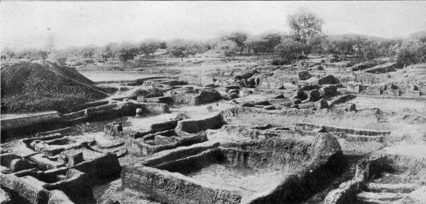

  
[Intangible Textual Heritage](../../index)  [Buddhism](../index) 
[Index](index)  [Previous](pos14)  [Next](pos16) 

------------------------------------------------------------------------

## CANTO X PSALM OF ELEVEN VERSES

### LXIII Kisā-gotamī.

NOW she was born, when Padumuttara was
Buddha, in the city of Haŋsavatī, in a clansman's family. And one day
she heard the Master preach the Dhamma, and assign foremost rank to a
Bhikkhunī with respect to the wearing of rough garments. She vowed that
this rank should one day be hers. In this Buddha-era she was reborn at
Sāvatthī, in a poor family. Gotamī was her name, and from the leanness
of her body she was called Lean Gotamī. And she was disdainfully treated
when married, and was called a nobody's daughter. But when she bore a
son, they paid her honour. Then, when he was old enough to run about and
play, he died, and she was distraught with grief. And, mindful of the
change in folk's treatment of her since his birth, she thought: 'They
will even try to take my child and expose him.' So, taking the corpse
upon her hip, she went, crazy with sorrow, from door to door, saying:
'Give me medicine for my child!' And people said with contempt:
'Medicine! What's the use?' She understood them not. But one sagacious
person thought: 'Her mind is upset with grief for her child. He of the
Tenfold Power will know of some medicine for her.' And he said: 'Dear
woman, go to the Very Buddha, and ask him for medicine to give your
child.' She went to the Vihāra at the time when the Master taught the
Doctrine, and said: 'Exalted One, give me medicine for my child!' The
Master, seeing the promise in her, said: 'Go, enter the town, and at any
house where yet no man hath died, thence bring a little mustard-seed.'
''Tis well, lord!' she said, with mind relieved; and, going to the first
house in the town, said: 'Let me take a little mustard, that I may give
medicine to my child. If in this house no man hath yet died, give me a
little mustard.' 'Who may say how many have not died here?' 'With such
mustard, then, I have nought to do.' So she went on to a second and a
third house, until, by the might of the Buddha, her frenzy left her, her
natural mind was restored, and she thought: 'Even this will be the order
of things in the whole town. The Exalted One foresaw this out of his
pity for my good.' And, thrilled at the thought, she left the town and
laid her child in the charnel-field, saying:

> 'No village law [308](pos15.htm#107-1) is this, no city
> law,  
> No law for this clan, or for that alone;  
> For the whole world–ay, and the gods in heav'n–  
> This is the Law: ALL IS IMPERMANENT!'

So saying, she went to the Master. And he said: 'Gotamī, hast thou
gotten the little mustard?' And she said: 'Wrought is the work, lord, of
the little mustard. Give thou me confirmation.' Then the Master spoke
thus:

> 'To him whose heart on children and on goods
> [309](pos15.htm#107-2)  
> Is centered, cleaving to them in his thoughts,  
> Death cometh like a great flood in the night,  
> Bearing away the village in its sleep.'
> [310](pos15.htm#107-3)

When he had spoken, she was confirmed in the fruition of the First (the
Stream - entry) Path, and asked for ordination. He consented, and she,
thrice saluting by the right, [311](pos15.htm#108-1) went to
the Bhikkhunīs, and was ordained. And not long afterwards, studying the
causes of things, she caused her insight to grow. Then the Master said a
Glory-verse: [312](pos15.htm#108-2)

> 'The man who, living for an hundred years,  
> Beholdeth never the Ambrosial Path,  
> Had better live no longer than one day,  
> So he behold within that day the
> Path.'[313](pos15.htm#108-3)

When he had finished, she attained Arahantship. And becoming pre-eminent
in ascetic habits, she was wont to wear raiment of triple roughness.
Then the Master, seated in the Jeta Grove in conclave, and assigning
rank of merit to the Bhikkhunīs, proclaimed her first among the wearers
of rough raiment. And she, reflecting on what great things she had won,
uttered this Psalm before the Master, in praise of friendship with the
elect:

<table data-align="center">
<colgroup>
<col style="width: 100%" />
</colgroup>
<tbody>
<tr class="odd">
<td><strong></strong>

Friendship with noble souls throughout the world 
The Sage hath praised.<a href="pos15.htm#108-4">314</a> A fool, in sooth, grows wise 
If he but entertain a noble friend. (213) 
Cleave to the men of worth! In them who cleave 
Wisdom doth grow; and in that pious love 
From all your sorrows shall ye be released. (214) 
 
Mark Sorrow well; mark ye how it doth come, 
And how it passes; mark the Eightfold Path 
That endeth woe, the Four great Ariyan Truths. (215) 
Woeful is woman's lot! hath he declared, 
Tamer and Driver of the hearts of men: 
Woeful when sharing home with hostile wives, 
Woeful when giving birth in bitter pain, 
Some seeking death, or e'er they suffer twice, (216) 
Piercing the throat; the delicate poison take. 
Woe too when mother-murdering embryo 
Comes not to birth, and both alike find death. (217) 
 
'Returning <a href="pos15.htm#109-1">315</a> home to give birth to my child, 
I saw my husband in the jungle die. 
Nor could I reach my kin ere travail came. (218) 
My baby boys I lost, my husband too. 
And when in misery I reached my home, 
Lo! where together on a scanty pyre, 
My mother, father, and my brother burn!' (219) 
 
O wretched, ruined woman! all this weight 
Of sorrows hast thou suffered, shed these tears 
Through weary round of many thousand lives. (220) 
I too have seen where, in the charnel-field, 
Devourèd was my baby's tender flesh. <a href="pos15.htm#109-2">316</a> 
 
Yet she, her people slain, herself outcast, 
Her husband dead, hath thither come 
Where death is not! (221) 
                                  Lo! I have gone 
Up on the Ariyan, on the Eightfold Path 
That goeth to the state ambrosial. <a href="pos15.htm#110-1">317</a> 
Nibbana have I realized, and gazed 
Into the Mirror of the holy Norm. (222) 
I, even I, am healèd of my hurt, 
Low is my burden laid, my task is done, 
My heart is wholly set at liberty. 
I, sister Kisā-gotamī, have uttered this! (223)
</td>
</tr>
</tbody>
</table>

------------------------------------------------------------------------

> 308 Dhamma.

> 309 'Goods'–lit., cattle or herds–is pertinent, since she
> had counted on her child for her improved status, which the absence of
> 'goods' in her own family had made of no account.

> 310 *Dhammapada*, ver. 47, 287.

> 311 *Cf.* [Ps. lxviii.](pos18.htm#LXVIII), ver.
> [307](pos18.htm#307).

> 312 *Cf.* [Ps. ii.](pos06.htm#II) and ſſ.

> 313 *Cf.* [Ps. xlvii.](pos10.htm#XLVII)

> 314 *Sanyutta-Nikāya*, i. 87, v. 2, etc.

> 315 She here incorporates the story of Paṭācārā ([Ps.
> xlvii](pos10.htm#XLVII).) in her own Psalm, as if more fully to utter,
> as 'Woman,' the pageant and tragedy of the woeful possibilities
> inherent in 'woman's lot,' whereof her own case was but a phase.
> Criticism may discern herein another 'fault' –geologically speaking–in
> the historical concordance between verses and commentary. Yet here,
> anyway, is a feature that no poem of purely literary construction
> would ever have borne. And in æsthetic intensity the poem gains
> wondrously through this groundwave of deeper tragedy underlying
> Kisā-gotamī's own sorrow, and through the blended victory in the fine
> pæan at the end.

> 316 The Commentary names dogs, jackals, tigers, panthers,
> cats, etc., as the scavengers of corpses thus exposed.

> 317 This line in Pali is simply *amatagāmī*, going to the
> ambrosial, or the not-dead. 'State' is a concession to metrical and
> grammatical exigencies. 'Gone up on'; lit., practised myself in. Note
> how verses 216-223 carry out the fourfold 'mark' of verse
> [215](pos15.htm#215).  
>   
> The metre in the Pali throughout is not the *śloka*, and is too
> irregular to be easily classifiable. *Cf.* that in lines 2-6 above–
>
> > *Nibbānaŋ, sacchīkataŋ Dhammādāsaŋ avekkhitaŋ.  
> > Ahaŋ amhi kantasallā ohitabhārā kataŋ me karaṇīyaŋ*
>
> with the *śloka*-metre, beginning of next Psalm:
>
> ˘
>
>  
>
>  
>
> ˘
>
>  
>
>  
>
>  
>
>  
>
>  
>
>  
>
>  
>
>  
>
>  
>
>  
>
>  
>
>  
>
>  
>
>  
>
>  
>
>  
>
>  
>
>  
>
>  
>
>  
>
>  
>
> ˘
>
>  
>
> ˘
>
>  
>
>  
>
> ˘
>
>  
>
> ˘
>
>  
>
>  
>
> ˘
>
>  
>
>  
>
>  
>
>  
>
>  
>
> ˘
>
>  
>
>  
>
>  
>
> \_
>
>  
>
>  
>
> \_
>
>  
>
>  
>
> \_
>
>  
>
> \_
>
>  
>
>  
>
> ˘
>
>  
>
>  
>
> \_
>
>  
>
>  
>
> \_
>
>  
>
>  
>
> ˘
>
>  
>
>  
>
>  
>
>  
>
> \_
>
>  
>
> \_
>
>  
>
>  
>
> \_
>
>  
>
> \_
>
>  
>
>  
>
>  
>
>  
>
>  
>
> \_
>
>  
>
>  
>
>  
>
>  
>
> \_
>
>  
>
> *U*
>
> *b*
>
> *h*
>
> *o*
>
> * *
>
> *m*
>
> *ā*
>
> *t*
>
> *ā*
>
> * *
>
> *c*
>
> *a*
>
> * *
>
> *d*
>
> *h*
>
> *ī*
>
> *t*
>
> *ā*
>
> * *
>
> *c*
>
> *a*
>
> * *
>
> *\|\|*
>
> * *
>
> *m*
>
> *a*
>
> *y*
>
> *a*
>
> *ŋ*
>
> * *
>
> *ā*
>
> *s*
>
> *u*
>
> *ŋ*
>
> * *
>
> *s*
>
> *a*
>
> *p*
>
> *a*
>
> *t*
>
> *t*
>
> *i*
>
> *y*
>
> *o*
>
> *.*

  
EXCAVATIONS AT JETA-VANA, NOW SAHĒṬH.  
To face p. 110.

------------------------------------------------------------------------

[Next: Canto XI. Psalms of Twelve Verses](pos16)
